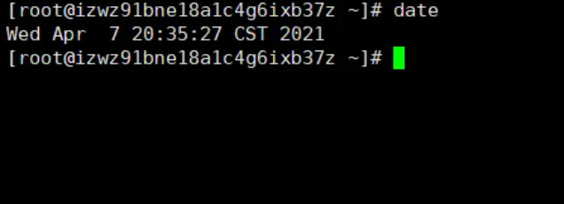
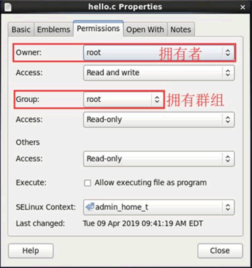

# 06 【实操篇-时间日期类 用户和用户组管理】

## 1.时间日期类

### 1.1 显示当前日期

- 基本语法

1. `date` (功能描述:显示当前时间)
2. `date +%Y`(功能描述:显示当前年份)
3. `date +%m`(功能描述:显示当前月份)
4. `date +%d` (功能描述:显示当前是哪一天)
5. `date "+%Y-%m-%d %H:%M:%S"` (功能描述:显示年月日时分秒)
6. `date +%s` (功能描述:显示当前日期时间戳)

- 应用实例

1. 案例1:显示当前时间信息 `date`
   

2. 案例2:显示当前时间年月日 `date "+%Y-%m-%d"`

   

3. 案例3:显示当前时间年月日时分秒 `date "+%Y-%m-%d %H:%M:%S"`
   

4. 案例3:显示当前时间戳 `date "+%s"`
   ```bash
   [root@localhost ~]# date +%s
   1660892982
   ```

### 1.2 显示非当前时间

**1）基本语法**

​	（1）date -d '1 days ago' （功能描述：显示前一天时间）

​	（2）date -d '-1 days ago' （功能描述：显示明天时间）

**2）案例实操**

​	（1）显示前一天

```bash
[root@localhost ~]# date -d '1 days ago'
2021 年 06 月 18 日 星期日 21:07:22 CST
```

​	（2）显示明天时间

```bash
[root@localhost ~]#date -d '-1 days ago'
2017 年 06 月 20 日 星期日 21:07:22 CST
```

### 1.3 设置日期

- 基本语法

```bash
date -s 字符串时间
```

- 应用实例

1. 案例1:设置系统当前时间，比如设置成 `2030-1-01 20:00:10`

```powershell
date -s "2030-1-01 20:00:10"
```

### 1.4 cal 指令

- 查看日历指令 `cal`
- 基本语法
   `cal [选项]`(功能描述:不加选项，显示本月日历)
- 应用实例

1. 案例1:显示当前日历`cal`
   

2. 案例2:显示2021年日历: `cal 2021`

   

## 2.用户管理命令

### 2.1 useradd 添加新用户

Linux 系统中，可以使用 useradd 命令新建用户

**1）基本语法** 

useradd 用户名 （功能描述：添加新用户） 

useradd -g 组名 用户名 （功能描述：添加新用户到某个组）

 **2）案例实操** 

（1）添加一个用户 

```bash
[root@localhost ~]# useradd lamp  [root@localhost ~]#ll /home/ 
```


### 2.2 passwd 设置用户密码

学习 useradd 命令我们知道，使用此命令创建新用户时，并没有设定用户密码，因此还无法用来登陆系统，本节就来学习 passwd 密码配置命令 。

**1）基本语法** 

passwd 用户名 （功能描述：设置用户密码)

**2）案例实操** 

例如，我们使用 root 账户修改 lamp 普通用户的密码，可以使用如下命令：

```bash
[root@localhost ~]#passwd lamp
Changing password for user lamp.
New password: <直接输入新的口令，但屏幕不会有任何反应
BAD PASSWORD: it is WAY too short <口令太简单或过短的错误！这里只是警告信息，输入的密码依旧能用
Retype new password: <再次验证输入的密码，再输入一次即可
passwd: all authentication tokens updated successfully. <提示修改密码成功
```

当然，也可以使用 passwd 命令修改当前系统已登录用户的密码，但要注意的是，需省略掉 "选项" 和 "用户名"。例如，我们登陆 lamp 用户，并使用 passwd 命令修改 lamp 的登陆密码，执行过程如下：

```bash
[root@localhost ~]#passwd
#passwd直接回车代表修改当前用户的密码
Changing password for user vbird2.
Changing password for vbird2
(current) UNIX password: <这里输入『原有的旧口令』
New password: <这里输入新口令
BAD PASSWORD: it is WAY too short <口令检验不通过，请再想个新口令
New password: <这里再想个来输入吧
Retype new password: <通过口令验证！所以重复这个口令的输入
passwd: all authentication tokens updated successfully. <成功修改用户密码
```

注意，普通用户只能使用 passwd 命令修改自己的密码，而不能修改其他用户的密码。

可以看到，与使用 root 账户修改普通用户的密码不同，普通用户修改自己的密码需要先输入自己的旧密码，只有旧密码输入正确才能输入新密码。不仅如此，此种修改方式对密码的复杂度有严格的要求，新密码太短、太简单，都会被系统检测出来并禁止用户使用。

> 很多Linux 发行版为了系统安装，都使用了 PAM 模块进行密码的检验，设置密码太短、与用户名相同、是常见字符串等，都会被 PAM 模块检查出来，从而禁止用户使用此类密码。有关 PAM 模块，后续章节会进行详细介绍。

而使用 root 用户，无论是修改普通用户的密码，还是修改自己的密码，都可以不遵守 PAM 模块设定的规则，就比如我刚刚给 lamp 用户设定的密码是 "123"，系统虽然会提示密码过短和过于简单，但依然可以设置成功。当然，在实际应用中，就算是 root 身份，在设定密码时也要严格遵守密码规范，因为只有好的密码规范才是服务器安全的基础。

### 2.3 id 查看用户是否存在

id 命令可以查询用户的UID、GID 和附加组的信息。命令比较简单，格式如下：

`[root@localhost ~]# id 用户名`
**【例 1】**

```bash
[root@localhost ~]# id lamp
uid=501(lamp) gid=501(lamp) groups=501(lamp)
#能看到uid(用户ID)、gid(初始组ID), groups是用户所在组，这里既可以看到初始组，如果有附加组，则也能看到附加组
```


**【例 2】**

```bash
[root@localhost ~]# usermod -G root lamp
#把用户加入root组
[root@localhost ~]# id lamp
uid=501(lamp) gid=501(lamp) groups=501(lamp),0(root)
#大家发现root组中加入了lamp用户的附加组信息
```

### 2.4 cat /etc/passwd 查看创建了哪些用户

Linux 系统中的 /etc/passwd 文件，是系统用户配置文件，存储了系统中所有用户的基本信息，并且所有用户都可以对此文件执行读操作。

首先我们来打开这个文件，看看到底包含哪些内容，执行命令如下：

```bash
[root@localhost ~]# vim /etc/passwd
#查看一下文件内容
root:x:0:0:root:/root:/bin/bash
bin:x:1:1:bin:/bin:/sbin/nologin
daemon:x:2:2:daemon:/sbin:/sbin/nologin
adm:x:3:4:adm:/var/adm:/sbin/nologin
...省略部分输出...
```

可以看到，/etc/passwd 文件中的内容非常规律，每行记录对应一个用户。

读者可能会问，Linux 系统中默认怎么会有这么多的用户？这些用户中的绝大多数是系统或服务正常运行所必需的用户，这种用户通常称为系统用户或伪用户。系统用户无法用来登录系统，但也不能删除，因为一旦删除，依赖这些用户运行的服务或程序就不能正常执行，会导致系统问题。

不仅如此，每行用户信息都以 "：" 作为分隔符，划分为 7 个字段，每个字段所表示的含义如下：

用户名：密码：UID（用户ID）：GID（组ID）：描述性信息：主目录：默认Shell

接下来，给大家逐个介绍这些字段。

#### 2.4.1 用户名

用户名，就是一串代表用户身份的字符串。

前面讲过，用户名仅是为了方便用户记忆，Linux 系统是通过 UID 来识别用户身份，分配用户权限的。/etc/passwd 文件中就定义了用户名和 UID 之间的对应关系。

#### 2.4.2 密码

"x" 表示此用户设有密码，但不是真正的密码，真正的密码保存在 /etc/shadow 文件中。

在早期的 UNIX 中，这里保存的就是真正的加密密码串，但由于所有程序都能读取此文件，非常容易造成用户数据被窃取。

虽然密码是加密的，但是采用暴力破解的方式也是能够进行破解的。

因此，现在 Linux 系统把真正的加密密码串放置在 /etc/shadow 文件中，此文件只有 root 用户可以浏览和操作，这样就最大限度地保证了密码的安全。

需要注意的是，虽然 "x" 并不表示真正的密码，但也不能删除，如果删除了 "x"，那么系统会认为这个用户没有密码，从而导致只输入用户名而不用输入密码就可以登陆（只能在使用无密码登录，远程是不可以的），除非特殊情况（如破解用户密码），这当然是不可行的。

#### 2.4.3 UID

UID，也就是用户 ID。每个用户都有唯一的一个 UID，Linux 系统通过 UID 来识别不同的用户。

实际上，UID 就是一个 0~65535 之间的数，不同范围的数字表示不同的用户身份，具体如表 1 所示。

| UID 范围  | 用户身份                                                     |
| --------- | ------------------------------------------------------------ |
| 0         | 超级用户。UID 为 0 就代表这个账号是管理员账号。在 Linux 中，如何把普通用户升级成管理员呢？只需把其他用户的 UID 修改为 0 就可以了，这一点和 Windows 是不同的。不过不建议建立多个管理员账号。 |
| 1~499     | 系统用户（伪用户）。也就是说，此范围的 UID 保留给系统使用。其中，1~99 用于系统自行创建的账号；100~499 分配给有系统账号需求的用户。  其实，除了 0 之外，其他的 UID 并无不同，这里只是默认 500 以下的数字给系统作为保留账户，只是一个公认的习惯而已。 |
| 500~65535 | 普通用户。通常这些 UID 已经足够用户使用了。但不够用也没关系，2.6.x 内核之后的 Linux 系统已经可以支持 232 个 UID 了。 |

#### 2.4.4 GID

全称“Group ID”，简称“组ID”，表示用户初始组的组 ID 号。这里需要解释一下初始组和附加组的概念。

初始组，指用户登陆时就拥有这个用户组的相关权限。每个用户的初始组只能有一个，通常就是将和此用户的用户名相同的组名作为该用户的初始组。比如说，我们手工添加用户 lamp，在建立用户 lamp 的同时，就会建立 lamp 组作为 lamp 用户的初始组。

附加组，指用户可以加入多个其他的用户组，并拥有这些组的权限。每个用户只能有一个初始组，除初始组外，用户再加入其他的用户组，这些用户组就是这个用户的附加组。附加组可以有多个，而且用户可以有这些附加组的权限。

举例来说，刚刚的 lamp 用户除属于初始组 lamp 外，我又把它加入了 users 组，那么 lamp 用户同时属于 lamp 组和 users 组，其中 lamp 是初始组，users 是附加组。

当然，初始组和附加组的身份是可以修改的，但是我们在工作中不修改初始组，只修改附加组，因为修改了初始组有时会让管理员逻辑混乱。

需要注意的是，在 /etc/passwd 文件的第四个字段中看到的 ID 是这个用户的初始组。

#### 2.4.5 描述性信息

这个字段并没有什么重要的用途，只是用来解释这个用户的意义而已。

#### 2.4.6 主目录

也就是用户登录后有操作权限的访问目录，通常称为用户的主目录。

例如，root 超级管理员账户的主目录为 /root，普通用户的主目录为 /home/yourIDname，即在 /home/ 目录下建立和用户名相同的目录作为主目录，如 lamp 用户的主目录就是 /home/lamp/ 目录。

#### 2.4.7 默认的Shell

Shell 就是 Linux 的命令解释器，是用户和 Linux 内核之间沟通的桥梁。

我们知道，用户登陆 Linux 系统后，通过使用 Linux 命令完成操作任务，但系统只认识类似 0101 的机器语言，这里就需要使用命令解释器。也就是说，Shell 命令解释器的功能就是将用户输入的命令转换成系统可以识别的机器语言。

通常情况下，Linux 系统默认使用的命令解释器是 bash（/bin/bash），当然还有其他命令解释器，例如 sh、csh 等。

在 /etc/passwd 文件中，大家可以把这个字段理解为用户登录之后所拥有的权限。如果这里使用的是 bash 命令解释器，就代表这个用户拥有权限范围内的所有权限。例如：

```bash
[root@localhost ~]# vim /etc/passwd
lamp:x:502:502::/home/lamp:/bin/bash
```

我手工添加了 lamp 用户，它使用的是 bash 命令解释器，那么这个用户就可以使用普通用户的所有权限。

如果我把 lamp 用户的 Shell 命令解释器修改为 /sbin/nologin，那么，这个用户就不能登录了，例如：

```bash
[root@localhost ~]# vim /etc/passwd
lamp:x:502:502::/home/lamp:/sbin/nologin
```

因为 /sbin/nologin 就是禁止登录的 Shell。同样，如果我在这里放入的系统命令，如 /usr/bin/passwd，例如：

```bash
[root@localhost ~]#vim /etc/passwd
lamp:x:502:502::/home/lamp:/usr/bin/passwd
```

那么这个用户可以登录，但登录之后就只能修改自己的密码。但是，这里不能随便写入和登陆没有关系的命令（如 ls），系统不会识别这些命令，同时也就意味着这个用户不能登录。

### 2.5 su 临时切换用户身份

#### 2.5.1 基本使用

su 是最简单的用户切换命令，通过该命令可以实现任何身份的切换，包括从普通用户切换为 root 用户、从 root 用户切换为普通用户以及普通用户之间的切换。

普通用户之间切换以及普通用户切换至 root 用户，都需要知晓对方的密码，只有正确输入密码，才能实现切换；从 root 用户切换至其他用户，无需知晓对方密码，直接可切换成功。
su 命令的基本格式如下：

`[root@localhost ~]# su [选项] 用户名`
选项：

- -：当前用户不仅切换为指定用户的身份，同时所用的工作环境也切换为此用户的环境（包括 PATH 变量、MAIL 变量等），使用 - 选项可省略用户名，默认会切换为 root 用户。
- -l：同 - 的使用类似，也就是在切换用户身份的同时，完整切换工作环境，但后面需要添加欲切换的使用者账号。
- -p：表示切换为指定用户的身份，但不改变当前的工作环境（不使用切换用户的配置文件）。
- -m：和 -p 一样；
- -c 命令：仅切换用户执行一次命令，执行后自动切换回来，该选项后通常会带有要执行的命令。

【例 1】

```bash
[lamp@localhost ~]$ su 
或者
[lamp@localhost ~]$ su - root
或者
[lamp@localhost ~]$ su - 
密码： <-- 输入 root 用户的密码
#"-"代表连带环境变量一起切换，不能省略
```

【例 2】

```bash
[lamp@localhost ~]$ whoami
lamp
#当前我是lamp
[lamp@localhost ~]$ su - -c "useradd user1" root
密码：
#不切换成root，但是执行useradd命令添加user1用户
[lamp@localhost ~]$ whoami
lamp
#我还是lamp
[lamp@localhost ~]$ grep "user1' /etc/passwd
userl:x:502:504::/home/user1:/bin/bash
#user用户已经添加了
```


除了像例 2 这样，执行一条命令后用户身份会随即自动切换回来，其他切换用户的方式不会自动切换，只能使用 exit 命令进行手动切换，例如：

```bash
[lamp@localhost ~]$ whoami
lamp
#当前我是lamp
[lamp@localhost ~]$ su - lamp1
Password:  <--输入lamp1用户的密码
#切换至 lamp1 用户的工作环境
[lamp@localhost ~]$ whoami
lamp1
#什么也不做，立即退出切换环境
[lamp1@localhost ~]$ exit
logout
[lamp@localhost ~]$ whoami
lamp
```

#### 2.5.2 su 和 su - 的区别

注意，使用 su 命令时，有 - 和没有 - 是完全不同的，- 选项表示在切换用户身份的同时，连当前使用的环境变量也切换成指定用户的。我们知道，环境变量是用来定义操作系统环境的，因此如果系统环境没有随用户身份切换，很多命令无法正确执行。

举个例子，普通用户 lamp 通过 su 命令切换成 root 用户，但没有使用 - 选项，这样情况下，虽然看似是 root 用户，但系统中的 $PATH 环境变量依然是 lamp 的（而不是 root 的），因此当前工作环境中，并不包含 /sbin、/usr/sbin等超级用户命令的保存路径，这就导致很多管理员命令根本无法使用。不仅如此，当 root 用户接受邮件时，会发现收到的是 lamp 用户的邮件，因为环境变量 $MAIL 也没有切换。

初学者可以这样理解它们之间的区别，即有 - 选项，切换用户身份更彻底；反之，只切换了一部分，这会导致某些命令运行出现问题或错误（例如无法使用 service 命令）。

通过下面这个例子，可直观的看到 su 和 su - 的区别：

```bash
[lamp@localhost ~]$ whoami
lamp
#查询用户身份，我是lamp
[lamp@localhost ~]$ su root
密码：
<-输入root密码
#切换到root，但是没有切换环境变量。注意：普通用户切换到root需要密码
[root@localhost ~]# env | grep lamp
#查看环境变量，提取包含lamp的行
USER=lamp
#用户名还是lamp，而不是root
PATH=/usr/lib/qt-3.3/bin:/usr/local/bin:/bin:/usr/bin:/usr/local/sbin:/usr/sbin:/sbin:/home/lamp/bin
#命令査找的路径不包含超级用户路径
MAIL=/var/spool/mail/lamp
PWD=/home/lamp
LOGNAME=lamp
#邮箱、主目录、目前用户名还是lamp
```

可以看到，在不使用 su - 的情况下，虽然用户身份成功切换，但环境变量依旧用的是原用户的，切换并不完整。

### 2.6 userdel  删除用户

userdel 命令功能很简单，就是删除用户的相关数据。此命令只有 root 用户才能使用。

通过前面的学习我们知道，用户的相关数据包含如下几项：

- 用户基本信息：存储在 /etc/passwd 文件中；
- 用户个人文件：主目录默认位于 /home/用户名

其实，userdel 命令的作用就是从以上文件中，删除与指定用户有关的数据信息。

userdel 命令的语法很简单，基本格式如下：

`[root@localhost ~]# userdel -r 用户名`

-r 选项表示在删除用户的同时删除用户的家目录。

注意，在删除用户的同时如果不删除用户的家目录，那么家目录就会变成没有属主和属组的目录，也就是垃圾文件。

例如，删除前面章节中创建的 lamp 用户，只需执行如下命令：

`[root@localhost ~]# userdel -r lamp`


除了使用 userdel 命令删除用户，还可以手动方式删除，毕竟通过前面的学习，我们已经知道与用户相关信息的存储位置。虽然这样做没有实际意义，但对于初学者来说，可以加深对 userdel 命令的理解。

手动删除用户，仅是为了让读者对 userdel 命令理解地更透彻，实际使用中，使用 userdel 删除用户更方便。

（1）删除用户但保存用户主目录

```bash
[root@localhost ~]#userdel tangseng
[root@localhost ~]#ll /home/
```

（2）删除用户和用户主目录，都删除

```bash
[root@localhost ~]#useradd zhubajie [root@localhost ~]#ll /home/ [root@localhost ~]#userdel -r zhubajie [root@localhost ~]#ll /home/
```

最后需要大家注意的是，如果要删除的用户已经使用过系统一段时间，那么此用户可能在系统中留有其他文件，因此，如果我们想要从系统中彻底的删除某个用户，最好在使用 userdel 命令之前，先通过 `find -user 用户名` 命令查出系统中属于该用户的文件，然后在加以删除。

### 2.7 who 查看登录用户信息

**基本语法**

（1）whoami （功能描述：显示自身用户名称） 

（2）who am i （功能描述：显示登录用户的用户名以及登陆时间）

whoami 命令和 who am i 命令是不同的 2 个命令，前者用来打印当前执行操作的用户名，后者则用来打印登陆当前 Linux 系统的用户名。

为了能够更好地区分这 2 个命令的功能，给大家举个例子，我们首先使用用户名为“lamp”登陆 Linux 系统，然后执行如下命令：

```bash
[lamp@localhost ~]$ whoami
lamp
[lamp@localhost ~]$ who am i
lamp  pts/0  2021-10-09 15:30 (:0.0)
```

在此基础上，使用 su 命令切换到 root 用户下，再执行一遍上面的命令：

```bash
[lamp@localhost ~] su - root
[root@localhost ~]$ whoami
root
[root@localhost ~]$ who am i
lamp  pts/0  2017-10-09 15:30 (:0.0)
```

看到了吗？在未切换用户身份之前，whoami 和 who am i 命令的输出是一样的，但使用 su 命令切换用户身份后，使用 whoami 命令打印的是切换后的用户名，而 who am i 命令打印的仍旧是登陆系统时所用的用户名。

> 执行 whoami 命令，等同于执行 id -un 命令；执行 who am i 命令，等同于执行 who -m 命令。

也就是说，使用 su 或者 sudo 命令切换用户身份，骗得过 whoami，但骗不过 who am i。要解释这背后的运行机制，需要搞清楚什么是实际用户（UID）和有效用户（EUID，即 Effective UID）。

所谓实际用户，指的是登陆 Linux 系统时所使用的用户，因此在整个登陆会话过程中，实际用户是不会发生变化的；而有效用户，指的是当前执行操作的用户，也就是说真正决定权限高低的用户，这个是能够利用 su 或者 sudo 命令进行任意切换的。

一般情况下，实际用户和有效用户是相同的，如果出现用户身份切换的情况，它们会出现差异。需要注意的是，实际用户和有效用户出现差异，切换用户并不是唯一的触发机制，至于其他的触发条件，后续章节会做详细介绍。

那么，whoami 和 who am i通常应用在哪些场景中呢？通常，对那些经常需要切换用户的系统管理员来说，经常需要明确当前使用的是什么身份；另外，对于某些 shell 脚本，或者需要特别的用户才能执行，这时就需要利用 whoami 命令来搞清楚执行它的用户是谁；甚至还有一些 shell 脚本，一定要某个特别用户才能执行，即便使用 su 或者 sudo 命令切换到此身份都不行，此时就需要利用 who am i 来确认。

### 2.8 sudo 设置普通用户具有 root 权限

我们知道，使用 su 命令可以让普通用户切换到 root 身份去执行某些特权命令，但存在一些问题，比如说：

- 仅仅为了一个特权操作就直接赋予普通用户控制系统的完整权限；
- 当多人使用同一台主机时，如果大家都要使用 su 命令切换到 root 身份，那势必就需要 root 的密码，这就导致很多人都知道 root 的密码；


考虑到使用 su 命令可能对系统安装造成的隐患，最常见的解决方法是使用 sudo 命令，此命令也可以让你切换至其他用户的身份去执行命令。

相对于使用 su 命令还需要新切换用户的密码，sudo 命令的运行只需要知道自己的密码即可，甚至于，我们可以通过手动修改 sudo 的配置文件，使其无需任何密码即可运行。

sudo 命令默认只有 root 用户可以运行。

**例1**

**1）添加 lamp 用户，并对其设置密码。**

```bash
[root@localhost ~]#useradd lamp
[root@localhost ~]#passwd lamp
```

**2）修改配置文件**

前面说过，默认情况下 sudo 命令只有 root 身份可以使用，那么，如何让普通用户也能使用它呢？

解决这个问题之前，先给大家分析一下 sudo 命令的执行过程。sudo命令的运行，需经历如下几步：

- 当用户运行 sudo 命令时，系统会先通过 /etc/sudoers 文件，验证该用户是否有运行 sudo 的权限；
- 确定用户具有使用 sudo 命令的权限后，还要让用户输入自己的密码进行确认。出于对系统安全性的考虑，如果用户在默认时间内（默认是 5 分钟）不使用 sudo 命令，此后使用时需要再次输入密码；
- 密码输入成功后，才会执行 sudo 命令后接的命令。


显然，能否使用 sudo 命令，取决于对 /etc/sudoers 文件的配置（默认情况下，此文件中只配置有 root 用户）。所以接下来，我们学习对 /etc/sudoers 文件进行合理的修改。

```bash
[root@localhost ~]#vim /etc/sudoers 
```

修改 /etc/sudoers 文件，找到下面一行(91 行)，在 root 下面添加一行，如下所示：

```bash
## Allow root to run any commands anywhere
root ALL=(ALL) ALL
lamp ALL=(ALL) ALL
#用户名 被管理主机的地址=(可使用的身份) 授权命令(绝对路径)
#%wheel ALL=(ALL) ALL
#%组名 被管理主机的地址=(可使用的身份) 授权命令(绝对路径)
```

或者配置成采用 sudo 命令时，不需要输入密码

```bash
## Allow root to run any commands anywhere
root ALL=(ALL) ALL
lamp ALL=(ALL) NOPASSWD:ALL
```

修改完毕，现在可以用 lamp 帐号登录，然后用命令 sudo ，即可获得 root 权限进行操作。

对以上 2 个模板的各部分进行详细的说明。

| 模块             | 含义                                                         |
| ---------------- | ------------------------------------------------------------ |
| 用户名或群组名   | 表示系统中的那个用户或群组，可以使用 sudo 这个命令。         |
| 被管理主机的地址 | 用户可以管理指定 IP 地址的服务器。这里如果写 ALL，则代表用户可以管理任何主机；如果写固定 IP，则代表用户可以管理指定的服务器。如果我们在这里写本机的 IP 地址，不代表只允许本机的用户使用指定命令，而是代表指定的用户可以从任何 IP 地址来管理当前服务器。 |
| 可使用的身份     | 就是把来源用户切换成什么身份使用，（ALL）代表可以切换成任意身份。这个字段可以省略。 |
| 授权命令         | 表示 root 把什么命令命令授权给用户，换句话说，可以用切换的身份执行什么命令。需要注意的是，此命令必须使用绝对路径写。默认值是 ALL，表示可以执行任何命令。 |

**3）案例实操**

用普通用户在/opt 目录下创建一个文件夹

```bash
[lamp@localhost opt]$ sudo mkdir module
[root@localhost opt]# chown lamp:lamp module/
```

**例2**

假设现在有 pro1，pro2，pro3 这 3 个用户，还有一个 group 群组，我们可以通过在 /etc/sudoers 文件配置 wheel 群组信息，令这 3 个用户同时拥有管理系统的权限。

首先，向 /etc/sudoers 文件中添加群组配置信息：

```bash
....(前面省略)....
%group     ALL=(ALL)    ALL
#在 84 行#wheel这一行后面写入
```

此配置信息表示，group 这个群组中的所有用户都能够使用 sudo 切换任何身份，执行任何命令。接下来，我们使用 usermod 命令将 pro1 加入 group 群组，看看有什么效果：

```bash
[root@localhost ~]# usermod -a -G group pro1
[pro1@localhost ~]# sudo tail -n 1 /etc/shadow <==注意身份是 pro1
....(前面省略)....
Password:  <==输入 pro1 的口令喔！
pro3:$1$GfinyJgZ$9J8IdrBXXMwZIauANg7tW0:14302:0:99999:7:::
[pro2@localhost ~]# sudo tail -n 1 /etc/shadow <==注意身份是 pro2
Password:
pro2 is not in the sudoers file.  This incident will be reported.
#此错误信息表示 pro2 不在 /etc/sudoers 的配置中。
```

可以看到，由于 pro1 加入到了 group 群组，因此 pro1 就可以使用 sudo 命令，而 pro2 不行。同样的道理，如果我们想让 pro3 也可以使用 sudo 命令，不用再修改 /etc/sudoers 文件，只需要将 pro3 加入 group 群组即可。

### 2.9 usermod 修改用户

前面章节介绍了如何利用 useradd 命令添加用户，但如果不小心添错用户信息，后期如何修改呢？

**1）基本语法** 

usermod -g 用户组 用户

**2）选项说明**

`-g` 修改用户的初始登录组，给定的组必须存在。默认组 id 是 1。

**3）案例实操**

将用户加入到用户组

````bash
[root@dselegent-study /]# groupadd group
[root@dselegent-study lamp]# usermod -g group lamp
[root@dselegent-study lamp]# id lamp
uid=1001(lamp) gid=1002(group) 组=1002(group)
````

## 3.用户组管理命令

### 3.1 用户和用户组

Linux 是多用户多任务操作系统，换句话说，Linux 系统支持多个用户在同一时间内登陆，不同用户可以执行不同的任务，并且互不影响。

例如，某台 Linux 服务器上有 4 个用户，分别是 root、www、ftp 和 mysql，在同一时间内，root 用户可能在查看系统日志、管理维护系统；www 用户可能在修改自己的网页程序；ftp 用户可能在上传软件到服务器；mysql 用户可能在执行自己的 SQL 查询，每个用户互不干扰，有条不紊地进行着自己的工作。与此同时，每个用户之间不能越权访问，比如 www 用户不能执行 mysql 用户的 SQL 查询操作，ftp 用户也不能修改 www 用户的网页程序。

不同用户具有不问的权限，毎个用户在权限允许的范围内完成不间的任务，Linux 正是通过这种权限的划分与管理，实现了多用户多任务的运行机制。

因此，如果要使用 Linux 系统的资源，就必须向系统管理员申请一个账户，然后通过这个账户进入系统（账户和用户是一个概念）。通过建立不同属性的用户，一方面可以合理地利用和控制系统资源，另一方面也可以帮助用户组织文件，提供对用户文件的安全性保护。

每个用户都有唯一的用户名和密码。在登录系统时，只有正确输入用户名和密码，才能进入系统和自己的主目录。

用户组是具有相同特征用户的逻辑集合。简单的理解，有时我们需要让多个用户具有相同的权限，比如查看、修改某一个文件的权限，一种方法是分别对多个用户进行文件访问授权，如果有 10 个用户的话，就需要授权 10 次，那如果有 100、1000 甚至更多的用户呢？

显然，这种方法不太合理。最好的方式是建立一个组，让这个组具有查看、修改此文件的权限，然后将所有需要访问此文件的用户放入这个组中。那么，所有用户就具有了和组一样的权限，这就是用户组。

将用户分组是 Linux 系统中对用户进行管理及控制访问权限的一种手段，通过定义用户组，很多程序上简化了对用户的管理工作。

**Linux用户和组的关系**

用户和用户组的对应关系有以下 4 种：

1. 一对一：一个用户可以存在一个组中，是组中的唯一成员；
2. 一对多：一个用户可以存在多个用户组中，此用户具有这多个组的共同权限；
3. 多对一：多个用户可以存在一个组中，这些用户具有和组相同的权限；
4. 多对多：多个用户可以存在多个组中，也就是以上 3 种关系的扩展。

用户和组之间的关系可以用图来表示：


### 3.2 UID和GID（用户ID和组ID）

登陆 Linux 系统时，虽然输入的是自己的用户名和密码，但其实 Linux 并不认识你的用户名称，它只认识用户名对应的 ID 号（也就是一串数字）。Linux 系统将所有用户的名称与 ID 的对应关系都存储在 /etc/passwd 文件中。

> 说白了，用户名并无实际作用，仅是为了方便用户的记忆而已。

要论证 "Linux系统不认识用户名" 也很简单，在前面章节，我们曾经在网络上下载过 ".tar.gz" 或 ".tar.bz2" 格式的文件，在解压缩之后的文件中，你会发现文件拥有者的属性显示的是一串数字，这很正常，就是因为系统只认识代表你身份的 ID，这串数字就是用户的 ID（UID）号。

Linux 系统中，每个用户的 ID 细分为 2 种，分别是用户 ID（User ID，简称 UID）和组 ID（Group ID，简称 GID），这与文件有拥有者和拥有群组两种属性相对应。




从图中可以看到，该文件的拥有者是超级管理员 root，拥有群组也是 root。读者可能会问，既然 Linux 系统不认识用户名，文件是如何判别它的拥有者名称和群组名称的呢？

每个文件都有自己的拥有者 ID 和群组 ID，当显示文件属性时，系统会根据 /etc/passwd 和 /etc/group 文件中的内容，分别找到 UID 和 GID 对应的用户名和群组名，然后显示出来。

/etc/passwd 文件和 /etc/group 文件，后续文章会做详细讲解，这里只需要知道，在 /etc/passwd 文件中，利用 UID 可以找到对应的用户名；在 /etc/group 文件中，利用 GID 可以找到对应的群组名。

### 3.3 groupadd 新增组

添加用户组的命令是 groupadd，命令格式如下:

`[root@localhost ~]# groupadd [选项] 组名`

选项：

- -g GID：指定组 ID；
- -r：创建系统群组。


使用 groupadd 命令创建新群组非常简单，例如：

```bash
[root@localhost ~]# groupadd group1
#添加group1组
[root@localhost ~]# grep "group1" /etc/group
/etc/group:group1:x:502:
/etc/gshadow:group1:!::
```

### 3.4 groupdel 删除组

groupdel 命令用于删除用户组（群组），此命令基本格式为：

`[root@localhost ~]#groupdel 组名`

通过前面的学习不难猜测出，使用 groupdel 命令删除群组，其实就是删除 /etc/gourp 文件和 /etc/gshadow 文件中有关目标群组的数据信息。

例如，删除前面章节中用 groupadd 命令创建的群组 group1，执行命令如下：

```bash
[root@localhost ~]#grep "group1" /etc/group /etc/gshadow
/etc/group:group1:x:505:
/etc/gshadow:group1:!::
[root@localhost ~]#groupdel group1
[root@localhost ~]#grep "group1" /etc/group /etc/gshadow
[root@localhost ~]#
```


注意，不能使用 groupdel 命令随意删除群组。此命令仅适用于删除那些 "不是任何用户初始组" 的群组，换句话说，如果有群组还是某用户的初始群组，则无法使用 groupdel 命令成功删除。例如：

```bash
[root@localhost ~]# useradd temp
#运行如下命令，可以看到 temp 用户建立的同时，还创建了 temp 群组，且将其作为 temp用户的初始组（组ID都是 505）
[root@localhost ~]# grep "temp" /etc/passwd /etc/group /etc/gshadow
/etc/passwd:temp:x:505:505::/home/temp:/bin/bash
/etc/group:temp:x:505:
/etc/gshadow:temp:!::
#下面尝试删除 temp 群组
[root@localhost ~]# groupdel temp
groupdel:cannot remove the primary group of user 'temp'
```

可以看到，groupdel 命令删除 temp 群组失败，且提示“不能删除 temp 用户的初始组”。如果一定要删除 temp 群组，要么修改 temp 用户的 GID，也就是将其初始组改为其他群组，要么先删除 temp 用户。

切记，虽然我们已经学了如何手动删除群组数据，但胡乱地删除群组可能会给其他用户造成不小的麻烦，因此更改文件数据要格外慎重。

### 3.5 groupmod 修改

groupmod 命令用于修改用户组的相关信息，命令格式如下：

`[root@localhost ~]# groupmod [选现] 新组名 旧组名`

选项：

- -g GID：修改组 ID；
- -n 新组名：修改组名；

例子：

```bash
[root@localhost ~]# groupmod -n testgrp group1
#把组名group1修改为testgrp
[root@localhost ~]# grep "testgrp" /etc/group
testgrp:x:502:
#注意GID还是502，但是组名已经改变
```

不过大家还是要注意，用户名不要随意修改，组名和 GID 也不要随意修改，因为非常容易导致管理员逻辑混乱。如果非要修改用户名或组名，则建议大家先删除旧的，再建立新的。

### 3.6 cat /etc/group 查看创建了哪些组

/ect/group 文件是用户组配置文件，即用户组的所有信息都存放在此文件中。

此文件是记录组 ID（GID）和组名相对应的文件。前面讲过，etc/passwd 文件中每行用户信息的第四个字段记录的是用户的初始组 ID，那么，此 GID 的组名到底是什么呢？就要从 /etc/group 文件中查找。

/etc/group 文件的内容可以通过 Vim 看到：

```bash
[root@localhost ~]#vim /etc/group
root:x:0:
bin:x:1:bin,daemon
daemon:x:2:bin,daemon
…省略部分输出…
lamp:x:502:
```

可以看到，此文件中每一行各代表一个用户组。在前面章节中，我们曾创建 lamp 用户，系统默认生成一个 lamp 用户组，在此可以看到，此用户组的 GID 为 502，目前它仅作为 lamp 用户的初始组。

各用户组中，还是以 "：" 作为字段之间的分隔符，分为 4 个字段，每个字段对应的含义为：

组名：密码：GID：该用户组中的用户列表

接下来，分别介绍各个字段具体的含义。

#### 3.6.1 组名

也就是是用户组的名称，有字母或数字构成。同 /etc/passwd 中的用户名一样，组名也不能重复。

#### 3.6.2 组密码

和 /etc/passwd 文件一样，这里的 "x" 仅仅是密码标识，真正加密后的组密码默认保存在 /etc/gshadow 文件中。

不过，用户设置密码是为了验证用户的身份，那用户组设置密码是用来做什么的呢？用户组密码主要是用来指定组管理员的，由于系统中的账号可能会非常多，root 用户可能没有时间进行用户的组调整，这时可以给用户组指定组管理员，如果有用户需要加入或退出某用户组，可以由该组的组管理员替代 root 进行管理。但是这项功能目前很少使用，我们也很少设置组密码。如果需要赋予某用户调整某个用户组的权限，则可以使用 sudo 命令代替。

#### 3.6.3 组ID (GID)

就是群组的 ID 号，Linux 系统就是通过 GID 来区分用户组的，同用户名一样，组名也只是为了便于管理员记忆。

这里的组 GID 与 /etc/passwd 文件中第 4 个字段的 GID 相对应，实际上，/etc/passwd 文件中使用 GID 对应的群组名，就是通过此文件对应得到的。

#### 3.6.4 组中的用户

此字段列出每个群组包含的所有用户。需要注意的是，如果该用户组是这个用户的初始组，则该用户不会写入这个字段，可以这么理解，该字段显示的用户都是这个用户组的附加用户。

举个例子，lamp 组的组信息为 `"lamp:x:502:"`，可以看到，第四个字段没有写入 lamp 用户，因为 lamp 组是 lamp 用户的初始组。如果要查询这些用户的初始组，则需要先到 /etc/passwd 文件中查看 GID（第四个字段），然后到 /etc/group 文件中比对组名。

每个用户都可以加入多个附加组，但是只能属于一个初始组。所以我们在实际工作中，如果需要把用户加入其他组，则需要以附加组的形式添加。例如，我们想让 lamp 也加入 root 这个群组，那么只需要在第一行的最后一个字段加入 lamp，即 `root:x:0:lamp` 就可以了。

一般情况下，用户的初始组就是在建立用户的同时建立的和用户名相同的组。

到此，我们已经学习了/etc/passwd、/etc/shadow、/etc/group，它们之间的关系可以这样理解，即先在 /etc/group 文件中查询用户组的 GID 和组名；然后在 /etc/passwd 文件中查找该 GID 是哪个用户的初始组，同时提取这个用户的用户名和 UID；最后通过 UID 到 /etc/shadow 文件中提取和这个用户相匹配的密码。