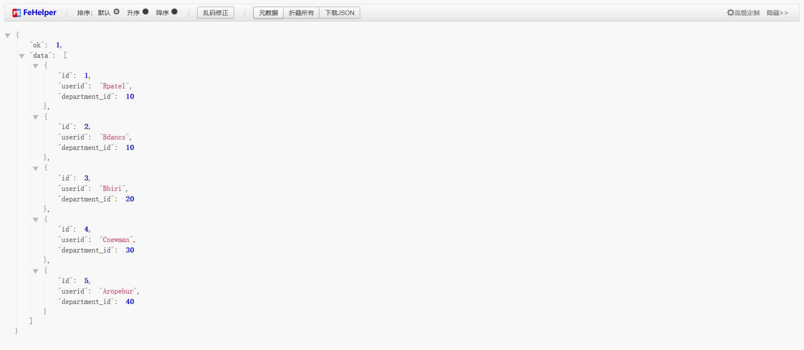
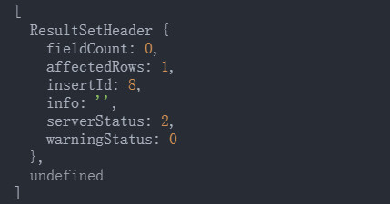
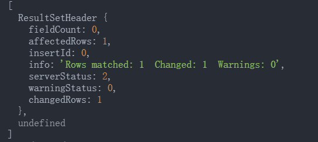
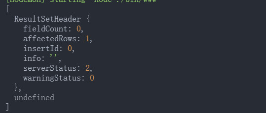

# 13 【操作mysql数据库】

## 1.mysql 介绍

付费的商用数据库：

- Oracle，典型的高富帅；
- SQL Server，微软自家产品，Windows定制专款；
- DB2，IBM的产品，听起来挺高端；
- Sybase，曾经跟微软是好基友，后来关系破裂，现在家境惨淡。

这些数据库都是不开源而且付费的，最大的好处是花了钱出了问题可以找厂家解决，不过在Web的世界里，常常需要部署成千上万的数据库服务器，当然不能把大把大把的银子扔给厂家，所以，无论是Google、Facebook，还是国内的BAT，无一例外都选择了免费的开源数据库：

- MySQL，大家都在用，一般错不了；
- PostgreSQL，学术气息有点重，其实挺不错，但知名度没有MySQL高；
- sqlite，嵌入式数据库，适合桌面和移动应用。

作为一个JavaScript全栈工程师，选择哪个免费数据库呢？当然是MySQL。因为MySQL普及率最高，出了错，可以很容易找到解决方法。而且，围绕MySQL有一大堆监控和运维的工具，安装和使用很方便。


## 2.与非关系数据库区别

关系型和非关系型数据库的主要差异是数据存储的方式。关系型数据天然就是表格式的，因此存储在数据表的行和列中。数据表可以彼此关联协作存储，也很容易提取数据。

与其相反，非关系型数据不适合存储在数据表的行和列中，而是大块组合在一起。非关系型数据通常存储在数据集中，就像文档、键值对或者图结构。你的数据及其特性是选择数据存储和提取方式的首要影响因素。

**关系型数据库最典型的数据结构是表，由二维表及其之间的联系所组成的一个数据组织**
优点：
1、易于维护：都是使用表结构，格式一致；
2、使用方便：SQL语言通用，可用于复杂查询；
3、复杂操作：支持SQL，可用于一个表以及多个表之间非常复杂的查询。
缺点：
1、读写性能比较差，尤其是海量数据的高效率读写；
2、固定的表结构，灵活度稍欠；
3、高并发读写需求，传统关系型数据库来说，硬盘I/O是一个很大的瓶颈。

**非关系型数据库严格上不是一种数据库，应该是一种数据结构化存储方法的集合，可以是文档或者键值对等。**

优点：

1、格式灵活：存储数据的格式可以是key,value形式、文档形式、图片形式等等，文档形式、图片形式等等，使用灵活，应用场景广泛，而关系型数据库则只支持基础类型。
2、速度快：nosql可以使用硬盘或者随机存储器作为载体，而关系型数据库只能使用硬盘；
3、高扩展性；
4、成本低：nosql数据库部署简单，基本都是开源软件。

缺点：

1、不提供sql支持；
2、无事务处理；
3、数据结构相对复杂，复杂查询方面稍欠。

## 3.MySQL2的历史以及选择原因

MySQL2 项目是 [MySQL-Native](https://github.com/sidorares/nodejs-mysql-native) 的延续。 协议解析器代码从头开始重写，api 更改为匹配流行的 [mysqljs/mysql](https://github.com/mysqljs/mysql)。 MySQL2 团队正在与 [mysqljs/mysql](https://github.com/mysqljs/mysql) 团队合作，将共享代码分解并移至 [mysqljs](https://github.com/mysqljs/mysql) 组织下。

MySQL2 大部分 API 与 [mysqljs](https://github.com/mysqljs/mysql) 兼容，并支持大部分功能。 MySQL2 还提供了更多的附加功能

- 更快、更好的性能
- [支持预处理](https://github.com/sidorares/node-mysql2/tree/master/documentation/Prepared-Statements.md)
- MySQL二进制日志协议
- [MySQL Server](https://github.com/sidorares/node-mysql2/tree/master/documentation/MySQL-Server.md)
- 对编码和排序规则有很好的支持
- [Promise封装](https://github.com/sidorares/node-mysql2/tree/master/documentation/Promise-Wrapper.md)
- 支持压缩
- SSL 和 [Authentication Switch](https://github.com/sidorares/node-mysql2/tree/master/documentation/Authentication-Switch.md)
- [自定义流](https://github.com/sidorares/node-mysql2/tree/master/documentation/Extras.md)
- [连接池](https://github.com/sidorares/node-mysql2/tree/master/documentation_zh-cn#using-connection-pools)

MySQL2 可以跨平台使用，毫无疑问可以安装在 Linux、Mac OS 或 Windows 上。

```bash
npm install --save mysql2
```

## 4.连接数据库

`config/db.config.js`

```js
const mysql = require('mysql2/promise')

// 通过createPool方法连接服务器
const db = mysql.createPool({
  host: '127.0.0.1', // 表示连接某个服务器上的mysql数据库
  user: 'root', // 数据库的用户名 （默认为root）
  password: '123456', // 数据库的密码 (默认为root)
  database: 'dbtest11', // 创建的本地数据库名称
})

// 测试数据库是否连接成功
db.getConnection((err, conn) => {
  conn.connect(err => {
    if (err) {
      console.log('连接失败~')
    } else {
      console.log('连接成功~')
    }
  })
})

module.exports = db
```

## 5.查询

- 导入mysql
- 通过createPool方法将mysql数据库连接到服务器，并声明一个db变量
- 通过db.query方法测试是否连接成功
- 将数据返回给客户端
  - 导入express
  - 创建服务器
  - 启动服务器
  - 注册路由
  - 通过db.query（查询数据库）来执行sql语句
  - 如果执行成功将数据响应给客户端

```js
var express = require('express')
const db = require('../config/db.config')
var router = express.Router()

// 通过nodejs获取数据库中的数据  并返回给客户端-
router.get('/', async (req, res) => {
  // 通过db.query方法来执行mysql  测试是否连接成功
  // 查询语句 data 得到的是一个数组，  增删改得到的是受影响的行数
  let users = await db.query('select * from users')
  console.log(users[0])
  res.send({
    ok: 1,
    data: users[0],
  })
})

module.exports = router
```

控制台输出：


返回的数据：



## 6.插入

```js
// 给user中添加用户名和密码
router.get('/addUser', async (req, res) => {
  const sql = 'insert into users (userid,department_id) values (?,?)' // 构建sql语句
  // 执行sql语句
  let ret = await db.query(sql, ['Mary', 2])
  console.log(ret)
  res.send({
    ok: 1,
  })
})
```

控制台输出：



## 7.修改

````js
// 修改数据
router.get('/updateUser', async (req, res) => {
  const sql = 'update users set userid=?,department_id=? where id=?' // 构建sql语句
  // 执行sql语句
  let ret = await db.query(sql, ['Jerry', 10, 8])
  console.log(ret)
  res.send({
    ok: 1,
  })
})
````

控制台输出：



## 8.删除

```js
// 删除数据
router.get('/deleteUser', async (req, res) => {
  const sql = 'delete from users where id=?' // 构建sql语句
  // 执行sql语句
  let ret = await db.query(sql, [8])
  console.log(ret)
  res.send({
    ok: 1,
  })
})
```

控制台输出：

