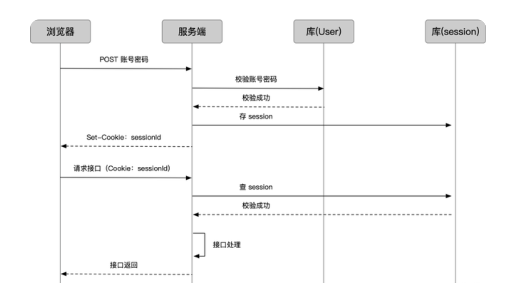
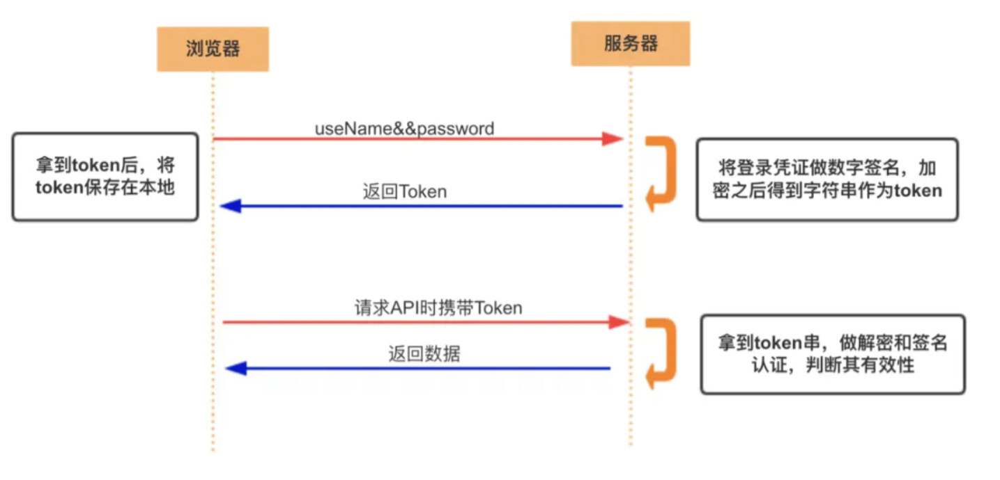
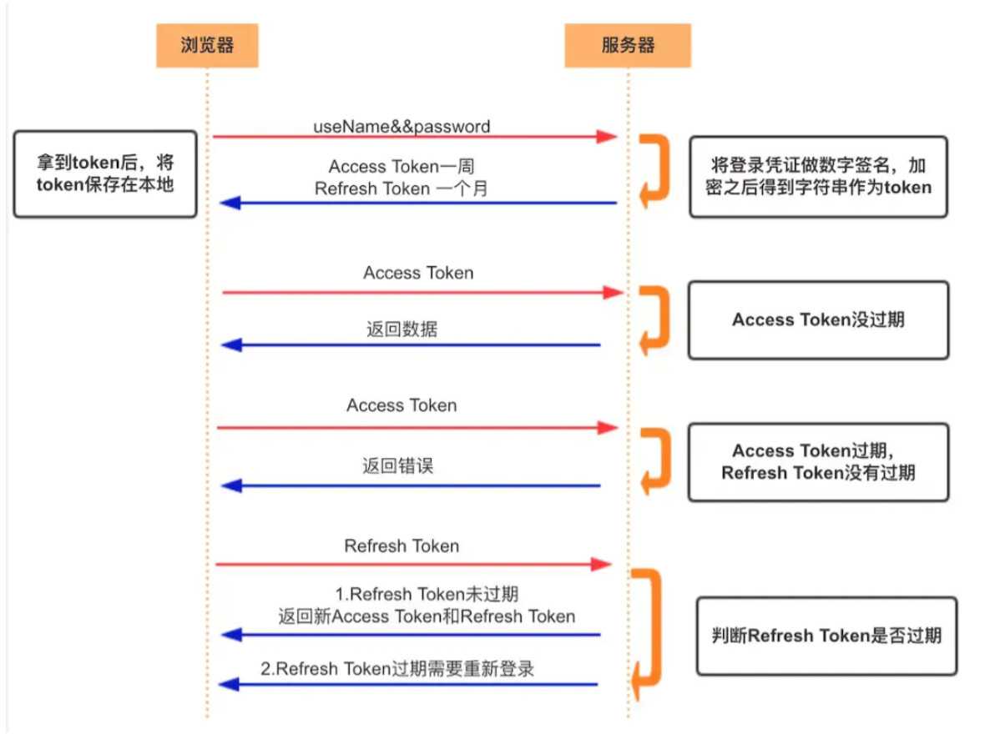
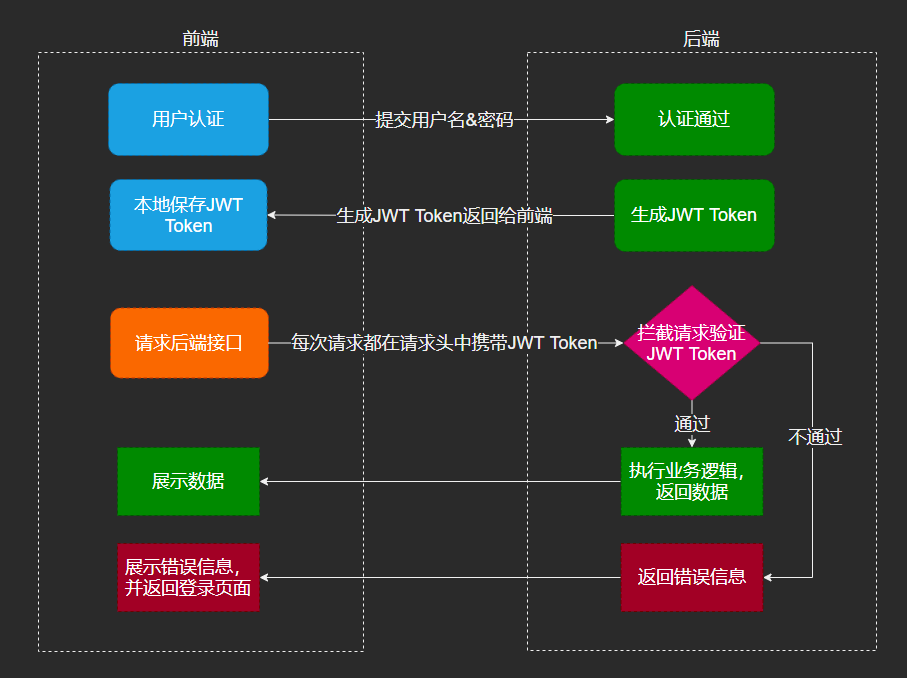
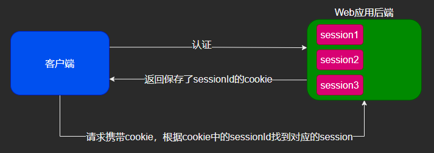
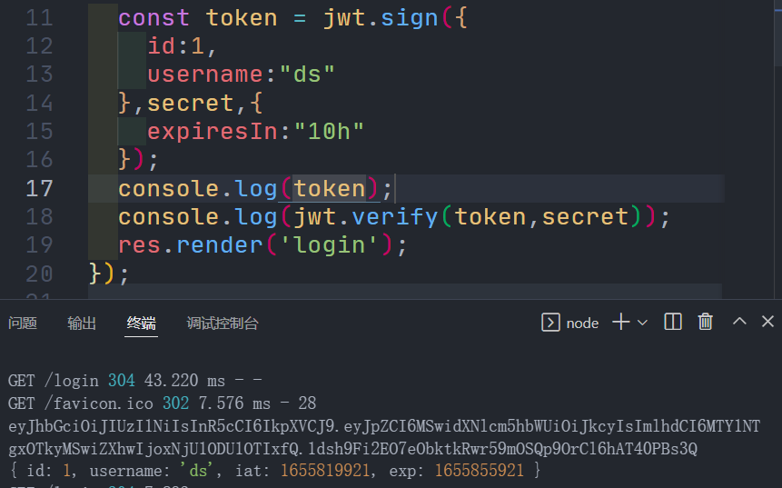

# 15 【登录鉴权-Cookie】

## 1.什么是认证（Authentication）

- 通俗地讲就是验证当前用户的身份，证明“你是你自己”（比如：你每天上下班打卡，都需要通过指纹打卡，当你的指纹和系统里录入的指纹相匹配时，就打卡成功）
- 互联网中的认证：
  - 用户名密码登录
  - 邮箱发送登录链接
  - 手机号接收验证码
  - 只要你能收到邮箱/验证码，就默认你是账号的主人

## 2.什么是授权（Authorization）

- 用户授予第三方应用访问该用户某些资源的权限
  - 你在安装手机应用的时候，APP 会询问是否允许授予权限（访问相册、地理位置等权限）
  - 你在访问微信小程序时，当登录时，小程序会询问是否允许授予权限（获取昵称、头像、地区、性别等个人信息）
- 实现授权的方式有：`cookie`、`session`、`token`、`OAuth`

## 3.什么是凭证（Credentials）

**实现认证和授权的前提是需要一种媒介（证书） 来标记访问者的身份**

> 在互联网应用中，一般网站（如掘金）会有两种模式，游客模式和登录模式。游客模式下，可以正常浏览网站上面的文章，一旦想要点赞/收藏/分享文章，就需要登录或者注册账号。当用户登录成功后，服务器会给该用户使用的浏览器颁发一个令牌（`token`），这个令牌用来表明你的身份，每次浏览器发送请求时会带上这个令牌，就可以使用游客模式下无法使用的功能。

## 4.什么是 Cookie

- **HTTP 是无状态的协议**（对于事务处理没有记忆能力，每次客户端和服务端会话完成时，服务端不会保存任何会话信息）：每个请求都是完全独立的，服务端无法确认当前访问者的身份信息，无法分辨上一次的请求发送者和这一次的发送者是不是同一个人。所以服务器与浏览器为了进行会话跟踪（知道是谁在访问我），就必须主动的去维护一个状态，这个状态用于告知服务端前后两个请求是否来自同一浏览器。而这个状态需要通过 `cookie` 或者 `session` 去实现
- **cookie 存储在客户端**： cookie 是服务器发送到用户浏览器并保存在本地的一小块数据，它会在浏览器下次向同一服务器再发起请求时被携带并发送到服务器上。
- **cookie 是不可跨域的**： 每个 cookie 都会绑定单一的域名，无法在别的域名下获取使用，**一级域名和二级域名之间是允许共享使用的**（靠的是 domain）。

| 属性                                                         | 说明                                                         |
| ------------------------------------------------------------ | ------------------------------------------------------------ |
| `name=value`                                                 | 键值对，设置 `Cookie` 的名称及相对应的值，都必须是字符串类型。如果值为 Unicode 字符，需要为字符编码。如果值为二进制数据，则需要使用 `BASE64` 编码。 |
| `domain`                                                     | 指定 `cookie` 所属域名，默认是当前域名                       |
| `path`                                                       | 指定 cookie 在哪个路径（路由）下生效，默认是 '/'。           |
| 如果设置为 /abc，则只有 /abc 下的路由可以访问到该 cookie，如：/abc/read。 |                                                              |
| `maxAge`                                                     | cookie 失效的时间，单位秒。如果为整数，则该 cookie 在 maxAge 秒后失效。如果为负数，该 cookie 为临时 cookie ，关闭浏览器即失效，浏览器也不会以任何形式保存该 cookie 。如果为 0，表示删除该 cookie 。默认为 -1。- 比 expires 好用。 |
| `expires`                                                    | 过期时间，在设置的某个时间点后该 cookie 就会失效。           |
| 一般浏览器的 cookie 都是默认储存的，当关闭浏览器结束这个会话的时候，这个 cookie 也就会被删除 |                                                              |
| `secure`                                                     | 该 cookie 是否仅被使用安全协议传输。安全协议有 HTTPS，SSL等，在网络上传输数据之前先将数据加密。默认为false。 |
| 当 secure 值为 true 时，cookie 在 HTTP 中是无效，在 HTTPS 中才有效 |                                                              |
| `httpOnly`                                                   | 如果给某个 cookie 设置了 httpOnly 属性，则无法通过 JS 脚本 读取到该 cookie 的信息，但还是能通过 Application 中手动修改 cookie，所以只是在一定程度上可以防止 XSS 攻击，不是绝对的安全 |

 **Cookie的特点**

1. cookie保存在浏览器本地，只要不过期关闭浏览器也会存在。
2. 正常情况下cookie不加密，用户可轻松看到
3. 用户可以删除或者禁用cookie
4. cookie可以被篡改
5. cookie可用于攻击
6. cookie存储量很小，大小一般是4k
7. 发送请求自动带上登录信息

## 5.Cookie的使用

1. 安装

```shell
pnpm install cookie-parser --save
```

2. 引入

```js
const cookieParser=require("cookie-parser");
```

3. 设置中间件

```js
app.use(cookieParser());
```

4. 设置cookie

```js
res.cookie("name",'zhangsan',{maxAge: 1000*60*60, httpOnly: true});
//res.cookie(名称,值,{配置信息})
```

5. 获取cookie

```js
req.cookies.name;
```


下面是一个基础实例：

```js
const express=require("express");
const cookieParser=require("cookie-parser");

var app=express();

//设置中间件
app.use(cookieParser());

app.get("/",function(req,res){
	res.send("首页");
});

//设置cookie
app.get("/set",function(req,res){
    //如果不进行任何设置,有效期默认为1个会话，浏览器关闭即失效
   // res.cookie('isLogin','true');
	res.cookie("userName",'张三',{maxAge: 1000*60*60, httpOnly: true});
	res.send("设置cookie成功");
});

//获取cookie
app.get("/get",function(req,res){
	console.log(req.cookies.userName);
	res.send("获取cookie成功，cookie为："+ req.cookies.userName);
});

app.listen(8080);
```


当访问set路由后会设置cookie，当访问get路由后会获取到设置的cookie值。当然你也可以在其他页面继续获取当前cookie，以实现cookie共享。cookie和session都可以在网页的响应头看到set-cookie

## 6.关于cookie加密

cookie加密是让客户端用户无法的获取cookie明文信息，是数据安全的重要部分；一般的我们可以在保存cookie时对cookie信息进行加密，或者在res.cookie中对option对象的signed属性设置设置成true即可。

```js
const express = require("express");
const cookieParser = require("cookie-parser");

var app = express();
app.use(cookieParser('secret'));//签名 （加密） 要指定秘钥 ，什么名字都星行，列如："xiaoxuesheng"

app.get("/",function(req,res){
	res.send("主页");
});

//获取cookie
app.use(function(req,res,next){
	console.log(req.signedCookies.name);
	next();
});

//设置cookie
app.use(function(req,res,next){
	console.log(res.cookie("name","zhangsan",{httpOnly: true,maxAge: 200000,signed: true}));
	res.end("cookie为："+req.signedCookies.name);
});

app.listen(8080);
```

## 7.使用 cookie 时需要考虑的问题

- 因为存储在客户端，容易被客户端篡改，使用前需要验证合法性
- 不要存储敏感数据，比如用户密码，账户余额
- 使用 httpOnly 在一定程度上提高安全性
- 尽量减少 cookie 的体积，能存储的数据量不能超过 4kb
- 设置正确的 domain 和 path，减少数据传输
- cookie 无法跨域
- 一个浏览器针对一个网站最多存 20 个Cookie，浏览器一般只允许存放 300 个Cookie
- 移动端对 cookie 的支持不是很好，而 session 需要基于 cookie 实现，所以移动端常用的是 token

## 8.什么是 Session

- 什么session?
  Session是另一种记录客户状态的机制，不同的是Cookie保存在客户端浏览器中，而Session保存在服务器上。客户端浏览器访问服务器的时候，服务器把客户端信息以某种形式记录在服务器上。这就是Session。客户端浏览器再次访问时只需要从该Session中查找该客户的状态就可以了session是一种特殊的cookie。cookie是保存在客户端的，而session是保存在服务端。
- 为什么要用session?
  由于cookie 是存在用户端，而且它本身存储的尺寸大小也有限，最关键是用户可以是可见的，并可以随意的修改，很不安全。那如何又要安全，又可以方便的全局读取信息呢？于是，这个时候，一种新的存储会话机制：session 诞生了。



**session 认证流程：**

- 用户第一次请求服务器的时候，服务器根据用户提交的相关信息，创建对应的 Session
- 请求返回时将此 Session 的唯一标识信息 SessionID 返回给浏览器
- 浏览器接收到服务器返回的 SessionID 信息后，会将此信息存入到 Cookie 中，同时 Cookie 记录此 SessionID 属于哪个域名
- 当用户第二次访问服务器的时候，请求会自动判断此域名下是否存在 Cookie 信息，如果存在自动将 Cookie 信息也发送给服务端，服务端会从 Cookie 中获取 SessionID，再根据 SessionID 查找对应的 Session 信息，如果没有找到说明用户没有登录或者登录失效，如果找到 Session 证明用户已经登录可执行后面操作。

> 根据以上流程可知，SessionID 是连接 Cookie 和 Session 的一道桥梁，大部分系统也是根据此原理来验证用户登录状态。

## 9.Cookie 和 Session 的区别

> 举一个例子
>
> - cookie就像去理发店办了张会员卡，下次去带会员卡（在响应头中设置cookie，以后改域名下每次请求的请求头都会附带cookie）
> - session就像去理发店办了张卡，但卡留在了那，记住卡号就行。

- **安全性**： Session 比 Cookie 安全，Session 是存储在服务器端的，Cookie 是存储在客户端的。
- **存取值的类型不同**：Cookie 只支持存字符串数据，想要设置其他类型的数据，需要将其转换成字符串，Session 可以存任意数据类型。
- **有效期不同**： Cookie 可设置为长时间保持，比如我们经常使用的默认登录功能，Session 一般失效时间较短，客户端关闭（默认情况下）或者 Session 超时都会失效。
- **存储大小不同**： 单个 Cookie 保存的数据不能超过 4K，Session 可存储数据远高于 Cookie，但是当访问量过多，会占用过多的服务器资源。

## 10.Session 的使用

1. 安装express-session

```shell
pnpm install express-session --save
```

2. 引入express-session模块

```js
const session=require("express-session");
```

3. 设置session

```js
app.use(session(options));
```

主要方法 : session(options)

通过option来设置session存储，除了session ID外，session中的任何数据都不存储在cookie中。

**参数**

```js
 cookie: {
  // Cookie Options
  // 默认为{ path: '/', httpOnly: true, secure: false, maxAge: null }
   /** maxAge: 设置给定过期时间的毫秒数（date）
  * expires: 设定一个utc过期时间，默认不设置，http>=1.1的时代请使用maxAge代替之（string）
  * path: cookie的路径（默认为/）（string）
  * domain: 设置域名，默认为当前域（String）
  * sameSite: 是否为同一站点的cookie（默认为false）（可以设置为['lax', 'none', 'none']或 true）
  * secure: 是否以https的形式发送cookie（false以http的形式。true以https的形式）true 是默认选项。 但是，它需要启用 https 的网站。 如果通过 HTTP 访问您的站点，则不会设置 cookie。 如果使用的是 secure: true，则需要在 express 中设置“trust proxy”。
  * httpOnly: 是否只以http(s)的形式发送cookie，对客户端js不可用（默认为true，也就是客户端不能以document.cookie查看cookie）
  * signed: 是否对cookie包含签名（默认为true）
  * overwrite: 是否可以覆盖先前的同名cookie（默认为true）*/
  },
    
  // 默认使用uid-safe这个库自动生成id
  genid: req => genuuid(),  
    
  // 设置会话的名字，默认为connect.sid
  name: 'value',  
  
  // 设置安全 cookies 时信任反向代理（通过在请求头中设置“X-Forwarded-Proto”）。默认未定义（boolean）
  proxy: undefined,
    
  // 是否强制保存会话，即使未被修改也要保存。默认为true
  resave: true, 
    
  // 强制在每个响应上设置会话标识符 cookie。 到期重置为原来的maxAge，重置到期倒计时。默认值为false。
  rolling: false,
    
  // 强制将“未初始化”的会话保存到存储中。 当会话是新的但未被修改时，它是未初始化的。 选择 false 对于实现登录会话、减少服务器存储使用或遵守在设置 cookie 之前需要许可的法律很有用。 选择 false 还有助于解决客户端在没有会话的情况下发出多个并行请求的竞争条件。默认值为 true。
  saveUninitialized: true,
    
  // 用于生成会话签名的密钥,必须项  
  secret: 'secret',
  
  // 会话存储实例，默认为new MemoryStore 实例。
  store: new MemoryStore(),
  
  // 设置是否保存会话，默认为keep。如果选择不保存可以设置'destory'
  unset: 'keep'
```

**Api**

`req.session`

要存储或访问会话数据，只需使用请求属性 req.session，它以JSON的形式存储序列化，对JS开发非常友好。

如下列代码示例：

```js
const express=require("express");
const session=require("express-session");
const MongoStore = require("connect-mongo");

var app=express();

//配置中间件
//session会自带一个httpOnly
app.use(
  session({
    name: 'session-id',
    secret: "this is session", // 服务器生成 session 的签名
    resave: true,     //每次是否都刷新到期时间
    saveUninitialized: true, //强制将为初始化的 session 存储(该session_id是没有用的)
    cookie: {
      maxAge: 1000 * 60 * 10,// 过期时间
      secure: false, // 为 true 时候表示只有 https 协议才能访问cookie
    },
	//自动在mongodb中创建一个数据库存储session，并且过期时间也会同步刷新
    store: MongoStore.create({
      mongoUrl: 'mongodb://127.0.0.1:27017/ds2_session',
      ttl: 1000 * 60 * 10 // 过期时间
  }),
  })
);

// 授权中间件，在这个之后的路由，除了错误处理，都是需要授权的。
app.use((req, res, next) => {
  //排除login相关的路由和接口（因为login就不需要重定向到login了）
  if (req.url.includes("login")) {
    next()
    return
  }
  if (req.session.user) {
    //重新设置以下sesssion
    req.session.mydate = Date.now()//加这个设置才能访问刷新过期时间
    next()
  } else {
    //是接口, 就返回错误码
    //不是接口，就重定向（因为ajax请求是不能重定向的，只能前端接收错误码做处理）
    req.url.includes("api")
      ? res.status(401).json({ ok: 0 }) : res.redirect("/login")
  }
})

app.use('/login',function(req,res){
	//设置session
	req.session.userinfo='张三';
	res.send("登陆成功！");
});

app.use('/',function(req,res){
	//获取session
	if(req.session.userinfo){
		res.send("hello "+req.session.userinfo+"，welcome");
	}else{
		res.send("未登陆");
	}
});

app.listen(8080);
```


**前端错误处理**

```js
      update.onclick=  ()=>{
        fetch("/api/user/6257ad33341e112715f25cb5",{
          method:"PUT",
          body:JSON.stringify({
            username:"修改的名字",
            password:"修改的密码",
            age:1 
          }),
          headers:{
            "Content-Type":"application/json"
          }
        }).then(res=>res.json()).then(res=>{
          console.log(res)
           //session验证失败会返回ok:0
          if(res.ok===0){
            location.href="/login"
          }
        })
      }
```

## 11.express-session 的其它用法

### 11.1 方法

1. .regenerate(callback)

要重新生成会话，只需调用该方法。 完成后，将在 req.session 处初始化一个新的 SID 和 Session 实例，并调用回调。

2. .destroy(callback)

销毁会话并取消设置 req.session 属性。 完成后，将调用回调。

3. **.**reload(callback)

从存储重新加载会话数据并重新填充 req.session 对象。 完成后，将调用回调。

4. .save(callback**)**

将会话保存回 store，用内存中的内容替换 store 上的内容。

如果会话数据已更改，则在 HTTP 响应结束时自动调用此方法。

在某些情况下调用此方法很有用，例如重定向、long-lived请求或在 WebSockets 中。

5. .touch()

更新 .maxAge 属性。 通常不需要调用，因为会话中间件会为您执行此操作。


以下演示通过销毁session的方式来退出登录

```js
app.use('/login',function(req,res){
	//设置session
	req.session.userinfo='张三';
	res.send("登陆成功！");
});

app.use('/loginOut',function(req,res){
	//注销session
	req.session.destroy(function(err){
		res.send("退出登录！"+err);
	});
});

app.use('/',function(req,res){
	//获取session
	if(req.session.userinfo){
		res.send("hello "+req.session.userinfo+"，welcome to index");
	}else{
		res.send("未登陆");
	}
});

app.listen(8080);
```

当我们进入到主页时，未显示任何信息，进入login路由后，自动设置session，这是回到主页则显示session信息，之后进入loginOut路由已注销session信息，再回到首页显示为`hello 张三, welcome to index`。

### 11.2 属性

1. .id

每个会话都有一个与之关联的唯一 ID。 该属性是 req.sessionID 的别名，不能修改。 添加它是为了使会话 ID 可从会话对象访问。

2. .cookie

每个会话都有一个唯一的 cookie 对象。 这允许您更改每个访问者的会话 cookie。 例如，我们可以将 req.session.cookie.expires 设置为 false 以使 cookie 仅在用户代理的持续时间内保留。

3. .Cookie.maxAge

req.session.cookie.maxAge 将返回以毫秒为单位的剩余时间，我们也可以调整 req.session.cookie.expires 属性，expires是返回Date()对象。安全性上说使用maxAge更好，过期时间是服务器给的，倒计时一过自动就没了。而expires是写死的时间，很容易修改浏览器的时间达到骗过有效期的目的。

4. .Cookie.originalMaxAge

属性返回会话 cookie 的原始 maxAge，以毫秒为单位。

5. req.sessionID

要获取已加载会话的 ID，请访问请求属性 req.sessionID。 这只是在加载/创建会话时设置的只读值。

### 11.3 Store

前面提到服务器会保存session，那具体保存在哪里呢？在配置session选项中有个store，如果不指定的话，默认会使用new MemoryStore()保存在内存中。内存有个特点就是断电或服务器重启数据就没了，所以通常我们可以指定其他的store中间件来保存session，比如file-store，或是数据库redis等等。如果要查看默认的store的话，你可以提前先创建一个变量，当store有了名字，就可以后面使用store的api来调用了。

```js
const store = new MemoryStore() // 创建个MemoryStore实例
app.use(session({
    ...
    store
}))

app.use((req, res, next) => {
  store.get(req.sessionId, (err, session) => {
    // 这里就可以操作内存中的store数据了。
  })
})
```

### **store.all(callback)**

此可选方法用于将存储中的所有会话作为数组获取。 callback中第一个为error，第二个是sessions。

### **store.destroy(sid, callback)**

这个必需的方法用于在给定会话 ID (sid) 的情况下从存储中销毁/删除会话。 callback的对象为error。

### **store.clear([callback])**

此方法用于从存储中删除所有会话.callback的对象为error。

### **store.length(callback)**

此方法用于获取商店中所有会话的数量。 callback中第一个为error，第二个是len。

### **store.get(sid, callback)**

这个方法第一个参数为会话 ID (sid) 。 callback中第一个为error，第二个是session。

找不到不会错误，而是在session返回null 或 undefined。

### **store.set(sid, session, callback)**

这个方法用于新建或修改session 保存在store中。 callback的对象为error。

### **store.touch(sid, session, callback)**

这个方法用给定会话 ID (sid) 和会话 (session)来“touch”对应的session。callback的对象为error。

这主要用于当存储将自动删除空闲会话并且此方法用于向存储发出信号给定会话处于活动状态时，可能会重置空闲计时器。

## 12.什么是 Token（令牌）

### 12.1 Acesss Token

- 访问资源接口（API）时所需要的资源凭证
- 简单 token 的组成： uid(用户唯一的身份标识)、time(当前时间的时间戳)、sign（签名，token 的前几位以哈希算法压缩成的一定长度的十六进制字符串）
- 特点：
  - 服务端无状态化、可扩展性好
  - 支持移动端设备
  - 安全
  - 支持跨程序调用
- `token` 的身份验证流程：



1. 客户端使用用户名跟密码请求登录
2. 服务端收到请求，去验证用户名与密码
3. 验证成功后，服务端会签发一个 token 并把这个 token 发送给客户端
4. 客户端收到 token 以后，会把它存储起来，比如放在 cookie 里或者 localStorage 里
5. 客户端每次向服务端请求资源的时候需要带着服务端签发的 token
6. 服务端收到请求，然后去验证客户端请求里面带着的 token ，如果验证成功，就向客户端返回请求的数据

- 每一次请求都需要携带 token，需要把 token 放到 HTTP 的 Header 里
- 基于 token 的用户认证是一种服务端无状态的认证方式，服务端不用存放 token 数据。用解析 token 的计算时间换取 session 的存储空间，从而减轻服务器的压力，减少频繁的查询数据库
- token 完全由应用管理，所以它可以避开同源策略

### 12.2 Refresh Token

- 另外一种 `token——refresh token`
- `refresh token` 是专用于刷新 access token 的 token。如果没有 refresh token，也可以刷新 access token，但每次刷新都要用户输入登录用户名与密码，会很麻烦。有了 refresh token，可以减少这个麻烦，客户端直接用 refresh token 去更新 access token，无需用户进行额外的操作。



- `Access Token` 的有效期比较短，当 Acesss Token 由于过期而失效时，使用 Refresh Token 就可以获取到新的 Token，如果 Refresh Token 也失效了，用户就只能重新登录了。
- `Refresh Token` 及过期时间是存储在服务器的数据库中，只有在申请新的 Acesss Token 时才会验证，不会对业务接口响应时间造成影响，也不需要向 Session 一样一直保持在内存中以应对大量的请求。

### 12.3 Token 和 Session 的区别

- `Session` 是一种记录服务器和客户端会话状态的机制，使服务端有状态化，可以记录会话信息。而 Token 是令牌，访问资源接口（API）时所需要的资源凭证。`Token` 使服务端无状态化，不会存储会话信息。
- `Session` 和 `Token` 并不矛盾，作为身份认证 Token 安全性比 Session 好，因为每一个请求都有签名还能防止监听以及重放攻击，而 Session 就必须依赖链路层来保障通讯安全了。如果你需要实现有状态的会话，仍然可以增加 Session 来在服务器端保存一些状态。
- 所谓 Session 认证只是简单的把 User 信息存储到 Session 里，因为 SessionID 的不可预测性，暂且认为是安全的。而 Token ，如果指的是 OAuth Token 或类似的机制的话，提供的是 认证 和 授权 ，认证是针对用户，授权是针对 App 。其目的是让某 App 有权利访问某用户的信息。这里的 Token 是唯一的。不可以转移到其它 App上，也不可以转到其它用户上。Session 只提供一种简单的认证，即只要有此 SessionID ，即认为有此 User 的全部权利。是需要严格保密的，这个数据应该只保存在站方，不应该共享给其它网站或者第三方 App。所以简单来说：如果你的用户数据可能需要和第三方共享，或者允许第三方调用 API 接口，用 Token 。如果永远只是自己的网站，自己的 App，用什么就无所谓了。

## 13.什么是 JWT

### 13.1 简介

- JSON Web Token（简称 JWT）是目前最流行的跨域认证解决方案。
- 是一种认证授权机制。
- JWT 是为了在网络应用环境间传递声明而执行的一种基于 JSON 的开放标准（RFC 7519）。JWT 的声明一般被用来在身份提供者和服务提供者间传递被认证的- 用户身份信息，以便于从资源服务器获取资源。比如用在用户登录上。
- 可以使用 HMAC 算法或者是 RSA 的公/私秘钥对 JWT 进行签名。因为数字签名的存在，这些传递的信息是可信的。

**JWT 认证流程：**

 首先，前端通过Web表单将自己的用户名和密码发送到后端的接口，这个过程一般是一个POST请求。建议的方式是通过SSL加密的传输(HTTPS)，从而避免敏感信息被嗅探
后端核对用户名和密码成功后，将包含用户信息的数据作为JWT的Payload，将其与JWT Header分别进行Base64编码拼接后签名，形成一个JWT Token，形成的JWT Token就是一个如同lll.zzz.xxx的字符串
后端将JWT Token字符串作为登录成功的结果返回给前端。前端可以将返回的结果保存在浏览器中，退出登录时删除保存的JWT Token即可
前端在每次请求时将JWT Token放入HTTP请求头中的Authorization属性中(解决XSS和XSRF问题)
后端检查前端传过来的JWT Token，验证其有效性，比如检查签名是否正确、是否过期、token的接收方是否是自己等等
验证通过后，后端解析出JWT Token中包含的用户信息，进行其他逻辑操作(一般是根据用户信息得到权限等)，返回结果



### 13.2 Token 和 JWT 的区别

**相同：**

- 都是访问资源的令牌
- 都可以记录用户的信息
- 都是使服务端无状态化
- 都是只有验证成功后，客户端才能访问服务端上受保护的资源

**区别：**

- **Token**：服务端验证客户端发送过来的 Token 时，还需要查询数据库获取用户信息，然后验证 Token 是否有效。
- **JWT**： 将 Token 和 Payload 加密后存储于客户端，服务端只需要使用密钥解密进行校验（校验也是 JWT 自己实现的）即可，不需要查询或者减少查询数据库，因为 JWT 自包含了用户信息和加密的数据。

## 14.为什么要用JWT?

**传统Session认证的弊端**

我们知道HTTP本身是一种无状态的协议，这就意味着如果用户向我们的应用提供了用户名和密码来进行用户认证，认证通过后HTTP协议不会记录下认证后的状态，那么下一次请求时，用户还要再一次进行认证，因为根据HTTP协议，我们并不知道是哪个用户发出的请求，所以为了让我们的应用能识别是哪个用户发出的请求，我们只能在用户首次登录成功后，在服务器存储一份用户登录的信息，这份登录信息会在响应时传递给浏览器，告诉其保存为cookie，以便下次请求时发送给我们的应用，这样我们的应用就能识别请求来自哪个用户了，这是传统的基于session认证的过程。



**然而，传统的session认证有如下的问题：**

- 每个用户的登录信息都会保存到服务器的session中，随着用户的增多，服务器开销会明显增大
- 由于session是存在与服务器的物理内存中，所以在分布式系统中，这种方式将会失效。虽然可以将session统一保存到Redis中，但是这样做无疑增加了系统的复杂性，对于不需要redis的应用也会白白多引入一个缓存中间件
- 对于非浏览器的客户端、手机移动端等不适用，因为session依赖于cookie，而移动端经常没有cookie
- 因为session认证本质基于cookie，所以如果cookie被截获，用户很容易收到跨站请求伪造攻击。并且如果浏览器禁用了cookie，这种方式也会失效
- 前后端分离系统中更加不适用，后端部署复杂，前端发送的请求往往经过多个中间件到达后端，cookie中关于session的信息会转发多次
- 由于基于Cookie，而cookie无法跨域，所以session的认证也无法跨域，对单点登录不适用

**JWT认证的优势**

对比传统的session认证方式，JWT的优势是：

- 简洁：JWT Token数据量小，传输速度也很快
- 因为JWT Token是以JSON加密形式保存在客户端的，所以JWT是跨语言的，原则上任何web形式都支持
- 不需要在服务端保存会话信息，也就是说不依赖于cookie和session，所以没有了传统session认证的弊端，特别适用于分布式微服务
- 单点登录友好：使用Session进行身份认证的话，由于cookie无法跨域，难以实现单点登录。但是，使用token进行认证的话， token可以被保存在客户端的任意位置的内存中，不一定是cookie，所以不依赖cookie，不会存在这些问题
- 适合移动端应用：使用Session进行身份认证的话，需要保存一份信息在服务器端，而且这种方式会依赖到Cookie（需要 Cookie 保存 SessionId），所以不适合移动端

> 因为这些优势，目前无论单体应用还是分布式应用，都更加推荐用JWT token的方式进行用户认证

## 15.jwt 应用

**封装方法**



```js
//jsonwebtoken 封装
const jwt = require("jsonwebtoken")
const secret = "dselegent"

const JWT = {
    //生成签名
    //expiresIn是过期时间，例'24h'
	//value是要传入的数据
    generate(value,expiresIn){
        return jwt.sign(value,secret,{expiresIn})
    },
    verify(token){
        try{
            return jwt.verify(token,secret)//返回的是解析后的token，原始数据+自带的数据构成的对象
        }catch(e){
            return false//通过上面按个方法会自动解出是否过期，可是会报错，所以用try-catch
        }
    }
}

module.exports = JWT
```

**router/login.js**

```js
  async login(req, res, next) {
    const { username, password } = req.body;

    let data = await userService.login({ username, password });//存储数据库
     //因为存储成功返回的data对象并不是简单的对象，不能直接用，只能取出要用的值
    if (data) {
      const token = jwt.generate({
        id:data._id,
        username:data.username
      },"10s")
      res.header("Authorization",token)//将token设置到响应头
      res.send({ok: 1});
    }
  }
```

**login.html**

```html
    <script src="https://cdn.jsdelivr.net/npm/axios/dist/axios.min.js"></script>
    <script>
       //拦截器，
       axios.interceptors.request.use(function (config) {
            // console.log("请求发出前，执行的方法")
            // Do something before request is sent
            return config;
        }, function (error) {
            // Do something with request error
            return Promise.reject(error);
        });
        axios.interceptors.response.use(function (response) {
          console.log(response);
            // console.log("请求成功后 ，第一个调用的方法")
            const {authorization } = response.headers
            authorization && localStorage.setItem("token",authorization)
            return response;
        }, function (error) {
            return Promise.reject(error);
        });
    </script>
        用户名:
        <input id="username" />
      <div>
        密码:
        <input type="password" id="password" />
      </div>
      <div><button id="login">登录</button></div>

    <script>
      var username = document.querySelector('#username');
      var password = document.querySelector('#password');
      var login = document.querySelector('#login');

      login.onclick = () => {
        axios.post("/users/login", {
                username: username.value,
                password: password.value,
            }).then(res => {
                console.log(res.data)
                if (res.data.ok === 1) {
                    //存储token
                    location.href = "/"
                } else {
                    alert("用户名密码不匹配")
                }
            })
      };
    </script>
```

**需要token才能进入的页面**

```ejs
<script src="https://cdn.jsdelivr.net/npm/axios/dist/axios.min.js"></script>
<script>
  //拦截器，
  axios.interceptors.request.use(function (config) {
     //携带token
    const token = localStorage.getItem("token")
    config.headers.Authorization = `Bearer ${token}`
    return config;
  }, function (error) {
    return Promise.reject(error);
  });

  axios.interceptors.response.use(function (response) {
    console.log(response);
    const {authorization} = response.headers
    //这里是如果有新的token返回（说明这次发请求的没有过期），就重新设置
    //如果过期了，后端会发错误码，前端处理重定向登录
    authorization && localStorage.setItem("token", authorization)
    return response;
  }, function (error) {
    if(error.response.status===401){
      localStorage.removeItem("token")
      location.href = "/login"
    }
    return Promise.reject(error);
  });
</script>

<body>
<div>
  <div>
    用户名:
    <input id="username" />
  </div>
  <div>
    密码:
    <input type="password" id="password" />
  </div>
  <div>
    年龄:
    <input type="number" id="age" />
  </div>

  <div>
    <button id="loginpost">注册</button>
  </div>
  <div>
    <button id="update">更新</button>
  </div>
  <div>
    <button id="delete">删除</button>
  </div>
</div>

<table border="1">
  <thead>
    <tr>
      <th>名字</th>
      <th>年龄</th>
    </tr>
  </thead>
  <tbody></tbody>
</table>
<script>
  var register = document.querySelector('#loginpost');
  var username = document.querySelector('#username');
  var password = document.querySelector('#password');
  var age = document.querySelector('#age');
  let tbody = document.querySelector('tbody');

  register.onclick = () => {
    axios.post("/users", {
    username: username.value,
    password: password.value,
    age: age.value
  }).then(res => {
    console.log(res.data)
  })
  };

    axios.get("/users?page=1&limit=10").then(res => {
  res = res.data
  var tbody = document.querySelector("tbody")
  tbody.innerHTML = res.map(item => `
  <tr>
      <td>${item.username}</td>
      <td>${item.age}</td>
    </tr>`).join("")
})
    //退出登录
     exit.onclick = () => {
   localStorage.removeItem("token")
   location.href = "/login"
 }
</script>
```

**token处理中间件**

```js
//node中间件校验
app.use((req,res,next)=>{
  // 如果token有效 ,next() 
  // 如果token过期了, 返回401错误
  if(req.url==="/login"){
    next()
    return;
  }
	//Authorization会变成authorization
    //链判断运算符如果？前面判断为真就会继续执行后面的，判断为假就不会执行后面
    //这里因为如果没有token，前面是undefined,去使用undefined是会报错的
    
    //如果有token就验证，没token就通过
    //(直接访问/能通过，但是有个那个页面自动获取数据的axios，在那里就会发送authorization请求头，进入token验证)
  const token = req.headers["authorization"]?.split(" ")[1]
  if(token){
    var payload = JWT.verify(token)
     //验证成功就生成一个新token重置有效时间，
    // 验证失败就返回错误码让前端跳到登录页
    if(payload){
      const newToken = JWT.generate({
        id:payload.id,
        username:payload.username
      },"1d")
      res.header("Authorization",newToken)
      next()
    }else{
      res.status(401).send({errCode:"-1",errorInfo:"token过期"})
    }
  }
})

```

