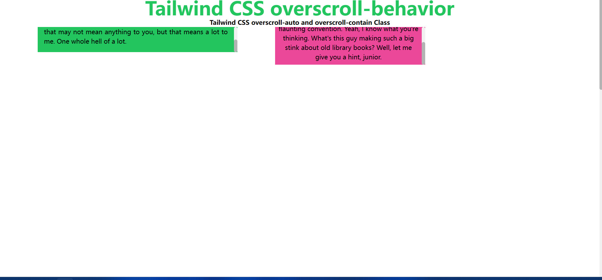
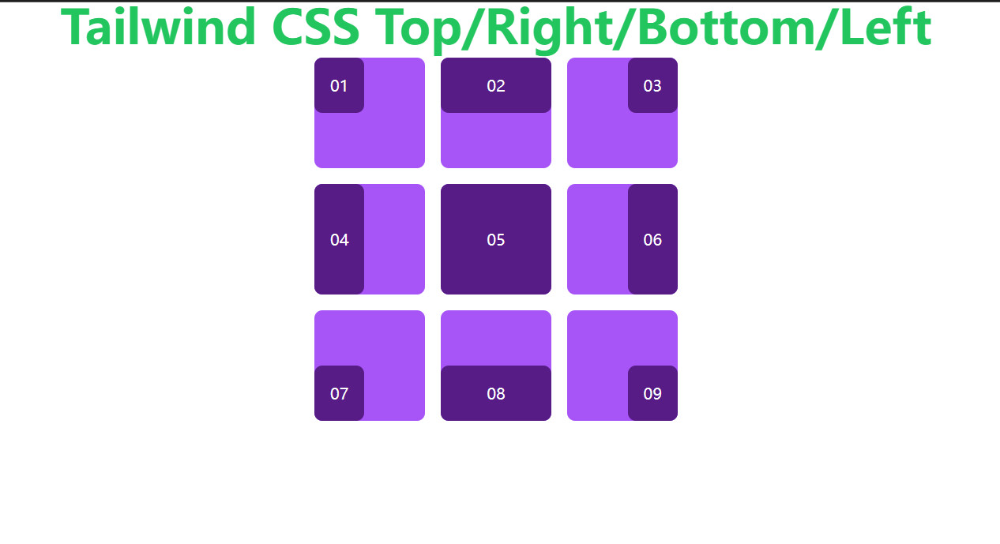
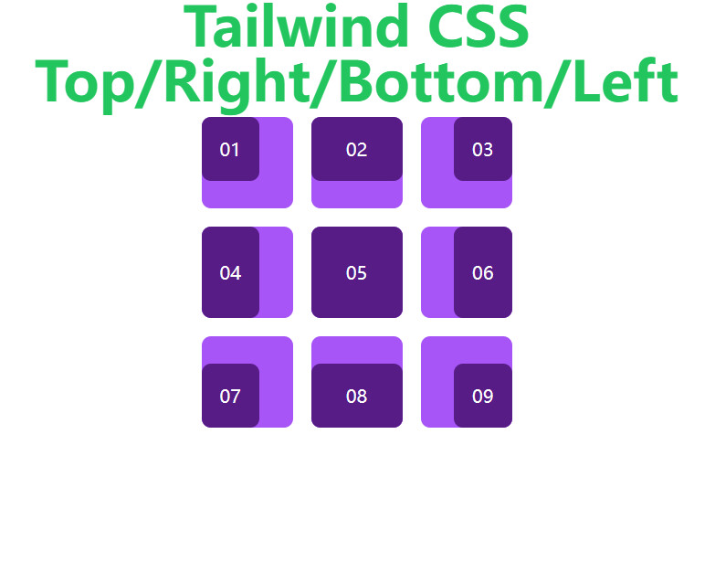
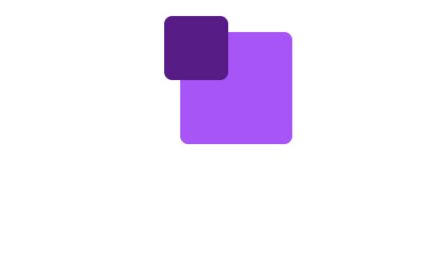
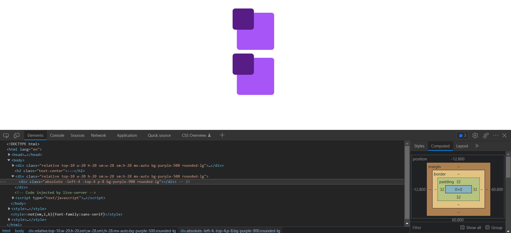

# 04 【布局之Overscroll Behavior  定位偏移量】

## 1.布局-Overscroll Behavior

`overscroll behavior` 用于控制浏览器到达滚动区域边界时的行为的功能类。这个属性可以用来防止在有多个滚动区域的页面中出现不必要的滚动。

### 1.1 快速参考

| Class                | Properties                      |
| -------------------- | ------------------------------- |
| overscroll-auto      | overscroll-behavior: auto;      |
| overscroll-contain   | overscroll-behavior: contain;   |
| overscroll-none      | overscroll-behavior: none;      |
| overscroll-y-auto    | overscroll-behavior-y: auto;    |
| overscroll-y-contain | overscroll-behavior-y: contain; |
| overscroll-y-none    | overscroll-behavior-y: none;    |
| overscroll-x-auto    | overscroll-behavior-x: auto;    |
| overscroll-x-contain | overscroll-behavior-x: contain; |
| overscroll-x-none    | overscroll-behavior-x: none;    |

### 1.2 基本用法

#### 阻止父元素的过度滚动

`overscroll-auto`
说明：它用于将滚动行为设置为默认。即使到达元素的边界，整个页面也会连同元素一起滚动。它是默认值。

`overscroll-contain`
说明:用来设置滚动行为，只对所使用的元素进行默认。在元素到达边界后进一步滚动，不会滚动它后面的元素。在相邻的滚动区域不会发生滚动链。

````html
<html lang="en">
  <head>
    <link rel="stylesheet" href="../dist/output.css" />
  </head>
  <body class="text-center">
    <h1 class="text-green-500 text-5xl font-bold">Tailwind CSS overscroll-behavior</h1>
    <b>Tailwind CSS overscroll-auto and overscroll-contain Class</b>
    <div class="flex">
      <div
        class="bg-green-500 mx-24 p-4 w-1/3 h-16 overscroll-contain overflow-y-auto text-justify"
      >
        Well, let me tell you something, funny boy. Y'know that little stamp, the one that says "New
        York Public Library"? Well that may not mean anything to you, but that means a lot to me.
        One whole hell of a lot.
      </div>

      <div class="bg-pink-500 p-2 w-1/4 h-24 overscroll-auto overflow-y-auto">
        Sure, go ahead, laugh if you want to. I've seen your type before: Flashy, making the scene,
        flaunting convention. Yeah, I know what you're thinking. What's this guy making such a big
        stink about old library books? Well, let me give you a hint, junior.
      </div>
    </div>
    <div class="h-[2000px]"></div>
  </body>
</html>
````



1. 左边的`div元素`设置了`overscroll-contain`,即使滚动到底，只要在这个元素滚动就不会影响父元素的滚动条。
2. 右边的`div元素`设置`overscroll-contain`，滚动到底后，在这个元素里面滚动，父元素的滚动条也会跟着滚动

#### 阻止过度滚动的反弹

> 暂时未发现这个属性的作用
>
> 以后发现了会补充

### 1.3 有条件的应用

#### 悬停、焦点和其他状态

Tailwind 允许您使用变体修饰符在不同状态下有条件地应用效用类。例如，使用 仅在悬停时应用该实用程序。`hover:overscroll-contain``overscroll-contain`

```html
<div class="overscroll-auto hover:overscroll-contain">
  <!-- ... -->
</div>
```

有关所有可用状态修饰符的完整列表，请查看 [Hover、Focus 和 Other State](https://tailwind.wyz.xyz/docs/hover-focus-and-other-states) 文档。

#### 断点和媒体查询

您还可以使用变体修饰符来定位媒体查询，如响应式断点、深色模式、首选减少运动等。例如，用于仅在中等屏幕尺寸及以上位置应用该实用工具。`md:overscroll-contain``overscroll-contain`

```html
<div class="overscroll-auto md:overscroll-contain">
  <!-- ... -->
</div>
```

若要了解详细信息，请查看有关[响应式设计](https://tailwind.wyz.xyz/docs/responsive-design)、[深色模式](https://tailwind.wyz.xyz/docs/dark-mode)[和其他媒体查询修饰符](https://tailwind.wyz.xyz/docs/hover-focus-and-other-states#media-queries)的文档。

## 2.布局-Top/Right/Bottom/Left

### 2.1 快速参考

属性很多，请点击链接进入官网查看[Top / Right / Bottom / Left - Tailwind CSS (wyz.xyz)](https://tailwind.wyz.xyz/docs/top-right-bottom-left)

### 2.2 基本用法

#### 放置定位元素

使用 `{top|right|bottom|left|inset}-0` 功能类，将绝对定位的元素锚定在最近定位的父元素的任何边缘上。

结合 Tailwind 的 padding 和 margin 功能类，您可能会发现这些是所有的您需要的用来精确控制绝对定位元素的功能类。

```html
<html lang="en">
  <head>
    <link rel="stylesheet" href="../dist/output.css" />
  </head>
  <body class="text-center">
    <h1 class="text-green-500 text-5xl font-bold">Tailwind CSS Top/Right/Bottom/Left</h1>
      
    <div class="flex w-72 sm:w-96 mx-auto justify-between flex-shrink-0 flex-wrap">
      <div class="relative w-20 h-20 sm:w-28 sm:h-28 bg-purple-500 rounded-lg m-2">
        <div
          class="absolute left-0 top-0 p-4 flex justify-center items-center text-white bg-purple-900 rounded-lg"
        >
          01
        </div>
      </div>
      <div class="relative w-20 h-20 sm:w-28 sm:h-28 bg-purple-500 rounded-lg m-2">
        <div
          class="absolute inset-x-0 top-0 p-4 flex justify-center items-center text-white bg-purple-900 rounded-lg"
        >
          02
        </div>
      </div>
      <div class="relative w-20 h-20 sm:w-28 sm:h-28 bg-purple-500 rounded-lg m-2">
        <div
          class="absolute top-0 right-0 p-4 flex justify-center items-center text-white bg-purple-900 rounded-lg"
        >
          03
        </div>
      </div>
      <div class="relative w-20 h-20 sm:w-28 sm:h-28 bg-purple-500 rounded-lg m-2">
        <div
          class="absolute inset-y-0 left-0 p-4 flex justify-center items-center text-white bg-purple-900 rounded-lg"
        >
          04
        </div>
      </div>
      <div class="relative w-20 h-20 sm:w-28 sm:h-28 bg-purple-500 rounded-lg m-2">
        <div
          class="absolute inset-0 p-4 flex justify-center items-center text-white bg-purple-900 rounded-lg"
        >
          05
        </div>
      </div>

      <div class="relative w-20 h-20 sm:w-28 sm:h-28 bg-purple-500 rounded-lg m-2">
        <div
          class="absolute inset-y-0 right-0 p-4 flex justify-center items-center text-white bg-purple-900 rounded-lg"
        >
          06
        </div>
      </div>
      <div class="relative w-20 h-20 sm:w-28 sm:h-28 bg-purple-500 rounded-lg m-2">
        <div
          class="absolute left-0 bottom-0 p-4 flex justify-center items-center text-white bg-purple-900 rounded-lg"
        >
          07
        </div>
      </div>
      <div class="relative w-20 h-20 sm:w-28 sm:h-28 bg-purple-500 rounded-lg m-2">
        <div
          class="absolute inset-x-0 bottom-0 p-4 flex justify-center items-center text-white bg-purple-900 rounded-lg"
        >
          08
        </div>
      </div>
      <div class="relative w-20 h-20 sm:w-28 sm:h-28 bg-purple-500 rounded-lg m-2">
        <div
          class="absolute right-0 bottom-0 p-4 flex justify-center items-center text-white bg-purple-900 rounded-lg"
        >
          09
        </div>
      </div>
    </div>
  </body>
</html>
```

sm屏幕显示



其他情况：



#### 使用负值

若要使用负上/右/下/左值，请在类名前面加上短划线前缀，以将其转换为负值。

```html
<!DOCTYPE html>
<html lang="en">
  <head>
    <meta charset="UTF-8" />
    <meta http-equiv="X-UA-Compatible" content="IE=edge" />
    <meta name="viewport" content="width=device-width, initial-scale=1.0" />
    <title>Document</title>
    <link rel="stylesheet" href="../dist/output.css" />
  </head>
  <body>
    <div class="relative top-10 w-20 h-20 sm:w-28 sm:h-28 mx-auto bg-purple-500 rounded-lg">
      <div class="absolute -left-4 -top-4 p-8 bg-purple-900 rounded-lg"></div>
    </div>
  </body>
</html>

```



### 2.3 有条件的应用

#### 悬停、焦点和其他状态

Tailwind 允许您使用变体修饰符在不同状态下有条件地应用效用类。例如，使用 仅在悬停时应用该实用程序。`hover:top-6``top-6`

```html
<div class="top-4 hover:top-6">
  <!-- ... -->
</div>
```

有关所有可用状态修饰符的完整列表，请查看 [Hover、Focus 和 Other State](https://tailwind.wyz.xyz/docs/hover-focus-and-other-states) 文档。

#### 断点和媒体查询

您还可以使用变体修饰符来定位媒体查询，如响应式断点、深色模式、首选减少运动等。例如，用于仅在中等屏幕尺寸及以上位置应用该实用工具。`md:top-6``top-6`

```html
<div class="top-4 md:top-6">
  <!-- ... -->
</div>
```

若要了解详细信息，请查看有关[响应式设计](https://tailwind.wyz.xyz/docs/responsive-design)、[深色模式](https://tailwind.wyz.xyz/docs/dark-mode)[和其他媒体查询修饰符](https://tailwind.wyz.xyz/docs/hover-focus-and-other-states#media-queries)的文档。

### 2.4 自定义主题

默认情况下，Tailwind 为[默认间距比例](https://tailwind.wyz.xyz/docs/customizing-spacing#default-spacing-scale)的组合以及一些其他分数值的组合提供上/右/下/左/插图实用程序。`auto``full`

您可以通过编辑或在文件中自定义间距比例。`theme.spacing``theme.extend.spacing``tailwind.config.js`

tailwind.config.js

```js
module.exports = {
  theme: {
    extend: {
      spacing: {
        4: '0.8rem',
      }
    }
  }
}
```

或者，您可以通过编辑或在文件中仅自定义上/右/下/左/插图比例。`theme.inset``theme.extend.inset``tailwind.config.js`

```html
 <div class="relative top-10 w-20 h-20 sm:w-28 sm:h-28 mx-auto bg-purple-500 rounded-lg">
      <div class="absolute -left-4 -top-4 p-8 bg-purple-900 rounded-lg"></div>
</div>
```



可以观察到`-left-4`就是`-0.8rem = -12.8px`

`tailwind.config.js`

```js
module.exports = {
  theme: {
    extend: {
      spacing: {
        4: '0.8rem',
      }
    }
  }
}
```

有关自定义默认主题的详细信息，请参阅[主题自定义](https://tailwind.wyz.xyz/docs/theme#customizing-the-default-theme)文档。
