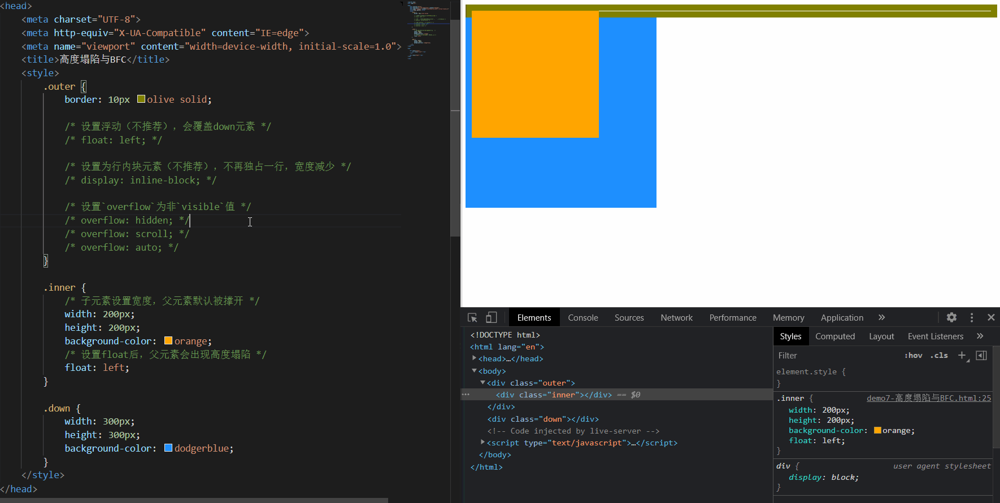
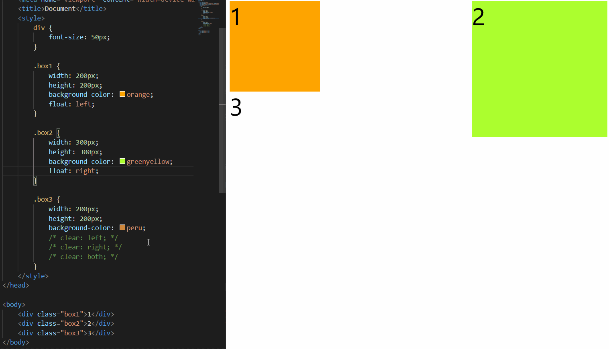
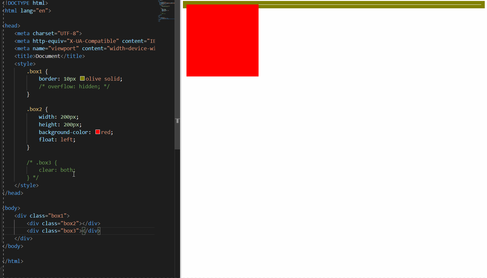
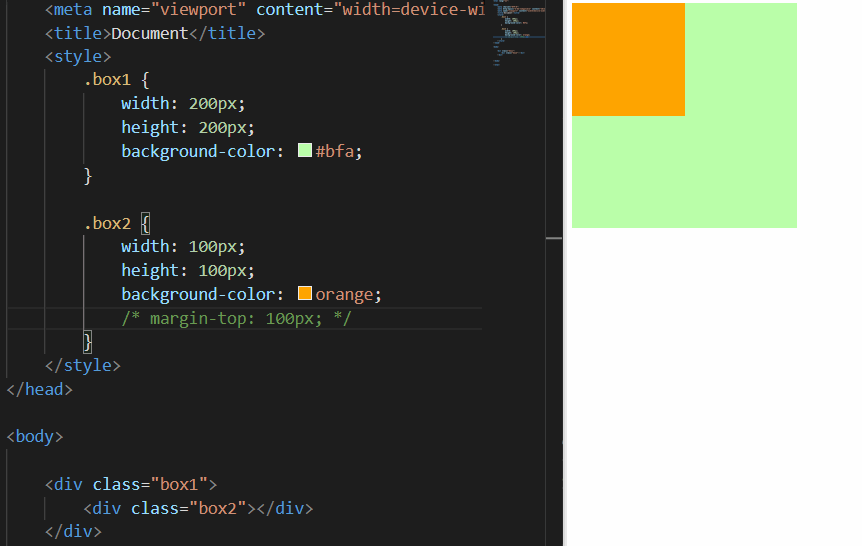
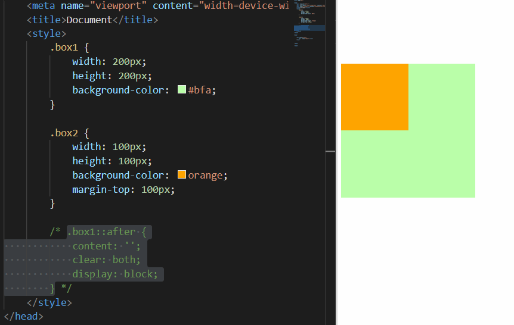
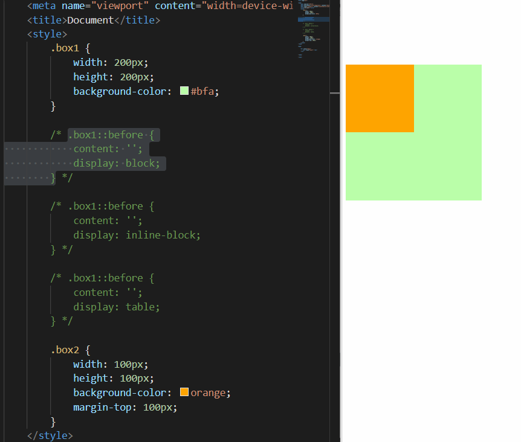
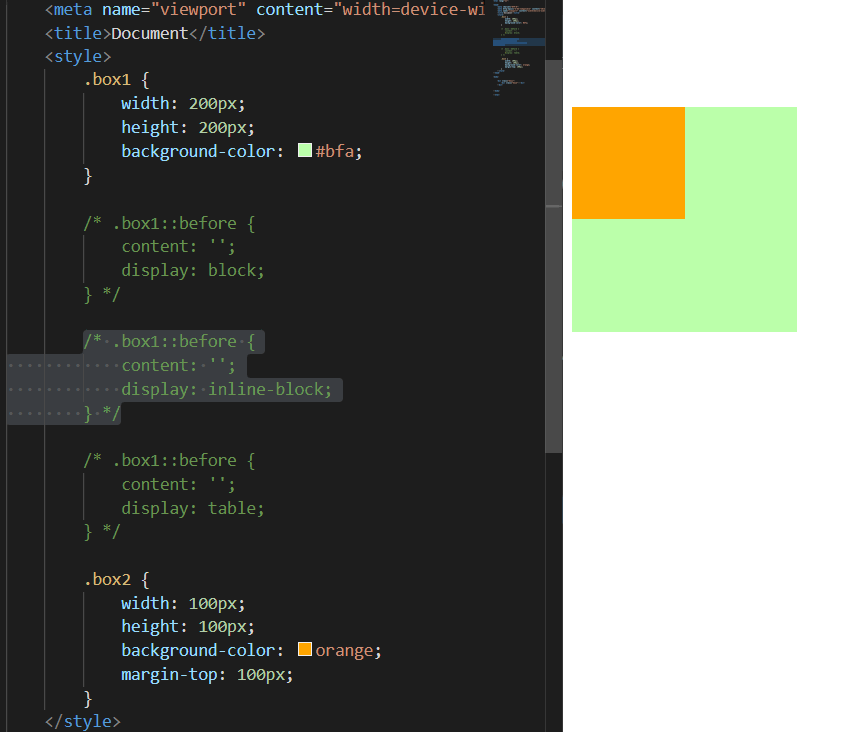
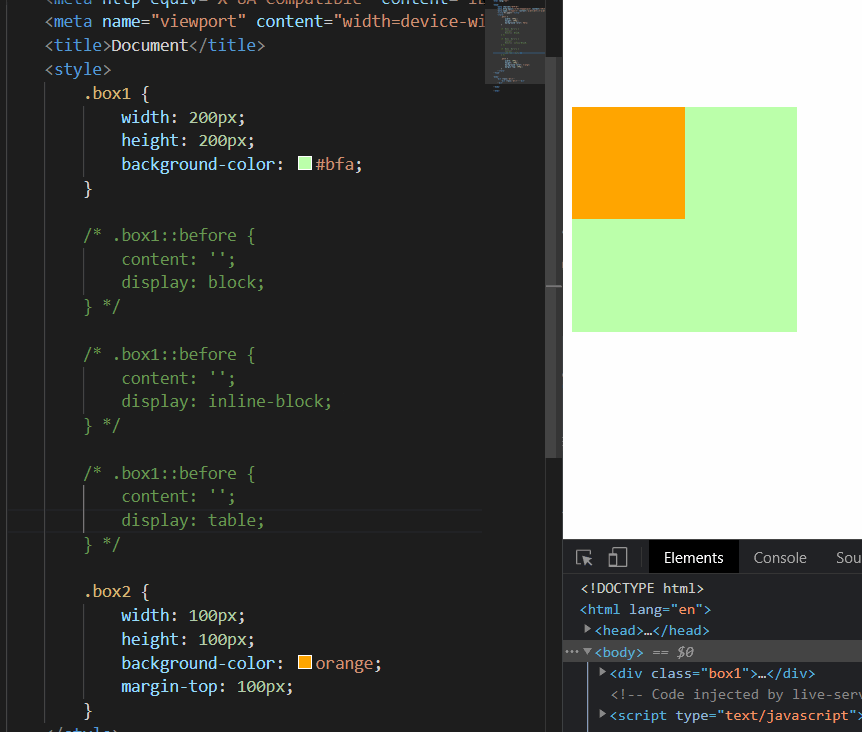
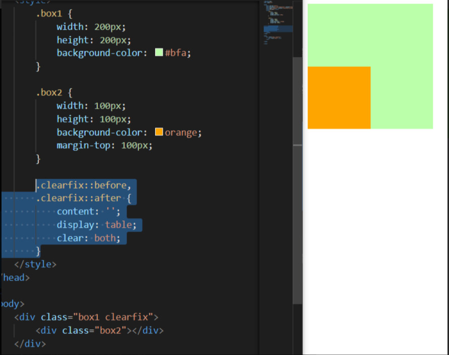

# 10 【高度塌陷与BFC】

## 1.高度塌陷

在浮动布局中，父元素的高度默认是被子元素撑开的

当子元素浮动后，其会完全脱离文档流，子元素从文档流中脱离将会无法撑起父元素的高度，导致父元素的高度丢失

父元素高度丢失以后，其下的元素会自动上移，导致页面的布局混乱


所以高度塌陷是浮动布局中比较常见的一个问题，这个问题我们必须要进行处理！

## 2.BFC

BFC（Block Formatting Context）块级格式化环境

- BFC是一个CSS中的一个隐含的属性，可以为一个元素开启BFC

- 开启BFC该元素会变成一个独立的布局区域

元素开启BFC后的特点：

- 不会被浮动元素覆盖

- 父子元素外边距不会重叠

- 可以包含浮动的元素

可以通过一些特殊方式来开启元素的BFC：

-  设置为浮动（不推荐）：很明显下方元素被覆盖了，总不能让所有元素都浮动吧


-  设置为行内块元素（不推荐）：不再独占一行，宽度变了，同时与下方元素产生了一点空隙


- 设置`overflow`为非`visible`值：既没有覆盖元素，也保持了独占一方的特性（保持了宽度），与下方元素也保持了最初的间隙
  常用的方式为元素设置`overflow:hidden`（`overflow:auto`也是ok的） 开启其BFC， 以使其可以包含浮动元素
  `overflow:scroll` 会有滚动条，可能并不需要的，所以不太推荐



不过，这种方式也存在一定问题，如下，`overflow`并没有完全清除div2布局上受到的影响

**总结**

- 可以通过变成浮动元素，来防止自身被浮动元素覆盖（有点“以毒攻毒”那味了）

- 可以设置行内块，来防止自身及其他元素被浮动元素覆盖（如果说浮动是“独善其身”，那行内块就有点“兼济天下”的意思）

- 可以设置`overflow`属性，包含浮动元素（既“独善其身”，又“兼济天下”，但仍有缺陷）

## 3.为什么需要清除浮动？

**问题**

由于父级盒子很多情况下不方便给高度，但是子盒子浮动又不占有位置，最后父级盒子高度为 0 时，就会影响下面的标准流盒子。


- 由于浮动元素不再占用原文档流的位置，所以它会对后面的元素排版产生影响

- 此时一但父盒子下面有其他盒子，那么布局就会发生严重混乱！

**实际开发**

我们前面浮动元素有一个标准流的父元素，他们有一个共同的特点，都是有高度的。

但是，所有的父盒子都必须有高度吗？

答案：不一定！比如，一个产品列表，随着时期的不同，产品数量也不同，所需的盒子大小也会随之改变，那么直接固定盒子高度的形式显然就是不行的。再比如，文章之类的盒子，不同的文章字数是不相同的，那么显然盒子也不能直接固定高度。

理想中的状态，让子盒子撑开父亲。有多少孩子，我父盒子就有多高。

但是不给父盒子高度会有问题吗？

答案：会！但有方法解决（清除浮动）。

## 4.清除浮动本质

- 清除浮动的本质是清除浮动元素造成的影响
- 如果父盒子本身有高度，则不需要清除浮动
- 清除浮动之后，父级就会根据浮动的子盒子自动检测高度。父级有了高度，就不会影响下面的标准流了

## 5.clear

我们这里设计三个兄弟元素，对前两个元素进行`float`的浮动属性设置，看下效果


由于box1的浮动，导致box3位置上移也就是box3受到了box1浮动的影响，位置发生了改变（注意，这里文字并没有被覆盖，这个就是“文字环绕”的问题）

如果我们不希望某个元素因为其他元素浮动的影响而改变位置，可以通过`clear`属性来清除浮动元素对当前元素所产生的影响

`clear`作用：清除浮动元素对当前元素所产生的影响（本质是为元素添加一个`margin-top`属性，值由浏览器自动计算）

语法：

```css
选择器 { clear: 属性值; }
```

| 属性值 | 描述                                                         |
| ------ | ------------------------------------------------------------ |
| left   | 不允许左侧有浮动元素（清除左侧浮动元素对当前元素的影响）     |
| right  | 不允许右侧有浮动元素（清除右侧浮动元素对当前元素的影响）     |
| both   | 清除两侧中影响较大一侧元素的影响（注意，这里不是同时清除两侧的影响） |

我们实际工作中，几乎只用 `clear: both;`

清除浮动的策略是：闭合浮动。



## 6.清除浮动方法

1. 额外标签法也称为隔墙法，是 W3C 推荐的做法。(实际开发不推荐)
2. 父级添加 overflow 属性
3. 父级添加 after 伪元素
4. 父级添加 双伪元素

## 7.清除浮动 —— 额外标签法

额外标签法也称为隔墙法，是 W3C 推荐的做法。

额外标签法会在浮动元素末尾添加一个空的标签。例如 `<div style="clear: both"></div>`，或者其他标签（如 `<br>` 等）。

- 优点： 通俗易懂，书写方便
- 缺点： 添加许多无意义的标签，结构化较差

注意： 要求这个新的空标签必须是**块级元素**。

总结：

- 清除浮动本质是？

清除浮动的本质是清除浮动元素脱离标准流造成的影响。

- 清除浮动策略是？

闭合浮动。只让浮动在父盒子内部影响，不影响父盒子外面的其他盒子。

- 额外标签法？

**隔墙法，就是在最后一个浮动的子元素后面添加一个额外空标签（块级标签），添加清除浮动样式。**

实际工作可能会遇到，但是不常用。



## 8.清除浮动 —— 父级添加 overflow

可以给父级添加 `overflow` 属性，将其属性值设置为 `hidden`、 `auto` 或 `scroll`。

子不教，父之过，注意是给父元素添加代码。

- 优点：代码简洁
- 缺点：无法显示溢出的部分


## 9.清除动 —— ::after 伪元素法

`::after` 方式是额外标签法的升级版，也是给父元素添加代码。

原理：自动在父盒子里的末尾添加一个 行内盒子，我们将它转换为 块级盒子，就间接实现了额外标签法。

```css
.clearfix::after {
	content: "";
	display: block;
	clear: both;
}
```

注意：类名不一定非要是 clearfix，但是还是推荐这么写以提高可读性。

- 优点：没有增加标签，结构更简单
- 缺点：需要单独照顾低版本浏览器
- 代表网站： 百度、淘宝网、网易等


**Q1：这里使用了一个伪元素选择器**`::after`**，那有人会问了，跟在box2下直接定义一个box3有什么区别呢？**

A：我们知道，网页的结构思想是：结构+表现+行为。在box2下直接定义一个box3，属于结构；而使用伪元素选择器，属于表现

而高度塌陷问题属于表现问题，所以在css中定义`::after`更符合网页的编程思想

**Q2：为什么需要使用**`display: block`**呢？**

A：因为默认情况下，`::after`伪元素是一个行内元素，如果不转为块元素，将仍然撑不起box1的高度

## 10.清除浮动 —— 双伪元素清除浮动

在前面说过垂直布局中边距重叠的问题：相邻的垂直方向外边距会发生重叠现象



如上图所示，子元素设置了一个`margin-top`之后，父元素跟随子元素一起进行了移动

即我们之前说的父子元素间相邻外边距，子元素会传递给父元素（上外边距）

可以用刚才说的伪元素选择器啊

好，我们先来看下效果



貌似是没有任何变化，到底是什么地方不对呢？

我们再来回顾下使用`after`伪元素的心路历程：

- 使用无内容的box3撑起box1 => 表现代替结构（`::after`代替box3）

- `clear`清除浮动对元素产生的影响（还记得`clear`的原理么？）

其实就是给元素设置了一个`margin-top`属性，不过这个在开发者工具中是看不到的

既然如此，就相当于在box2下面添加一个box3，然后给box3设置一个`margin-top`属性

到此为止，

∵  相邻的垂直方向外边距 这个条件仍然满足

∴  会发生重叠现象这个结论也依然成立

具体点就是，父子元素间相邻外边距，子元素会传递给父元素（上外边距），表现为box1和box2同步往下移动

那我们应该怎么做才能解决这个问题？

当然是让两个元素垂直外边距不相邻啊



我们用了`before`伪元素选择器，目的当然是让box1和box2的外边距不相邻，但是好像并没有效果

我们再换成`display: inline-block`属性看看



好像是解决了父元素布局的问题，但是子元素怎么还往下跑了一段距离？ 是谁给的勇气？

因为`inline-block`兼顾行内元素和块元素的特点，既可以设置宽高也不独占一行

在没有设置宽高时，会存在一个默认高度，所以`inline-block`仍然行不通

还有一个属性，`display: table`



**Q1：为什么没有使用clear属性？**

A：不是说了吗？`clear`是为了清除浮动对布局的影响，我们现在没有浮动的元素啊，我们要讨论的也不是浮动的问题

**Q2：display不是还有一个**`none`**属性么，为什么不用呢？**

A：`none`属性是不占据位置，但是也不能让元素相邻的外边距分离啊

**Q3：为什么**`table`值就可以呢？

A：这个也是开启BFC的方法，而且，应该牢记的是，元素开启BFC后的其中一个特点就是 父子元素外边距不会重叠。当然，这里也需要合理选择伪元素选择器，使其外边距不相邻才行

另外，总结一下：

- 高度塌陷问题，一般用`::after`

- 外边距重叠问题，一般用`::before`

`clearfix` 这个样式就可以同时解决高度塌陷和外边距重叠的问题

当你在遇到这些问题时，直接使用`clearfix`这个类即可，他就可以帮你轻松搞定css中的两大难题

额外标签法的升级版，也是给给父元素添加代码。

原理：自动在父盒子里的两端添加两个行内盒子，并把它们转换为 表格，间接实现了额外标签法。

```css
.clearfix::before,
.clearfix::after{
    content: '';
    display: table;
    clear: both;
}

```

其中`.clearfix::before`是为了解决外边距重叠问题

```css
.clearfix::before{
    content: '';
    display: table;
}
```

`.clearfix::after`是为了解决高度塌陷问题

````css
.clearfix::after{
    content: '';
    display: table;
    clear: both;
}
````



## 11.清除浮动总结

为什么需要清除浮动？

- 父级没高度
- 子盒子浮动了
- 影响下面布局了，我们就应该清除浮动了

| 清除浮动的方式         | 优点               | 缺点                                 |
| ---------------------- | ------------------ | ------------------------------------ |
| 额外标签法（隔墙法）   | 通俗易懂，书写方便 | 添加许多无意义的标签，结构化较差     |
| 父级 overflow: hidden; | 书写简单           | 溢出隐藏                             |
| 父级 after 伪元素      | 结构语义化正确     | 由于 IE6~7 不支持 :after，兼容性问题 |
| 父级双伪元素           | 结构语义化正确     | 由于 IE6~7 不支持 :after，兼容性问题 |
