# 15【背景 渐变色】 

## 1.背景

### 1.1 背景颜色

`background-color` 属性定义了元素的背景颜色。

```css
background-color: 颜色值;
```

一般情况下元素背景颜色默认值是 `transparent`（透明），我们也可以手动指定背景颜色为透明色。

```css
background-color: transparent;
```

目前 CSS 还支持丰富的渐变色，但是某些浏览器不支持。

```html
<!doctype html>
<html lang="zh-CN">

<head>
    <meta charset="UTF-8">
    <meta http-equiv="X-UA-Compatible" content="IE=edge">
    <meta name="viewport" content="width=device-width, initial-scale=1.0">
    <title>渐变</title>
    <style>
        #grad1 {
            height: 200px;
            /* 浏览器不支持时显示 */
            background-color: red;
            /* 线性渐变 - 从上到下（默认情况下）*/
            background-image: linear-gradient(#e66465, #9198e5);
        }
    </style>
</head>

<body>
    <h3>线性渐变 - 从上到下</h3>
    <p>从顶部开始的线性渐变。起点是红色，慢慢过渡到蓝色：</p>

    <div id="grad1"></div>

    <p><strong>注意：</strong> Internet Explorer 9 及之前的版本不支持渐变。</p>
</body>

</html>
```

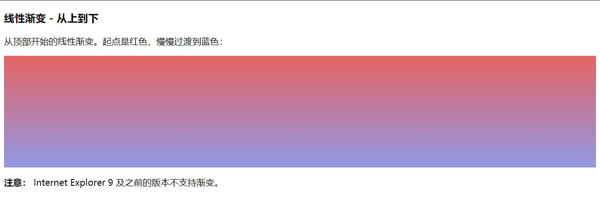

### 1.2 背景图片

`background-image` 属性描述了元素的背景图像，实际开发常用于 **logo** 或者一些**装饰性的小图片**或者是**超大的背景图片**, 优点是非常便于控制位置（精灵图也是一种运用场景）。

```css
background-image : none | url(url)
```

| 参数值 | 作用                           |
| ------ | ------------------------------ |
| `none` | 无背景图（默认的）             |
| `url`  | 使用绝对或相对地址指定背景图像 |

注意：背景图片后面的地址，千万不要忘记加 URL， 同时里面的路径不要加引号。

```css
background-color: pink;
background-image: url(../images/logo.png);
/* 1、背景图片不平铺 */
/* background-repeat: no-repeat; */
/* 2、默认情况下，背景图片是平铺的 */
/* background-repeat: repeat; */ /* 页面元素既可以添加背景颜色也可以添加背景图片，只不过背景图片区域会覆盖背景颜色 */
```

- 如果背景图片大小小于元素，则背景图片会自动在元素中平铺将元素铺满

- 如果背景图片大小大于元素，则背景图片一部分会无法完全显示

- 如果背景图片大小等于元素，则背景图片会直接正常显示

> 可以同时设置背景图片和背景颜色，这样背景颜色将会成为图片的背景色

### 1.3 背景平铺

如果需要在 HTML 页面上对背景图像进行平铺，可以使用 `background-repeat` 属性。

注：平铺可以简单的理解为“重复”。

```css
background-repeat: repeat | no-repeat | repeat-x | repeat-y
```

| 参数值      | 作用                                 |
| ----------- | ------------------------------------ |
| `repeat`    | 背景图像在纵向和横向上平铺（默认的） |
| `no-repeat` | 背景图像不平铺                       |
| `repeat-x`  | 背景图像在横向上平铺                 |
| `repeat-y`  | 背景图像在纵向上平铺                 |

### 1.4 背景图片位置

利用 `background-position` 属性可以改变图片在背景中的位置。

```css
background-position: x y;
```

参数代表的意思是：x 坐标 和 y 坐标，可以使用 `方位名词` 或者 `精确单位`。

| 参数值     | 说明                                              |
| ---------- | ------------------------------------------------- |
| `length`   | 百分数 \| 由浮点数字和单位标识符组成的长度值      |
| `position` | top \| center \| bottom \| left \| rigth 方位名词 |

- 参数是方位名词
  - 如果指定的两个值都是方位名词，则两个值前后顺序无关，比如 left top 和 top left 效果一致
  - 使用方位词时必须要同时指定两个值，如果只写一个则第二个默认就是`center`


- 参数是精确单位
  - 如果参数值是精确坐标，那么第一个肯定是 x 坐标，第二个一定是 y 坐标
  - 如果只指定一个数值，那该数值一定是 x 坐标，**另一个默认垂直居中**


- 参数是混合单位
  - 如果指定的两个值是精确单位和方位名词混合使用，则第一个值是 x 坐标，第二个值是 y 坐标

### 1.5 背景图像固定（背景附着）

`background-attachment` 属性设置背景图像是否固定或者随着页面的其余部分滚动。

`background-attachment` 后期可以制作 `视差滚动` 的效果。

```css
background-attachment : scroll | fixed
```

| 参数     | 作用                               |
| -------- | ---------------------------------- |
| `scroll` | 默认值，背景图片会跟随元素移动     |
| `fixed`  | 背景会固定在页面中，不会随元素移动 |

```html
<!doctype html>
<html lang="en">

<head>
    <meta charset="UTF-8">
    <meta http-equiv="X-UA-Compatible" content="IE=edge">
    <meta name="viewport" content="width=device-width, initial-scale=1.0">
    <title>超大背景图片</title>
    <style>
        body {
            background-image: url(images/bg.jpg);
            background-repeat: no-repeat;
            background-position: center top;
            /* 把背景图片固定住 */
            background-attachment: fixed;
            color: #fff;
            font-size: 20px;
        }
    </style>
</head>

<body>
    <p>天王盖地虎, pink老师一米五</p>
    <p>天王盖地虎, pink老师一米五</p>
    <p>天王盖地虎, pink老师一米五</p>
    <p>天王盖地虎, pink老师一米五</p>
    <p>天王盖地虎, pink老师一米五</p>
    <p>天王盖地虎, pink老师一米五</p>
    <p>天王盖地虎, pink老师一米五</p>
    <p>天王盖地虎, pink老师一米五</p>
    <p>天王盖地虎, pink老师一米五</p>
    <p>天王盖地虎, pink老师一米五</p>
    <p>天王盖地虎, pink老师一米五</p>
    <p>天王盖地虎, pink老师一米五</p>
    <p>天王盖地虎, pink老师一米五</p>
    <p>天王盖地虎, pink老师一米五</p>
    <p>天王盖地虎, pink老师一米五</p>
    <p>天王盖地虎, pink老师一米五</p>
    <p>天王盖地虎, pink老师一米五</p>
    <p>天王盖地虎, pink老师一米五</p>
    <p>天王盖地虎, pink老师一米五</p>
    <p>天王盖地虎, pink老师一米五</p>
    <p>天王盖地虎, pink老师一米五</p>
    <p>天王盖地虎, pink老师一米五</p>
    <p>天王盖地虎, pink老师一米五</p>
    <p>天王盖地虎, pink老师一米五</p>
    <p>天王盖地虎, pink老师一米五</p>
    <p>天王盖地虎, pink老师一米五</p>
    <p>天王盖地虎, pink老师一米五</p>
    <p>天王盖地虎, pink老师一米五</p>
    <p>天王盖地虎, pink老师一米五</p>
    <p>天王盖地虎, pink老师一米五</p>
    <p>天王盖地虎, pink老师一米五</p>
    <p>天王盖地虎, pink老师一米五</p>
    <p>天王盖地虎, pink老师一米五</p>
    <p>天王盖地虎, pink老师一米五</p>
    <p>天王盖地虎, pink老师一米五</p>
    <p>天王盖地虎, pink老师一米五</p>
    <p>天王盖地虎, pink老师一米五</p>
    <p>天王盖地虎, pink老师一米五</p>
    <p>天王盖地虎, pink老师一米五</p>
    <p>天王盖地虎, pink老师一米五</p>
    <p>天王盖地虎, pink老师一米五</p>
    <p>天王盖地虎, pink老师一米五</p>
    <p>天王盖地虎, pink老师一米五</p>
    <p>天王盖地虎, pink老师一米五</p>
    <p>天王盖地虎, pink老师一米五</p>
    <p>天王盖地虎, pink老师一米五</p>
    <p>天王盖地虎, pink老师一米五</p>
</body>

</html>
```


### 1.6 背景大小

利用 `background-size ` 属性可以设置背景图片的大小。

```css
background-size: length|percentage|cover|contain;
```

| 值         | 描述                                                         |
| :--------- | :----------------------------------------------------------- |
| length     | 设置背景图片高度和宽度。第一个值设置宽度，第二个值设置的高度。如果只给出一个值，第二个是设置为 **auto**(自动) |
| percentage | 将计算相对于背景定位区域的百分比。第一个值设置宽度，第二个值设置的高度。如果只给出一个值，第二个是设置为"auto(自动)" |
| cover      | 此时会保持图像的纵横比并将图像缩放成将完全覆盖背景定位区域的最小大小。 |
| contain    | 此时会保持图像的纵横比并将图像缩放成将适合背景定位区域的最大大小。 |

### 1.7 背景范围 

利用 `background-clip ` 属性可以设置背景的范围 。

```css
background-clip: border-box|padding-box|content-box;
```

| 值          | 说明                                       |
| :---------- | :----------------------------------------- |
| border-box  | 默认值，背景会出现在边框的下边             |
| padding-box | 背景不会出现在边框，只出现在内容区和内边距 |
| content-box | 背景只会出现在内容区                       |

### 1.8 背景复合写法

为了简化背景属性的代码，我们可以将这些属性合并简写在同一个属性 `background` 中，从而节约代码量。
当使用简写属性时，没有特定的书写顺序，一般习惯约定顺序为：
`background`: `背景颜色` `背景图片地址` `背景平铺` `背景图像滚动` `背景图片位置/背景大小`

```css
    background: #bfa url("assets/dlam.png") no-repeat 100px 100px/200px padding-box content-box;
```

**注意**

- `background-size`必须写在`background-position`的后边，并且使用/隔开`background-position/background-size`

- `background-origin background-clip` 两个样式，`orgin`要在`clip`的前边

这是实际开发中，我们更提倡的写法。

### 1.9 背景色半透明

CSS3 为我们提供了背景颜色半透明的效果。

```css
background: rgba(0, 0, 0, 0.3);
```

- 最后一个参数是 `alpha` 透明度，取值范围在 `0~1` 之间
- 习惯把 0.3 的 0 省略掉，写为 `background: rgba(0, 0, 0, .3);`
- 注意：背景半透明是指盒子背景半透明，盒子里面的内容不受影响
- CSS3 新增属性，是 IE9+ 版本浏览器才支持的
- 但是现在实际开发，我们不太关注兼容性写法了，可以放心使用

```html
<!doctype html>
<html lang="en">

<head>
    <meta charset="UTF-8">
    <meta http-equiv="X-UA-Compatible" content="IE=edge">
    <meta name="viewport" content="width=device-width, initial-scale=1.0">
    <title>背景色透明写法</title>
    <style>
        div {
            width: 300px;
            height: 300px;
            /* background-color: black; */
            background: rgba(0, 0, 0, .3);
        }
    </style>
</head>

<body>
    <!-- 只是让背景颜色半透明，盒子里的内容并不受影响 -->
    <div>dselegent</div>
</body>

</html>
```

### 1.10 背景总结

| 属性                   | 作用           | 值                                               |
| ---------------------- | -------------- | ------------------------------------------------ |
| `backgroud-color`      | 背景颜色       | 预定义的颜色值 / 十六进制 / RGB代码              |
| `backgroud-image`      | 背景图片       | url（图片路径）                                  |
| `backgroud-repeat`     | 是否平铺       | repeat / no-repeat / repeat-x / repeat-y         |
| `backgroud-position`   | 背景位置       | length / position 分别是 x 和 y 坐标             |
| `backgroud-attachment` | 背景附着       | scroll（背景滚动）/ fixed（背景固定）            |
| `背景简写`             | 书写更简单     | 背景颜色 背景图片地址 背景平铺 背景滚动 背景位置 |
| `背景色半透明`         | 背景颜色半透明 | background: rgba(0, 0, 0, 0.3); 后面必须是4个值  |

背景图片：实际开发常见于 logo 或者一些装饰性的小图片或者是超大的背景图片，优点是非常便于控制位置（精灵图也是一种运用场景）。

## 2.渐变色

### 2.1 线性渐变

通过渐变可以设置一些复杂的背景颜色，可以实现从一个颜色向其他颜色过渡的效果

渐变是图片，需要通过`background-image`来设置

线性渐变，颜色沿着一条直线发生变化 `linear-gradient()`

```css
# 红色在开头，黄色在结尾，中间是过渡区域
background-image: linear-gradient(red, yellow);
```

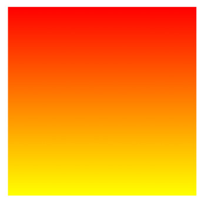

线性渐变的开头，我们可以指定一个渐变的方向

- `to left`

- `to right`

- `to bottom`

- `to top`

- `deg` deg表示度数

- `turn` 表示圈

```css
background-image: linear-gradient(to left, red, yellow);
background-image: linear-gradient(to right, red, yellow);
background-image: linear-gradient(to top, red, yellow);
background-image: linear-gradient(to bottom, red, yellow);
```

上面基本的4个方向的渐变很好理解，我们就不再做过多的一一解释了

我们来看度数的渐变效果

```css
background-image: linear-gradient(45deg, red, yellow);
```

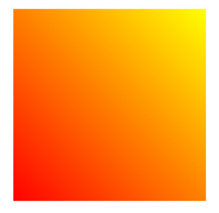

会发现它是从左下角往右上角去进行渐变的，为什么呢？

我们小时候肯定都用过量角器

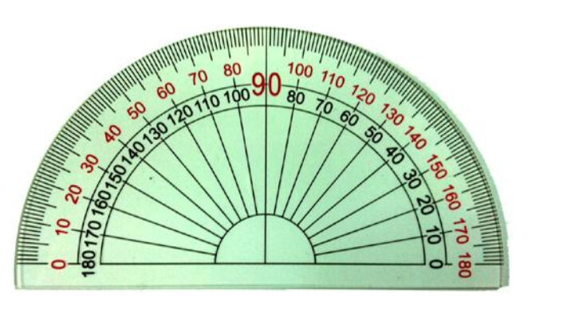

是不是恍然大悟，我们以原点作为起始点，有角度的那条边去做渐变，再把四象限的概念和矩形内部的四个角对应起来

**总结**：线性渐变的边上的某一点为起点，以一定角度渐变的；渐变方向的颜色是线性变化的，而其垂线方向的颜色是一致的

然后看下圈数的表示方法

```css
background-image: linear-gradient(0.4turn, red, yellow);
```

因为圈数和角度之间可以相互转换，所以这里就不再进行赘述了

另外，渐变可以同时指定多个颜色，多个颜色默认情况下平均分布，也可以手动指定渐变的分布情况

`repeating-linear-gradient()` 可以平铺的线性渐变

```css
background-image: repeating-linear-gradient(red, yellow);
```

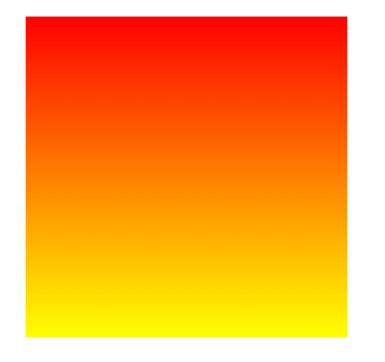

默认情况下，跟`linear-gradient(red, yellow)`效果一样，我们稍作改动

```css
background-image: repeating-linear-gradient(red 0px, yellow 50px);
```

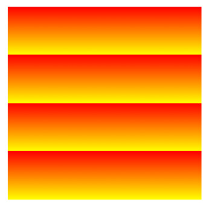

由于我们设置的`div`宽高为`200px`，所以会有4次重复的渐变效果

所以默认情况下，下列几种写法是一致的，效果相同

```css
background-image: linear-gradient(red, yellow);
background-image: repeating-linear-gradient(red, yellow);
/* 因为我们设置的div盒子的宽高为200px，所以这里[height]=200px */
background-image: repeating-linear-gradient(red 0, yellow [height]);
```

### 2.2 径向渐变

`radial-gradient()` 径向渐变（放射性的效果）

```css
background-image: radial-gradient(red, yellow);
```

默认情况下，径向渐变的形状根据元素的形状来计算的

-  正方形 --> 圆形
- 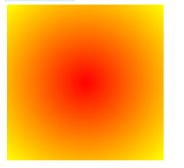
- 长方形 --> 椭圆形
  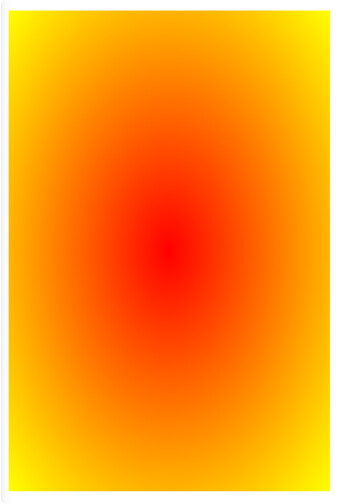

默认情况下，`circle`和`ellipse`是自动适配盒子的，我们也可以手动指定径向渐变的形状

**形状**

- `circle` 圆形

- `ellipse`椭圆

```css
background-image: radial-gradient(circle, red, yellow);
```

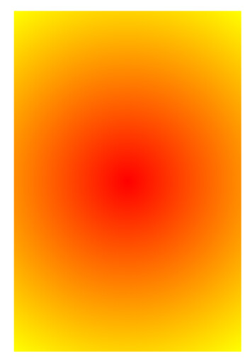

也可以指定渐变的位置

**位置**

- `top`

- `right`

- `left`

- `center`

- `bottom`

```css
background-image: radial-gradient(at left, red, yellow);
```

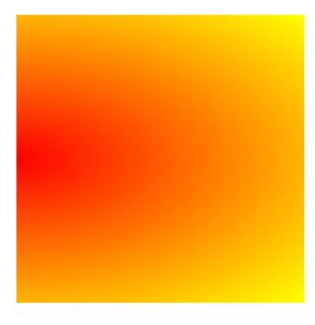

当然，除了上述值，还可以指定像素

**大小**

- `closest-side` 近边

- `farthest-side` 远边

- `closest-corner` 近角

- `farthest-corner` 远角

```css
background-image: radial-gradient(100px 60px, red, yellow);
```

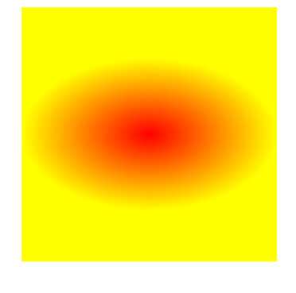

同时对其形状/大小和位置进行指定

`radial-gradient(形状/大小 at 位置, 颜色 位置, 颜色 位置, 颜色 位置)`

```css
background-image: radial-gradient(circle at 50px 100px, red 50px, yellow 100px);
```

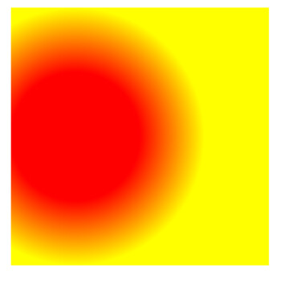

总结一下

**形状**

- `circle` 圆形

- `ellipse`椭圆

**大小**

- `closest-side` 近边

- `farthest-side` 远边

- `closest-corner` 近角

- `farthest-corner` 远角

**位置**

- `top`

- `right`

- `left`

- `center`

- `bottom`

类似于线性渐变，径向渐变也有对应的`repeat`属性

```css
background-image: repeating-radial-gradient(circle at 50px 100px, red 50px, yellow 100px);
```

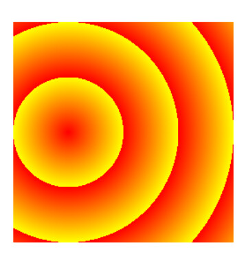

**总结**：径向渐变的渐变方向以圆心为起点，往四周扩散的；同一半径上的颜色是渐变的，同一圆周上的颜色是一致的