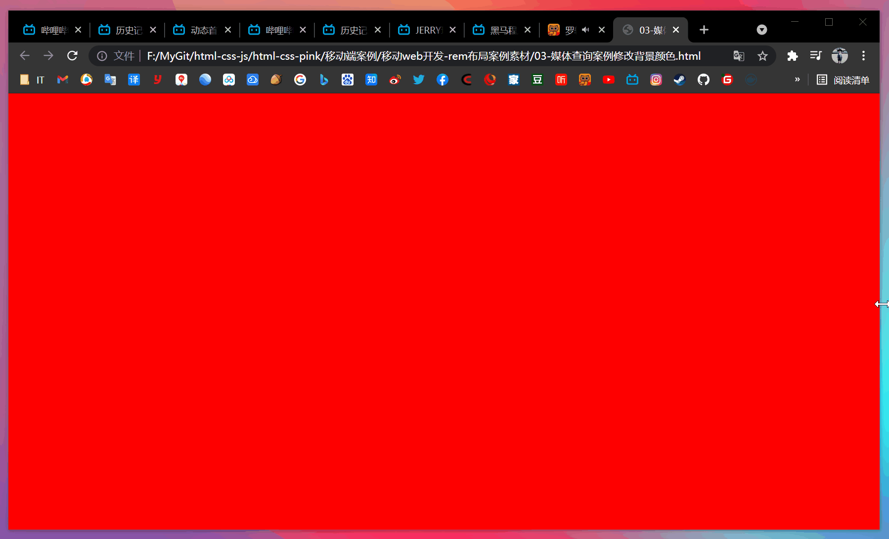
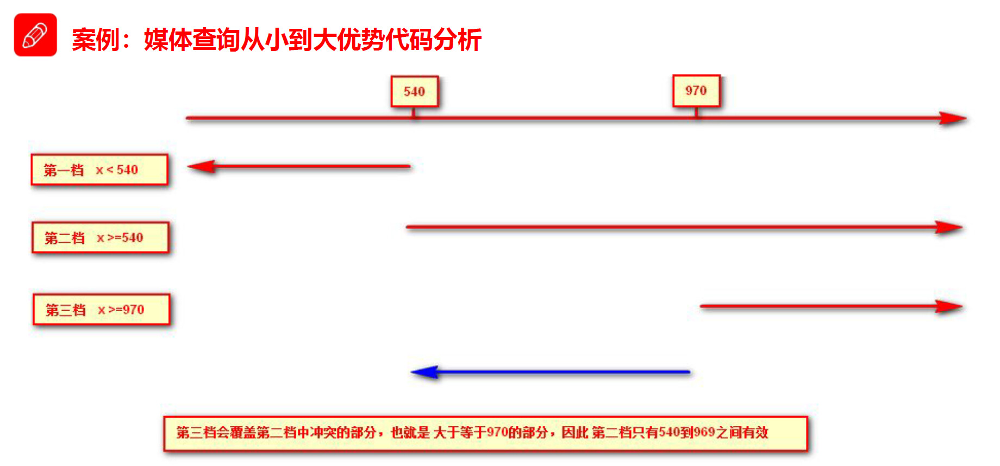
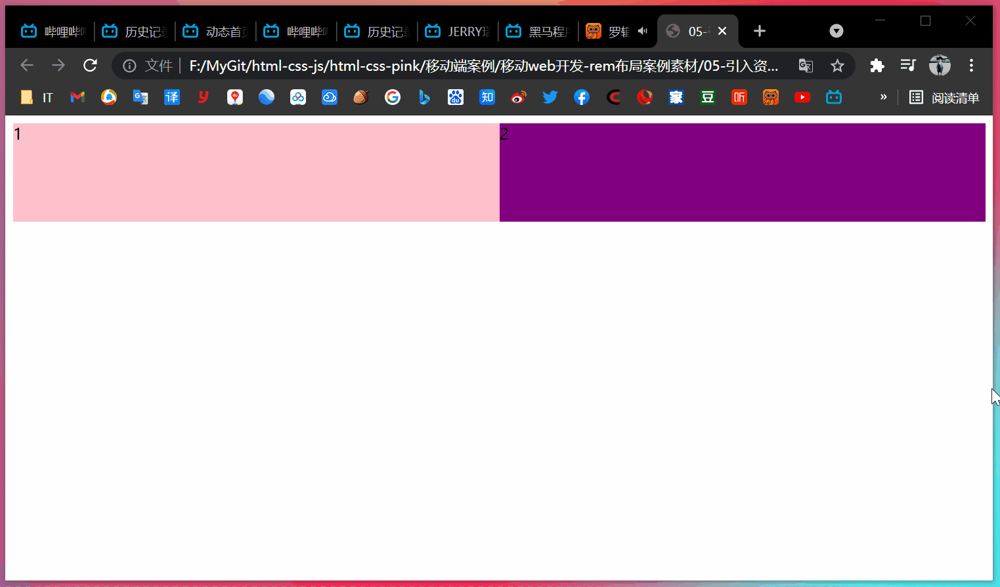
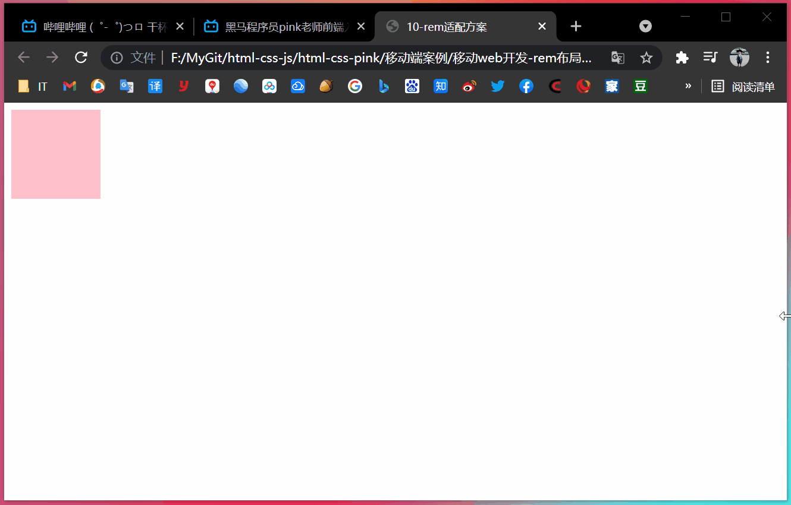
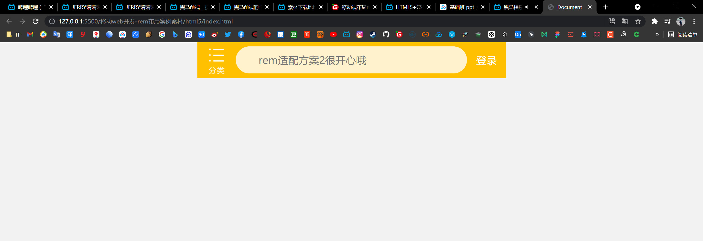

# 20 【rem适配布局】


【思考】

1. 页面布局文字能否随着屏幕大小变化而变化？
2. 流式布局和 flex 布局主要针对于宽度布局，那高度如何设置？
3. 怎么样让屏幕发生变化的时候元素高度和宽度等比例缩放？

## 1.rem单位 

`rem`（root em）是一个相对单位，类似于 `em`，em 是父元素字体大小。

不同的是 rem 的基准是**相对于 html 元素的字体大小**。

比如，根元素（html）设置 `font-size=12px`，非根元素设置 `width: 2rem;` 则换成 px 表示就是 24px。

rem 的优势：父元素文字大小可能不一致，但是整个页面只有一个 `html`，可以很好来控制整个页面的元素大小。（即：达到统一控制全局字体大小的效果！）

> 注意：rem 控制的不仅仅是字体大小，还能控制其他元素的大小。

```css
/* 根 html 为 12px */
html {
    font-size: 12px;
}
/* 此时 div 的字体大小就是 24px */
div {
    font-size: 2rem；
}
```

【案例】

```html
<!doctype html>
<html lang="en">

<head>
    <meta charset="UTF-8">
    <meta name="viewport" content="width=device-width, initial-scale=1.0">
    <meta http-equiv="X-UA-Compatible" content="ie=edge">
    <title>rem单位</title>
    <style>
        html {
            font-size: 12px;
        }

        div {
            font-size: 12px;
            width: 15rem;
            height: 15rem;
            background-color: purple;
        }

        p {
            /* 1. em 相对于父元素的字体大小来说的 */
            /* 
            width: 10em;
            height: 10em;
            */
            /* 2. rem 相对于 html 元素字体大小来说的 */
            width: 10rem;
            height: 10rem;
            background-color: pink;
            /* 3.rem 的优点就是可以通过修改 html 里面的文字大小来改变页面中元素的大小可以整体控制 */
        }
    </style>
</head>

<body>
    <div>
        <p></p>
    </div>
</body>

</html>
```

注：虽然使用 rem 之后实现了全局字体大小的统一控制，但是依旧不能根据窗口大小自动适配，所以我们还要学习媒体查询。

## 2.媒体查询

### 2.1 什么是媒体查询

媒体查询（Media Query）是 CSS3 新语法。

- 使用 `@media` 查询，可以争对不同的媒体类型定义不同的样式
- `@media` 可以争对不同的屏幕尺寸设置不同的样式
- 当你重置浏览器大小的过程中，页面也会根据浏览器的宽度和高度重新渲染页面
- 目前针对很多苹果手机、Android 手机、平板等设备都用得到媒体查询

### 2.2 语法规范

```css
@media mediatype and|not|only (media feature) {
    CSS-Code;
}
```

- 用 @media 开头，注意 `@` 符号
- mediatype 媒体类型
- 关键字 and not only
- media feature 媒体特性，必须有小括号包含

### 2.3 mediatype 查询类型

将不同的终端设备划分成不同的类型，称为媒体类型。

| 值      | 解释说明                           |
| ------- | ---------------------------------- |
| `all`   | 用于所有设备                       |
| `print` | 用于打印机和打印预览               |
| `scree` | 用于电脑屏幕、平板电脑、智能手机等 |

### 2.4 关键字

关键字将媒体类型或多个媒体特性连接到一起做为媒体查询的条件。

- and：可以将多个媒体特性连接到一起，相当于 “且” 的意思。
- not：排除某个媒体类型，相当于 “非” 的意思，可以省略。
- only：指定某个特定的媒体类型，可以省略。

### 2.5 媒体特性

每种媒体类型都具有各自不同的特性，根据不同媒体类型的媒体特性设置不同的展示风格。我们暂且了解三个。注意他们要加小括号包含。

| 值          | 解释说明                           |
| ----------- | ---------------------------------- |
| `width`     | 定义输出设备中页面可见区域的宽度   |
| `min-width` | 定义输出设备中页面最小可见区域宽度 |
| `max-width` | 定义输出设备中页面最大可见区域宽度 |

【案例】

根据页面宽度改变背景颜色。

实现思路：

- 按照 **从大到小** 的或者 **从小到大** 的思路
- 注意我们有最大值 `max-width` 和最小值 `min-width` 都是**包含等于**的
- 当屏幕小于 540 像素，背景颜色变为蓝色（x <= 539）
- 当屏幕大于等于 540 像素并且小于等于 969 像素的时候背景颜色为绿色（540 <= x <= 969）
- 当屏幕大于等于 970 像素的时候，背景颜色为红色（x >= 970）

注意：为了防止混乱，媒体查询我们要按照从小到大或者从大到小的顺序来写，但是我们最喜欢的还是**从小到大**来写，这样代码更简洁。

举例：

```html
<!doctype html>
<html lang="en">

<head>
    <meta charset="UTF-8">
    <meta name="viewport" content="width=device-width, initial-scale=1.0">
    <meta http-equiv="X-UA-Compatible" content="ie=edge">
    <title>媒体查询案例修改背景颜色</title>
    <style>
        /* 1. 媒体查询一般按照从大到小或者从小到大的顺序来 */
        /* 2. 小于 540px 页面的背景颜色变为蓝色 */
        @media screen and (max-width: 539px) {
            body {
                background-color: blue;
            }
        }

        /* 3. 540 ~ 970 我们的页面颜色改为绿色 */
        /* @media screen and (min-width: 540px) and (max-width: 969px) {
            body {
                background-color: green;
            }
        } */
        /* 从小到大（层叠性） */
        @media screen and (min-width: 540px) {
            body {
                background-color: green;
            }
        }

        /* 4. 大于等于 970px 我们页面的颜色改为红色 */
        @media screen and (min-width: 970px) {
            body {
                background-color: red;
            }
        }

        /* 5. screen 还有 and 必须带上不能省略的 */
        /* 6. 我们的数字后面必须跟单位 970px 这个 px 不能省略的 */
    </style>
</head>

<body>

</body>

</html>
```

效果图：



媒体查询从小到大优势代码分析：



## 3.媒体查询+rem实现元素动态大小变化

`rem` 单位是跟着 html 来走的，有了 rem 页面元素可以设置不同大小尺寸。

媒体查询可以根据不同设备宽度来修改样式。

`媒体查询 + rem` 就可以实现不同设备宽度，实现页面元素大小的动态变化。

【案例】

```html
<!doctype html>
<html lang="en">

<head>
    <meta charset="UTF-8">
    <meta name="viewport" content="width=device-width, initial-scale=1.0">
    <meta http-equiv="X-UA-Compatible" content="ie=edge">
    <title>媒体查询+rem实现元素动态变化</title>
    <style>
        * {
            margin: 0;
            padding: 0;
        }

        /* html {
            font-size: 100px;
        } */
        /* 从小到大的顺序 */

        @media screen and (min-width: 320px) {
            html {
                font-size: 50px;
            }
        }

        @media screen and (min-width: 640px) {
            html {
                font-size: 100px;
            }
        }

        .top {
            height: 1rem;
            font-size: .5rem;
            background-color: green;
            color: #fff;
            text-align: center;
            line-height: 1rem;
        }
    </style>
</head>

<body>
    <div class="top">购物车</div>
</body>

</html>
```


## 4.引入资源（理解）

当样式比较繁多的时候，我们可以针对不同的媒体使用不同 stylesheet（样式表）。

> 比如：从 PC 端样式变移动端样式时，最好分开写样式表

原理，就是直接在 link 中判断设备的设备的尺寸，然后引用不同的 CSS 文件。

（1）语法规范

```html
<link rel="stylesheet" media="mediatype and|not|only (media feature)" href="mystylesheet.css">
```

（2）实例

```html
<link rel="stylesheet" media="screen and (min-width: 400px)" href="styleA.css">
```

【案例】

- html

```html
<!doctype html>
<html lang="en">

<head>
    <meta charset="UTF-8">
    <meta name="viewport" content="width=device-width, initial-scale=1.0">
    <meta http-equiv="X-UA-Compatible" content="ie=edge">
    <title>引入资源</title>
    <style>
        /* 当我们屏幕大于等于 640px 以上的，我们让 div 一行显示 2 个 */
        /* 当我们屏幕小于 640px 我们让 div 一行显示一个 */
        /* 一个建议：我们媒体查询最好的方法是从小到大 */
        /* 引入资源就是针对于不同的屏幕尺寸调用不同的 css 文件 */
    </style>
    <link rel="stylesheet" href="style335.css" media="screen and (min-width: 320px)">
    <link rel="stylesheet" href="style640.css" media="screen and (min-width: 640px)">
</head>

<body>
    <div>1</div>
    <div>2</div>
</body>

</html>
```

- style335.css

```css
div {
  width: 100%;
  height: 100px;
}

div:nth-child(1) {
  background-color: pink;
}

div:nth-child(2) {
  background-color: purple;
}
```

- style640.css

```css
div {
  float: left;
  width: 50%;
  height: 100px;
}

div:nth-child(1) {
  background-color: pink;
}

div:nth-child(2) {
  background-color: purple;
}
```

- 效果



## 5.rem适配方案介绍

【思考】

1. 我们适配的目标是什么？
2. 怎么去达到这个目标的？
3. 在实际的开发如何实现？

【答案】

1. 让一些不能等比自适应的元素，达到当设备尺寸发生改变的时候，等比例适配当前设备。
2. 使用媒体查询根据不同的设备按比例设置 html 的字体大小，然后页面元素使用 rem 做尺寸单位，当 html 做尺寸单位，当 html 字体大小变化元素尺寸也会发生变化，从而达到等比缩放的适配。

### 5.1 rem实际开发适配方案

（1）按照设计稿与设备宽度的比例，动态计算并设置 html 根标签的 font-size 大小（媒体查询）。

（2）CSS 中，设计稿元素的宽、高、相对位置等取值，按照同等比例换算为 rem 为单位的值。


### 5.2 rem适配方案技术使用（市场主流）

（1）技术方案1

- less
- 媒体查询
- rem

（2）技术方案2

- flexible.js
- rem

（3）技术方案3

- vw
- rem

总结：

1. 两种方案的底层原理都是一样的
2. 两种方案目前都在使用
3. 方案2 更简单，现阶段大家无需了解里面的 js 代码

## 6.rem实际开发适配方案1

rem + 媒体查询 + less

**（1）设计稿常见尺寸宽度**

| 设备           | 常见宽度                                                     |
| -------------- | ------------------------------------------------------------ |
| iphone 4 5     | 640px                                                        |
| iphone 6 7 8   | 750px                                                        |
| iphone x 11 12 | 1170px                                                       |
| Android        | 常见 320px、360px、375px、384px、400px、414px、500px、720px、1080px |

一般情况下，我们以一套或两套效果图适应大部分的屏幕，放弃极端屏或对其优雅降级，牺牲一些效果，现在基本以 750px 为准。（目前应该是 1080px 2021年）

**（2）动态设置 html 标签 font-size 大小**

1. 假设设计稿是 750px
2. 假设我们把整个屏幕划分为 15 等份（划分标准不一，可以是 20 份，也可以是 10 等份）
3. 每一份作为 html 字体大小，这里就是 750/15 = 50px
4. 那么在 320px 设备的时候，字体大小为 320/15 = 21.33px
5. 用我们页面元素的大小除以不同的 html 字体大小会发现他们比例还是相同的
6. 比如我们以 750px 设计稿
7. 此时便实现了不同屏幕下页面元素盒子等比例缩放的效果

**（3）元素大小取值方法**

1. 最后的公式：`页面元素的 rem 值 = 页面元素值（px） / （屏幕宽度 / 划分份数）`
2. `屏幕宽度 / 划分份数 = html font-size 的大小`
3. 或者：`页面元素的 rem 值 = 页面元素值（px） / html font-size 字体大小`

【案例】

```html
<!doctype html>
<html lang="en">

<head>
    <meta charset="UTF-8">
    <meta name="viewport" content="width=device-width, initial-scale=1.0">
    <meta http-equiv="X-UA-Compatible" content="ie=edge">
    <title>rem适配方案</title>
    <style>
        @media screen and (min-width: 320px) {
            html {
                font-size: 21.33px;
            }
        }

        @media screen and (min-width: 750px) {
            html {
                font-size: 50px;
            }
        }

        div {
            width: 2rem;
            height: 2rem;
            background-color: pink;
        }

        /* 1. 首先我们选一套标准尺寸 750px 为准 
           2. 我们用屏幕尺寸 除以 我们划分的份数 得到了 html 里面的文字大小 但是我们知道不同屏幕下得到的文字大小是不一样的 */
        /* 3. 页面元素的 rem值 =  页面元素在 750 像素的下px值 / html 里面的文字大小 */
    </style>
</head>

<body>
    <div></div>
</body>

</html>
```



## 7.rem适配方案2

### 7.1 简洁高效的rem适配方案flexible.js

手机淘宝团队出的简洁高效的移动端适配库

我们再也不需要在写不同屏幕的媒体查询，因为里面 js 做了处理

它的原理是把当前设备划分为 10 等份，但是不同设备下，比例还是一致的

我们要做的，就是确定好我们当前设备的 html 文字大小就可以了

比如当前设计稿是 750px，那么我们只需要把 html 文字大小设置为 75px（750 / 10）就可以

里面页面元素 rem 值：页面元素的 px 值 / 75

剩余的，让 flexible.js 来去算

github 地址：https://github.com/amfe/lib-flexible/

### 7.2 使用适配方案2制作苏宁移动端首页

【技术选型】

方案：我们采取单独制作移动页面方案

技术：布局采取 rem 适配布局2（flexible.js + rem）

设计图：本设计图采用 750px 设计尺寸

【搭建相关文件夹结构】


【设置视口标签以及引入初始化样式还有 js 文件】

```html
<meta name="viewport" content="width=device-width, user-scalable=no,
initial-scale=1.0, maximum-scale=1.0, minimum-scale=1.0">
<link rel="stylesheet" href="css/normalize.css">
<link rel="stylesheet" href="css/index.css">
```

【我们页面需要引入这个 js 文件】

```html
<!-- 在 index.html 中 引入 flexible.js 这个文件 -->
<script src=“js/flexible.js”> </script>
```

【body 样式】

```css
body {
	min-width: 320px;
    max-width: 750px;
    /* flexible 给我们划分了 10 等份 */
	width: 10rem;
	margin: 0 auto;
	line-height: 1.5;
	font-family: Arial,Helvetica;
	background: #F2F2F2;
}
```

【VSCode px 转 rem 插件 cssrem】

cssrem 插件默认的 html 文字大小（cssroot）为 `16px`，即：`16px = 1rem`。

所以，我们需要根据具体情况修改 html 字体大小基准值。

比如：750px 分 10 等份时 `750px / 10 = 75px`，我们就需要将其基准值设置为 `75px`。

1. 打开插件的设置按钮
2. 找到基准
3. 修改值
4. 重启 VSCode

【案例代码】

- index.css

```css
body {
  min-width: 320px;
  /* flexible 默认以浏览器窗口为 10 等份的划分区域，所以我们要先设置一个最大宽度 */
  max-width: 750px;
  /* flexible 给我们划分了 10 等份 */
  width: 10rem;
}


/* 如果我们的屏幕超过了 750px 那么我们就按照 750 设计稿来走 不会让我们页面超过 750px */

@media screen and (min-width: 750px) {
  html {
    font-size: 75px !important;
  }
}

```

- flexible.js（注意：分为几等份是可以在 js 中修改的）

```javascript
(function flexible(window, document) {
...

  // set 1rem = viewWidth / 10
  function setRemUnit() {
    var rem = docEl.clientWidth / 10;
    docEl.style.fontSize = rem + "px";
  }
...
})(window, document);
```

- index.html

```html
<!doctype html>
<html lang="en">

<head>
    <meta charset="UTF-8">
    <meta name="viewport"
        content="width=device-width, user-scalable=no,initial-scale=1.0, maximum-scale=1.0, minimum-scale=1.0">
    <meta http-equiv="X-UA-Compatible" content="ie=edge">
    <link rel="stylesheet" href="css/normalize.css">
    <link rel="stylesheet" href="css/index.css">
    <!-- 引入我们的 flexible.js 文件 -->
    <script src="js/flexible.js"></script>
    <title>Document</title>
</head>

<body>
    <div class="search-content">
        <a href="#" class="classify"></a>
        <div class="search">
            <form action="">
                <input type="search" value="rem适配方案2很开心哦">
            </form>
        </div>
        <a href="#" class="login">登录</a>
    </div>
</body>

</html>
```

- 效果图



## 8.rem适配方案3

> `vw`表示的是视口的宽度（viewport width）
>
> - 100vw = 一个视口的宽度
> - 1vw = 1%视口宽度
>
> **vw单位永远参考于视口宽度进行计算**

常规的设计图宽度750px，使用vw如何通过设计图中的大小来设计网站大小？

设计图中48x 35像素大小的元素如何在页面中保证元素大小？

100vw = 750px （设计图中像素）

0.1333333333333333333vw = 1px

0.13333333333vw x 48px = 6.4vw

0.13333333333vw x 35px = 4.66666666666vw

如果根据设计图像素计算vw ， 必须通过0.133333333333*px ，数值的换算非常不方便

1rem = 1 html的字体大小

能否将font-size设置为0.1333333333来方便设置vw呢？

```css
font-size: 0.1333333333333333vw;
```

> 网页中字体大小最小是12px，不能设置一个比12像素还小的字体
>
> 如果我们设置了一个小于12px的字体，则字体自动设置为12

现在将font-size 扩大100倍

```css
font-size: 13.33333333333333vw;
```

每次使用时设计图像素除100

> 0.01rem = 1px 也可以用设计图像素乘以0.01

```css
width: 0.48rem;
height: 0.35rem;
```

