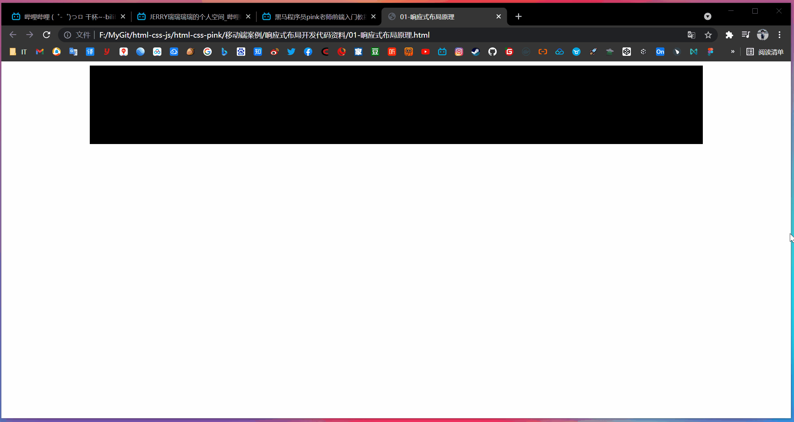
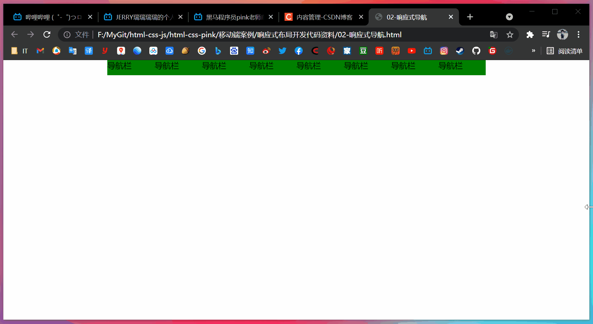
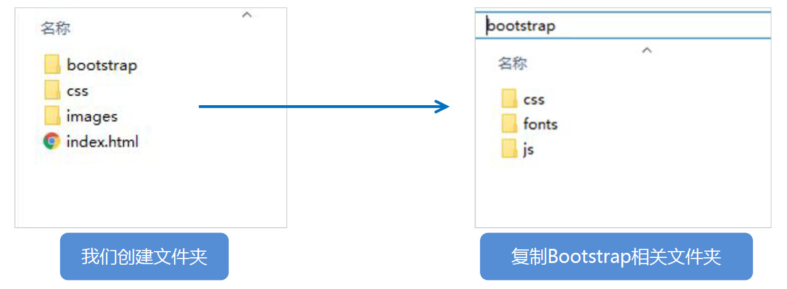
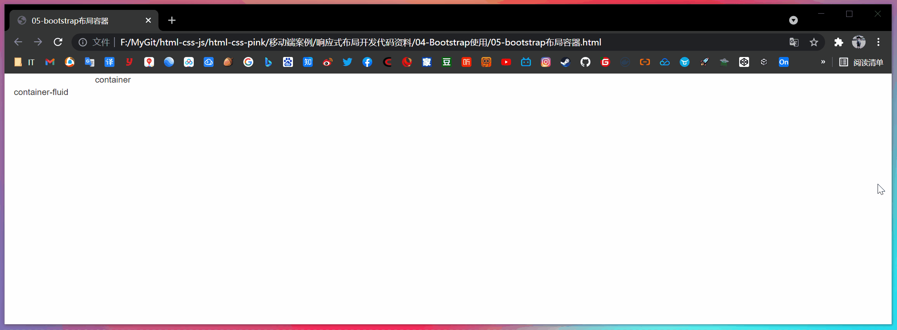
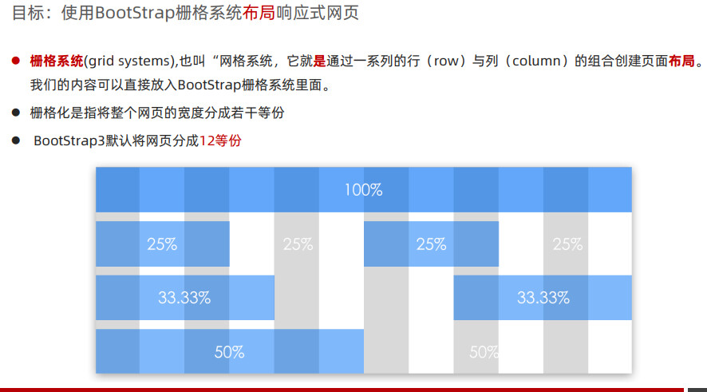
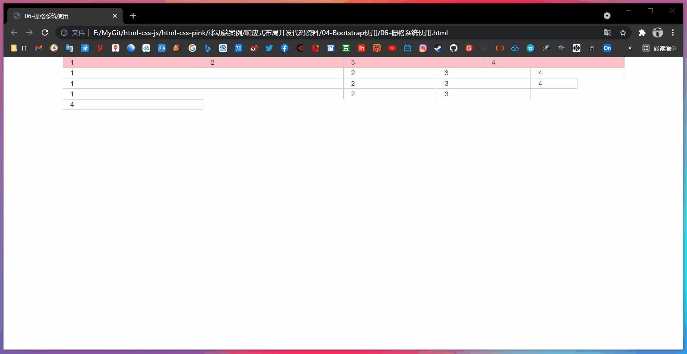
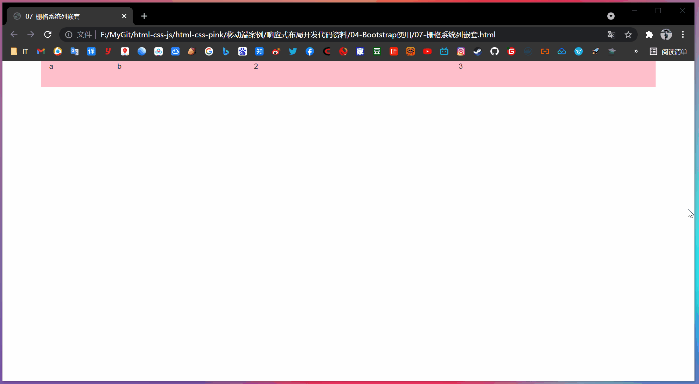
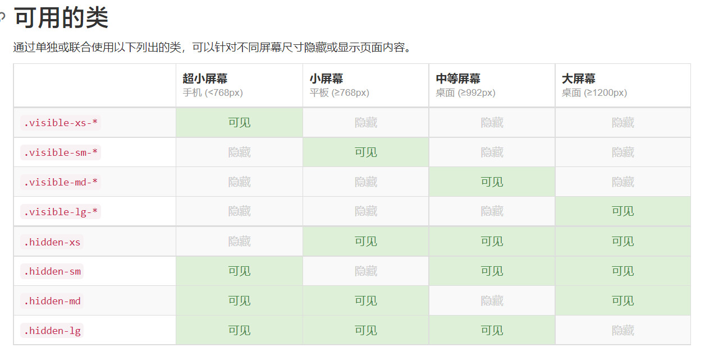
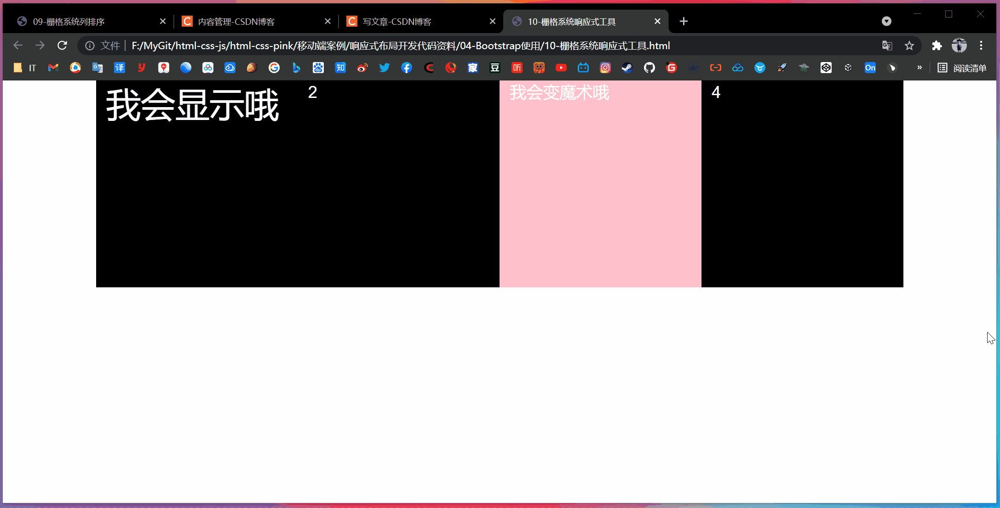

# 22 【响应式布局】

## 1.响应式开发

### 1.1 响应式开发原理

就是使用媒体查询针对不同宽度的设备进行布局和样式的设置，从而适配不同设备的目的。

| 设备划分                 | 尺寸区间            |
| ------------------------ | ------------------- |
| 超小屏幕（手机）         | < 768px             |
| 小屏设备（平板）         | >= 768px ~ < 992px  |
| 中等屏幕（桌面显示器）   | >= 992px ~ < 1200px |
| 宽屏设置（大桌面显示器） | >= 1200px           |

### 1.2 响应式布局容器

响应式需要一个父级作为布局容器，来配合子级元素来实现变化效果。

原理就是在不同屏幕下，通过媒体查询来改变这个布局容器的大小，再改变里面子元素的排列方式和大小，从而实现不同屏幕下，看到不同的页面布局和样式变化。

【平时我们的响应式尺寸划分】

- 超小屏幕（手机，小于 768px）：设置宽度为 100%
- 小屏幕（平板，大于等于 768px）：设置宽度为 750px
- 中等屏幕（桌面显示器，大于等于 992px）：宽度设置为 970px
- 大屏幕（大桌面显示器，大于等于 1200px）：宽度设置为 1170px

但是我们也可以根据实际情况自己定义划分。

【案例】

```html
<!doctype html>
<html lang="en">

<head>
    <meta charset="UTF-8">
    <meta name="viewport" content="width=device-width, initial-scale=1.0">
    <meta http-equiv="X-UA-Compatible" content="ie=edge">
    <title>01-响应式布局原理</title>
    <style>
        .container {
            height: 150px;
            background-color: black;
            margin: 0 auto;
        }

        /* 1. 超小屏幕下  小于 768  布局容器的宽度为 100% */

        @media screen and (max-width: 767px) {
            .container {
                width: 100%;
            }
        }

        /* 2. 小屏幕下  大于等于 768px  布局容器改为 750px */

        @media screen and (min-width: 768px) {
            .container {
                width: 750px;
            }
        }

        /* 3. 中等屏幕下  大于等于 992px  布局容器修改为 970px */

        @media screen and (min-width: 992px) {
            .container {
                width: 970px;
            }
        }

        /* 4. 大屏幕下  大于等于 1200px  布局容器修改为 1170 */

        @media screen and (min-width: 1200px) {
            .container {
                width: 1170px;
            }
        }
    </style>
</head>

<body>
    <!-- 响应式开发里面，首先需要一个布局容器 -->
    <div class="container"></div>
</body>

</html>
```

- 效果图



【案例：响应式导航】

- 需求分析

1. 当我们屏幕大于等于 800 像素，我们给 nav 宽度为 800px，因为里面子盒子需要浮动，所以 nav 需要清除浮动
2. nav 里面包含 8 个小 li 盒子，每个盒子的宽度定位 100px，高度为 30px，浮动一行显示
3. 当我们屏幕缩放，宽度小于 800 像素的时候，nav 盒子宽度修改为 100% 宽度
4. nav 里面的 8 个小 li，宽度修改为 33.33%，这样一行就只能显示 3 个小 li，剩余下行显示

```html
<!doctype html>
<html lang="en">

<head>
    <meta charset="UTF-8">
    <meta name="viewport" content="width=device-width, initial-scale=1.0">
    <meta http-equiv="X-UA-Compatible" content="ie=edge">
    <title>02-响应式导航</title>
    <style>
        * {
            margin: 0;
            padding: 0;
        }

        ul {
            list-style: none;
        }

        .container {
            width: 750px;
            margin: 0 auto;
        }

        .container ul li {
            float: left;
            width: 93.75px;
            height: 30px;
            background-color: green;
        }

        @media screen and (max-width: 767px) {
            .container {
                width: 100%;
            }

            .container ul li {
                width: 33.33%;
            }
        }
    </style>
</head>

<body>
    <div class="container">
        <ul>
            <li>导航栏</li>
            <li>导航栏</li>
            <li>导航栏</li>
            <li>导航栏</li>
            <li>导航栏</li>
            <li>导航栏</li>
            <li>导航栏</li>
            <li>导航栏</li>
        </ul>
    </div>
</body>

</html>
```



## 2.Bootstrap前端开发框架

### 2.1 Bootstrap简介

Bootstrap 来自 Twitter（推特），是目前最受欢迎的前端框架。

Bootstrap 是基于 HTML、CSS 和 JavaScript 的，它简洁灵活，使得 Web 开发更加快捷。

- 中文官网：http://www.bootcss.com/
- 官网：https://getbootstrap.com/

框架：顾名思义就是一套架构，它有一套比较完整的网页功能解决方案，而且控制权在框架本身，有预制样式库、组件和插件。使用者要按照框架所规定的某种规则进行开发。

**（1）优点**

- 标准化的 html + css 编码规范
- 提供了一套简洁、直观、强悍的组件
- 有自己的生态圈，不断的更新迭代
- 让开发更简单，提高了开发的效率

**（2）版本**

- 2.x.x：停止维护，兼容性好，代码不够简洁，功能不够完善
- 3.x.x：目前使用最多，稳定，但是放弃了 IE6-IE7。对 IE8 支持但是界面效果不好，偏向用于开发响应式布局、移动设备优先的 Web 项目
- 4.x.x：最新版，目前还不是很流行

> 以下内容基于 3.x.x

### 2.2 Bootstrap使用

在现阶段我们还没有接触 JavaScript 相关课程，所以我们只考虑使用它的 CSS 样式库。

控制权在框架本身，使用者要按照框架所规定的某种规范进行开发。

Bootstrap 使用四步曲：

1. 创建文件夹结构
2. 创建 html 骨架结构
3. 引入相关样式文件
4. 书写内容

**（1）创建文件夹结构**



**（2）创建 html 骨架结构**

```html
<!-- 要求当前网页使用 IE 浏览器最高版本的内核来渲染 -->
<meta http-equiv="X-UA-Compatible" content="IE=edge">
<!-- 视口的设置：视口的宽度和设备一致，默认的缩放比例和 PC 端一致，用户不能自行缩放 -->
<meta name="viewport" content="width=device-width, initial-scale=1, user-scalable=0">
<!--[if lt IE 9]>
<!-- 解决 ie9 以下浏览器对 html5 新增标签的不识别，并导致CSS不起作用的问题 -->
<script src="https://oss.maxcdn.com/html5shiv/3.7.2/html5shiv.min.js"></script>
<!-- 解决 ie9 以下浏览器对 css3 Media Query 的不识别 -->
<script src="https://oss.maxcdn.com/respond/1.4.2/respond.min.js"></script>
<![endif]-->
```

注：`<!--[if lt IE 9]>` 及 `<![endif]-->`：为 HTML 的条件注释判断，当条件满足时便执行。

**（3）引入相关样式文件**

```html
<!-- Bootstrap 核心样式-->
<link rel="stylesheet" href="bootstrap/css/bootstrap.min.css">
```

**（4）书写内容**

- 复制 Bootstrap 预先定义好的样式来使用
- 修改 Bootstrap 原来的样式，注意权重问题
- 学好 Bootstrap 的关键在于知道它定义了哪些样式，以及这些样式能实现什么样的效果

【案例】

- 项目结构


> 注意：Bootstrap 中默认使用的就是 normalize.css 初始化样式表，所以我们就不用再引入了。

### 2.3 布局容器

Bootstrap 需要为页面内容和栅格系统包裹一个 `.container` 容器，它提供了两个作此用处的类。

1. container 类

container是 Bootstrap 中专门提供的类名，所有应用该类名的盒子，默认已被指定宽度且居中。

- 响应式布局容器 固定宽度
- 大屏（>= 1200px）宽度定为 1170px
- 中屏（>= 992px）宽度定为 970px
- 小屏（>= 768px）宽度定为 750px
- 超小屏（100%）

2. container-fluid 类

container-fluid也是 Bootstrap 中专门提供的类名，所有应用该类名的盒子，宽度均为 100%。

- 流式布局容器，百分百宽度
- 占据全部视口（viewport）的容器

> **注意:** 
>
> 1. container和container-fluid类自带左右内边距15px; 
> 2. row类自带间距-15px
> 3. col类自带左右内边距15px; 

【案例】

```html
<!doctype html>
<html lang="en">

<head>
  <meta charset="UTF-8">
  <meta name="viewport" content="width=device-width, initial-scale=1.0">
  <meta http-equiv="X-UA-Compatible" content="ie=edge">
  <!--[if lt IE 9]>
      <script src="https://oss.maxcdn.com/html5shiv/3.7.2/html5shiv.min.js"></script>
      <script src="https://oss.maxcdn.com/respond/1.4.2/respond.min.js"></script>
  <![endif]-->
  <!-- 一定不要忘记引入bootstrap 的样式文件 -->
  <link rel="stylesheet" href="bootstrap/css/bootstrap.min.css">
  <title>05-bootstrap布局容器</title>
</head>

<body>
  <div class="container">container</div>
  <div class="container-fluid">container-fluid</div>
</body>

</html>
```



## 3.Bootstrap栅格系统

### 3.1 栅格系统简介

栅格系统英文为（grid systems），也有人翻译为 “网格系统”，它是指将页面布局划分为等宽的列，然后通过列数的定义来模块化页面布局。

目标：使用BootStrap栅格系统布局响应式网页



Bootstrap 提供了一套响应式、移动设备优先的流式栅格系统，随着屏幕或视口（viewport）尺寸的增加，系统会自动分为最多 12 列。

> **其实就是将父元素分成12等份**

### 3.2 栅格选项参数

栅格系统用于通过一系列的行（row）与列（column）的组合来创建页面布局，你的内容就可以放入这些创建好的布局中。

|                     | 超小屏幕（手机）< 768px | 小屏设备（平板）>= 768px | 中等屏幕（桌面显示器）>= 992px | 宽屏设备（大桌面显示器） >= 1200px |
| ------------------- | ----------------------- | ------------------------ | ------------------------------ | ---------------------------------- |
| .container 最大宽度 | 自动（100%）            | 750px                    | 970px                          | 1170px                             |
| 类前缀              | `.col-xs-`              | `.col-sm-`               | `.col-md-`                     | `.col-lg-`                         |
| 列（column）数      | 12                      | 12                       | 12                             | 12                                 |
| 列间距              | 30px                    | 30px                     | 30px                           | 30px                               |

- 按照不同屏幕划分为 1~12 等份
- 行（row）可以去除父容器默认的 15px 内边距
- xs-extra small：超小；sm-small：小；md-medium：中等；lg-large：大；
- 列（column）大于 12，多余的 “列（column）” 所在的元素将被作为一个整体另起一行排列
- 每一列默认有左右 15 像素的 padding
- 可以同时为一列指定多个设备的类名，以便在不同的窗口尺寸下划分不同份数，例如：`class="col-md-4 col-sm-6"`
- 当只指定一个类前缀时，大于类前缀的宽度默认符合类前缀所规定的份数，小于类前缀的宽度默认每个元素占12 份

【案例：栅格系统的使用】

```html
<!doctype html>
<html lang="en">
<head>
    <!-- 一定不要忘记引入 bootstrap 的样式文件 -->
    <link rel="stylesheet" href="bootstrap/css/bootstrap.min.css">
    <title>06-栅格系统使用</title>
    <!-- 修改 Bootstrap 原来的样式，由于权重问题，所以放在 link 后 -->
    <style>
        [class^="col"] {
            border: 1px solid #ccc;
        }

        .row:nth-child(1) {
            background-color: pink;
        }
    </style>
</head>

<body>
    <div class="container">
        <div class="row">
            <div class="col-lg-3 col-md-4 col-sm-6 col-xs-12">1</div>
            <div class="col-lg-3 col-md-4 col-sm-6 col-xs-12">2</div>
            <div class="col-lg-3 col-md-4 col-sm-6 col-xs-12">3</div>
            <div class="col-lg-3 col-md-4 col-sm-6 col-xs-12">4</div>
        </div>

        <!-- 如果孩子的份数相加等于 12 则孩子能占满整个的 container 的宽度 -->
        <div class="row">
            <!-- 当只指定一个类前缀时，大于类前缀的宽度默认符合类前缀所规定的份数，小于类前缀的宽度默认每个元素占12 份 -->
            <div class="col-lg-6">1</div>
            <div class="col-lg-2">2</div>
            <div class="col-lg-2">3</div>
            <div class="col-lg-2">4</div>
        </div>

        <!-- 如果孩子的份数相加 小于 12 则会？ 则占不满整个 container 的宽度会有空白 -->
        <div class="row">
            <div class="col-lg-6">1</div>
            <div class="col-lg-2">2</div>
            <div class="col-lg-2">3</div>
            <div class="col-lg-1">4</div>
        </div>

        <!-- 如果孩子的份数相加 大于 12 则会？ 多于的那一列会另起一行显示 -->
        <div class="row">
            <div class="col-lg-6">1</div>
            <div class="col-lg-2">2</div>
            <div class="col-lg-2">3</div>
            <div class="col-lg-3">4</div>
        </div>
    </div>
</body>

</html>
```



### 3.3 列嵌套

栅格系统内置的栅格系统将内容再次嵌套。简单理解就是一个列内再分成若干份小列。我们可以通过添加一个新的 `.row` 元素和一系列 `.col-sm-*` 元素到已经存在的 `.col-sm-*` 元素内。


```html
<!-- 列嵌套 -->
<div class="col-sm-4">
	<div class="row">
		<div class="col-sm-6">小列</div>
		<div class="col-sm-6">小列</div>
	</div>
</div>
```

【案例：列嵌套】

```html
<!doctype html>
<html lang="en">
<head>
    <!-- 一定不要忘记引入 bootstrap 的样式文件 -->
    <link rel="stylesheet" href="bootstrap/css/bootstrap.min.css">
    <title>07-栅格系统列嵌套</title>
    <style>
        .row>div {
            height: 50px;
            background-color: pink;
        }
    </style>
</head>

<body>
    <div class="container">
        <div class="row">
            <div class="col-md-4">
                <!-- 我们列嵌套最好加 1 个行 row 这样可以取消父元素的 padding 值，而且高度自动和父级一样高 -->
                <div class="row">
                    <div class="col-md-4">a</div>
                    <div class="col-md-8">b</div>
                </div>
            </div>
            <div class="col-md-4">2</div>
            <div class="col-md-4">3</div>
        </div>
    </div>
</body>

</html>
```



注：b 被 2 盖住了。

### 3.4 列偏移

使用 `.col-md-offset-*` 类可以将列向右侧偏移。

这些类实际是通过使用 `*` 选择器为当前元素增加了左侧的边距（margin）。


```html
<!-- 列偏移 -->
<div class="row">
	<div class="col-lg-4">1</div>
	<div class="col-lg-4 col-lg-offset-4">2</div>
</div>
```

【案例：列偏移】

```html
<!doctype html>
<html lang="en">
<head>
    <link rel="stylesheet" href="bootstrap/css/bootstrap.min.css">
    <title>08-栅格系统列偏移</title>
    <style>
        .row div {
            height: 50px;
            background-color: pink;
        }
    </style>
</head>

<body>
    <div class="container">
        <div class="row">
            <div class="col-md-3">左侧</div>
            <!-- 偏移的份数 就是 12 - 两个盒子的份数 = 6 -->
            <div class="col-md-3 col-md-offset-6">右侧</div>
        </div>
        <div class="row">
            <!-- 如果只有一个盒子 那么就偏移 = (12 - 8) / 2 -->
            <div class="col-md-8 col-md-offset-2">中间盒子</div>
        </div>

    </div>
</body>

</html>
```


### 3.5 列排序

通过使用 `.col-md-push-*` 和 `.col-md-pull-*` 类就可以很容易的改变列（column）的顺序。


```html
<!-- 列排序 -->
<div class="row">
	<div class="col-lg-4 col-lg-push-8">左侧</div>
	<div class="col-lg-8 col-lg-pull-4">右侧</div>
</div>
```

【案例：列排序】

```html
<!doctype html>
<html lang="en">
<head>
    <link rel="stylesheet" href="bootstrap/css/bootstrap.min.css">
    <title>09-栅格系统列排序</title>
    <style>
        .row div {
            height: 50px;
            background-color: pink;
        }
    </style>
</head>

<body>
    <div class="container">
        <div class="row">
            <div class="col-md-4 col-md-push-8">左侧</div>
            <div class="col-md-8 col-md-pull-4">右侧</div>
        </div>
    </div>
</body>

</html>
```


## 4.响应式工具

为了加快对移动设备友好的页面开发工作，利用媒体查询功能，并使用这些工具类可以方便的针对不同设备展示或隐藏页面内容。



Bootstrap 其他（按钮、表单、表格）请参考 Bootstrap 文档。

【案例：响应式工具】

```html
<!doctype html>
<html lang="en">
<head>
    <!-- 一定不要忘记引入 bootstrap 的样式文件 -->
    <link rel="stylesheet" href="bootstrap/css/bootstrap.min.css">
    <title>10-栅格系统响应式工具</title>
    <style>
        .row div {
            height: 300px;
            background-color: purple;
            
        }

        .row div:nth-child(3) {
            background-color: pink;
        }

        span {
            font-size: 50px;
            color: #fff;
        }
    </style>
</head>

<body>
    <div class="container">
        <div class="row">
            <div class="col-xs-3">
                <span class="visible-lg">我会显示哦</span>
            </div>
            <div class="col-xs-3">2</div>
            <div class="col-xs-3 hidden-md hidden-xs">我会变魔术哦</div>
            <div class="col-xs-3">4</div>
        </div>
    </div>
</body>

</html>
```



## 移动端技术选型

- 流式布局（百分比布局）
- flex 弹性布局（推荐）
- rem 适配布局（推荐）
- 响应式布局

建议：我们选取一种主要技术选型，其他技术作为辅助，这种混合技术开发。

