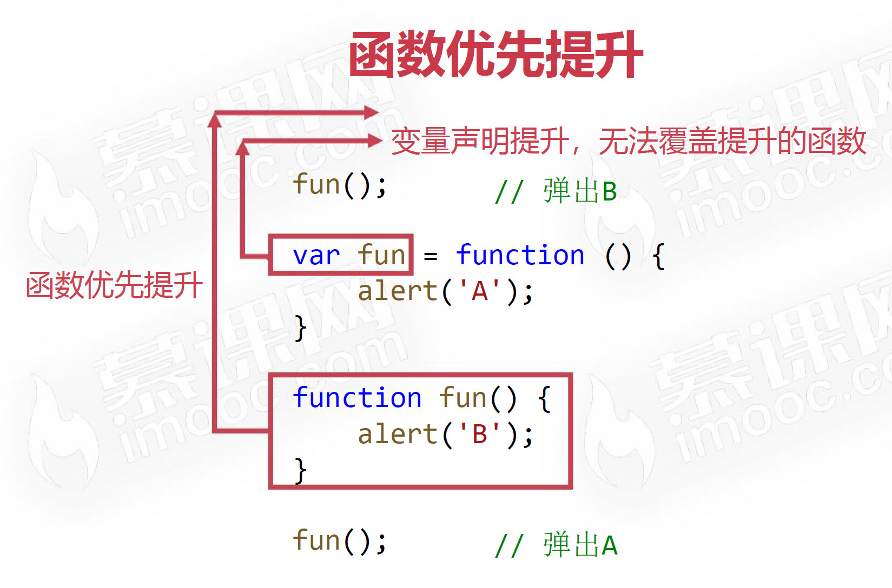
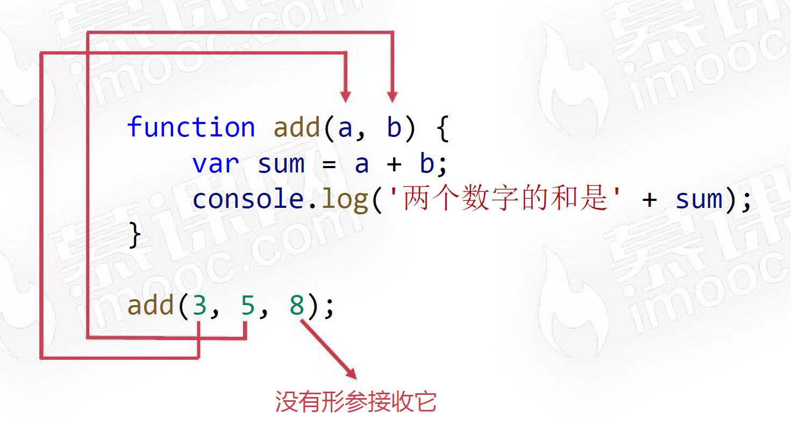
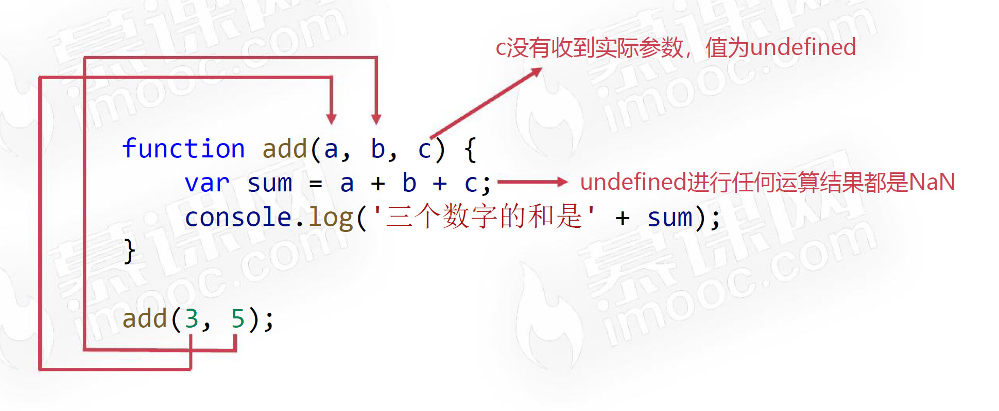
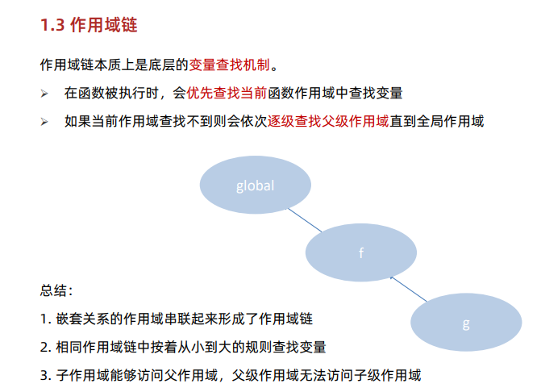
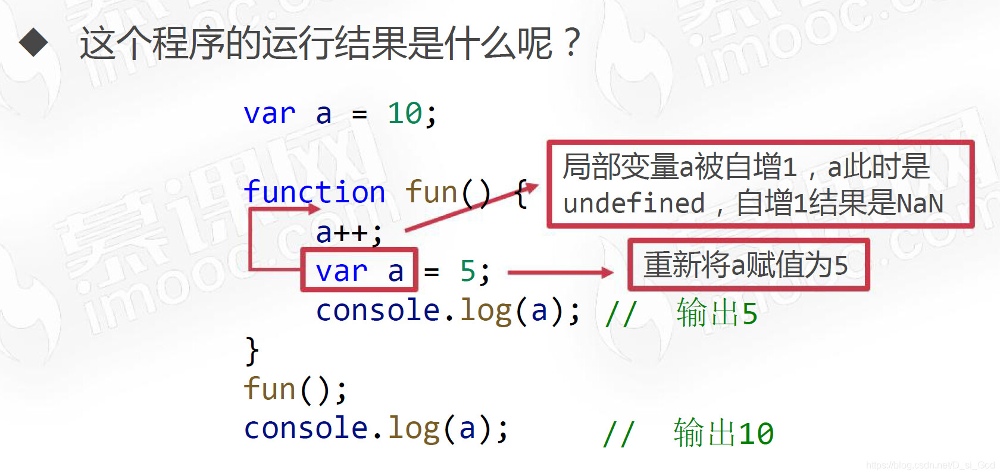
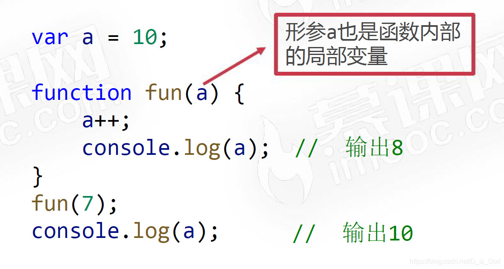

# 05 【函数（上）】

## 1.函数基本介绍

函数就是语句的封装，可以让这些代码方便地被复用。

函数具有 “一次定义，多次调用” 的优点。

使用函数，可以简化代码，让代码更具有可读性。

**函数也是一个对象，也具有普通对象的功能（能有属性）**  
使用typeof检查一个函数时会返回function  

和变量类似，函数必须先定义然后才能使用。

使用 `function` 关键字定义函数。

> function：函数、功能。

**创建函数**  

1. 函数声明 

```javascript
function 函数名([形参1,形参2...形参N]){  
    语句...  
}  
```

- `function`：表示定义函数
- `fun`：函数名（必须符合 JS 标识符命名规则）
- `()`：圆括号中是形参列表，即使没有形参，也必须书写圆括号
- `{}`：花括号内为函数语句块

2.  函数表达式

```javascript
var 函数名 = function([形参1,形参2...形参N]){  
    语句...  
};  
```

- `function(){}`：匿名函数
- `()`：圆括号中是形参列表，即使没有形参，也必须书写圆括号
- `{}`：花括号内为函数语句块
- `fun`：函数变量

> 一般来说：
>
> ```java
> function fun() {
>  // 函数语句块
> } // 末尾不需要加 ;
> ```
>
> ```javascript
> var fun = function() {
>  // 函数语句块
> };	// 末尾最好加上 ;
> ```

**调用函数**  

执行函数体中的所有语句，就称为 “调用函数”。

调用函数非常简单，只需要在函数名字后书写圆括号对即可。

```javascript
fun();	// 调用函数
```

【小案例】

```javascript
// 定义函数，定义的函数是不会被立即执行的
function fun() {
    console.log('你好');
    console.log('今天天气真好');
}
// 函数必须要等到调用的时候才能被执行
fun();
fun();
fun();
// 执行了三次
```

 当我们调用函数时，函数中封装的代码会按照编写的顺序执行  

## 2.函数的声明提升

和变量声明提升类似，函数声明也可以被提升。

1. **变量的声明提前**  
   在全局作用域中，使用**var关键字声明的变量会在所有的代码执行之前被声明，但是不会赋值。**  
    		所以我们可以在变量声明前使用变量。但是不使用var关键字声明的变量不会被声明提前。  
    	 在函数作用域中，也具有该特性，使用var关键字声明的变量会在函数所有的代码执行前被声明，  
    		如果没有使用var关键字声明变量，则变量会变成全局变量 

2. **函数的声明提前**  
   在全局作用域中，使用**函数声明创建的函数（function fun(){}）,会在所有的代码执行之前被创建**，  
    		也就是我们可以在函数声明前去调用函数，但是使用函数表达式(var fun = function(){})创建的函数没有该特性  
    	 在函数作用域中，使用函数声明创建的函数，会在所有的函数中的代码执行之前就被创建好了。 

```javascript
fun();
// 在预解析阶段会被提升
function fun() {
    alert("函数被执行");
}
```

效果相当于：

```javascript
function fun() {
    alert("函数被执行");
}
fun();
```

【函数表达式不能被提升】

```javascript
fun();	// 报错！
var fun = function() {
    alert("函数不能被执行");
};
```

> 解释：函数表达式不能被提升的本质原因是函数表达式定义的其实是个变量，只不过是把函数赋给这个变量，而变量的提升只提升定义，不提升赋值！

## 3.函数优先提升

可以简单理解为：函数提升程度 > 变量提升程度。



```javascript
fun(); // B

var fun = function () {
    alert('A');
};

function fun() {
    alert('B');
}

fun(); // A
```

效果相当于：

```javascript
function fun() {
    alert('B');
}

var fun;

fun(); // B

fun = function () {
    alert('A');
};

fun(); // A
```

## 4.函数的参数和返回值

### 4.1 函数参数

参数是函数内的一些待定值，在调用函数时，必须传入这些参数的具体值。

 **形参：形式参数**  

  - 定义函数时，可以在()中定义一个或多个形参，形参之间使用,隔开    

  - 定义形参就相当于在函数内声明了对应的变量但是并不赋值，  

  - 形参会在调用时才赋值。  

**实参：实际参数**  

    - 调用函数时，可以在()传递实参，传递的实参会赋值给对应的形参 

   - 调用函数时JS解析器不会检查实参的类型和个数，可以传递任意数据类型的值。  
     如果实参的数量大于形参，多余实参将不会赋值，**如果实参的数量小于形参，则没有对应实参的形参将会赋值undefined**  

```javascript
// 形参
function add(a, b) {
    var sum = a + b;
    console.log('a + b = ' + sum);
}
// 实参
add(3, 5);
```

- 圆括号中定义 “形式参数”
- 调用函数时传入 “实际参数”

> “形式参数” 和 “实际参数” 是彼此独立的，除了传递值之外，互不干扰！

> 注意：JS 只有 “值传递” 没有 “引用传递”，对于复杂类型的传递，传递的不是引用，而是那个变量里面的值（引用的地址）。
>
> 引用传递：修改形参，实参也会改变。JS 中复杂类型的实参是个地址值不需要改变，也改变不了，改变的是地址所指向的堆中的复杂类型的具体值，此处具有迷惑性，要加以辨别。

### 4.2 形参和实参个数不同的情况





### 4.3 动态参数arguments

函数内 `arguments` 表示它接收到的实参列表，它是一个类数组对象。

类数组对象：所有属性均为从 `0` 开始的自然数序列，并且有 `length` 属性，和数组类似可以用方括号书写下标访问对象的某个属性值，但是**不能调用数组的方法**。

```javascript
function fun() {
    console.log(arguments);		// 11 22 33 44
    console.log(arguments[0]);	// 11
    console.log(arguments[1]);	// 22
    console.log(arguments[9]);	// undefined
}
fun(11, 22, 33, 44);
```

【小案例】

JS 本身没有函数的重载（函数名相同，形参个数不同），但是可以借助 arguments 模拟 “函数重载”。

> 以下例子是一个典型的 “函数重载”，参数个数不同形成 “重载”。

```javascript
function fun() {
    if (arguments.length == 0) {
        console.log(0);
    } else if (arguments.length == 1) {
        console.log(1);
    } else {
        console.log(2);
    }
}
fun(); // 0
fun(1); // 1
fun(1, 2); // 2
```

【小案例】

```js
//传入多少数就加多少数
function add(){
    let sum = 0;
    for (let i = 0; i < arguments.length; i++) {
        sum+=arguments[i]
    }
    console.log(sum);
}

add(1,2,3,4,5);
```

总结： 

1. arguments 是一个伪数组，只存在于函数中 

2. arguments 的作用是动态获取函数的实参 
3. 可以通过for循环依次得到传递过来的实参

### 4.4 返回值

函数体内可以使用 `return` 关键字表示 “函数的返回值”。

**返回值，就是函数执行的结果。**  
 使用return 来设置函数的返回值。  
 语法：return 值;  
	 该值就会成为函数的返回值，可以通过一个变量来接收返回值  
 return后边的代码都不会执行，一旦执行到return语句时，函数将会立刻退出。  
 return后可以跟任意类型的值，可以是基本数据类型，也可以是一个对象。  
 **如果return后不跟值，或者是不写return则函数默认返回undefined。**  

 **break、continue和return**  
 break  
 	退出循环  
 continue  
 	跳过当次循环  
 return  
 	退出函数  

```javascript
function sum(a, b) {
    return a + b;	// 函数的返回值
}
var result = sum(3, 5);	// 函数的返回值可以被变量接收
```

调用一个有返回值的函数，可以被当做一个普通值，从而可以出现在任何可以书写值的地方。

```javascript
function sum(a, b) {
    return a + b;
}
var result = sum(3, 4) * sum(2, 6);
```

```javascript
function sum(a, b) {
    return a + b;
}
var result = sum(3, sum(4, 5));	// 函数嵌套
```

遇见 `return` 即退出函数。

结合 if 语句的时候，往往不需要写 else 分支了。

```javascript
// 判断一个数字是否为偶数
function checkEven(n) {
    if (n % 2 == 0) {
        return true;
    }
    return false;
}
var result = checkEven(6);
console.log(result);	// true
```

### 4.5 返回值类型

```js
function fun(){
    alert("函数要执行了~~~~");
    for(var i=0 ; i<5 ; i++){
        if(i == 2){
            //使用break可以退出当前的循环
            break;

            //continue用于跳过当次循环
            //continue;

            //使用return可以结束整个函数
            //return;
        }
        console.log(i);
    }

    alert("函数执行完了~~~~");
}

fun();

/*
 * 返回值可以是任意的数据类型
 * 	也可以是一个对象，也可以是一个函数
 */
function fun2(){

    //返回一个对象
    return {name:"沙和尚"};
}

var a = fun2();

//console.log("a = "+a);

function fun3(){
    //在函数内部再声明一个函数
    function fun4(){
        alert("我是fun4");
    }

    //将fun4函数对象作为返回值返回
    return fun4;
}

a = fun3();
//console.log(a);
//a();
fun3()();//fun3()() == a=fun3();a();

```

## 5.递归

函数的内部语句可以调用这个函数自身，从而发起对函数的一次迭代。在新的迭代中，又会执行调用函数自身的语句，从而又产生一次迭代。当函数执行到某一次时，不再进行新的迭代，函数被一层一层返回，函数被递归。

> 函数自己调用自己！

递归是一种较为高级的编程思想，它把一个大型复杂的问题层层转化为一个与原问题相似的规模较小的问题来求解。

【小案例：求阶乘】

```javascript
// n! 的本质：n * (n-1)!
function factorial(n) {
    // 递归的出口
    if (n == 1) {
        return 1;
    }
    return n * factorial(n - 1);
}
```

> 递归技巧：
>
> 1. 分析问题，抽象出具体的数学模型
> 2. 分析数学模型是否有 “规律性”
> 3. 找到基本的 “规律”（比如：`n!` 的本质：`n * (n-1)!`）
> 4. 将 “规律” 转换为代码（比如：`return n * factorial(n - 1);`）
> 5. 找到 “出口” 也就是临界情况（比如：`1! == 1`）
> 6. 将 “出口” 转化为代码（比如：`if (n == 1) { return 1; }`）
> 7. 组合代码形成递归算法

## 6.作用域

了解作用域对程序执行的影响及作用域链的查找机制，使用闭包函数创建隔离作用域避免全局变量污染。 作用域（scope）规定了变量能够被访问的“范围”，离开了这个“范围”变量便不能被访问。

### 6.1 作用域链



先来认识函数的嵌套：一个函数内部也可以定义一个函数。和局部变量类似，定义在一个函数内部的函数是局部变量。

```javascript
function fun() {
    // 局部函数
    function inner() {
        console.log('你好');
    }
    // 调用局部函数
    inner();
}
// 调用外部函数
fun();
```

在函数嵌套中，变量会从内到外逐层寻找它的定义。

```javascript
var a = 10;
var b = 20;
function fun() {
    var c = 40;
    function inner() {
    	var a = 40;
        var d = 50;
        console.log(a, b, c, d);	// 40 20 40 50
    }
    inner();
}
fun();
```

### 6.2 全局作用域

**访问一个未定义的变量会报错，而访问一个对象没有的属性时返回`undefined`**

直接在script标签中编写的代码都运行在全局作用域中  
**全局作用域在打开页面时创建，在页面关闭时销毁。**  
全局作用域中有一个全局对象window，window对象由浏览器提供，  
可以在页面中直接使用，它代表的是整个的浏览器的窗口。  
**在全局作用域中创建的变量都会作为window对象的属性保存**  
在全局作用域中创建的函数都会作为window对象的方法保存  
在全局作用域中创建的变量和函数可以在页面的任意位置访问。  
在函数作用域中也可以访问到全局作用域的变量。  
尽量不要在全局中创建变量	 

如果不将变量定义在任何函数的内部，此时这个变量就是全局变量，它在任何函数内部都可以被访问和更改。

### 6.3 局部作用域(local)-函数作用域

函数作用域是函数执行时创建的作用域，每次调用函数都会创建一个新的函数作用域。  
函数作用域在函数执行时创建，在函数执行结束时销毁。  
在函数作用域中创建的变量，不能在全局中访问。  
当在函数作用域中使用一个变量时，它会先在自身作用域中寻找，  如果找到了则直接使用，如果没有找到则到上一级作用域中寻找，  如果找到了则使用，找不到则继续向上找。

```javascript
function fun() {
    var a = 10;
}

fun();
console.log(a);	// 报错
```

> 变量 a 是在 fun 函数中被定义的，所以变量 a 只在 fun 函数内部有定义，fun 函数就是 a 的 “作用域”，变量 a 被称为 “局部变量”。

### 6.4 遮蔽效应

如果函数中也定义了和全局变量同名的变量，则函数内的局部变量会将全局的变量进行 “遮蔽”。

```javascript
var a = 10;
function fun() {
    var a = 5;
    a++;
    console.log(a);	// 6
}
fun();
console.log(a);	// 10
```

### 6.5 注意考虑变量声明提升的情况



### 6.6 形参也是局部变量



### 6.7 不加 var 将定义全局变量

在初次给变量赋值时，如果没有加 `var`，则将定义全局变量。

```javascript
function fun() {
    a = 3;
}
fun();
console.log(a);	// 3
```

> 没有特殊情况，一律都要记得加 `var`。

## 7.this（上下文对象)

### 7.1 函数的上下文

函数中可以使用 this 关键字，它表示函数的上下文。

与中文中 “这” 类似，函数中的 this 具体指代什么必须通过**调用函数时的 “前言后语”** 来判断。

> 注意：准确的来说，应该叫 “方法的上下文”，因为这里主要指的是对象方法里的上下文 this

### 7.2 函数中的 this

```javascript
var xiaoming = {
    nickname: '小明',
    age: 12,
    sayHello: function () {
        console.log('我是' + this.nickname + '，我' + this.age + '岁了');
    }
};
xiaoming.sayHello();

// 我是小明，我12岁了
```

```javascript
var xiaoming = {
    nickname: '小明',
    age: 12,
    sayHello: function () {
        console.log('我是' + this.nickname + '，我' + this.age + '岁了');
    }
};
var sayHello = xiaoming.sayHello;	// 将函数“提”出来，单独存为变量
sayHello();		// 直接圆括号调用这个函数，而不是对象打点调用了

// 我是undefined，我undefined岁了
```

### 7.3 函数的上下文由调用方式决定

**同一个函数，用不同的形式调用它，则函数的上下文不同。**

- 情形1：对象打点调用函数，函数中的 this 指代这个打点的对象

```javascript
xiaoming.sayHello();
```

- 情形2：圆括号直接调用函数，函数中的 this 指代 window 对象

```javascript
var sayHello = xiaoming.sayHello;
sayHello();
```

【案例】

```javascript
var obj = {
    a: 1,
    b: 2,
    fn: function() {
        console.log(this.a + this.b);
        /*
        请问，这里的两个 this 指代什么？
        正确答案：不知道！
        原因：函数只有被调用时，它的上下文才能被确定。
        */
    }
};

obj.fn();	// 3

var fn = obj.fn;	// 提炼的是函数本身，而不是函数执行结果，所以不能加()
fn();			   // NaN（undefined+undefined=NaN）
```

> 宏观上可以把 “谁调用，上下文就是谁” 作为评判方法，如果没有明确的调用者，那么就是 Window。

### 7.4 简单总结

我们每次调用函数时，解析器都会将一个上下文对象作为隐含的参数传递进函数。  
使用this来引用上下文对象，根据函数的调用形式不同，this的值也不同。  

指向当前对象  

this的不同的情况：  
1.以函数的形式调用时，this是window  
2.以方法的形式调用时，this就是调用方法的对象  
3.以构造函数的形式调用时，this就是新创建的对象  

注： 普通函数没有明确调用者时 `this` 值为 `window`，严格模式下没有调用者时 `this` 的值为 `undefined`。

## 8.上下文规则

### 8.1 函数的上下文由调用函数的方式决定

函数的上下文（this 关键字）由调用函数的方式决定，function 是 “运行时上下文” 策略。

函数如果不调用，则不能确定函数的上下文。

### 8.2 规则1

**规则1：对象打点调用它的方法函数，则函数的上下文是这个打点的对象。**

```javascript
对象.方法()
```

【规则1题目举例 - 第1小题】 

```javascript
function fn() {
    console.log(this.a + this.b);
}

var obj = {
    a: 66,
    b: 33,
    fn: fn
};

obj.fn();	// 99	
// 构成 对象.方法() 的形式，适用规则1
```

【规则1题目举例 - 第2小题】

```javascript
var obj1 = {
    a: 1,
    b: 2,
    fn: function() {
        console.log(this.a + this.b);
    }
};

var obj2 = {
    a: 3,
    b: 4,
    fn: obj1.fn		// obj2中的fn方法指向了obj1中的fn方法，即：fn方法在内存中只有一份但是被两次指向
};

obj2.fn();	// 7
// 构成 对象.方法() 的形式，使用规则1
```

【规则1题目举例 - 第3小题】

```javascript
function outer() {
    var a = 11;
    var b = 22;
    return {
        a: 33, 
        b: 44, 
        fn: function () {
            console.log(this.a + this.b);
        }
    };
}

outer().fn();	// 77
// outer()返回一个对象
// 对象.fu()
// 构成 对象.方法() 的形式，适用规则1
```

【规则1题目举例 - 第4小题】

```javascript
funtion fun() {
    console.log(this.a + this.b);
}
var obj = {
    a: 1,
    b: 2,
    c: [{
        a: 3,
        b: 4,
        c: fun
    }]
};
var a = 5;
obj.c[0].c();	// 7	
// obj.c[0]是 {a:3, b:4, c:fun}
// 所以实际上是 {a:3, b:4, c:fun}.c();
// 构成 对象.方法()的形式，适用规则1
```

### 8.3 规则2

**规则2：圆括号直接调用函数，则函数的上下文是 window 对象。**

> 如果是 strict 严格模式下，圆括号直接调用函数，则函数的上下文是 undefined
>
> （在非严格模式下 undefined 会转换为 window）

```javascript
函数()
```

【规则2题目举例 - 第1小题】

```javascript
var obj1 = {
    a: 1,
    b: 2,
    fn: function() {
        console.log(this.a + this.b);
    }
};

var a = 3;
var b = 4;

var fn = obj1.fn;	// 将函数的引用交给变量存储
fn();	// 7
// 构成函数()的形式，适用规则2
```

【规则2题目举例 - 第2小题】

```javascript
function fun() {
    return this.a + this.b;
}
var a = 1;
var b = 2;
var obj = {
    a: 3,
    b: fun(),	// fun函数的执行结果赋给b，适用规则2，b = 1+2
    fun: fun	// fun函数的引用
};
var resulr = obj.fun();		// 适用规则1
console.log(result);	// 6
```

### 8.4 规则3

**规则3：数组（类数组对象）枚举出函数进行调用，上下文是这个数组（类数组对象）。**

```javascript
数组[下标]()
```

【规则3题目举例 - 第1小题】

```javascript
var arr = ['A', 'B', 'C', function() {
    console.log(this[0]);
}];
arr[3]();	// A
// 适用规则3
```

【类数组对象】

什么是类数组对象：所有键名为自然数序列（从0开始），且有 length 属性的对象。

arguments 对象是最常见的类数组对象，它是函数的实参列表。

【规则3题目举例 - 第2小题】

```javascript
function fun() {
    arguments[3]();	// 适用规则3
}
fun('A', 'B', 'C', function() {
    console.log(this[1]);
});
// B
```

### 8.5 规则4

**规则4：IIFE 中的函数，上下文是 window 对象。**

```javascript
(function() {
 })();
```

【规则4题目 - 举例】

```javascript
var a = 1;
var obj = {
    a: 2,
    fun: (function() {
          var a = this.a;
          return function() {
    	  	  console.log(a + this.a);	// 1 + 2
		  }
     })()	// 适用规则4
};
obj.fun();	// 适用规则1
// 3
```

### 8.6 规则5

**规则5：定时器、延时器调用函数，上下文是 window 对象。**

```javascript
setInterval(函数, 时间);
setTimeout(函数, 时间);
```

【规则5题目举例 - 第1小题】

```javascript
var obj = {
    a: 1,
    b: 2,
    fun: function() {
    	console.log(this.a + this.b);
	}
}
var a = 3;
var b = 4;

setTimeout(obj.fun, 2000);	// 7
// 适用规则5
```

【规则5题目举例 - 第2小题】

```javascript
var obj = {
    a: 1,
    b: 2,
    fun: function() {
        console.log(this.a + this.b);
    }
}
var a = 3;
var b = 4;
setTimeout(function() {
		obj.fun(); // 输出3，适用规则1，原因：此时setTimeout没有直接调用obj.fun()，而是直接调用了匿名函数
}, 2000);
```

### 8.7 规则6

**规则6：事件处理函数的上下文是绑定事件的 DOM 元素。**

```javascript
DOM元素.onclick = function() {
};
```

【规则6 - 小案例1】

请实现效果：点击哪个盒子，哪个盒子就变红，要求使用同一个事件处理函数实现。

```html
<!DOCTYPE html>
<html lang="en">
<head>
    <meta charset="UTF-8">
    <meta name="viewport" content="width=device-width, initial-scale=1.0">
    <title>Document</title>
    <style>
        div {
            width: 200px;
            height: 200px;
            float: left;
            border: 1px solid #000;
            margin-right: 10px;
        }
    </style>
</head>
<body>
<div id="box1"></div>
<div id="box2"></div>
<div id="box3"></div>

<script>
    function setColorToRed() {
        this.style.backgroundColor = 'red';
    }

    var box1 = document.getElementById('box1');
    var box2 = document.getElementById('box2');
    var box3 = document.getElementById('box3');

    box1.onclick = setColorToRed;
    box2.onclick = setColorToRed;
    box3.onclick = setColorToRed;
</script>
</body>
</html>
```

【规则6 - 小案例2】

请实现效果：点击哪个盒子，哪个盒子在 2000 毫秒后就变红，要求使用同一个事件处理函数实现。

```html
<!DOCTYPE html>
<html lang="en">
<head>
    <meta charset="UTF-8">
    <meta name="viewport" content="width=device-width, initial-scale=1.0">
    <title>Document</title>
    <style>
        div {
            width: 200px;
            height: 200px;
            float: left;
            border: 1px solid #000;
            margin-right: 10px;
        }
    </style>
</head>
<body>
<div id="box1"></div>
<div id="box2"></div>
<div id="box3"></div>

<script>
    function setColorToRed() {
        // 备份上下文（因为：定时器、延时器调用函数，上下文是 window 对象，所以要先备份上下文，用self或that或_this）
        var self = this;
        // 变法让定时器、延时器中不出现 this 这个关键字
        setTimeout(function () {
            self.style.backgroundColor = 'red';
        }, 2000);
    }

    var box1 = document.getElementById('box1');
    var box2 = document.getElementById('box2');
    var box3 = document.getElementById('box3');

    box1.onclick = setColorToRed;
    box2.onclick = setColorToRed;
    box3.onclick = setColorToRed;
</script>
</body>
</html>
```

## 9.call、apply和bind

### 9.1 call和apply能指定函数的上下文

```javascript
function sum() {
    alert(this.chinese + this.math + this.english);
}

var xiaoming = {
    chinese: 80,
    math: 95,
    english: 93
};
```

将 xiaoming 变为 sum() 的上下文就可以了。

`sum.call(xiaoming);` 或 `sum.apply(xiaoming);`

- `函数.call(上下文);`
- `函数.apply(上下文);`

```javascript
function sum() {
    console.log(this.chinese + this.math + this.english);
}

var xiaoming = {
    chinese: 80,
    math: 95,
    english: 93
};

sum.call(xiaoming);		// 268
sum.apply(xiaoming);	// 268
```

> 当然直接利用规则1方法也行：
>
> ```javascript
> function sum() {
> 	alert(this.chinese + this.math + this.english);
> }
> 
> var xiaoming = {
> 	chinese: 80,
> 	math: 95,
> 	english: 93,
> 	sum: sum
> };
> 
> xiaoming.sum();
> ```

### 9.2 call和apply的区别（参数形式不同）

```javascript
function sum(b1, b2) {
    alert(this.c + this.m + this.e + b1 + b2);
}

var xiaoming = {
    c: 80,
    m: 95,
    e: 93
};

sum.call(xiaoming, 5, 3);		// 276 call 必须要用逗号罗列参数
sum.apply(xiaoming, [5, 3]);	// 276 apply 必须要把参数写到数组中
```

### 9.3 到底使用call还是apply？

```javascript
function fun1() {
    fun2.apply(this, arguments);	// arguments 是数组，只能用 apply
	// 因为 fun1 是用 () 直接调用的，所以 fun1 的上下文 this 为 window 对象
    // 当然，这里之所以写 this 是因为必须要有一个上下文指定，所以就写个 this 代替
}

function fun2(a, b) {
    console.log(a + b);
}

fun1(33, 44);	// 77
```

**总结**：

1. `call`和`apply` 方法能够在调用函数的同时指定 `this` 的值
2. 使用 `call`和`apply` 方法调用函数时，第1个参数为 `this` 指定的值
3. `call`方法的实参在上下文对象之后依次传递，`apply` 方法第2个参数为数组，数组的单元值依次自动传入函数做为函数的参数

### 9.4 bind方法的使用

bind方法，顾名思义，就是绑定的意思，到底是怎么绑定然后怎么用呢，下面就来说说我对这个方法的理解。

**语法**

fun.bind(this,arg1,arg2,...)

该方法会改变函数内部this的指向，并改过this的函数重新返回

该方法可传入两个参数，第一个参数作为this，第二个及以后的参数则作为函数的参数调用

**实例** 

**1.创建绑定函数**

```js
    const obj = {
      age: 18
    }
    function fn() {
      console.log(this)
    }

    // 1. bind 不会调用函数 
    // 2. 能改变this指向
    // 3. 返回值是个函数，但是这个函数里面的this是更改过的obj
    const fun = fn.bind(obj)
    // console.log(fun) 
    fun()
```

从上面的例子可以看出，为什么要创建绑定函数，就是当我们调用某些函数的时候是要在特定环境下才能调用到，所以我们就要把函数放在特定环境下，就是使用bind把函数绑定到特定的所需的环境下。

**2.让函数拥有预设的参数**

使用bind()方法使函数拥有预设的初始参数，这些参数会排在最前面，传给绑定函数的参数会跟在它们后面

```js
1 function list(){
 2     // 让类数组arguments拥有数组的方法slice，这个函数实现了简单把类数组转换成数组
 3     return Array.prototype.slice.call(arguments);
 4 }
 5 
 6 list(1,2,3);//[1,2,3]
 7 
 8 //给list绑定一个预设参数4 
 9 var list1 = list.bind(undefined,4);
10 
11 list1();//[4]
12 
13 list1(1,2,3);//[4,1,2,3]
```

**3.setTimeout的使用**

正常情况下，调用setTimeout的时候this会指向全局对象，但是使用类的方法时我们需要指向类的实例，所以要把this，绑定要回调函数方便继续使用实例

```js
    // 需求，有一个按钮，点击里面就禁用，2秒钟之后开启
document.querySelector('button').addEventListener('click', function () {
  // 禁用按钮
  this.disabled = true
  window.setTimeout(function () {
    // 在这个普通函数里面，我们要this由原来的window 改为 btn
    this.disabled = false
  }.bind(this), 2000)   // 这里的this就是 btn 一样
})
```

### 9.5 上下文规则总结

| 规则               | 上下文          |
| ------------------ | --------------- |
| `对象.函数()`      | 对象            |
| `函数()`           | window          |
| `数组[下标]()`     | 数组            |
| `IIFE`             | window          |
| `定时器`           | window          |
| `DOM 事件处理函数` | 绑定 DOM 的元素 |
| `call apply bind`  | 任意指定        |

> **一句话：函数的上下文只有函数在被执行的时候才会知道。且执行时谁调用的函数，函数的上下文就是谁，否则就是 window 对象。**

