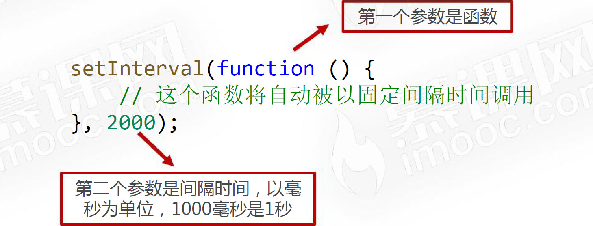
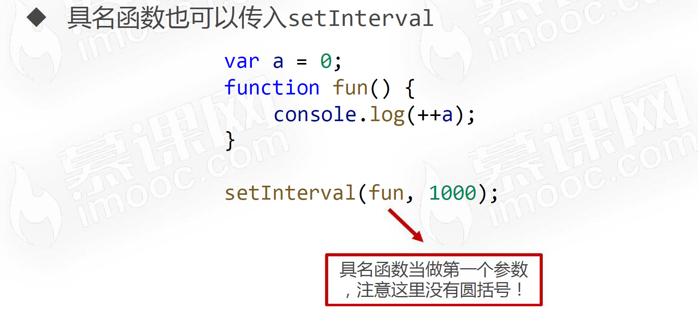
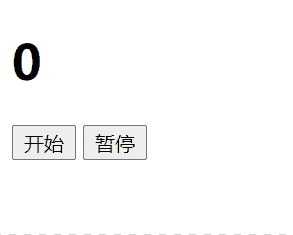
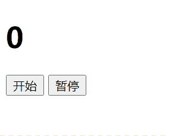

# 29【定时器和延时器】

## 1.定时器

### 1.1 基本介绍

`setInterval()` 函数可以重复调用一个函数，在每次调用之间有固定的时间间隔。

> Interval：间隔



```html
<!DOCTYPE html>
<html lang="en">

<head>
    <meta charset="UTF-8">
    <meta name="viewport" content="width=device-width, initial-scale=1.0">
    <title>Document</title>
</head>

<body>
    <script>
        var a = 0;

        setInterval(function () {
            console.log(++a);
        }, 1000);
    </script>
</body>

</html>
```


### 1.2 函数的参数

`setInterval()` 函数可以接收第 3、4、…… 个参数，它们将按顺序传入函数。


### 1.3 具名函数也可以传入setInterval

具名函数也可以传入 `setInterval`。

> 具名函数：有名称的函数。
>
> 匿名函数：无名称的函数。



### 1.4 深入

`setInterval`函数的用法与`setTimeout`完全一致，区别仅仅在于`setInterval`指定某个任务每隔一段时间就执行一次，也就是无限次的定时执行。

```js
var i = 1
var timer = setInterval(function() {
  console.log(2);
}, 1000)
```

上面代码中，每隔1000毫秒就输出一个2，会无限运行下去，直到关闭当前窗口。

与`setTimeout`一样，除了前两个参数，`setInterval`方法还可以接受更多的参数，它们会传入回调函数。

下面是一个通过`setInterval`方法实现网页动画的例子。

```js
var div = document.getElementById('someDiv');
var opacity = 1;
var fader = setInterval(function() {
  opacity -= 0.1;
  if (opacity >= 0) {
    div.style.opacity = opacity;
  } else {
    clearInterval(fader);
  }
}, 100);
```

上面代码每隔100毫秒，设置一次`div`元素的透明度，直至其完全透明为止。

`setInterval`的一个常见用途是实现轮询。下面是一个轮询 URL 的 Hash 值是否发生变化的例子。

```js
var hash = window.location.hash;
var hashWatcher = setInterval(function() {
  if (window.location.hash != hash) {
    updatePage();
  }
}, 1000);
```

`setInterval`指定的是“开始执行”之间的间隔，并不考虑每次任务执行本身所消耗的时间。因此实际上，两次执行之间的间隔会小于指定的时间。比如，`setInterval`指定每 100ms 执行一次，每次执行需要 5ms，那么第一次执行结束后95毫秒，第二次执行就会开始。如果某次执行耗时特别长，比如需要105毫秒，那么它结束后，下一次执行就会立即开始。

为了确保两次执行之间有固定的间隔，可以不用`setInterval`，而是每次执行结束后，使用`setTimeout`指定下一次执行的具体时间。

```js
var i = 1;
var timer = setTimeout(function f() {
  // ...
  timer = setTimeout(f, 2000);
}, 2000);
```

上面代码可以确保，下一次执行总是在本次执行结束之后的2000毫秒开始。

### 1.5 清除定时器

`clearInterval()` 函数可以清除一个定时器。


```html
<!DOCTYPE html>
<html lang="en">

<head>
    <meta charset="UTF-8">
    <meta name="viewport" content="width=device-width, initial-scale=1.0">
    <title>Document</title>
</head>

<body>
    <h1 id="info">0</h1>
    <button id="btn1">开始</button>
    <button id="btn2">暂停</button>

    <script>
        var oInfo = document.getElementById('info');
        var oBtn1 = document.getElementById('btn1');
        var oBtn2 = document.getElementById('btn2');

        var a = 0;

        // 全局变量
        var timer;

        oBtn1.onclick = function () {
            // 更改全局变量 timer 的值为一个定时器实体
            timer = setInterval(function () {
                oInfo.innerText = ++a;
            }, 1000);
        };

        oBtn2.onclick = function () {
            clearInterval(timer);
        };
    </script>
</body>

</html>
```



但是，此时有一个 BUG，那就是当重复点击时，会发生定时器叠加。

> 定时器叠加：同一时间有多个定时器在同时工作。



改进：

```js
        var oInfo = document.getElementById('info');
        var oBtn1 = document.getElementById('btn1');
        var oBtn2 = document.getElementById('btn2');

        var a = 0;

        // 全局变量
        var timer;

        oBtn1.onclick = function () {
            // 为了防止定时器叠加，我们应该在设置定时器之前先清除定时器
            clearInterval(timer);
            // 更改全局变量timer的值为一个定时器实体
            timer = setInterval(function () {
                oInfo.innerText = ++a;
            }, 1000);
        };

        oBtn2.onclick = function () {
            clearInterval(timer);
        };
```


## 2.延时器

### 2.1 基本介绍

`setTimeout()` 函数可以设置一个延时器，当指定时间到了之后，会执行函数一次，不再重复执行。


### 2.2 深入

`setTimeout`函数用来指定某个函数或某段代码，在多少毫秒之后执行。它返回一个整数，表示定时器的编号，以后可以用来取消这个定时器。

```js
var timerId = setTimeout(func|code, delay);
```

上面代码中，`setTimeout`函数接受两个参数，第一个参数`func|code`是将要推迟执行的函数名或者一段代码，第二个参数`delay`是推迟执行的毫秒数。

```js
console.log(1);
setTimeout('console.log(2)',1000);
console.log(3);
// 1
// 3
// 2
```

上面代码会先输出1和3，然后等待1000毫秒再输出2。注意，`console.log(2)`必须以字符串的形式，作为`setTimeout`的参数。

如果推迟执行的是函数，就直接将函数名，作为`setTimeout`的参数。

```js
function f() {
  console.log(2);
}

setTimeout(f, 1000);
```

`setTimeout`的第二个参数如果省略，则默认为0。

```js
setTimeout(f)
// 等同于
setTimeout(f, 0)
```

除了前两个参数，`setTimeout`还允许更多的参数。它们将依次传入推迟执行的函数（回调函数）。

```js
setTimeout(function (a,b) {
  console.log(a + b);
}, 1000, 1, 1);
```

上面代码中，`setTimeout`共有4个参数。最后那两个参数，将在1000毫秒之后回调函数执行时，作为回调函数的参数。

还有一个需要注意的地方，如果回调函数是对象的方法，那么`setTimeout`使得方法内部的`this`关键字指向全局环境，而不是定义时所在的那个对象。

```js
var x = 1;

var obj = {
  x: 2,
  y: function () {
    console.log(this.x);
  }
};

setTimeout(obj.y, 1000) // 1
```

上面代码输出的是1，而不是2。因为当`obj.y`在1000毫秒后运行时，`this`所指向的已经不是`obj`了，而是全局环境。

为了防止出现这个问题，一种解决方法是将`obj.y`放入一个函数。

```js
var x = 1;

var obj = {
  x: 2,
  y: function () {
    console.log(this.x);
  }
};

setTimeout(function () {
  obj.y();
}, 1000);
// 2
```

上面代码中，`obj.y`放在一个匿名函数之中，这使得`obj.y`在`obj`的作用域执行，而不是在全局作用域内执行，所以能够显示正确的值。

另一种解决方法是，使用`bind`方法，将`obj.y`这个方法绑定在`obj`上面。

```js
var x = 1;

var obj = {
  x: 2,
  y: function () {
    console.log(this.x);
  }
};

setTimeout(obj.y.bind(obj), 1000)
// 2
```

### 2.3 清除延时器

`clearTimeout()` 函数可以清除延时器，和 `clearInterval()` 非常类似。

```html
<!DOCTYPE html>
<html lang="en">

<head>
    <meta charset="UTF-8">
    <meta name="viewport" content="width=device-width, initial-scale=1.0">
    <title>Document</title>
</head>

<body>
    <button id="btn1">2秒后弹出你好</button>
    <button id="btn2">取消弹出</button>

    <script>
        var btn1 = document.getElementById('btn1');
        var btn2 = document.getElementById('btn2');
        var timer;

        btn1.onclick = function () {
            timer = setTimeout(function () {
                alert('你好');
            }, 2000);
        }

        btn2.onclick = function () {
            clearTimeout(timer);
        }
    </script>
</body>

</html>
```

## 3.运行机制

`setTimeout`和`setInterval`的运行机制，是将指定的代码移出本轮事件循环，等到下一轮事件循环，再检查是否到了指定时间。如果到了，就执行对应的代码；如果不到，就继续等待。

这意味着，`setTimeout`和`setInterval`指定的回调函数，必须等到本轮事件循环的所有同步任务都执行完，才会开始执行。由于前面的任务到底需要多少时间执行完，是不确定的，所以没有办法保证，`setTimeout`和`setInterval`指定的任务，一定会按照预定时间执行。

```js
setTimeout(someTask, 100);
veryLongTask();
```

上面代码的`setTimeout`，指定100毫秒以后运行一个任务。但是，如果后面的`veryLongTask`函数（同步任务）运行时间非常长，过了100毫秒还无法结束，那么被推迟运行的`someTask`就只有等着，等到`veryLongTask`运行结束，才轮到它执行。

再看一个`setInterval`的例子。

```js
setInterval(function () {
  console.log(2);
}, 1000);

sleep(3000);

function sleep(ms) {
  var start = Date.now();
  while ((Date.now() - start) < ms) {
  }
}
```

上面代码中，`setInterval`要求每隔1000毫秒，就输出一个2。但是，紧接着的`sleep`语句需要3000毫秒才能完成，那么`setInterval`就必须推迟到3000毫秒之后才开始生效。注意，生效后`setInterval`不会产生累积效应，即不会一下子输出三个2，而是只会输出一个2。

## 4.setTimeout(f, 0)

### 4.1 含义

`setTimeout`的作用是将代码推迟到指定时间执行，如果指定时间为`0`，即`setTimeout(f, 0)`，那么会立刻执行吗？

答案是不会。因为上一节说过，必须要等到当前脚本的同步任务，全部处理完以后，才会执行`setTimeout`指定的回调函数`f`。也就是说，`setTimeout(f, 0)`会在下一轮事件循环一开始就执行。

```js
setTimeout(function () {
  console.log(1);
}, 0);
console.log(2);
// 2
// 1
```

上面代码先输出`2`，再输出`1`。因为`2`是同步任务，在本轮事件循环执行，而`1`是下一轮事件循环执行。

总之，`setTimeout(f, 0)`这种写法的目的是，尽可能早地执行`f`，但是并不能保证立刻就执行`f`。

实际上，`setTimeout(f, 0)`不会真的在0毫秒之后运行，不同的浏览器有不同的实现。以 Edge 浏览器为例，会等到4毫秒之后运行。如果电脑正在使用电池供电，会等到16毫秒之后运行；如果网页不在当前 Tab 页，会推迟到1000毫秒（1秒）之后运行。这样是为了节省系统资源。

### 4.2 应用

`setTimeout(f, 0)`有几个非常重要的用途。它的一大应用是，可以调整事件的发生顺序。比如，网页开发中，某个事件先发生在子元素，然后冒泡到父元素，即子元素的事件回调函数，会早于父元素的事件回调函数触发。如果，想让父元素的事件回调函数先发生，就要用到`setTimeout(f, 0)`。

```js
// HTML 代码如下
// <input type="button" id="myButton" value="click">

var input = document.getElementById('myButton');

input.onclick = function A() {
  setTimeout(function B() {
    input.value +=' input';
  }, 0)
};

document.body.onclick = function C() {
  input.value += ' body'
};
```

上面代码在点击按钮后，先触发回调函数`A`，然后触发函数`C`。函数`A`中，`setTimeout`将函数`B`推迟到下一轮事件循环执行，这样就起到了，先触发父元素的回调函数`C`的目的了。

另一个应用是，用户自定义的回调函数，通常在浏览器的默认动作之前触发。比如，用户在输入框输入文本，`keypress`事件会在浏览器接收文本之前触发。因此，下面的回调函数是达不到目的的。

```js
// HTML 代码如下
// <input type="text" id="input-box">

document.getElementById('input-box').onkeypress = function (event) {
  this.value = this.value.toUpperCase();
}
```

上面代码想在用户每次输入文本后，立即将字符转为大写。但是实际上，它只能将本次输入前的字符转为大写，因为浏览器此时还没接收到新的文本，所以`this.value`取不到最新输入的那个字符。只有用`setTimeout`改写，上面的代码才能发挥作用。

```js
document.getElementById('input-box').onkeypress = function() {
  var self = this;
  setTimeout(function() {
    self.value = self.value.toUpperCase();
  }, 0);
}
```

上面代码将代码放入`setTimeout`之中，就能使得它在浏览器接收到文本之后触发。

由于`setTimeout(f, 0)`实际上意味着，将任务放到浏览器最早可得的空闲时段执行，所以那些计算量大、耗时长的任务，常常会被放到几个小部分，分别放到`setTimeout(f, 0)`里面执行。

```js
var div = document.getElementsByTagName('div')[0];

// 写法一
for (var i = 0xA00000; i < 0xFFFFFF; i++) {
  div.style.backgroundColor = '#' + i.toString(16);
}

// 写法二
var timer;
var i=0x100000;

function func() {
  timer = setTimeout(func, 0);
  div.style.backgroundColor = '#' + i.toString(16);
  if (i++ == 0xFFFFFF) clearTimeout(timer);
}

timer = setTimeout(func, 0);
```

上面代码有两种写法，都是改变一个网页元素的背景色。写法一会造成浏览器“堵塞”，因为 JavaScript 执行速度远高于 DOM，会造成大量 DOM 操作“堆积”，而写法二就不会，这就是`setTimeout(f, 0)`的好处。

另一个使用这种技巧的例子是代码高亮的处理。如果代码块很大，一次性处理，可能会对性能造成很大的压力，那么将其分成一个个小块，一次处理一块，比如写成`setTimeout(highlightNext, 50)`的样子，性能压力就会减轻。

## 5.JS和CSS3结合实现动画

### 5.1 JS和CSS3结合实现动画

- 我们知道，CSS3 的 `transition` 过渡属性可以实现动画。
- JS 可以利用 CSS3 的 transition 属性轻松实现元素动画。
- JS 和 CSS3 结合实现动画规避了定时器制作动画的缺点。

### 5.2 函数节流

函数节流：一个函数执行一次后，只有大于设定的执行周期后才允许执行第二次。

函数节流的意义：在许多 JS + CSS3 实现的动画中，如果没有函数节流，那么当一个动画还没有执行完时，如果用户再次要求执行动画，则动画会直接中断还未执行完的动画，然后执行新的动画。我们要通过函数节流来避免这种情况，比如：轮播图中就要避免用户高频地点击轮播图切换按钮时轮播图飞快切换的问题，而应该做到无论用户点击多块，轮播图的切换速度始终是平稳的。

函数节流非常容易实现，只需借助 `setTimeout` 延时器。

【函数节流模板】

```javascript
// 声明节流锁
var lock = true;

function 需要节流的函数() {
    // 如果锁是关闭状态，则不执行
    if (!lock) {
        return;
    }
    
    // 函数核心语句
    // ……
    // 函数核心语句
    
    // 关锁
    lock = false;
    
    // 指定毫秒数后将锁打开
    setTimeout(function() {
        lock = true;
    }, 2000);
}
```

【案例】

```html
<!DOCTYPE html>
<html lang="en">

<head>
    <meta charset="UTF-8">
    <meta name="viewport" content="width=device-width, initial-scale=1.0">
    <title>Document</title>
    <style>
        #box {
            width: 100px;
            height: 100px;
            background-color: orange;
            position: absolute;
            top: 100px;
            left: 100px;
        }
    </style>
</head>

<body>
    <button id="btn">按我运动</button>
    <div id="box"></div>

    <script>
        // 得到元素
        var btn = document.getElementById('btn');
        var box = document.getElementById('box');

        // 标识量，指示当前盒子在左边还是右边
        var pos = 1; // 1左边，2右边

        // 函数节流锁
        var lock = true;

        // 事件监听
        btn.onclick = function () {
            // 首先检查锁是否是关闭
            if (!lock) return;

            // 把过渡加上
            box.style.transition = 'all 2s linear 0s';
            if (pos == 1) {
                // 瞬间移动，但是由于有过渡，所以是动画
                box.style.left = '1100px';
                pos = 2;
            } else if (pos == 2) {
                // 瞬间移动，但是由于有过渡，所以是动画
                box.style.left = '100px';
                pos = 1;
            }

            // 关锁
            lock = false;
            // 指定时间后，将锁打开
            setTimeout(function () {
                lock = true;
            }, 2000);
        };
    </script>
</body>

</html>
```


## 6.常见动画制作

### 6.1 动画效果开发1-无缝连续滚动特效


原理:


代码：

> 此动画利用定时器反而比 JS + CSS3 更方便。

```html
<!DOCTYPE html>
<html lang="en">

<head>
    <meta charset="UTF-8">
    <meta name="viewport" content="width=device-width, initial-scale=1.0">
    <title>Document</title>
    <style>
        * {
            margin: 0;
            padding: 0;
        }

        .box {
            width: 1000px;
            height: 130px;
            border: 1px solid #000;
            margin: 50px auto;
            overflow: hidden;
        }

        .box ul {
            list-style: none;
            /* 设置大一点，这样li才能浮动 */
            width: 5000px;
            position: relative;
        }

        .box ul li {
            float: left;
            margin-right: 10px;
        }
    </style>
</head>

<body>
    <div id="box" class="box">
        <ul id="list">
            <li></li>
            <li></li>
            <li></li>
            <li></li>
            <li></li>
            <li></li>
        </ul>
    </div>
    <script>
        var box = document.getElementById('box');
        var list = document.getElementById('list');

        // 复制多一遍所有的li
        list.innerHTML += list.innerHTML;

        // 全局变量，表示当前list的left值
        var left = 0;

        // 定时器，全局变量
        var timer;

        move();

        // 动画封装成函数
        function move() {
            // 设表先关，防止动画积累
            clearInterval(timer);

            timer = setInterval(function () {
                left -= 4;
                // 验收
                if (left <= -1260) {
                    left = 0;
                }
                list.style.left = left + 'px';
            }, 20);
        }

        // 鼠标进入停止定时器
        box.onmouseenter = function () {
            clearInterval(timer);
        };

        // 鼠标离开继续定时器
        box.onmouseleave = function () {
            move();
        };
    </script>
</body>

</html>
```

### 6.2 动画效果开发2-跑马灯轮播图特效

> 跑马灯轮播图，又叫：滑动轮播图。此种轮播图需要将图片排成一行，并在最后一张图片后克隆一份第一张图片（当到达最后一张时，实现瞬间轮回效果）。

```html
<!DOCTYPE html>
<html lang="en">

<head>
    <meta charset="UTF-8">
    <meta name="viewport" content="width=device-width, initial-scale=1.0">
    <title>Document</title>
    <style>
        * {
            margin: 0;
            padding: 0;
        }

        .carousel {
            width: 650px;
            height: 360px;
            border: 1px solid #000;
            margin: 50px auto;
            position: relative;
            overflow: hidden;
        }

        .carousel ul {
            list-style: none;
            width: 6000px;
            position: relative;
            left: 0px;
            transition: left .5s ease 0s;
        }

        .carousel ul li {
            float: left;
        }

        .carousel .leftbtn {
            position: absolute;
            left: 20px;
            top: 50%;
            margin-top: -25px;
            width: 50px;
            height: 50px;
            background-color: rgb(28, 180, 226);
            border-radius: 50%;
        }

        .carousel .rightbtn {
            position: absolute;
            right: 20px;
            top: 50%;
            margin-top: -25px;
            width: 50px;
            height: 50px;
            background-color: rgb(28, 180, 226);
            border-radius: 50%;
        }
    </style>
</head>

<body>
    <div class="carousel">
        <ul id="list">
            <li></li>
            <li></li>
            <li></li>
            <li></li>
            <li></li>
        </ul>
        <a href="javascript:;" class="leftbtn" id="leftbtn"></a>
        <a href="javascript:;" class="rightbtn" id="rightbtn"></a>
    </div>
    <script>
        // 得到按钮和ul，ul整体进行运动
        var leftbtn = document.getElementById('leftbtn');
        var rightbtn = document.getElementById('rightbtn');
        var list = document.getElementById('list');

        // 克隆第一张图片
        var cloneli = list.firstElementChild.cloneNode(true); // 记得要写true，不然就只会克隆li而不会克隆img
        list.appendChild(cloneli);

        // 当前ul显示到第几张了，从0开始数
        var idx = 0;

        // 节流锁
        var lock = true;

        // 右边按钮监听
        rightbtn.onclick = function () {
            // 判断锁的状态
            if (!lock) return;

            lock = false;

            // 给list加过渡，为什么要加？？css中不是已经加了么？？这是因为最后一张图片会把过渡去掉
            list.style.transition = 'left .5s ease 0s';
            idx++;
            if (idx > 4) {
                // 设置一个延时器，延时器的功能就是将ul瞬间拉回0的位置，延时器的目的就是让过渡动画结束之后
                setTimeout(function () {
                    // 取消掉过渡，因为要的是瞬间移动，不是“咕噜”回去
                    list.style.transition = 'none';
                    list.style.left = 0;
                    idx = 0;
                }, 500);
            }
            list.style.left = -idx * 650 + 'px';

            // 函数节流
            setTimeout(function () {
                lock = true;
            }, 500);
        }

        // 左边按钮监听
        leftbtn.onclick = function () {
            if (!lock) return;

            lock = false;

            // 判断是不是第0张，如果是，就要瞬间用假的替换真的
            if (idx == 0) {
                // 取消掉过渡，因为要的是瞬间移动，不是“咕噜”过去
                list.style.transition = 'none';
                // 直接瞬间移动到最后的假图片上
                list.style.left = -5 * 650 + 'px';
                // 设置一个延时器，这个延时器的延时时间可以是0毫秒，虽然是0毫秒，但是可以让我们过渡先是瞬间取消，然后再加上
                setTimeout(function () {
                    // 加过渡
                    list.style.transition = 'left .5s ease 0s';
                    // idx改为真正的最后一张
                    idx = 4;
                    list.style.left = -idx * 650 + 'px';
                }, 0);
            } else {
                idx--;
                list.style.left = -idx * 650 + 'px';
            }

            // 函数节流
            setTimeout(function () {
                lock = true;
            }, 500);
        }
    </script>
</body>

</html>
```


原理：


### 6.3 动画效果开发3-呼吸灯轮播图特效

> 呼吸灯轮播图，又叫：淡入淡出轮播图。此种轮播图需要将图片叠到一起。

```html
<!DOCTYPE html>
<html lang="en">

<head>
    <meta charset="UTF-8">
    <meta name="viewport" content="width=device-width, initial-scale=1.0">
    <title>Document</title>
    <style>
        * {
            margin: 0;
            padding: 0;
        }

        .carousel {
            width: 650px;
            height: 360px;
            border: 1px solid #000;
            margin: 50px auto;
            position: relative;

        }

        .carousel ul {
            list-style: none;
        }

        .carousel ul li {
            position: absolute;
            top: 0;
            left: 0;
            /* 透明度都是0 */
            opacity: 0;
            transition: opacity 1s ease 0s;
        }

        /* 只有第一张透明度是1 */
        .carousel ul li:first-child {
            opacity: 1;
        }

        .carousel .leftbtn {
            position: absolute;
            left: 20px;
            top: 50%;
            margin-top: -25px;
            width: 50px;
            height: 50px;
            background-color: rgb(28, 180, 226);
            border-radius: 50%;
        }

        .carousel .rightbtn {
            position: absolute;
            right: 20px;
            top: 50%;
            margin-top: -25px;
            width: 50px;
            height: 50px;
            background-color: rgb(28, 180, 226);
            border-radius: 50%;
        }
    </style>
</head>

<body>
    <div class="carousel">
        <ul id="list">
            <li></li>
            <li></li>
            <li></li>
            <li></li>
            <li></li>
        </ul>
        <a href="javascript:;" class="leftbtn" id="leftbtn"></a>
        <a href="javascript:;" class="rightbtn" id="rightbtn"></a>
    </div>
    <script>
        // 得到按钮和ul，ul整体进行运动
        var leftbtn = document.getElementById('leftbtn');
        var rightbtn = document.getElementById('rightbtn');
        var list = document.getElementById('list');
        var lis = list.getElementsByTagName('li');

        // 当前是第几张图显示
        var idx = 0;

        // 节流
        var lock = true;

        // 右按钮
        rightbtn.onclick = function () {
            // 判断节流
            if (!lock) return;

            lock = false;

            // 还没有改idx，此时的idx这个图片就是老图，老图淡出
            lis[idx].style.opacity = 0;
            idx++;
            if (idx > 4) idx = 0;
            // 改了idx，此时的idx这个图片就是新图，新图淡入
            lis[idx].style.opacity = 1;

            // 动画结束之后，开锁
            setTimeout(function () {
                lock = true;
            }, 1000);
        }

        // 左按钮
        leftbtn.onclick = function () {
            // 判断节流
            if (!lock) return;

            lock = false;

            // 还没有改idx，此时的idx这个图片就是老图，老图淡出
            lis[idx].style.opacity = 0;
            idx--;
            if (idx < 0) idx = 4;
            // 改了idx，此时的idx这个图片就是新图，新图淡入
            lis[idx].style.opacity = 1;

            // 动画结束之后，开锁
            setTimeout(function () {
                lock = true;
            }, 1000);
        }
    </script>
</body>

</html>
```

