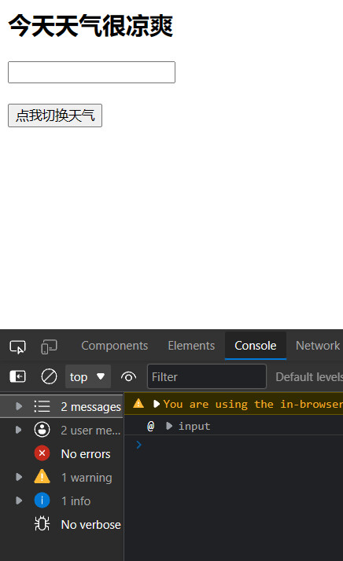

# 02 【面向组件编程】

## 1.组件的使用

当应用是以多组件的方式实现，这个应用就是一个组件化的应用

只有两种方式的组件

- 函数组件
- 类式组件

> **注意：**
>
> 1. 组件名必须是首字母大写（React 会将以小写字母开头的组件视为原生 DOM 标签。例如，< div />`代表 HTML 的 div 标签，而`< Weclome /> 则代表一个组件，并且需在作用域内使用 `Welcome`）
> 2. 虚拟DOM元素只能有一个根元素
> 3. 虚拟DOM元素必须有结束标签 `< />`

**渲染类组件标签的基本流程**

1. React 内部会创建组件实例对象
2. 调用`render()`得到虚拟 DOM ,并解析为真实 DOM
3. 插入到指定的页面元素内部

### 1.1 函数式组件

定义组件最简单的方式就是编写 JavaScript 函数：

```js
 //1.创建函数式组件
      function MyComponent(props) {
        console.log(this) //此处的this是undefined，因为babel编译后开启了严格模式
        return <h2>我是用函数定义的组件(适用于【简单组件】的定义)</h2>
      }

 //2.渲染组件到页面
      ReactDOM.render(<MyComponent />, document.getElementById('test'))
```

该函数是一个有效的 React 组件，因为它接收唯一带有数据的 “props”（代表属性）对象与并返回一个 React 元素。这类组件被称为“函数组件”，因为它本质上就是 JavaScript 函数。

让我们来回顾一下这个例子中发生了什么：

1. React解析组件标签，找到了MyComponent组件。

2. 发现组件是使用函数定义的，随后调用该函数，将返回的虚拟DOM转为真实DOM，随后呈现在页面中。

**注意：** **组件名称必须以大写字母开头。**

React 会将以小写字母开头的组件视为原生 DOM 标签。例如，`<div />` 代表 HTML 的 div 标签，而 `<Welcome />` 则代表一个组件，并且需在作用域内使用 `Welcome`。

你可以在[深入 JSX](https://zh-hans.reactjs.org/docs/jsx-in-depth.html#user-defined-components-must-be-capitalized) 中了解更多关于此规范的原因。

### 1.2 类式组件

> **将函数组件转换成 class 组件**
>
> 通过以下五步将 `Clock` 的函数组件转成 class 组件：
>
> 1. 创建一个同名的 [ES6 class](https://developer.mozilla.org/en/docs/Web/JavaScript/Reference/Classes)，并且继承于 `React.Component`。
> 2. 添加一个空的 `render()` 方法。
> 3. 将函数体移动到 `render()` 方法之中。
> 4. 在 `render()` 方法中使用 `this.props` 替换 `props`。
> 5. 删除剩余的空函数声明。

```js
class MyComponent extends React.Component {
        render() {
          console.log('render中的this:', this)
          return <h2>我是用类定义的组件(适用于【复杂组件】的定义)</h2>
        }
      }

ReactDOM.render(<MyComponent />, document.getElementById('test'))
```

每次组件更新时 `render` 方法都会被调用，但只要在相同的 DOM 节点中渲染 `<MyComponent/>` ，就仅有一个 `MyComponent` 组件的 class 实例被创建使用。这就使得我们可以使用如 state 或生命周期方法等很多其他特性。

**执行过程：**

1. React解析组件标签，找到相应的组件

2. 发现组件是类定义的，随后new出来的类的实例，并通过该实例调用到原型上的render方法

3. 将render返回的虚拟DOM转化为真实的DOM,随后呈现在页面中

### 1.3 组合组件

组件可以在其输出中引用其他组件。这就可以让我们用同一组件来抽象出任意层次的细节。按钮，表单，对话框，甚至整个屏幕的内容：在 React 应用程序中，这些通常都会以组件的形式表示。

例如，我们可以创建一个可以多次渲染 `Welcome` 组件的 `App` 组件：

```js
function Welcome(props) {
  return <h1>Hello, {props.name}</h1>;
}

function App() {
  return (
    <div>
      <Welcome name="Sara" />      
      <Welcome name="Cahal" />      
      <Welcome name="Edite" />    
     </div>
  );
}
```


通常来说，每个新的 React 应用程序的顶层组件都是 `App` 组件。但是，如果你将 React 集成到现有的应用程序中，你可能需要使用像 `Button` 这样的小组件，并自下而上地将这类组件逐步应用到视图层的每一处。

### 1.4 提取组件

将组件拆分为更小的组件。

例如，参考如下 `Comment` 组件：

```js
function formatDate(date) {
	return date.toLocaleDateString()
}

function Comment(props) {
    return (
      <div className="Comment">
        <div className="UserInfo">
          
          <div className="UserInfo-name">{props.author.name}</div>
        </div>
        <div className="Comment-text">{props.text}</div>
        <div className="Comment-date">{formatDate(props.date)}</div>
      </div>
    )
}

const comment = {
    date: new Date(),
    text: 'I hope you enjoy learning React!',
    author: {
      name: 'Hello Kitty',
      avatarUrl: 'http://placekitten.com/g/64/64',
    },
}

ReactDOM.render(
<Comment date={comment.date} text={comment.text} author={comment.author} />,
document.getElementById('test'),
)
```

**[在 CodePen 上试试](https://codepen.io/gaearon/pen/VKQwEo?editors=1010)**

该组件用于描述一个社交媒体网站上的评论功能，它接收 `author`（对象），`text` （字符串）以及 `date`（日期）作为 props。


该组件由于嵌套的关系，变得难以维护，且很难复用它的各个部分。因此，让我们从中提取一些组件出来。

首先，我们将提取 `Avatar` 组件：

```js
function Avatar(props) {
  return (
      );
}
```

`Avatar` 不需知道它在 `Comment` 组件内部是如何渲染的。因此，我们给它的 props 起了一个更通用的名字：`user`，而不是 `author`。

我们建议从组件自身的角度命名 props，而不是依赖于调用组件的上下文命名。

我们现在针对 `Comment` 做些微小调整：

```js
  function Avatar(props) {
    return 
  }

  function Comment(props) {
    return (
      <div className="Comment">
        <div className="UserInfo">
          <Avatar user={props.author} />
          <div className="UserInfo-name">{props.author.name}</div>
        </div>
        <div className="Comment-text">{props.text}</div>
        <div className="Comment-date">{formatDate(props.date)}</div>
      </div>
    )
  }
```

接下来，我们将提取 `UserInfo` 组件，该组件在用户名旁渲染 `Avatar` 组件：

```js
function UserInfo(props) {
  return (
    <div className="UserInfo">
      <Avatar user={props.user} />
      <div className="UserInfo-name">
        {props.user.name}
      </div>
    </div>
  );
}
```

进一步简化 `Comment` 组件：

```js
  function Avatar(props) {
    return 
  }

  function UserInfo(props) {
    return (
      <div className="UserInfo">
        <Avatar user={props.user} />
        <div className="UserInfo-name">{props.user.name}</div>
      </div>
    )
  }

  function Comment(props) {
    return (
      <div className="Comment">
        <UserInfo user={props.author} />
        <div className="Comment-text">{props.text}</div>
        <div className="Comment-date">{formatDate(props.date)}</div>
      </div>
    )
  }
```

**[在 CodePen 上试试](https://codepen.io/gaearon/pen/rrJNJY?editors=1010)**

最初看上去，提取组件可能是一件繁重的工作，但是，在大型应用中，构建可复用组件库是完全值得的。根据经验来看，如果 UI 中有一部分被多次使用（`Button`，`Panel`，`Avatar`），或者组件本身就足够复杂（`App`，`FeedStory`，`Comment`），那么它就是一个可提取出独立组件的候选项。

## 组件实例的三大属性 state props refs

## 2.state

### 2.1 基本使用

> 我们都说React是一个状态机，体现是什么地方呢，就是体现在state上，通过与用户的交互，实现不同的状态，然后去渲染UI,这样就让用户的数据和界面保持一致了。state是组件的私有属性。
>
> 在React中，更新组件的state，结果就会重新渲染用户界面(不需要操作DOM),一句话就是说，用户的界面会随着状态的改变而改变。
>
> state是组件对象最重要的属性，值是对象（可以包含多个key-value的组合）
>
> 简单的说就是组件的状态，也就是该组件所存储的数据

**案例**：

需求：页面显示【今天天气很炎热】，鼠标点击文字的时候，页面更改为【今天天气很凉爽】

核心代码如下：

````js
<body>
    <!-- 准备好容器 -->
    <div id="test">
        
    </div>
</body>

<!--这里使用了js来创建虚拟DOM-->
<script type="text/babel">
        //1.创建组件
        class St extends React.Component{
            constructor(props){
                super(props);
                //先给state赋值
                this.state = {isHot:true,win:"ss"};
                //找到原型的dem，根据dem函数创建了一个dem1的函数，并且将实例对象的this赋值过去
                this.dem1 = this.dem.bind(this);
            }
            //render会调用1+n次【1就是初始化的时候调用的，n就是每一次修改state的时候调用的】
            render(){ //这个This也是实例对象
                //如果加dem()，就是将函数的回调值放入这个地方
                //this.dem这里面加入this，并不是调用，只不过是找到了dem这个函数，在调用的时候相当于直接调用，并不是实例对象的调用
                return <h1 onClick = {this.dem1}>今天天气很{this.state.isHot?"炎热":"凉爽"}</h1>    
            }
            //通过state的实例调用dem的时候，this就是实例对象
            dem(){
                const state =  this.state.isHot;
                 //状态中的属性不能直接进行更改，需要借助API
                // this.state.isHot = !isHot; 错误
                //必须使用setState对其进行修改，并且这是一个合并
                this.setState({isHot:!state});
            }
        }
        // 2.渲染，如果有多个渲染同一个容器，后面的会将前面的覆盖掉
        ReactDOM.render(<St/>,document.getElementById("test"));
</script>
````

在**类式组件**的函数中，直接修改`state`值

```js
this.state.isHot = false
```

> 页面的渲染靠的是`render`函数

这时候会发现页面内容不会改变，原因是 React 中不建议 `state`不允许直接修改，而是通过类的原型对象上的方法 `setState()`

**注意：**

1. 组件的构造函数，必须要传递一个props参数

2. 特别关注this【重点】，类中所有的方法局部都开启了严格模式，如果直接进行调用，this就是undefined

3. 想要改变state,需要使用setState进行修改，如果只是修改state的部分属性，则不会影响其他的属性，这个只是合并并不是覆盖。

**在优化过程中遇到的问题**

1. 组件中的 render 方法中的 this 为组件实例对象
2. 组件自定义方法中由于开启了严格模式，this 指向`undefined`如何解决
   1. 通过 bind 改变 this 指向
   2. 推荐采用箭头函数，箭头函数的 `this` 指向
3. state 数据不能直接修改或者更新

### 2.2 setState()

this.setState()，该方法接收两种参数：对象或函数。

```js
this.setState(partialState, [callback]);
```

- `partialState`: 需要更新的状态的部分对象
- `callback`: 更新完状态后的回调函数

**有两种写法:**

1. 对象：即想要修改的state

   ```js
   this.setState({
       isHot: false
   })
   ```

2. 函数：接收两个函数，第一个函数接受两个参数，第一个是当前state，第二个是当前props，该函数返回一个对象，和直接传递对象参数是一样的，就是要修改的state；第二个函数参数是state改变后触发的回调

```js
this.setState(state => ({count: state.count+1});
```

- 在执行 `setState`操作后，React 会自动调用一次 `render()`
- `render()` 的执行次数是 1+n (1 为初始化时的自动调用，n 为状态更新的次数)

### 2.3 简化版本

1. state的赋值可以不再构造函数中进行

2. 使用了箭头函数，将this进行了改变

```js
<body>
    <!-- 准备好容器 -->
    <div id="test">
        
    </div>
</body>

<script type="text/babel">
        class St extends React.Component{
            //可以直接对其进行赋值
            state = {isHot:true};
            render(){ //这个This也是实例对象
                return <h1 onClick = {this.dem}>今天天气很{this.state.isHot?"炎热":"凉爽"}</h1>    
                //或者使用{()=>this.dem()也是可以的}
            }
            //箭头函数 [自定义方法--->要用赋值语句的形式+箭头函数]
            dem = () =>{
                console.log(this);
                const state =  this.state.isHot;
                this.setState({isHot:!state});
            }
        }
        ReactDOM.render(<St />,document.getElementById("test"));       
</script>
```

如果想要在调用方法的时候传递参数，有两个方法：

```js
<button onClick={(e) => this.deleteRow(id, e)}>Delete Row</button>
<button onClick={this.deleteRow.bind(this, id)}>Delete Row</button>
```

上述两种方式是等价的，分别通过[箭头函数](https://developer.mozilla.org/en-US/docs/Web/JavaScript/Reference/Functions/Arrow_functions)和 [`Function.prototype.bind`](https://developer.mozilla.org/en-US/docs/Web/JavaScript/Reference/Global_objects/Function/bind) 来实现。

在这两种情况下，React 的事件对象 `e` 会被作为第二个参数传递。如果通过箭头函数的方式，事件对象必须显式的进行传递，而通过 `bind` 的方式，事件对象以及更多的参数将会被隐式的进行传递。

### 2.4 State 的更新可能是异步的

**React控制之外的事件中调用setState是同步更新的。比如原生js绑定的事件，setTimeout/setInterval等**。

> 18版本中测试setTimeout回调函数中也是异步更新的

**大部分开发中用到的都是React封装的事件，比如onChange、onClick、onTouchMove等，这些事件处理程序中的setState都是异步处理的。**

```js
//1.创建组件
class St extends React.Component{
    //可以直接对其进行赋值
    state = {isHot:10};
    render(){ //这个This也是实例对象
        return <h1 onClick = {this.dem}>点击事件</h1> 
    }
//箭头函数 [自定义方法--->要用赋值语句的形式+箭头函数]
    dem = () =>{
        //修改isHot
        this.setState({ isHot: this.state.isHot + 1})
        console.log(this.state.isHot);
    }
}
```

上面的案例中预期setState使得isHot变成了11，输出也应该是11。然而在控制台打印的却是10，也就是并没有对其进行更新。这是因为异步的进行了处理，在输出的时候还没有对其进行处理。

```js
document.getElementById("test").addEventListener("click",()=>{
        this.setState({isHot: this.state.isHot + 1});
        console.log(this.state.isHot);
    })
}
```

但是通过这个原生JS的，可以发现，控制台打印的就是11，也就是已经对其进行了处理。也就是进行了同步的更新。

**React怎么调用同步或者异步的呢？**

在 React 的 setState 函数实现中，会根据一个变量 isBatchingUpdates 判断是直接更新 this.state 还是放到队列中延时更新，而 isBatchingUpdates 默认是 false，表示 setState 会同步更新 this.state；但是，有一个函数 batchedUpdates，该函数会把 isBatchingUpdates 修改为 true，而当 React 在调用事件处理函数之前就会先调用这个 batchedUpdates将isBatchingUpdates修改为true，这样由 React 控制的事件处理过程 setState 不会同步更新 this.state。

**如果是同步更新，每一个setState对调用一个render，并且如果多次调用setState会以最后调用的为准，前面的将会作废；如果是异步更新，多个setSate会统一调用一次render**

```js
dem = () =>{
    this.setState({
        isHot:  1,
        cont:444
    })
    this.setState({
    	isHot: this.state.isHot + 1

    })
    this.setState({
        isHot:  888,
        cont:888
    })
}
```

上面的最后会输出：isHot是888，cont是888

```js
 dem = ()=> {  
    this.setState({
        isHot: this.state.isHot + 1,

    })
    this.setState({
        isHot: this.state.isHot + 1,

    })
    this.setState({
        isHot: this.state.isHot + 888
    })
}
```

初始isHot为10，最后isHot输出为898，也就是前面两个都没有执行。

**注意！！这是异步更新才有的，如果同步更新，每一次都会调用render，这样每一次更新都会 **

### 2.5 异步更新解决方案

出于性能考虑，React 可能会把多个 `setState()` 调用合并成一个调用。

因为 `this.props` 和 `this.state` 可能会异步更新，所以你不要依赖他们的值来更新下一个状态。

例如，此代码可能会无法更新计数器：

```js
// Wrong
this.setState({
  counter: this.state.counter + this.props.increment,
});
```

要解决这个问题，可以让 `setState()` 接收一个函数而不是一个对象。这个函数用上一个 state 作为第一个参数，将此次更新被应用时的 props 做为第二个参数：

```js
// Correct
this.setState((state, props) => ({
  counter: state.counter + props.increment
}));
```

上面使用了[箭头函数](https://developer.mozilla.org/en-US/docs/Web/JavaScript/Reference/Functions/Arrow_functions)，不过使用普通的函数也同样可以：

```js
// Correct
this.setState(function(state, props) {
  return {
    counter: state.counter + props.increment
  };
});
```

### 2.6 数据是向下流动的

不管是父组件或是子组件都无法知道某个组件是有状态的还是无状态的，并且它们也并不关心它是函数组件还是 class 组件。

这就是为什么称 state 为局部的或是封装的的原因。除了拥有并设置了它的组件，其他组件都无法访问。

组件可以选择把它的 state 作为 props 向下传递到它的子组件中：

```js
<FormattedDate date={this.state.date} />
```

`FormattedDate` 组件会在其 props 中接收参数 `date`，但是组件本身无法知道它是来自于 `Clock` 的 state，或是 `Clock` 的 props，还是手动输入的：

```js
function FormattedDate(props) {
  return <h2>It is {props.date.toLocaleTimeString()}.</h2>;
}
```

[**在 CodePen 上尝试**](https://codepen.io/gaearon/pen/zKRqNB?editors=0010)

这通常会被叫做“自上而下”或是“单向”的数据流。任何的 state 总是所属于特定的组件，而且从该 state 派生的任何数据或 UI 只能影响树中“低于”它们的组件。

如果你把一个以组件构成的树想象成一个 props 的数据瀑布的话，那么每一个组件的 state 就像是在任意一点上给瀑布增加额外的水源，但是它只能向下流动。

为了证明每个组件都是真正独立的，我们可以创建一个渲染三个 `Clock` 的 `App` 组件：

```js
function App() {
  return (
    <div>
      <Clock />      
      <Clock />      
      <Clock />    
     </div>
  );
}
```

[**在 CodePen 上尝试**](https://codepen.io/gaearon/pen/vXdGmd?editors=0010)

每个 `Clock` 组件都会单独设置它自己的计时器并且更新它。

在 React 应用中，组件是有状态组件还是无状态组件属于组件实现的细节，它可能会随着时间的推移而改变。你可以在有状态的组件中使用无状态的组件，反之亦然。

## 3.props

### 3.1 基本使用

与`state`不同，`state`是组件自身的状态，而`props`则是外部传入的数据

基本使用：

```js
<body>
    <div id = "div">

    </div>

</body>
<script type="text/babel">
    class Person extends React.Component{
        render(){
          const { name, age, sex } = this.props
            return (
                <ul>
                  <li>姓名：{name}</li>
                  <li>性别：{sex}</li>
                  <li>年龄：{age + 1}</li>
                </ul>
          )
        }
    }
    //传递数据
    ReactDOM.render(<Person name="tom" age = {41} sex="男"/>,document.getElementById("div"));
</script>
```

如果传递的数据是一个对象，可以更加简便的使用

```js
<script type="text/babel">
    class Person extends React.Component{
        render(){
            return (
                <ul>
                    <li>{this.props.name}</li>
                    <li>{this.props.age}</li>
                    <li>{this.props.sex}</li>
                </ul>
            )
        }
    }
    const p = {name:"张三",age:"18",sex:"女"}
   ReactDOM.render(<Person {...p}/>,document.getElementById("div"));
</script>
```

... 这个符号恐怕都不陌生，这个是一个展开运算符，主要用来展开数组，如下面这个例子：

```js
arr = [1,2,3];
arr1 = [4,5,6];
arr2 = [...arr,...arr1];  //arr2 = [1,2,3,4,5,6]
```

但是他还有其他的用法：

1.复制一个对象给另一个对象{...对象名}。此时这两个对象并没有什么联系了

```js
const p1 = {name:"张三",age:"18",sex:"女"}
const p2 = {...p1};
p1.name = "sss";
console.log(p2)  //{name:"张三",age:"18",sex:"女"}
```

2.在复制的时候，合并其中的属性

```js
 const p1 = {name:"张三",age:"18",sex:"女"}
 const p2 = {...p1,name : "111",hua:"ss"};
 p1.name = "sss";
 console.log(p2)  //{name: "111", age: "18", sex: "女",hua:"ss"}
```

**注意！！** **{...P}并不能展开一个对象**

**props传递一个对象，是因为babel+react使得{..p}可以展开对象，但是只有在标签中才能使用**

### 3.2 props限制

> 注意：
>
> 自 React v15.5 起，`React.PropTypes` 已移入另一个包中。请使用 [`prop-types` 库](https://www.npmjs.com/package/prop-types) 代替。
>
> 我们提供了一个 [codemod 脚本](https://zh-hans.reactjs.org/blog/2017/04/07/react-v15.5.0.html#migrating-from-reactproptypes)来做自动转换。

随着你的应用程序不断增长，你可以通过类型检查捕获大量错误。对于某些应用程序来说，你可以使用 [Flow](https://flow.org/) 或 [TypeScript](https://www.typescriptlang.org/) 等 JavaScript 扩展来对整个应用程序做类型检查。但即使你不使用这些扩展，React 也内置了一些类型检查的功能。要在组件的 props 上进行类型检查，你只需配置特定的 `propTypes` 属性：

react对此提供了相应的解决方法：

- propTypes:类型检查，还可以限制不能为空
- defaultProps：默认值

> 从 ES2022 开始，你也可以在 React 类组件中将 `defaultProps` 声明为静态属性。欲了解更多信息，请参阅 [class public static fields](https://developer.mozilla.org/en-US/docs/Web/JavaScript/Reference/Classes/Public_class_fields#public_static_fields)。这种现代语法需要添加额外的编译步骤才能在老版浏览器中工作。

```js

<!-- 准备好一个“容器” -->
<div id="test1"></div>
<div id="test2"></div>
<div id="test3"></div>

<script type="text/babel">
    //创建组件
    class Person extends React.Component{
        render(){
            // console.log(this);
            const {name,age,sex} = this.props
            //props是只读的
            //this.props.name = 'jack' //此行代码会报错，因为props是只读的
            return (
                <ul>
                    <li>姓名：{name}</li>
                    <li>性别：{sex}</li>
                    <li>年龄：{age+1}</li>
                </ul>
            )
        }
    }
    //对标签属性进行类型、必要性的限制
    Person.propTypes = {
        name:PropTypes.string.isRequired, //限制name必传，且为字符串
        sex:PropTypes.string,//限制sex为字符串
        age:PropTypes.number,//限制age为数值
        speak:PropTypes.func,//限制speak为函数
    }
    //指定默认标签属性值
    Person.defaultProps = {
        sex:'男',//sex默认值为男
        age:18 //age默认值为18
    }
    //渲染组件到页面
    ReactDOM.render(<Person name={100} speak={speak}/>,document.getElementById('test1'))
    ReactDOM.render(<Person name="tom" age={18} sex="女"/>,document.getElementById('test2'))

    const p = {name:'老刘',age:18,sex:'女'}
    // console.log('@',...p);
    // ReactDOM.render(<Person name={p.name} age={p.age} sex={p.sex}/>,document.getElementById('test3'))
    ReactDOM.render(<Person {...p}/>,document.getElementById('test3'))

    function speak(){
        console.log('我说话了');
    }
</script>
```

当传入的 `prop` 值类型不正确时，JavaScript 控制台将会显示警告。出于性能方面的考虑，`propTypes` 仅在开发模式下进行检查。

`defaultProps` 用于确保 `this.props.sex` 在父组件没有指定其值时，有一个默认值。`propTypes` 类型检查发生在 `defaultProps` 赋值后，所以类型检查也适用于 `defaultProps`。

**PropTypes**

以下提供了使用不同验证器的例子：

```js
import PropTypes from 'prop-types';

MyComponent.propTypes = {
  // 你可以将属性声明为 JS 原生类型，默认情况下
  // 这些属性都是可选的。
  optionalArray: PropTypes.array,
  optionalBool: PropTypes.bool,
  optionalFunc: PropTypes.func,
  optionalNumber: PropTypes.number,
  optionalObject: PropTypes.object,
  optionalString: PropTypes.string,
  optionalSymbol: PropTypes.symbol,

  // 任何可被渲染的元素（包括数字、字符串、元素或数组）
  // (或 Fragment) 也包含这些类型。
  optionalNode: PropTypes.node,

  // 一个 React 元素。
  optionalElement: PropTypes.element,

  // 一个 React 元素类型（即，MyComponent）。
  optionalElementType: PropTypes.elementType,

  // 你也可以声明 prop 为类的实例，这里使用
  // JS 的 instanceof 操作符。
  optionalMessage: PropTypes.instanceOf(Message),

  // 你可以让你的 prop 只能是特定的值，指定它为
  // 枚举类型。
  optionalEnum: PropTypes.oneOf(['News', 'Photos']),

  // 一个对象可以是几种类型中的任意一个类型
  optionalUnion: PropTypes.oneOfType([
    PropTypes.string,
    PropTypes.number,
    PropTypes.instanceOf(Message)
  ]),

  // 可以指定一个数组由某一类型的元素组成
  optionalArrayOf: PropTypes.arrayOf(PropTypes.number),

  // 可以指定一个对象由某一类型的值组成
  optionalObjectOf: PropTypes.objectOf(PropTypes.number),

  // 可以指定一个对象由特定的类型值组成
  optionalObjectWithShape: PropTypes.shape({
    color: PropTypes.string,
    fontSize: PropTypes.number
  }),

  // 具有额外属性警告的对象
  optionalObjectWithStrictShape: PropTypes.exact({
    name: PropTypes.string,
    quantity: PropTypes.number
  }),

  // 你可以在任何 PropTypes 属性后面加上 `isRequired` ，确保
  // 这个 prop 没有被提供时，会打印警告信息。
  requiredFunc: PropTypes.func.isRequired,

  // 任意类型的必需数据
  requiredAny: PropTypes.any.isRequired,

  // 你可以指定一个自定义验证器。它在验证失败时应返回一个 Error 对象。
  // 请不要使用 `console.warn` 或抛出异常，因为这在 `oneOfType` 中不会起作用。
  customProp: function(props, propName, componentName) {
    if (!/matchme/.test(props[propName])) {
      return new Error(
        'Invalid prop `' + propName + '` supplied to' +
        ' `' + componentName + '`. Validation failed.'
      );
    }
  },

  // 你也可以提供一个自定义的 `arrayOf` 或 `objectOf` 验证器。
  // 它应该在验证失败时返回一个 Error 对象。
  // 验证器将验证数组或对象中的每个值。验证器的前两个参数
  // 第一个是数组或对象本身
  // 第二个是他们当前的键。
  customArrayProp: PropTypes.arrayOf(function(propValue, key, componentName, location, propFullName) {
    if (!/matchme/.test(propValue[key])) {
      return new Error(
        'Invalid prop `' + propFullName + '` supplied to' +
        ' `' + componentName + '`. Validation failed.'
      );
    }
  })
};
```

**限制单个元素**

你可以通过 `PropTypes.element` 来确保传递给组件的 children 中只包含一个元素。

```js
import PropTypes from 'prop-types';

class MyComponent extends React.Component {
  render() {
    // 这必须只有一个元素，否则控制台会打印警告。
    const children = this.props.children;
    return (
      <div>
        {children}
      </div>
    );
  }
}

MyComponent.propTypes = {
  children: PropTypes.element.isRequired
};
```

### 3.3 简写方式

```js
<!-- 准备好一个“容器” -->
<div id="test1"></div>
<div id="test2"></div>
<div id="test3"></div>


<script type="text/babel">
    //创建组件
    class Person extends React.Component{

        constructor(props){
            //构造器是否接收props，是否传递给super，取决于：是否希望在构造器中通过this访问props
            // console.log(props);
            super(props)
            console.log('constructor',this.props);
        }

        //对标签属性进行类型、必要性的限制
        static propTypes = {
            name:PropTypes.string.isRequired, //限制name必传，且为字符串
            sex:PropTypes.string,//限制sex为字符串
            age:PropTypes.number,//限制age为数值
        }

        //指定默认标签属性值
        static defaultProps = {
            sex:'男',//sex默认值为男
            age:18 //age默认值为18
        }

        render(){
            // console.log(this);
            const {name,age,sex} = this.props
            //props是只读的
            //this.props.name = 'jack' //此行代码会报错，因为props是只读的
            return (
                <ul>
                    <li>姓名：{name}</li>
                    <li>性别：{sex}</li>
                    <li>年龄：{age+1}</li>
                </ul>
            )
        }
    }

    //渲染组件到页面
    ReactDOM.render(<Person name="jerry"/>,document.getElementById('test1'))
</script>
```

在使用的时候可以通过 `this.props`来获取值 类式组件的 `props`:

1. 通过在组件标签上传递值，在组件中就可以获取到所传递的值
2. 在构造器里的`props`参数里可以获取到 `props`
3. 可以分别设置 `propTypes` 和 `defaultProps` 两个属性来分别操作 `props`的规范和默认值，两者都是直接添加在类式组件的**原型对象**上的（所以需要添加 `static`）
4. 同时可以通过`...`运算符来简化

### 3.4 函数式组件的使用

> 函数在使用props的时候，是作为参数进行使用的(props)

```js
<!DOCTYPE html>
<html lang="en">
  <head>
    <meta charset="UTF-8" />
    <title>对props进行限制</title>
  </head>
  <body>
    <!-- 准备好一个“容器” -->
    <div id="test1"></div>

    <script type="text/babel">
      //创建组件
      function Person(props) {
        const { name, age, sex } = props
        return (
          <ul>
            <li>姓名：{name}</li>
            <li>性别：{sex}</li>
            <li>年龄：{age}</li>
          </ul>
        )
      }
      Person.propTypes = {
        name: PropTypes.string.isRequired, //限制name必传，且为字符串
        sex: PropTypes.string, //限制sex为字符串
        age: PropTypes.number, //限制age为数值
      }

      //指定默认标签属性值
      Person.defaultProps = {
        sex: '男', //sex默认值为男
        age: 18, //age默认值为18
      }
      //渲染组件到页面
      ReactDOM.render(<Person name="jerry" />, document.getElementById('test1'))
    </script>
  </body>
</html>
```

函数组件的 `props`定义:

1. 在组件标签中传递 `props`的值
2. 组件函数的参数为 `props`
3. 对 `props`的限制和默认值同样设置在原型对象上

### 3.5 props 的只读性

组件无论是使用[函数声明还是通过 class 声明](https://zh-hans.reactjs.org/docs/components-and-props.html#function-and-class-components)，都绝不能修改自身的 props。来看下这个 `sum` 函数：

```js
function sum(a, b) {
  return a + b;
}
```

这样的函数被称为[“纯函数”](https://en.wikipedia.org/wiki/Pure_function)，因为该函数不会尝试更改入参，且多次调用下相同的入参始终返回相同的结果。

相反，下面这个函数则不是纯函数，因为它更改了自己的入参：

```js
function withdraw(account, amount) {
  account.total -= amount;
}
```

React 非常灵活，但它也有一个严格的规则：

**所有 React 组件都必须像纯函数一样保护它们的 props 不被更改。**

当然，应用程序的 UI 是动态的，并会伴随着时间的推移而变化。`state`在不违反上述规则的情况下，state 允许 React 组件随用户操作、网络响应或者其他变化而动态更改输出内容。

## 4.refs

Refs 提供了一种方式，允许我们访问 DOM 节点或在 `render` 方法中创建的 React 元素。

在典型的 React 数据流中，[props](https://zh-hans.reactjs.org/docs/components-and-props.html) 是父组件与子组件交互的唯一方式。要修改一个子组件，你需要使用新的 props 来重新渲染它。但是，在某些情况下，你需要在典型数据流之外强制修改子组件。被修改的子组件可能是一个 React 组件的实例，也可能是一个 DOM 元素。对于这两种情况，React 都提供了解决办法。

> 在我们正常的操作节点时，需要采用DOM API 来查找元素，但是这样违背了 React 的理念，因此有了`refs`

**何时使用 Refs**

下面是几个适合使用 refs 的情况：

- 管理焦点，文本选择或媒体播放。
- 触发强制动画。
- 集成第三方 DOM 库。

避免使用 refs 来做任何可以通过声明式实现来完成的事情。

**有三种操作`refs`的方法，分别为：**

- 字符串形式
- 回调形式
- `createRef`形式

**勿过度使用 Refs**

你可能首先会想到使用 refs 在你的 app 中“让事情发生”。如果是这种情况，请花一点时间，认真再考虑一下 state 属性应该被安排在哪个组件层中。通常你会想明白，让更高的组件层级拥有这个 state，是更恰当的。查看 [状态提升](https://zh-hans.reactjs.org/docs/lifting-state-up.html) 以获取更多有关示例。

### 4.1 字符串形式

在想要获取到一个DOM节点，可以直接在这个节点上添加ref属性。利用该属性进行获取该节点的值。

案例：给需要的节点添加ref属性，此时该实例对象的refs上就会有这个值。就可以利用实例对象的refs获取已经添加节点的值

```js
<input ref="dian" type="text" placeholder="点击弹出" />

inputBlur = () =>{
            alert(this.refs.shiqu.value);
}
```

**注意**

不建议使用它，因为 string 类型的 refs 存在 [一些问题](https://github.com/facebook/react/pull/8333#issuecomment-271648615)。它已过时并可能会在未来的版本被移除。

如果你目前还在使用 `this.refs.textInput` 这种方式访问 refs ，我们建议用[回调函数](https://zh-hans.reactjs.org/docs/refs-and-the-dom.html#callback-refs)或 [`createRef` API](https://zh-hans.reactjs.org/docs/refs-and-the-dom.html#creating-refs) 的方式代替。

### 4.2 回调形式

React 也支持另一种设置 refs 的方式，称为“回调 refs”。它能助你更精细地控制何时 refs 被设置和解除。

这种方式会将该DOM作为参数传递过去。

组件实例的`ref`属性传递一个回调函数`c => this.input1 = c `（箭头函数简写），这样会在实例的属性中存储对DOM节点的引用，使用时可通过`this.input1`来使用

```js
<input ref={e => this.input1 = e } type="text" placeholder="点击按钮提示数据"/>
```

`e`会接收到当前节点作为参数，然后将当前节点赋值给实例的`input1`属性上面

**关于回调 refs 的说明**

如果 `ref` 回调函数是以内联函数的方式定义的，在更新过程中它会被执行两次，第一次传入参数 `null`，然后第二次会传入参数 DOM 元素。这是因为在每次渲染时会创建一个新的函数实例，所以 React 清空旧的 ref 并且设置新的。通过将 ref 的回调函数定义成 class 的绑定函数的方式可以避免上述问题，但是大多数情况下它是无关紧要的。

```js
class Demo extends React.Component {
    state = { isHot: false }

    changeWeather = () => {
      //获取原来的状态
      const { isHot } = this.state
      //更新状态
      this.setState({ isHot: !isHot })
    }

    render() {
      const { isHot } = this.state
      return (
        <div>
          <h2>今天天气很{isHot ? '炎热' : '凉爽'}</h2>
          <input
            ref={c => {
              this.input1 = c
              console.log('@', c)
            }}
            type="text"
          />
          <br />
          <br />
          <button onClick={this.changeWeather}>点我切换天气</button>
        </div>
      )
    }
}
```

刚渲染完会调用一次



触发模板更新会调用两次


第一次传递一个null值把之前的属性清空，再重新赋值。

如果不想总是这样重新创建新的函数，可以使用下面的方案

下面的例子描述了一个通用的范例：使用 `ref` 回调函数，在实例的属性中存储对 DOM 节点的引用。

```js
//创建组件
class Demo extends React.Component {
    state = { isHot: false }
	// 在实例上面创建一个函数
    setTextInputRef = e => {
      this.input1 = e
    }

    changeWeather = () => {
      console.log(this.input1)
      //获取原来的状态
      const { isHot } = this.state
      //更新状态
      this.setState({ isHot: !isHot })
    }

    render() {
      const { isHot } = this.state
      return (
        <div>
          <h2>今天天气很{isHot ? '炎热' : '凉爽'}</h2>
          <input ref={this.setTextInputRef} type="text" />
          <br />
          <button onClick={this.changeWeather}>点我切换天气</button>
        </div>
      )
    }
}
```

React 将在组件挂载时，会调用 `ref` 回调函数并传入 DOM 元素，当卸载时调用它并传入 `null`。

你可以在组件间传递回调形式的 refs，就像你可以传递通过 `React.createRef()` 创建的对象 refs 一样。

```js
function CustomTextInput(props) {
  return (
    <div>
      <input ref={props.inputRef} />    
     </div>
  );
}

class Parent extends React.Component {
  render() {
    return (
      <CustomTextInput
        inputRef={el => this.inputElement = el}      />
    );
  }
}
```

在上面的例子中，`Parent` 把它的 refs 回调函数当作 `inputRef` props 传递给了 `CustomTextInput`，而且 `CustomTextInput` 把相同的函数作为特殊的 `ref` 属性传递给了 `<input>`。结果是，在 `Parent` 中的 `this.inputElement` 会被设置为与 `CustomTextInput` 中的 `input` 元素相对应的 DOM 节点。

### 4.3 createRef 形式（推荐写法）

**创建 Refs**

Refs 是使用 `React.createRef()` 创建的，并通过 `ref` 属性附加到 React 元素。在构造组件时，通常将 Refs 分配给实例属性，以便可以在整个组件中引用它们。

```js
class MyComponent extends React.Component {
  constructor(props) {
    super(props);
    this.myRef = React.createRef();
  }
  render() {
    return <div ref={this.myRef} />;
  }
}
```

**访问 Refs**

当 ref 被传递给 `render` 中的元素时，对该节点的引用可以在 ref 的 `current` 属性中被访问。

```js
const node = this.myRef.current;
```

ref 的值根据节点的类型而有所不同：

- 当 `ref` 属性用于 HTML 元素时，构造函数中使用 `React.createRef()` 创建的 `ref` 接收底层 DOM 元素作为其 `current` 属性。
- 当 `ref` 属性用于自定义 class 组件时，`ref` 对象接收组件的挂载实例作为其 `current` 属性。
- **你不能在函数组件上使用 `ref` 属性**，因为他们没有实例。

### 4.4 为 DOM 元素添加 ref

以下代码使用 `ref` 去存储 DOM 节点的引用：

```js
class CustomTextInput extends React.Component {
  constructor(props) {
    super(props);
    // 创建一个 ref 来存储 textInput 的 DOM 元素
    this.textInput = React.createRef();    
    this.focusTextInput = this.focusTextInput.bind(this);
  }

  focusTextInput() {
    // 直接使用原生 API 使 text 输入框获得焦点
    // 注意：我们通过 "current" 来访问 DOM 节点
    this.textInput.current.focus();  
  }

  render() {
    // 告诉 React 我们想把 <input> ref 关联到
    // 构造器里创建的 `textInput` 上
    return (
      <div>
        <input
          type="text"
          ref={this.textInput} 
        />        
        <input
          type="button"
          value="Focus the text input"
          onClick={this.focusTextInput}
        />
      </div>
    );
  }
}
```

React 会在组件挂载时给 `current` 属性传入 DOM 元素，并在组件卸载时传入 `null` 值。`ref` 会在 `componentDidMount` 或 `componentDidUpdate` 生命周期钩子触发前更新。

注意：我们不要过度的使用 ref，如果发生时间的元素刚好是需要操作的元素，就可以使用事件对象去替代。

### 4.5 为 class 组件添加 Ref

如果我们想包装上面的 `CustomTextInput`，来模拟它挂载之后立即被点击的操作，我们可以使用 ref 来获取这个自定义的 input 组件并手动调用它的 `focusTextInput` 方法：

```js
class AutoFocusTextInput extends React.Component {
  constructor(props) {
    super(props);
    this.textInput = React.createRef();  
  }

  componentDidMount() {
    this.textInput.current.focusTextInput();  
  }

  render() {
    return (
      <CustomTextInput ref={this.textInput} />    
    );
  }
}
```

请注意，这仅在 `CustomTextInput` 声明为 class 时才有效：

```js
class CustomTextInput extends React.Component {  // ...
}
```

### 4.6 Refs 与函数组件

默认情况下，**你不能在函数组件上使用 `ref` 属性**，因为它们没有实例：

```js
function MyFunctionComponent() {
  return <input />;
}

class Parent extends React.Component {
  constructor(props) {
    super(props);
    this.textInput = React.createRef();
  }
  render() {
    // This will *not* work!
    return (
      <MyFunctionComponent ref={this.textInput} />
    );
  }
}
```

如果要在函数组件中使用 `ref`，你可以使用 [`forwardRef`](https://zh-hans.reactjs.org/docs/forwarding-refs.html)（可与 [`useImperativeHandle`](https://zh-hans.reactjs.org/docs/hooks-reference.html#useimperativehandle) 结合使用），或者可以将该组件转化为 class 组件。

不管怎样，你可以**在函数组件内部使用 `ref` 属性**，只要它指向一个 DOM 元素或 class 组件：

```js
function CustomTextInput(props) {
  // 这里必须声明 textInput，这样 ref 才可以引用它
  const textInput = useRef(null);

  function handleClick() {
    textInput.current.focus();
  }

  return (
    <div>
      <input
        type="text"
        ref={textInput} />
      <input
        type="button"
        value="Focus the text input"
        onClick={handleClick}
      />
    </div>
  );
}
```