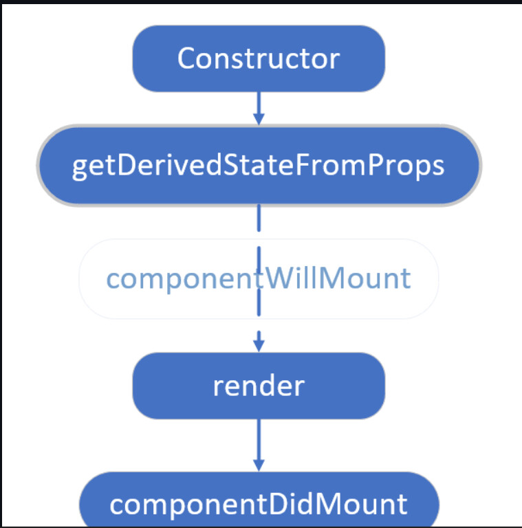
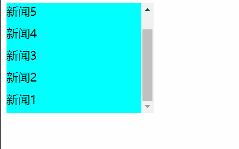

# 04 【生命周期】

## 1.简介

组件从创建到死亡，会经过一些特定的阶段

 React组件中包含一系列钩子函数{生命周期回调函数}，会在特定的时刻调用

 我们在定义组件的时候，会在特定的声明周期回调函数中，做特定的工作

在 React 中为我们提供了一些生命周期钩子函数，让我们能在 React 执行的重要阶段，在钩子函数中做一些事情。那么在 React 的生命周期中，有哪些钩子函数呢，我们来总结一下

**react生命周期(旧)**

```js
1. 初始化阶段: 由ReactDOM.render()触发---初次渲染
                    1.	constructor()
                    2.	componentWillMount()
                    3.	render()
                    4.	componentDidMount() =====> 常用
                        一般在这个钩子中做一些初始化的事，例如：开启定时器、发送网络请求、订阅消息
2. 更新阶段: 由组件内部this.setSate()或父组件render触发
                    1.	shouldComponentUpdate()
                    2.	componentWillUpdate()
                    3.	render() =====> 必须使用的一个
                    4.	componentDidUpdate()
3. 卸载组件: 由ReactDOM.unmountComponentAtNode()触发
                    1.	componentWillUnmount()  =====> 常用
                        一般在这个钩子中做一些收尾的事，例如：关闭定时器、取消订阅消息
```


在最新的react版本中，有些生命周期钩子被抛弃了，具体函数如下：

- `componentWillMount`
- `componentWillReceiveProps`
- `componentWillUpdate`

这些生命周期方法经常被误解和滥用；此外，我们预计，在异步渲染中，它们潜在的误用问题可能更大。我们将在即将发布的版本中为这些生命周期添加 “UNSAFE_” 前缀。（这里的 “unsafe” 不是指安全性，而是表示使用这些生命周期的代码在 React 的未来版本中更有可能出现 bug，尤其是在启用异步渲染之后。）

由此可见，新版本中并不推荐持有这三个函数，取而代之的是带有UNSAFE_ 前缀的三个函数，比如: UNSAFE_ componentWillMount。即便如此，其实React官方还是不推荐大家去使用，在以后版本中有可能会去除这几个函数。

**react生命周期(新)**

````js
1. 初始化阶段: 由ReactDOM.render()触发---初次渲染
                1.	constructor()
                2.	getDerivedStateFromProps 
                3.	render()
                4.	componentDidMount() =====> 常用
                	一般在这个钩子中做一些初始化的事，例如：开启定时器、发送网络请求、订阅消息
2. 更新阶段: 由组件内部this.setSate()或父组件重新render触发
                1.	getDerivedStateFromProps
                2.	shouldComponentUpdate()
                3.	render()
                4.	getSnapshotBeforeUpdate
                5.	componentDidUpdate()
3. 卸载组件: 由ReactDOM.unmountComponentAtNode()触发
                1.	componentWillUnmount()  =====> 常用
                	一般在这个钩子中做一些收尾的事，例如：关闭定时器、取消订阅消息
````


## 2.初始化阶段

**在组件实例被创建并插入到dom中时，生命周期调用顺序如下**

**旧生命周期：**

1. constructor（props）
2. componentWillMount（）-------------可以用但是不建议使用
3. render（）
4. componentDidMount（）

**新生命周期：**

1. constructor（props）
2. `static getDerivedStateFromProps（props，state）`--替代了`componentWillReceiveProps`
3. render（）
4. componentDidMount（）

### 2.1 constructor

**数据的初始化。**

接收props和context，当想在函数内使用这两个参数需要在super传入参数，当使用constructor时必须使用super，否则可能会有this的指向问题，如果不初始化state或者不进行方法绑定，则可以不为组件实现构造函数；

避免将 props 的值复制给 state！这是一个常见的错误：

```js
constructor(props) {
 super(props);
 // 不要这样做
 this.state = { color: props.color };
}
```

如此做毫无必要（可以直接使用 this.props.color），同时还产生了 bug（更新 prop 中的 color 时，并不会影响 state）。

现在我们通常不会使用 `constructor` 属性，而是改用类加箭头函数的方法，来替代 `constructor`

例如，我们可以这样初始化 `state`

```js
state = {
	count: 0
};
```

### 2.2 componentWillMount（即将废弃）

**该方法只在挂载的时候调用一次，表示组件将要被挂载，并且在 `render` 方法之前调用。**

> 如果存在 `getDerivedStateFromProps` 和 `getSnapshotBeforeUpdate` 就不会执行生命周期`componentWillMount`。

​    在服务端渲染唯一会调用的函数，代表已经初始化数据但是没有渲染dom，因此在此方法中同步调用 `setState()` 不会触发额外渲染。

**这个方法在 React 18版本中将要被废弃，官方解释是在 React 异步机制下，如果滥用这个钩子可能会有 Bug**

### 2.3 static getDerivedStateFromProps（新钩子）

**从props获取state。**

替代了`componentWillReceiveProps，`此方法适用于[罕见的用例](https://zh-hans.reactjs.org/blog/2018/06/07/you-probably-dont-need-derived-state.html#when-to-use-derived-state)，即 state 的值在任何时候都取决于 props。

这个是 React 新版本中新增的2个钩子之一，据说很少用。

1. 首先，该函数会在调用 render 方法之前调用，并且在初始挂载及后续更新时都会被调用；

2. 该函数必须是静态的；

3. 给组件传递的数据（props）以及组件状态（state），会作为参数到这个函数中；

4. 该函数也必须有返回值，返回一个Null或者state对象。因为初始化和后续更新都会执行这个方法，因此在这个方法返回state对象，就相当于将原来的state进行了覆盖，所以倒是修改状态不起作用。

> 注意：`state` 的值在任何时候都取决于传入的 `props` ，不会再改变

如下

```js
static getDerivedStateFromProps(props, state) {
    return null											
}
ReactDOM.render(<Count count="109"/>,document.querySelector('.test'))
```

`count` 的值不会改变，一直是 109

> [React的生命周期 - 简书](https://www.jianshu.com/p/b331d0e4b398)
>
> 老版本中的componentWillReceiveProps()方法判断前后两个 props 是否相同，如果不同再将新的 props 更新到相应的 state 上去。这样做一来会破坏 state 数据的单一数据源，导致组件状态变得不可预测，另一方面也会增加组件的重绘次数。
>
> 这两者最大的不同就是:
> 在 componentWillReceiveProps 中，我们一般会做以下两件事，一是根据 props 来更新 state，二是触发一些回调，如动画或页面跳转等。
>
> 1. 在老版本的 React 中，这两件事我们都需要在 componentWillReceiveProps 中去做。
> 2. 而在新版本中，官方将更新 state 与触发回调重新分配到了 getDerivedStateFromProps 与 componentDidUpdate 中，使得组件整体的更新逻辑更为清晰。而且在 getDerivedStateFromProps 中还禁止了组件去访问 this.props，强制让开发者去比较 nextProps 与 prevState 中的值，以确保当开发者用到 getDerivedStateFromProps 这个生命周期函数时，就是在根据当前的 props 来更新组件的 state，而不是去做其他一些让组件自身状态变得更加不可预测的事情。

### 2.4 render

**class组件中唯一必须实现的方法。**

> render函数会插入jsx生成的dom结构，react会生成一份虚拟dom树，在每一次组件更新时，在此react会通过其diff算法比较更新前后的新旧DOM树，比较以后，找到最小的有差异的DOM节点，并重新渲染。

> 注意：避免在 `render` 中使用 `setState` ，否则会死循环

当render被调用时，他会检查this.props.和this.state的变化并返回以下类型之一：

1. 通过jsx创建的react元素
2.  数组或者fragments：使得render可以返回多个元素
3.   Portals:可以渲染子节点到不同的dom树上
4.   字符串或数值类型：他们在dom中会被渲染为文本节点
5.   布尔类型或者null：什么都不渲染

### 2.5 componentDidMount

**在组件挂在后（插入到dom树中）后立即调用**

`componentDidMount` 的执行意味着初始化挂载操作已经基本完成，它主要用于组件挂载完成后做某些操作

这个挂载完成指的是：组件插入 DOM tree

​    可以在这里调用Ajax请求，返回的数据可以通过setState使组件重新渲染，或者添加订阅，但是要在conponentWillUnmount中取消订阅

### 2.6 初始化阶段总结

执行顺序 `constructor` -> `getDerivedStateFromProps` 或者 `componentWillMount` -> `render` -> `componentDidMount`



## 3.更新阶段

**当组件的 props 或 state 发生变化时会触发更新。**

**旧生命周期：**

1. componentWillReceiveProps (nextProps)------------------可以用但是不建议使用

2. shouldComponentUpdate（nextProps,nextState）

3. componetnWillUpdate（nextProps,nextState）----------------可以用但是不建议使用

4. render（）

5. componentDidUpdate（prevProps,precState,snapshot）

**新生命周期：**

1. static getDerivedStateFromProps（nextProps, prevState）
2. shouldComponentUpdate（nextProps,nextState）
3. render（）
4. getSnapshotBeforeUpdate（prevProps,prevState）
5. componentDidUpdate（prevProps,precState,snapshot）

### 3.1 componentWillReceiveProps (即将废弃)

**在已挂载的组件接收新的props之前调用。**

通过对比nextProps和this.props，将nextProps的state为当前组件的state，从而重新渲染组件，可以在此方法中使用this.setState改变state。

```js
componentWillReceiveProps (nextProps) {
    nextProps.openNotice !== this.props.openNotice&&this.setState({
        openNotice:nextProps.openNotice
    }，() => {
      console.log(this.state.openNotice:nextProps)
      //将state更新为nextProps,在setState的第二个参数（回调）可以打         印出新的state
    })
}
```

> 请注意，如果父组件导致组件重新渲染，即使 props 没有更改，也会调用此方法。如果只想处理更改，请确保进行当前值与变更值的比较。
>
> React 不会针对初始 props 调用 UNSAFE_componentWillReceiveProps()。组件只会在组件的 props 更新时调用此方法。调用 this.setState() 通常不会触发该生命周期。

### 3.2 shouldComponentUpdate

在渲染之前被调用，默认返回为true。

​    返回值是判断组件的输出是否受当前state或props更改的影响，默认每次state发生变化都重新渲染，首次渲染或使用forceUpdate(使用`this.forceUpdate()`)时不被调用。

> 他主要用于性能优化，会对 props 和 state 进行浅层比较，并减少了跳过必要更新的可能性。不建议深层比较，会影响性能。如果返回false，则不会调用componentWillUpdate、render和componentDidUpdate

- 唯一用于控制组件重新渲染的生命周期，由于在react中，setState以后，state发生变化，组件会进入重新渲染的流程，在这里return false可以阻止组件的更新，但是不建议，建议使用 PureComponent 
- 因为react父组件的重新渲染会导致其所有子组件的重新渲染，这个时候其实我们是不需要所有子组件都跟着重新渲染的，因此需要在子组件的该生命周期中做判断

### 3.3 componentWillUpdate (即将废弃)

**当组件接收到新的props和state会在渲染前调用，初始渲染不会调用该方法。**

​    shouldComponentUpdate返回true以后，组件进入重新渲染的流程，进入componentWillUpdate，不能在这使用setState，在函数返回之前不能执行任何其他更新组件的操作

> 此方法可以替换为 `componentDidUpdate()`。如果你在此方法中读取 DOM 信息（例如，为了保存滚动位置），则可以将此逻辑移至 `getSnapshotBeforeUpdate()` 中。

### 3.4 getSnapshotBeforeUpdate（新钩子）

**在最近一次的渲染输出之前被提交之前调用，也就是即将挂载时调用，替换componetnWillUpdate。**

相当于淘宝购物的快照，会保留下单前的商品内容，在 React 中就相当于是 即将更新前的状态

它可以使组件在 DOM 真正更新之前捕获一些信息（例如滚动位置），此生命周期返回的任何值都会作为参数传递给 `componentDidUpdate()`。如不需要传递任何值，那么请返回 null

> 和componentWillUpdate的区别
>
> - 在 React 开启异步渲染模式后，在 render 阶段读取到的 DOM 元素状态并不总是和 commit 阶段相同，这就导致在componentDidUpdate 中使用 componentWillUpdate 中读取到的 DOM 元素状态是不安全的，因为这时的值很有可能已经失效了。
> - getSnapshotBeforeUpdate 会在最终的 render 之前被调用，也就是说getSnapshotBeforeUpdate 中读取到的 DOM 元素状态是可以保证与 componentDidUpdate 中一致的。

### 3.5 componentDidUpdate

**组件在更新完毕后会立即被调用，首次渲染不会调用**

可以在该方法调用setState，但是要包含在条件语句中，否则一直更新会造成死循环。

当组件更新后，可以在此处对 DOM 进行操作。如果对更新前后的props进行了比较，可以进行网络请求。（当 props 未发生变化时，则不会执行网络请求）。

```javascript
componentDidUpdate(prevProps,prevState,snapshotValue) {
  // 典型用法（不要忘记比较 props）：
  if (this.props.userID !== prevProps.userID) {
    this.fetchData(this.props.userID);
  }
}
```

> 如果组件实现了 `getSnapshotBeforeUpdate()` 生命周期（不常用），则它的返回值将作为 `componentDidUpdate()` 的第三个参数 “snapshotValue” 参数传递。否则此参数将为 undefined。如果返回false就不会调用这个函数。

### 3.6 getSnapshotBeforeUpdate使用场景

在一个区域内，定时的输出以行话，如果内容大小超过了区域大小，就出现滚动条，但是内容不进行移动 



如上面的动图：区域内部的内容展现没有变化，但是可以看见滚动条在变化，也就是说上面依旧有内容在输出，只不过不在这个区域内部展现。

1.首先我们先实现定时输出内容

我们可以使用state状态，改变新闻后面的值，但是为了同时显示这些内容，我们应该为state的属性定义一个数组。并在创建组件之后开启一个定时器，不断的进行更新state。更新渲染组件

```js
 class New extends React.Component{

        state = {num:[]};

        //在组件创建之后,开启一个定时任务
        componentDidMount(){
            setInterval(()=>{
                let {num} = this.state;
                const news = (num.length+1);
                this.setState({num:[news,...num]});
            },2000);
        }

        render(){
            return (
                <div ref = "list" className = "list">{
                    this.state.num.map((n,index)=>{
                    return <div className="news" key={index} >新闻{n}</div>
                    })
                }</div>
            )
        }
  }
  ReactDOM.render(<New />,document.getElementById("div"));
```

2.接下来就是控制滚动条了

我们在组件渲染到DOM之前获取组件的高度，然后用组件渲染之后的高度减去之前的高度就是一条新的内容的高度，这样在不断的累加到滚动条位置上。

````js
getSnapshotBeforeUpdate(){
	return this.refs.list.scrollHeight;
}

componentDidUpdate(preProps,preState,height){
	this.refs.list.scrollTop += (this.refs.list.scrollHeight - height);
}
````

这样就实现了这个功能。

## 4.卸载组件

**当组件从 DOM中移除时会调用如下方法**

### 4.1 componentWillUnmount

**在组件卸载和销毁之前调用**

> 使用这样的方式去卸载`ReactDOM.unmountComponentAtNode(document.getElementById('test'))`

​    在这执行必要的清理操作，例如，清除timer（setTimeout,setInterval），取消网络请求，或者取消在componentDidMount的订阅，移除所有监听

有时候我们会碰到这个warning:

```js
Can only update a mounted or mounting component. This usually means you called setState() on an unmounted component. This is a   no-op. Please check the code for the undefined component.
```

原因：因为你在组件中的ajax请求返回setState,而你组件销毁的时候，请求还未完成，因此会报warning

解决方法：

```javascript
componentDidMount() {
    this.isMount === true
    axios.post().then((res) => {
    this.isMount && this.setState({   // 增加条件ismount为true时
      aaa:res
    })
})
}
componentWillUnmount() {
    this.isMount === false
}
```

`componentWillUnmount()` 中不应调用 `setState()`，因为该组件将永远不会重新渲染。组件实例卸载后，将永远不会再挂载它。