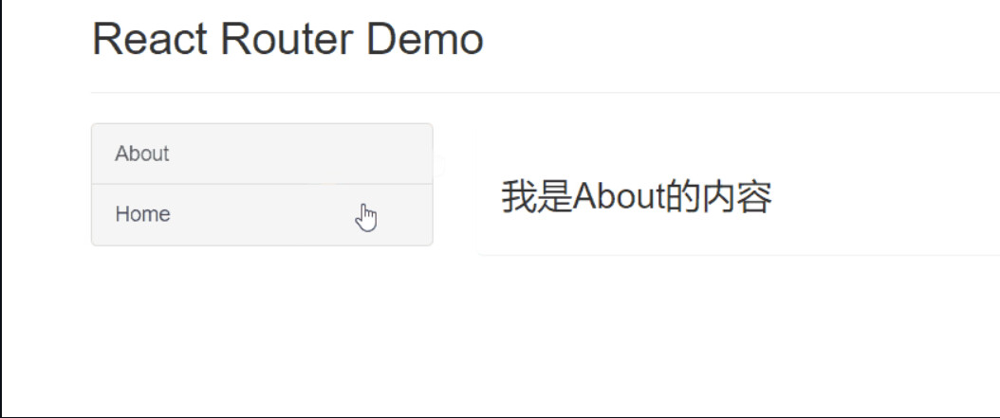
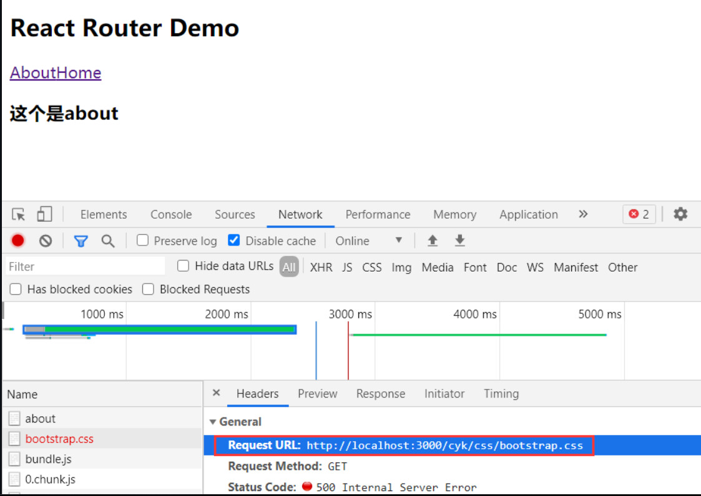
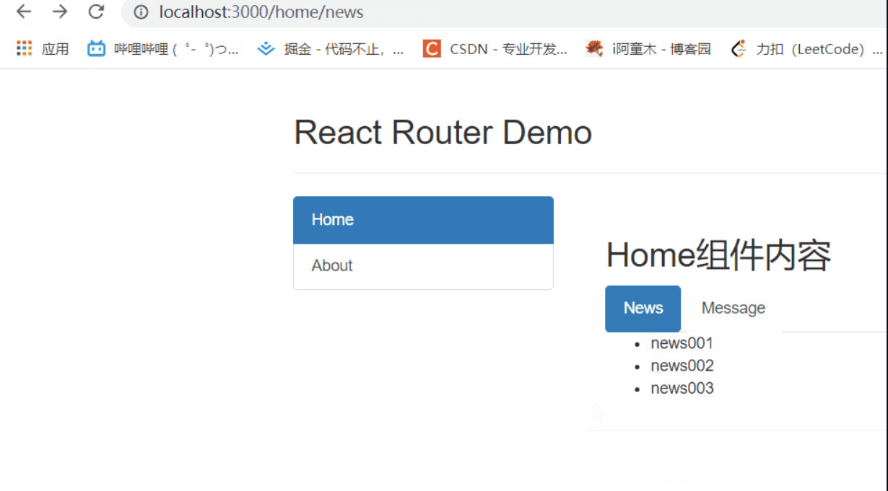

# 11 【react-router 5】

## 1.准备

### 1.1 SPA

而为了减少这样的情况，我们还有另一种应用，叫做 SPA ，单页应用程序

它比传统的 Web 应用程序更快，因为它们在 Web 浏览器本身而不是在服务器上执行逻辑。在初始页面加载后，**只有数据来回发送**，而不是整个 HTML，这会降低带宽。它们可以独立请求标记和数据，并直接在浏览器中呈现页面

### 1.2 什么是路由？

路由是根据不同的 URL 地址展示不同的内容或页面

在 SPA 应用中，大部分页面结果不改变，只改变部分内容的使用

一个路由其实就是一个映射关系（k:v）

key为路径，value可能是function 或者是 component

**后端路由：**

value是function，用来处理客户端提交的请求

注册路由：router.get(path,function(req,res))

工作过程：当node接收一个请求的时候，根据请求路径找到匹配的路由，调用路由中的函数来处理请求，返回响应的数据

**前端路由：**

浏览器端路由，value是Component，用于展示页面内容

注册路由：< Route path="/test" component={Test}>

工作过程：当浏览器的path变为/test的时候，当前路由组件就会变成Test组件

**前端路由的优缺点**

**优点**

用户体验好，不需要每次都从服务器全部获取整个 HTML，快速展现给用户

**缺点**

1. SPA 无法记住之前页面滚动的位置，再次回到页面时无法记住滚动的位置
2. 使用浏览器的前进和后退键会重新请求，没有合理利用缓存

### 1.3 前端路由的原理

前端路由的主要依靠的时 history ，也就是浏览器的历史记录

> history 是 BOM 对象下的一个属性，在 H5 中新增了一些操作 history 的 API

浏览器的历史记录就类似于一个栈的数据结构，前进就相当于入栈，后退就相当于出栈

并且历史记录上可以采用 `listen` 来监听请求路由的改变，从而判断是否改变路径

在 H5 中新增了 `createBrowserHistory` 的 API ，用于创建一个 history 栈，允许我们手动操作浏览器的历史记录

新增 API：`pushState` ，`replaceState`，原理类似于 Hash 实现。 用 H5 实现，单页路由的 URL 不会多出一个 `#` 号，这样会更加的美观

## 2.react-router-dom 的理解和使用

react的路由有三类：

web【主要适用于前端】,native【主要适用于本地】,anywhere【任何地方】

在这主要使用web也就是这个标题 react-router-dom

> 专门给 web 人员使用的库

1. 一个 react 的仓库
2. 很常用，基本是每个应用都会使用的这个库
3. 专门来实现 SPA 应用

安装：`npm i react-router-dom@5 `

首先我们要明确好页面的布局 ，分好导航区、展示区

要引入 `react-router-dom` 库，暴露一些属性 `Link、BrowserRouter...`

```js
import { Link, BrowserRouter, Route } from 'react-router-dom'
```

导航区的 a 标签改为 Link 标签

```html
<Link className="list-group-item" to="/about">About</Link>
```

同时我们需要用 `Route` 标签，来进行路径的匹配，从而实现不同路径的组件切换

```html
<Route path="/about" component={About}></Route>
<Route path="/home" component={Home}></Route>
```

这样之后我们还需要一步，加个路由器，在上面我们写了两组路由，同时还会报错指示我们需要添加 `Router` 来解决错误，这就是需要我们添加路由器来管理路由，如果我们在 Link 和 Route 中分别用路由器管理，那这样是实现不了的，只有在一个路由器的管理下才能进行页面的跳转工作。

因此我们也可以在 Link 和 Route 标签的外层标签采用 `BrowserRouter`(或者`HashRouter`) 包裹，但是这样当我们的路由过多时，我们要不停的更改标签包裹的位置，因此我们可以这么做

我们回到 App.jsx 目录下的 `index.js` 文件，将整个 App 组件标签采用 `BrowserRouter` 标签去包裹，这样整个 App 组件都在**一个路由器**的管理下

```html
// index.js
<BrowserRouter>
< App />
</BrowserRouter>
```



## 3.路由组件和一般组件

在我们前面的内容中，我们是把组件 Home 和组件 About 当成是一般组件来使用，我们将它们写在了 src 目录下的 components 文件夹下，但是我们又会发现它和普通的组件又有点不同，对于普通组件而言，我们在引入它们的时候我们是通过标签的形式来引用的。但是在上面我们可以看到，我们把它当作路由来引用时，我们是通过 `{Home}` 来引用的。

从这一点我们就可以认定一般组件和路由组件存在着差异

1. 写法不同

**一般组件**：`<Demo/>`，**路由组件**：`<Route path="/demo" component={Demo}/>`

2. 存放的位置不同

同时为了规范我们的书写，一般将路由组件放在 `pages`/`views` 文件夹中，路由组件放在 `components`

而最重要的一点就是它们接收到的 `props` 不同，在一般组件中，如果我们不进行传递，就不会收到值。而对于路由组件而言，它会接收到 3 个固定属性 `history` 、`location` 以及 `match`


重要的属性

```css
history:
    go: ƒ go(n)
    goBack: ƒ goBack()
    goForward: ƒ goForward()
    push: ƒ push(path, state)
    replace: ƒ replace(path, state)
location:
    pathname: "/about"
    search: ""
    state: undefined

match:
    params: {}
    path: "/about"
    url: "/about"
```

## 4.NavLink 标签

### 4.1 基本使用

NavLink 标签是和 Link 标签作用相同的，但是它又比 Link 更加强大。

在前面的 demo 展示中，你可能会发现点击的按钮并没有出现高亮的效果，正常情况下我们给标签多添加一个 `active` 的类就可以实现高亮的效果

而 NavLink 标签正可以帮助我们实现这一步

当我们选中某个 NavLink 标签时，就会自动的在类上添加一个 `active` 属性

```html
<NavLink className="list-group-item" to="/about">About</NavLink>
```

当然 NavLink 标签是默认的添加上 `active` 类，我们也可以改变它，在标签上添加一个属性 `activeClassName`

如下代码，就写了`activeClassName`，当点击的时候就会触发这个class的样式

```html
{/*NavLink在点击的时候就会去找activeClassName="ss"所指定的class的值，如果不添加默认是active
 这是因为Link相当于是把标签写死了，不能去改变什么。*/}

<NavLink  activeClassName="ss" className="list-group-item"  to="/about">About</NavLink>
<NavLink className="list-group-item"  to="/home">Home</NavLink> 
```

### 4.2 NavLink 封装

在上面的 NavLink 标签种，我们可以发现我们每次都需要重复的去写这些样式名称或者是 `activeClassName` ，这并不是一个很好的情况，代码过于冗余。那我们是不是可以想想办法封装一下它们呢？

我们可以采用 `MyNavLink` 组件，对 NavLink 进行封装

首先我们需要新建一个 MyNavLink 组件

`return` 一个结构

```html
 // 通过{...对象}的形式解析对象，相当于将对象中的属性全部展开
<NavLink className="list-group-item" {...this.props} />
```

首先，有一点非常重要的是，我们在标签体内写的内容都会成为一个 `children` 属性，因此我们在调用 `MyNavLink` 时，在标签体中写的内容，都会成为 `props` 中的一部分，从而能够实现

接下来我们在调用时，直接写

```html
{/*将NavLink进行封装，成为MyNavLink,通过props进行传参数，标签体内容props是特殊的一个属性，叫做children */}
<MyNavLink to="/home">home</MyNavLink>
```

## 5.解决二级路由样式丢失的问题

拿上面的案例来说：

这里面会有一个样式：


此时，加载该样式的路径为：


但是在写路由的时候，有的时候就会出现多级路由，

```html
<MyNavLink to = "/cyk/about" >About</MyNavLink>

<Route path="/cyk/about"component={About}/>
```

这个时候就在刷新页面，就会出现问题：

样式因为路径问题加载失败，此时页面返回public下面的Index.html



解决这个问题，有三个方法：

1.样式加载使用绝对位置

```html
 <link href="/css/bootstrap.css" rel="stylesheet"> 
```

2.使用 `%PUBLIC_URL%`

```html
 <link href="%PUBLIC_URL%/css/bootstrap.css" rel="stylesheet">
```

3.使用`HashRouter`

因为HashRouter会添加#，默认不会处理#后面的路径，所以也是可以解决的

## 6.模糊匹配和精准匹配

路由的匹配有两种形式，一种是精准匹配一种是模糊匹配，React 中默认开启的是模糊匹配

模糊匹配可以理解为，在匹配路由时，只要有匹配到的就好了

精准匹配就是，两者必须相同

比如：

```html
<MyNavLink to = "/home/a/b" >Home</MyNavLink>
```

此时该标签匹配的路由，分为三个部分 home a b；将会根据这个先后顺序匹配路由。

如下就可以匹配到相应的路由：

```html
<Route path="/home"component={Home}/>
```

但是如果是下面这个就会失败，也就是说他是根据路径一级一级查询的，可以包含前面那一部分，但并不是只包含部分就可以。

```html
<Route path="/a" component={Home}/>
```

当然也可以使用这个精确的匹配` exact={true}`

如以下：这样就精确的匹配/home，则上面的/home/a/b就不行了

```html
<Route exact={true}  path="/home" component={Home}/>
或者
<Route exact path="/home" component={Home}/>
```

## 7.Switch 解决相同路径问题

首先我们看一段这样的代码

```html
<Route path="/home" component={Home}></Route>
<Route path="/about" component={About}></Route>
<Route path="/about" component={About}></Route>
```

这是两个路由组件，在2，3行中，我们同时使用了相同的路径 `/about`


我们发现它出现了两个 `about` 组件的内容，那这是为什么呢？

其实是因为，`Route` 的机制，当匹配上了第一个 `/about` 组件后，它还会继续向下匹配，因此会出现两个 About 组件，这时我们可以采用 `Switch` 组件进行包裹

```html
<Switch>
    <Route path="/home" component={Home}></Route>
    <Route path="/about" component={About}></Route>
    <Route path="/about" component={About}></Route>
</Switch>
```

在使用 `Switch` 时，我们需要先从 `react-router-dom` 中暴露出 `Switch` 组件

这样我们就能成功的解决掉这个问题了

## 8.路由重定向

在配置好路由，最开始打开页面的时候，应该是不会匹配到任意一个组件。这个时候页面就显得极其不合适，此时应该默认的匹配到一个组件。

这个时候我们就需要时候 Redirecrt 进行默认匹配了。

```html
<Redirect to="/home" />
```

当我们加上这条语句时，页面找不到指定路径时，就会重定向到 `/home` 页面下因此当我们请求3000端口时，就会重定向到 `/home` 这样就能够实现我们想要的效果了

如下的代码就是默认匹配/home路径所到的组件

```html
<Switch>
    <Route path="/about"component={About}/>
    {/* exact={true}：开启严格匹配的模式，路径必须一致 */}
    <Route   path="/home" component={Home}/>
    {/* Redirect:如果上面的都没有匹配到，就匹配到这个路径下面 */}
    <Redirect  to = "/home"/>
</Switch>
```

## 9.嵌套路由

嵌套路由也就是我们前面有提及的二级路由，但是嵌套路由包括了二级、三级...还有很多级路由，当我们需要在一个路由组件中添加两个组件，一个是头部，一个是内容区

我们将我们的嵌套内容写在相应的组件里面，这个是在 Home 组件的 return 内容

```html
<div>
    <h2>Home组件内容</h2>
    <div>
        <ul className="nav nav-tabs">
            <li>
                <MyNavLink className="list-group-item" to="/home/news">News</MyNavLink>
            </li>
            <li>
                <MyNavLink className="list-group-item " to="/home/message">Message</MyNavLink>
            </li>
        </ul>
        {/* 注册路由 */}
        <Switch>
            <Route path="/home/news" component={News} />
            <Route path="/home/message" component={Message} />
        </Switch>
    </div>
</div>
```

在这里我们需要使用嵌套路由的方式，才能完成匹配

首先我们得 React 中路由得注册是有顺序的，我们在匹配得时候，因为 Home 组件是先注册得，因此在匹配的时候先去找 home 路由，由于是模糊匹配，会成功的匹配

在 Home 组件里面去匹配相应的路由，从而找到 /home/news 进行匹配，因此找到 News 组件，进行匹配渲染

> 如果开启精确匹配的话，第一步的 `/home/news` 匹配 `/home` 就会卡住不动，这个时候就不会显示有用的东西了！

## 10.传递参数

### 10.1 传递 params 参数


首先我们需要实现的效果是，点击消息列表，展示出消息的详细内容

这个案例实现的方法有三种，第一种就是传递 params 参数，由于我们所显示的数据都是从数据集中取出来的，因此我们需要有数据的传输给 Detail 组件

我们首先需要将详细内容的数据列表，保存在 DetailData 中，将消息列表保存在 Message 的 state 中。

我们可以通过将数据拼接在路由地址末尾来实现数据的传递

```html
 <Link to={`/home/message/detail/${msgObj.id}/${msgObj.title}`}>{msgObj.title}</Link>
```

如上，我们将消息列表的 id 和 title 写在了路由地址后面

> 这里我们需要注意的是：需要采用模板字符串以及 `$` 符的方式来进行数据的获取

在注册路由时，我们可以通过 `:参数名` 来传递数据

```html
<Route path="/home/message/detail/:id/:title" component={Detail} />
```

如上，使用了 `:id/:title` 成功的接收了由 Link 传递过来的 id 和 title 数据

这样我们既成功的实现了路由的跳转，又将需要获取的数据传递给了 Detail 组件

我们在 Detail 组件中打印 `this.props` 来查看当前接收的数据情况

我们可以发现，我们传递的数据被接收到了对象的 match 属性下的 params 中

因此我们可以在 Detail 组件中获取到又 Message 组件中传递来的 params 数据

并通过 params 数据中的 `id` 值，在详细内容的数据集中查找出指定 `id` 的详细内容	

```js
const { id, title } = this.props.match.params
const findResult = DetailData.find((detailObj) => {
    return detailObj.id === id
})
```

最后渲染数据即可

### 10.2 传递 search 参数

我们还可以采用传递 search 参数的方法来实现

首先我们先确定数据传输的方式

我们先在 Link 中采用 `?` 符号的方式来表示后面的为可用数据

```html
<Link to={`/home/message/detail/?id=${msgObj.id}&title=${msgObj.title}`}>{msgObj.title}</Link>
```

采用 `search` 传递的方式，无需在 Route 中再次声明，可以在 Detail 组件中直接获取到


我们可以发现，我们的数据保存在了 `location` 对象下的 `search` 中，是一种字符串的形式保存的，我们可以引用一个库来进行转化 `qs`

>   qs是一个npm仓库所管理的包,可通过npm install qs命令进行安装.
>
> 1. qs.parse()将URL解析成对象的形式
>
> 2. qs.stringify()将对象 序列化成URL的形式，以&进行拼接
>
> ```js
> // nodejs中调试
> const qs = require('qs');
> 
> 1.qs.parse()
> const str = "username='admin'&password='123456'";
> console.log(qs.parse(str)); 
> // Object { username: "admin", password: "123456" }
> 
> 2.qs.stringify()
> const a = qs.stringify({ username: 'admin', password: '123456' });
> console.log(a); 
> // username=admin&password=123456
> 
> 
> 
> qs.stringify() 和JSON.stringify()有什么区别?
> 
>     var a = {name:'hehe',age:10};
>     qs.stringify序列化结果如
>     name=hehe&age=10
>     --------------------
>     而JSON.stringify序列化结果如下：
>     "{"a":"hehe","age":10}"
> ```

我们可以采用 `parse` 方法，将字符串转化为键值对形式的对象

```js
const { search } = this.props.location
const { id, title } = qs.parse(search.slice(1)) // 从?后面开始截取字符串
```

这样我们就能成功的获取数据，并进行渲染

### 10.3 传递 state 参数

采用传递 state 参数的方法，是我觉得最完美的一种方法，因为它不会将数据携带到地址栏上，采用内部的状态来维护

```html
<Link to={{ pathname: '/home/message/detail', state: { id: msgObj.id, title: msgObj.title } }}>{msgObj.title}</Link>
```

首先，我们需要在 Link 中注册跳转时，传递一个路由对象，包括一个 跳转地址名，一个 state 数据，这样我们就可以在 Detail 组件中获取到这个传递的 state 数据

> 注意：采用这种方式传递，无需声明接收

我们可以在 Detail 组件中的 location 对象下的 state 中取出我们所传递的数据

```js
const { id, title } = this.props.location.state
```


解决清除缓存造成报错的问题，我们可以在获取不到数据的时候用空对象来替代，例如，

```js
const { id, title } = this.props.location.state || {}
```

当获取不到 `state` 时，则用空对象代替

> 这里的 state 和状态里的 state 有所不同

### 10.4 小结

```html
1.params参数
            路由链接(携带参数)：<Link to='/demo/test/tom/18'}>详情</Link>
            注册路由(声明接收)：<Route path="/demo/test/:name/:age" component={Test}/>
            接收参数：this.props.match.params
2.search参数
            路由链接(携带参数)：<Link to='/demo/test?name=tom&age=18'}>详情</Link>
            注册路由(无需声明，正常注册即可)：<Route path="/demo/test" component={Test}/>
            接收参数：this.props.location.search
            备注：获取到的search是urlencoded编码字符串，需要借助querystring解析
3.state参数
            路由链接(携带参数)：<Link to={{pathname:'/demo/test',state:{name:'tom',age:18}}}>详情</Link>
            注册路由(无需声明，正常注册即可)：<Route path="/demo/test" component={Test}/>
            接收参数：this.props.location.state
            备注：刷新也可以保留住参数
```

**接收参数**

```js
// 接收params参数
// const {id,title} = this.props.match.params 

// 接收search参数
// const {search} = this.props.location
// const {id,title} = qs.parse(search.slice(1))

// 接收state参数
const {id,title} = this.props.location.state || {}
```

## 11.路由跳转

### 11.1 push 与 replace 模式

默认情况下，开启的是 push 模式，也就是说，每次点击跳转，都会向栈中压入一个新的地址，在点击返回时，可以返回到上一个打开的地址，

当我们在读消息的时候，有时候我们可能会不喜欢这种繁琐的跳转，我们可以开启 replace 模式，这种模式与 push 模式不同，它会将当前地址**替换**成点击的地址，也就是替换了新的栈顶

我们只需要在需要开启的链接上加上 `replace` 即可

```jsx
<Link replace to={{ pathname: '/home/message/detail', state: { id: msgObj.id, title: msgObj.title } }}>{msgObj.title}</Link>
```



### 11.2 编程式路由导航

```js
借助this.prosp.history对象上的API对操作路由跳转、前进、后退
        -this.prosp.history.push()
        -this.prosp.history.replace()
        -this.prosp.history.goBack()
        -this.prosp.history.goForward()
        -this.prosp.history.go(1)
```

我们可以采用绑定事件的方式实现路由的跳转，我们在按钮上绑定一个 `onClick` 事件，当事件触发时，我们执行一个回调 

```js
//push跳转+携带params参数
// this.props.history.push(`/home/message/detail/${id}/${title}`)

//push跳转+携带search参数
// this.props.history.push(`/home/message/detail?id=${id}&title=${title}`)

//push跳转+携带state参数
this.props.history.push(`/home/message/detail`,{id,title})

//replace跳转+携带params参数
//this.props.history.replace(`/home/message/detail/${id}/${title}`)

//replace跳转+携带search参数
// this.props.history.replace(`/home/message/detail?id=${id}&title=${title}`)

//replace跳转+携带state参数
this.props.history.replace(`/home/message/detail`,{id,title})
```

### 11.3 withRouter

当我们需要在页面内部添加回退前进等按钮时，由于这些组件我们一般通过一般组件的方式去编写，因此我们会遇到一个问题，**无法获得 history 对象**，这正是因为我们采用的是一般组件造成的。

只有路由组件才能获取到 history 对象

因此我们需要如何解决这个问题呢

我们可以利用 `react-router-dom` 对象下的 `withRouter` 函数来对我们导出的 `Header` 组件进行包装，这样我们就能获得一个拥有 `history` 对象的一般组件

我们需要对哪个组件包装就在哪个组件下引入

```js
// Header/index.jsx
import { withRouter } from 'react-router-dom'
// 在最后导出对象时，用 `withRouter` 函数对 index 进行包装
export default withRouter(index);
```

这样就能让一般组件获得路由组件所特有的 API

## 12.BrowserRouter 和 HashRouter 的区别

#### **它们的底层实现原理不一样**

对于 BrowserRouter 来说它使用的是 React 为它封装的 history API ，这里的 history 和浏览器中的 history 有所不同噢！通过操作这些 API 来实现路由的保存等操作，但是这些 API 是 H5 中提出的，因此不兼容 IE9 以下版本。

对于 HashRouter 而言，它实现的原理是通过 URL 的哈希值，但是这句话我不是很理解，用一个简单的解释就是

我们可以理解为是锚点跳转，因为锚点跳转会保存历史记录，从而让 HashRouter 有了相关的前进后退操作，HashRouter 不会将 `#` 符号后面的内容请求。兼容性更好！

**地址栏的表现形式不一样**

- HashRouter 的路径中包含 `#` ，例如 `localhost:3000/#/demo/test`

**刷新后路由 state 参数改变**

1. 在BrowserRouter 中，state 保存在history 对象中，刷新不会丢失
2. HashRouter 则刷新会丢失 state