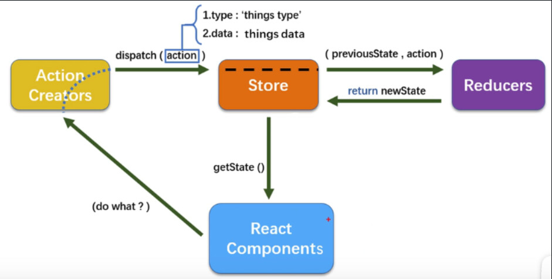

# 17 【redux】

## 引言

我们现在开始学习了 Redux ，在我们之前写的案例当中，我们对于状态的管理，都是通过 state 来实现的，比如，我们在给兄弟组件传递数据时，需要先将数据传递给父组件，再由父组件转发 给它的子组件。这个过程十分的复杂，后来我们又学习了**消息的发布订阅**，我们通过 **pubsub** 库，实现了消息的转发，直接将数据发布，由兄弟组件订阅，实现了兄弟组件间的数据传递。但是，随着我们的需求不断地提升，我们需要进行更加复杂的数据传递，更多层次的数据交换。**因此我们为何不可以将所有的数据交给一个中转站，这个中转站独立于所有的组件之外，由这个中转站来进行数据的分发，这样不管哪个组件需要数据，我们都可以很轻易的给他派发。**

而有这么一个库就可以帮助我们来实现，那就是 Redux ，它可以帮助我们实现集中式状态管理

## 1.简介

> [Redux – 李立超 | lilichao.com](https://www.lilichao.com/index.php/2022/05/22/redux/)
>
> 李立超老师的解释

A Predictable State Container for JS Apps是Redux官方对于Redux的描述，这句话可以这样翻译“一个专为JS应用设计的可预期的状态容器”，简单来说Redux是一个可预测的状态容器，什么玩意？这几个字单独拿出来都认识，连到一起后怎么就不像人话了？别急，我们一点一点看。

### 1.1 状态（State）

state直译过来就是状态，使用React这么久了，对于state我们已经是非常的熟悉了。state不过就是一个变量，一个用来记录（组件）状态的变量。组件可以根据不同的状态值切换为不同的显示，比如，用户登录和没登录看到页面应该是不同的，那么用户的登录与否就应该是一个状态。再比如，数据加载与否，显示的界面也应该不同，那么数据本身就是一个状态。换句话说，状态控制了页面的如何显示。

但是需要注意的是，状态并不是React中或其他类似框架中独有的。所有的编程语言，都有状态，所有的编程语言都会根据不同的状态去执行不同的逻辑，这是一定的。所以状态是什么，状态就是一个变量，用以记录程序执行的情况。

### 1.2 容器（Container）

容器当然是用来装东西的，状态容器即用来存储状态的容器。状态多了，自然需要一个东西来存储，但是容器的功能却不是仅仅能存储状态，它实则是一个状态的管理器，除了存储状态外，它还可以用来对state进行查询、修改等所有操作。（编程语言中容器几乎都是这个意思，其作用无非就是对某个东西进行增删改查）

### 1.3 可预测（Predictable）

可预测指我们在对state进行各种操作时，其结果是一定的。即以相同的顺序对state执行相同的操作会得到相同的结果。简单来说，Redux中对状态所有的操作都封装到了容器内部，外部只能通过调用容器提供的方法来操作state，而不能直接修改state。这就意味着外部对state的操作都被容器所限制，对state的操作都在容器的掌控之中，也就是可预测。

总的来说，**Redux是一个稳定、安全的状态管理器**。

## 2.为什么是Redux？

问：不对啊？React中不是已经有state了吗？为什么还要整出一个Redux来作为状态管理器呢？

答：state应付简单值还可以，如果值比较复杂的话并不是很方便。

问：复杂值可以用useReducer嘛！

答：的确可以啊！但无论是state还是useReducer，state在传递起来还是不方便，自上至下一层一层的传递并不方便啊！

问：那不是还有context吗？

答：的确使用context可以解决state的传递的问题，但依然是简单的数据尚可，如果数据结构过于复杂会使得context变得异常的庞大，不方便维护。

Redux可以理解为是reducer和context的结合体，使用Redux即可管理复杂的state，又可以在不同的组件间方便的共享传递state。当然，Redux主要使用场景依然是大型应用，大型应用中状态比较复杂，如果只是使用reducer和context，开发起来并不是那么的便利，此时一个有一个功能强大的状态管理器就变得尤为的重要。

## 3.什么情况使用 Redux 

首先，我们先明晰 `Redux` 的作用 ，实现集中式状态管理。

`Redux` 适用于多交互、多数据源的场景。简单理解就是**复杂**

从组件角度去考虑的话，当我们有以下的应用场景时，我们可以尝试采用 `Redux` 来实现

1. 某个组件的状态需要共享时
2. 一个组件需要改变其他组件的状态时
3. 一个组件需要改变全局的状态时

除此之外，还有很多情况都需要使用 Redux 来实现


如上图所示，`redux` 通过将所有的 `state` 集中到组件顶部，能够灵活的将所有 `state` 各取所需地分发给所有的组件。

`redux` 的三大原则：

- 整个应用的 `state` 都被存储在一棵 `object tree` 中，并且 `object tree` 只存在于唯一的 `store` 中（这并不意味使用 `redux` 就需要将所有的 `state` 存到 `redux` 上，组件还是可以维护自身的 `state` ）。
- `state` 是只读的。`state` 的变化，会导致视图（`view`）的变化。用户接触不到 `state`，只能接触到视图，唯一改变 `state` 的方式则是在视图中触发`action`。`action`是一个用于描述已发生事件的普通对象。
- 使用 `reducers` 来执行 `state` 的更新。 `reducers` 是一个纯函数，它接受 `action` 和当前  `state` 作为参数，通过计算返回一个新的 `state` ，从而实现视图的更新。

## 4.Redux 的工作流程



如上图所示，`redux` 的工作流程大致如下：

- 首先，用户在视图中通过 `store.dispatch` 方法发出 `action`。
- 然后，`store` 自动调用 `reducers`，并且传入两个参数：当前 `state` 和收到的 `action`。`reducers` 会返回新的 `state` 。
- 最后，当`store` 监听到 `state` 的变化，就会调用监听函数，触发视图的重新渲染。

## 5.Redux API

### 5.1 store

- `store` 就是保存数据的地方，整个应用只能有一个 `store`。
- `redux` 提供 `createStore` 这个函数，用来创建一个 `store` 以存放整个应用的 `state`：

```js
import { createStore } from 'redux';
const store = createStore(reducer, [preloadedState], enhancer);
```

createStore用来创建一个Redux中的容器对象，它需要三个参数：`reducer`、`preloadedState`、`enhancer`。

- `reducer`是一个函数，是state操作的整合函数，每次修改state时都会触发该函数，它的返回值会成为新的state。

- `preloadedState`就是state的初始值，可以在这里指定也可以在reducer中指定。

- `enhancer`增强函数用来对state的功能进行扩展，暂时先不理它。

### 5.2 state

- `store` 对象包含所有数据。如果想得到某个时点的数据，就要对 `store` 生成快照。这种时点的数据集合，就叫做 `state`。
- 如果要获取当前时刻的 `state`，可以通过 `store.getState()` 方法拿到：

```js
import { createStore } from 'redux';
const store = createStore(reducer, [preloadedState], enhancer);

const state = store.getState();
```

### 5.3 action

- `state` 的变化，会导致视图的变化。但是，用户接触不到 `state`，只能接触到视图。所以，`state` 的变化必须是由视图发起的。
- `action` 就是视图发出的通知，通知`store`此时的 `state` 应该要发生变化了。
- `action` 是一个对象。其中的 `type` 属性是必须的，表示 `action` 的名称。其他属性可以自由设置，社区有一个规范可以参考：

```js
const action = {
  type: 'ADD_TODO',
  payload: 'Learn Redux' // 可选属性
};
```

上面代码定义了一个名称为 `ADD_TODO` 的 `action`，它携带的数据信息是 `Learn Redux`。

### 5.4 Action Creator

- `view` 要发送多少种消息，就会有多少种 `action`，如果都手写，会很麻烦。
- 可以定义一个函数来生成 `action`，这个函数就称作 `Action Creator`，如下面代码中的 `addTodo` 函数：

```js
const ADD_TODO = '添加 TODO';

function addTodo(text) {
  return {
    type: ADD_TODO,
    text
  }
}

const action = addTodo('Learn Redux');
```

- `redux-actions` 是一个实用的库，让编写 `redux` 状态管理变得简单起来。该库提供了 `createAction` 方法用于创建动作创建器：

```javascript
import { createAction } from "redux-actions"

export const INCREMENT = 'INCREMENT'
export const increment = createAction(INCREMENT)
```

- 上边代码定义一个动作 `INCREMENT`, 然后通过 `createAction`

   创建了对应 `Action Creator`：

  - 调用 `increment()` 时就会返回 `{ type: 'INCREMENT' }`
  - 调用`increment(10)`返回 `{ type: 'INCREMENT', payload: 10 }`

### 5.5 store.dispatch()

- `store.dispatch()` 是视图发出 `action` 的唯一方法，该方法接受一个 `action` 对象作为参数：

```js
import { createStore } from 'redux';
const store = createStore(reducer, [preloadedState], enhancer);

store.dispatch({
  type: 'ADD_TODO',
  payload: 'Learn Redux'
});
```

- 结合 `Action Creator`，这段代码可以改写如下：

```js
import { createStore } from 'redux';
import { createAction } from "redux-actions"
const store = createStore(reducer, [preloadedState], enhancer);

const ADD_TODO = 'ADD_TODO';
const add_todo = createAction('ADD_TODO'); // 创建 Action Creator

store.dispatch(add_todo('Learn Redux'));
```

### 5.6 reducer

- `store` 收到 `action` 以后，必须给出一个新的 `state`，这样视图才会进行更新。`state` 的计算（更新）过程则是通过 `reducer` 实现。
- `reducer` 是一个函数，它接受 `action` 和当前 `state` 作为参数，返回一个新的 `state`：

```javascript
const reducer = function (state, action) {
  // ...
  return new_state;
};
```

- 为了实现调用 `store.dispatch` 方法时自动执行 `reducer` 函数，需要在创建 `store` 时将将 `reducer` 传入 `createStore` 方法：

```javascript
import { createStore } from 'redux';
const reducer = function (state, action) {
  // ...
  return new_state;
};
const store = createStore(reducer);
```

- 上面代码中，`createStore` 方法接受 `reducer` 作为参数，生成一个新的 `store`。以后每当视图使用 `store.dispatch` 发送给 `store` 一个新的 `action`，就会自动调用 `reducer`函数，得到更新的 `state`。
- `redux-actions` 提供了 `handleActions` 方法用于处理多个 `action`：

```javascript
// 使用方法：
// handleActions(reducerMap, defaultState)

import { handleActions } from 'redux-actions';
const initialState = { 
  counter: 0 
};

const reducer = handleActions(
  {
    INCREMENT: (state, action) => ({
      counter: state.counter + action.payload
    }),
    DECREMENT: (state, action) => ({
      counter: state.counter - action.payload
    })
  },
  initialState,
);
```

## 6.在网页中直接使用

我们先来在网页中使用以下Redux，在网页中使用Redux就像使用jQuery似的，直接在网页中引入Redux的库文件即可：

```js
<script src="https://unpkg.com/redux@4.2.0/dist/redux.js"></script>
```

网页中我们实现一个简单的计数器功能，页面长成这样：


```html
<button id="btn01">减少</button>
<span id="counter">1</span>
<button id="btn02">增加</button>
```

我们要实现的功能很简单，点击减少数字变小，点击增加数字变大。如果用传统的DOM编写，可以创建一个变量用以记录数量，点击不同的按钮对变量做不同的修改并设置到span之中，代码像是这样：

不使用Redux：

```js
const btn01 = document.getElementById('btn01');
const btn02 = document.getElementById('btn02');
const counterSpan = document.getElementById('counter');

let count = 1;

btn01.addEventListener('click', ()=>{
   count--;
   counterSpan.innerText = count;
});

btn02.addEventListener('click', ()=>{
   count++;
   counterSpan.innerText = count;
});
```

上述代码中count就是一个状态，只是这个状态没有专门的管理器，它的所有操作都在事件的响应函数中进行处理，这种状态就是不可预测的状态，因为在任何的函数中都可以对这个状态进行修改，没有任何安全限制。

使用Redux:

Redux是一个状态容器，所以使用Redux必须先创建容器对象，它的所有操作都是通过容器对象来进行的

```js
Redux.createStore(reducer, [preloadedState], [enhancer])
```

三个参数中，只有reducer是必须的，来看一个Reducer的示例：

```js
const countReducer = (state = {count:0}, action) => {
    switch (action.type){
        case 'ADD':
            return {count:state.count+1};
        case 'SUB':
            return {count:state.count-1};
        default:
            return state
    }
};
```

`state = {count:0}`这是在指定state的默认值，如果不指定，第一次调用时state的值会是undefined。也可以将该值指定为createStore()的第二个参数。action是一个普通对象，用来存储操作信息。

将reducer传递进createStore后，我们会得到一个store对象：

```js
const store = Redux.createStore(countReducer);
```

store对象创建后，对state的所有操作都需要通过它来进行：

读取state：

```js
store.getState()
```

修改state：

```js
store.dispatch({type:'ADD'})
```

dipatch用来触发state的操作，可以将其理解为是想reducer发送任务的工具。它需要一个对象作为参数，这个对象将会成为reducer的第二个参数action，需要将操作信息设置到对象中传递给reducer。action中最重要的属性是type，type用来识别对state的不同的操作，上例中’ADD’表示增加操作，’SUB’表示减少的操作。

除了这些方法外，store还拥有一个subscribe方法，这个方法用来订阅state变化的信息。该方法需要一个回调函数作为参数，当store中存储的state发生变化时，回调函数会自动调用，我们可以在回调函数中定义state发生变化时所要触发的操作：

```js
store.subscribe(()=>{
    // store中state发生变化时触发
    console.log('state变化了')
    console.log(store.getState())
    spanRef.current.innerText = store.getState().count
});
```

如此一来，刚刚的代码被修改成了这个样子：

修改后的代码相较于第一个版本要复杂一些，同时也解决了之前代码中存在的一些问题：

1. 前一个版本的代码state就是一个变量，可以任意被修改。state不可预测，容易被修改为错误的值。新代码中使用了Redux，Redux中的对state的所有操作都封装到了reducer函数中，可以限制state的修改使state可预测，有效的避免了错误的state值。
2. 前一个版本的代码，每次点击按钮修改state，就要手动的修改counterSpan的innerText，非常麻烦，这样一来我们如果再添加新的功能，依然不能忘记对其进行修改。新代码中，counterSpan的修改是在store.subscribe()的回调函数中进行的，state每次发生变化其值就会随之变化，不需要再手动修改。换句话说，state和DOM元素通过Redux绑定到了一起。

通过上例也不难看出，Redux中最最核心的东西就是这个store，只要拿到了这个store对象就相当于拿到了Redux中存储的数据。在加上Redux的核心思想中有一条叫做“单一数据源”，也就是所有的state都会存储到一课对象树中，并且这个对象树会存储到一个store中。所以到了React中，组件只需获取到store即可获取到Redux中存储的所有state。

## 7.React-Redux 基本使用

### 7.1 引言

在前面我们学习了 Redux ，我们在写案例的时候，也发现了它存在着一些问题，例如组件无法状态无法公用，每一个状态组件都需要通过订阅来监视，状态更新会影响到全部组件更新，面对着这些问题，React 官方在 redux 基础上提出了 React-Redux 库

在前面的案例中，我们如果把 store 直接写在了 React 应用的顶层 props 中，各个子组件，就能访问到顶层 props

```js
<顶层组件 store={store}>
  <App />
</顶层组件/>
```

这就类似于 React-Redux

### 7.2 开始使用 React-Redux

当我们需要在React中使用Redux时，我们除了需要引入Redux核心库外，还需要引入react-redux库，以使React和redux适配，可以通过npm或yarn安装：

```bash
npm install -S redux react-redux
```

接下来我们尝试在Redux，添加一些复杂的state，比如一个学生的信息：

```js
{name:'孙悟空', age:18, gender:'男', address:'花果山'}
```

创建reducer：

```jsx
const reducer = (state = {
    name: '孙悟空',
    age: 18,
    gender: '男',
    address: '花果山'
}, action) => {
    switch (action.type) {
        case 'SET_NAME':
            return {
                ...state,
                name: action.payload
            };
        case 'SET_AGE':
            return {
                ...state,
                age: action.payload
            };
        case 'SET_ADDRESS':
            return {
                ...state,
                address: action.payload
            };
        case 'SET_GENDER':
            return {
                ...state,
                gender: action.payload
            };
        default :
            return state
    }

};
```

reducer的编写和之前的案例并没有本质的区别，只是这次的数据和操作方法变得复杂了一些。以SET_NAME为例，当需要修改name属性时，dispatch需要传递一个有两个属性的action，action的type应该是字符串”SET_NAME”，payload应该是要修改的新名字，比如要将名字修改为猪八戒，则dispatch需要传递这样一个对象`{type:'SET_NAME',payload:'猪八戒'}`。

创建store：

```js
const store = createStore(reducer);
```

创建store和前例并无差异，传递reducer进行构建即可。

### 7.3 设置 provider

由于我们的状态可能会被很多组件使用，所以 React-Redux 给我们提供了一个 Provider 组件，可以全局注入 redux 中的 store ，只需要把 Provider 注册在根部组件即可

例如，当以下组件都需要使用 store 时，我们需要这么做，但是这样徒增了工作量，很不便利

```js
<Count store={store}/>
{/* 示例 */}
<Demo1 store={store}/>
<Demo2 store={store}/>
<Demo3 store={store}/>
<Demo4 store={store}/>
<Demo5 store={store}/>
```

我们可以这么做：在 src 目录下的 `main.jsx` 文件中，引入 `Provider` ，直接用 `Provider` 标签包裹 `App` 组件，将 `store` 写在 `Provider` 中即可

```jsx
ReactDOM.createRoot(document.getElementById('root')).render(
  <Provider store={store}>
    <App />
  </Provider>
)
```

### 7.4 操作数据

访问数据：

```js
const stu = useSelector(state => state);
```

react-redux还为我们提供一个钩子函数useSelector，用于获取Redux中存储的数据，它需要一个回调函数作为参数，回调函数的第一个参数就是当前的state，回调函数的返回值，会作为useSelector的返回值返回，所以`state => state`表示直接将整个state作为返回值返回。现在就可以通过stu来读取state中的数据了：

```js
<p>
    {stu.name} -- {stu.age} -- {stu.gender} -- {stu.address}
</p>
```

操作数据：

```js
const dispatch = useDispatch();
```

useDispatch同样是react-redux提供的钩子函数，用来获取redux的派发器，对state的所有操作都需要通过派发器来进行。

通过派发器修改state：

```js
dispatch({type:'SET_NAME', payload:'猪八戒'})
dispatch({type:'SET_AGE', payload:28})
dispatch({type:'SET_GENDER', payload:'女'})
dispatch({type:'SET_ADDRESS', payload:'高老庄'})
```

完整代码：

```jsx
import ReactDOM from 'react-dom/client';
import {Provider, useDispatch, useSelector} from "react-redux";
import {createStore} from "redux";

const reducer = (state = {
    name: '孙悟空',
    age: 18,
    gender: '男',
    address: '花果山'
}, action) => {
    switch (action.type) {
        case 'SET_NAME':
            return {
                ...state,
                name: action.payload
            };
        case 'SET_AGE':
            return {
                ...state,
                age: action.payload
            };
        case 'SET_ADDRESS':
            return {
                ...state,
                address: action.payload
            };
        case 'SET_GENDER':
            return {
                ...state,
                gender: action.payload
            };
        default :
            return state
    }

};

const store = createStore(reducer);

const App = () =>{
    const stu = useSelector(state => state);
    const dispatch = useDispatch();
    return  <div>
        <p>
            {stu.name} -- {stu.age} -- {stu.gender} -- {stu.address}
        </p>
        <div>
            <button onClick={()=>{dispatch({type:'SET_NAME', payload:'猪八戒'})}}>改name</button>
            <button onClick={()=>{dispatch({type:'SET_AGE', payload:28})}}>改age</button>
            <button onClick={()=>{dispatch({type:'SET_GENDER', payload:'女'})}}>改gender</button>
            <button onClick={()=>{dispatch({type:'SET_ADDRESS', payload:'高老庄'})}}>改address</button>
        </div>
  </div>
};

ReactDOM.createRoot(document.getElementById('root')).render(
  <Provider store={store}>
    <App />
  </Provider>
)
```

## 8.复杂的State

上例中的数据结构已经变得复杂，但是距离真实项目还有一定的差距。因为Redux的核心思想是所有的state都应该存储到同一个仓库中，所以只有一个学生数据确实显得有点单薄，现在将数据变得复杂一些，出来学生数据外，还增加了一个学校的信息，于是state的结构变成了这样：

```js
{
    stu:{
        name: '孙悟空',
        age: 18,
        gender: '男',
        address: '花果山' 
    },
    school:{
        name:'花果山一小',
        address:'花果山大街1号'
    }
}
```

数据结构变得复杂了，我们需要对代码进行修改，首先看reducer：

```js
const reducer = (state = {
    stu: {
        name: '孙悟空',
        age: 18,
        gender: '男',
        address: '花果山'
    },
    school: {
        name: '花果山一小',
        address: '花果山大街1号'
    }

}, action) => {
    switch (action.type) {
        case 'SET_NAME':
            return {
                ...state,
                stu: {
                    ...state.stu,
                    name: action.payload
                }
            };
        case 'SET_AGE':
            return {
                ...state,
                stu: {
                    ...state.stu,
                    age: action.payload
                }
            };
        case 'SET_ADDRESS':
            return {
                ...state,
                stu: {
                    ...state.stu,
                    address: action.payload
                }
            };
        case 'SET_GENDER':
            return {
                ...state,
                stu: {
                    ...state.stu,
                    gender: action.payload
                }
            };
        case 'SET_SCHOOL_NAME':
            return {
                ...state,
                school: {
                    ...state.school,
                    name:action.payload
                }
            };
        case 'SET_SCHOOL_ADDRESS':
            return {
                ...state,
                school: {
                    ...state.school,
                    address: action.payload
                }
            }
        default :
            return state;
    }

};
```

数据层次变多了，我们在操作数据时也变得复杂了，比如修改name的逻辑变成了这样：

```js
case 'SET_NAME':
    return {
         ...state,
        stu: {
            ...state.stu,
            name: action.payloadjs
    }
};
```

同时数据加载的逻辑也要修改，之前我们是将整个state返回，现在我们需要根据不同情况获取state，比如获取学生信息要这么写：

```js
const stu = useSelector(state => state.stu);
```

获取学校信息：

```js
const school = useSelector(state => state.school);
```

完整代码：

`store/stuReducer.js`

```js
const stuReducer = (
  state = {
    name: '孙悟空',
    age: 18,
    gender: '男',
    address: '花果山',
  },
  action,
) => {
  switch (action.type) {
    case 'SET_NAME':
      return {
        ...state,
        name: action.payload,
      }
    case 'SET_AGE':
      return {
        ...state,
        age: action.payload,
      }
    case 'SET_ADDRESS':
      return {
        ...state,
        address: action.payload,
      }
    case 'SET_GENDER':
      return {
        ...state,
        gender: action.payload,
      }
    default:
      return state
  }
}

export default stuReducer
```

`store/index.js`

```js
import { createStore } from 'redux'
import stuReducer from './stuReducer.js'

const store = createStore(stuReducer)

export default store
```

`main.js`

```js
import React from 'react'
import ReactDOM from 'react-dom/client'
import App from './App'
import { Provider } from 'react-redux'
import store from './store'

ReactDOM.createRoot(document.getElementById('root')).render(
  <Provider store={store}>
    <App />
  </Provider>,
)
```

`App.jsx`

```jsx
import React from 'react'
import { useDispatch, useSelector } from 'react-redux'

export default function App() {
  const stu = useSelector(state => state)
  const dispatch = useDispatch()
  return (
    <div>
      <p>
        {stu.name} -- {stu.age} -- {stu.gender} -- {stu.address}
      </p>
      <div>
        <button
          onClick={() => {
            dispatch({ type: 'SET_NAME', payload: '猪八戒' })
          }}
        >
          改name
        </button>
        <button
          onClick={() => {
            dispatch({ type: 'SET_AGE', payload: 28 })
          }}
        >
          改age
        </button>
        <button
          onClick={() => {
            dispatch({ type: 'SET_GENDER', payload: '女' })
          }}
        >
          改gender
        </button>
        <button
          onClick={() => {
            dispatch({ type: 'SET_ADDRESS', payload: '高老庄' })
          }}
        >
          改address
        </button>
      </div>
    </div>
  )
}
```

麻烦确实是麻烦了一些，但是还好功能实现了。

## 9.多个Reducer

上边的案例的写法存在一个非常严重的问题！将所有的代码都写到一个reducer中，会使得这个reducer变得无比庞大，现在只有学生和学校两个信息。如果数据在多一些，操作方法也会随之增多，reducer会越来越庞大变得难以维护。

Redux中是允许我们创建多个reducer的，所以上例中的reducer我们可以根据它的数据和功能进行拆分，拆分为两个reducer，像是这样：

```js
const stuReducer = (state = {
    name: '孙悟空',
    age: 18,
    gender: '男',
    address: '花果山'
}, action) => {
    switch (action.type) {
        case 'SET_NAME':
            return {
                ...state,
                name: action.payload
            };
        case 'SET_AGE':
            return {
                ...state,
                age: action.payload
            };
        case 'SET_ADDRESS':
            return {
                ...state,
                address: action.payload
            };
        case 'SET_GENDER':
            return {
                ...state,
                gender: action.payload
            };
        default :
            return state;
    }

};

const schoolReducer = (state = {

    name: '花果山一小',
    address: '花果山大街1号'

}, action) => {
    switch (action.type) {
        case 'SET_SCHOOL_NAME':
            return {
                ...state,
                name: action.payload
            };
        case 'SET_SCHOOL_ADDRESS':
            return {
                ...state,
                address: action.payload
            };
        default :
            return state;
    }

};
```

修改后reducer被拆分为了stuReducer和schoolReducer，拆分后在编写每个reducer时，只需要考虑当前的state数据，不再需要对无关的数据进行复制等操作，简化了reducer的编写。于此同时将不同的功能编写到了不同的reducer中，降低了代码间的耦合，方便对代码进行维护。

拆分后，还需要使用Redux为我们提供的函数combineReducer将多个reducer进行合并，合并后才能传递进createStore来创建store。

```js
const reducer = combineReducers({
    stu:stuReducer,
    school:schoolReducer
});

const store = createStore(reducer);
```

combineReducer需要一个对象作为参数，对象的属性名可以根据需要指定，比如我们有两种数据stu和school，属性名就命名为stu和school，stu指向stuReducer，school指向schoolReducer。读取数据时，直接通过state.stu读取学生数据，通过state.school读取学校数据

完整代码：

`store/reducers.js`

```js
export const stuReducer = (
  state = {
    name: '孙悟空',
    age: 18,
    gender: '男',
    address: '花果山',
  },
  action,
) => {
  switch (action.type) {
    case 'SET_NAME':
      return {
        ...state,
        name: action.payload,
      }
    case 'SET_AGE':
      return {
        ...state,
        age: action.payload,
      }
    case 'SET_ADDRESS':
      return {
        ...state,
        address: action.payload,
      }
    case 'SET_GENDER':
      return {
        ...state,
        gender: action.payload,
      }
    default:
      return state
  }
}

export const schoolReducer = (
  state = {
    name: '花果山一小',
    address: '花果山大街1号',
  },
  action,
) => {
  switch (action.type) {
    case 'SET_SCHOOL_NAME':
      return {
        ...state,
        name: action.payload,
      }
    case 'SET_SCHOOL_ADDRESS':
      return {
        ...state,
        address: action.payload,
      }
    default:
      return state
  }
}

```

`store/index.js`

```js
import { createStore, combineReducers } from 'redux'
import { stuReducer, schoolReducer } from './reduces.js'

const reducer = combineReducers({
  stu: stuReducer,
  school: schoolReducer,
})

const store = createStore(reducer)

export default store
```

`main.js`

和`8.复杂的State`的一样

`App.jsx`

```jsx
import React from 'react'
import { useDispatch, useSelector } from 'react-redux'

export default function App() {
  const stu = useSelector(state => state.stu)
  const school = useSelector(state => state.school)
  const dispatch = useDispatch()
  
  return (
    <div>
      <p>
        {stu.name} -- {stu.age} -- {stu.gender} -- {stu.address}
      </p>
      <div>
        <button
          onClick={() => {
            dispatch({ type: 'SET_NAME', payload: '猪八戒' })
          }}
        >
          改name
        </button>
        <button
          onClick={() => {
            dispatch({ type: 'SET_AGE', payload: 28 })
          }}
        >
          改age
        </button>
        <button
          onClick={() => {
            dispatch({ type: 'SET_GENDER', payload: '女' })
          }}
        >
          改gender
        </button>
        <button
          onClick={() => {
            dispatch({ type: 'SET_ADDRESS', payload: '高老庄' })
          }}
        >
          改address
        </button>
      </div>

      <hr />

      <p>
        {school.name} -- {school.address}
      </p>
      <div>
        <button
          onClick={() => {
            dispatch({ type: 'SET_SCHOOL_NAME', payload: '高老庄小学' })
          }}
        >
          改学校name
        </button>
        <button
          onClick={() => {
            dispatch({ type: 'SET_SCHOOL_ADDRESS', payload: '高老庄中心大街15号' })
          }}
        >
          改学校address
        </button>
      </div>
    </div>
  )
}
```

## 10.总结


Redux 确实有许多新的术语和概念需要记住。提醒一下，这是我们刚刚介绍的内容：

- Redux 是一个管理全局应用状态的库
  - Redux 通常与 React-Redux 库一起使用，把 Redux 和 React 集成在一起
  - Redux Toolkit 是编写 Redux 逻辑的推荐方式
- Redux 使用 "单向数据流"
  - State 描述了应用程序在某个时间点的状态，视图基于该 state 渲染
  - 当应用程序中发生某些事情时：
    - 视图 dispatch 一个 action
    - store 调用 reducer，随后根据发生的事情来更新 state
    - store 将 state 发生了变化的情况通知 UI
  - 视图基于新 state 重新渲染
- Redux 有这几种类型的代码
  - *Action* 是有 `type` 字段的纯对象，描述发生了什么
  - *Reducer* 是纯函数，基于先前的 state 和 action 来计算新的 state
  - 每当 dispatch 一个 action 后，*store* 就会调用 root reducer
