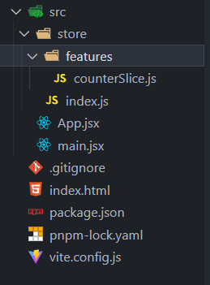
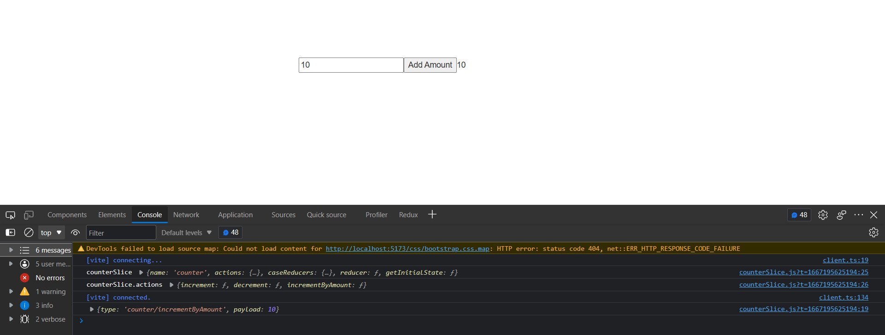
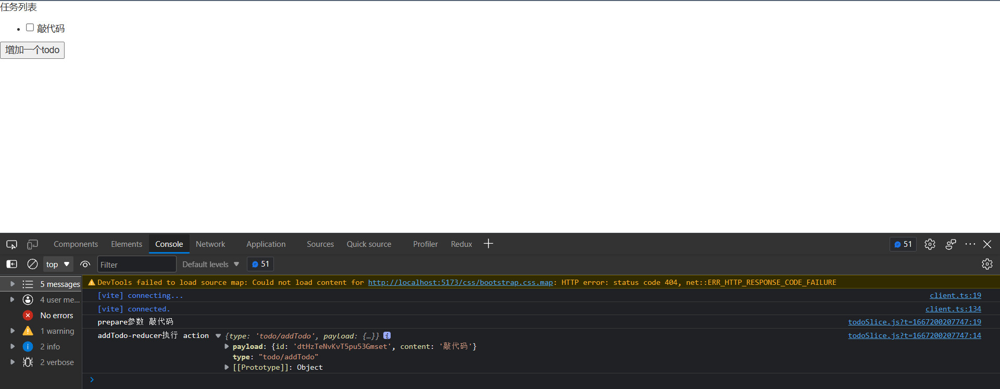
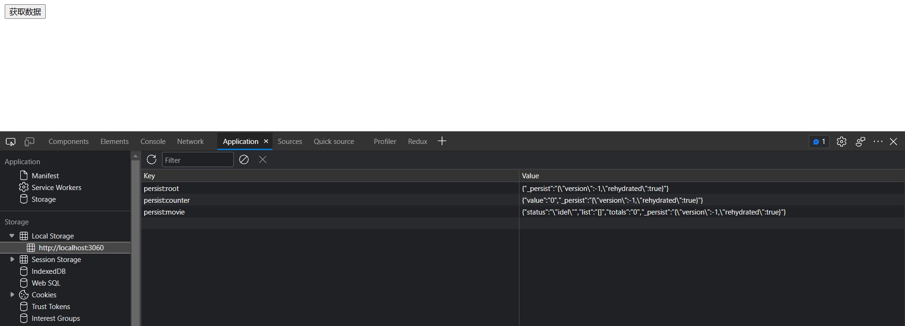

# 18 【Redux Toolkit】

上边的案例我们一直在使用Redux核心库来使用Redux，除了Redux核心库外Redux还为我们提供了一种使用Redux的方式——Redux Toolkit。它的名字起的非常直白，Redux工具包，简称RTK。RTK可以帮助我们处理使用Redux过程中的重复性工作，简化Redux中的各种操作。

## 1.Redux Toolkit 概览

### 1.1  Redux Toolkit 是什么？

**Redux Toolkit** 是官方推荐的编写 **Redux** 逻辑的方法。 它包含我们对于构建 **Redux** 应用程序必不可少的包和函数。 **Redux Toolkit** 的构建简化了大多数 **Redux** 任务，防止了常见错误，并使编写 **Redux** 应用程序变得更加容易。可以说 **Redux Toolkit** 就是目前 **Redux** 的最佳实践方式。

为了方便后面内容，之后 **Redux Toolkit** 简称 **RTK**

### 1.2 目的

Redux 核心库是故意设计成非定制化的样子（unopinionated）。怎么做完全取决于你，例如配置 store，你的 state 存什么东西，以及如何构建 reducer。

有些时候这样挺好，因为有很高的灵活性，但我们又不总是需要这么高的自由度。有时，我们只是想以最简单的方式上手，并想要一些良好的默认行为能够开箱即用。或者，也许你正在编写一个更大的应用程序并发现自己正在编写一些类似的代码，而你想减少必须手工编写的代码量。

**Redux Toolkit** 它最初是为了帮助解决有关 Redux 的三个常见问题而创建的：

- "配置 Redux store 过于复杂"
- "我必须添加很多软件包才能开始使用 Redux"
- "Redux 有太多样板代码"

### 1.3 为什么需要使用 Redux Toolkit

通过遵循我们推荐的最佳实践，提供良好的默认行为，捕获错误并让你编写更简单的代码，**React Toolkit** 使得编写好的 Redux 应用程序以及加快开发速度变得更加容易。 Redux Toolkit 对**所有 Redux 用户都有帮助**，无论技能水平或者经验如何。可以在新项目开始时添加它，也可以在现有项目中将其用作增量迁移的一部分。

### 1.4 文档链接

学习的最佳方法我个人觉得还是看官方文档比较权威： [中文官方文档](https://link.juejin.cn/?target=http%3A%2F%2Fcn.redux.js.org%2Fintroduction%2Fgetting-started)、[英文官方文档](https://link.juejin.cn/?target=https%3A%2F%2Fredux-toolkit.js.org%2F)。

- 简介
  - [快速开始](https://redux-toolkit.js.org/introduction/quick-start)
- 教程
  - [基础教程](https://redux-toolkit.js.org/tutorials/basic-tutorial)
  - [中级教程](https://redux-toolkit.js.org/tutorials/intermediate-tutorial)
  - [高级教程](https://redux-toolkit.js.org/tutorials/advanced-tutorial)
- 使用 Redux Toolkit
  - [入门](https://redux-toolkit.js.org/usage/usage-guide)
- API 文档
  - [`configureStore`](https://redux-toolkit.js.org/api/configureStore)
  - [`getDefaultMiddleware`](https://redux-toolkit.js.org/api/getDefaultMiddleware)
  - [`createReducer`](https://redux-toolkit.js.org/api/createReducer)
  - [`createAction`](https://redux-toolkit.js.org/api/createAction)
  - [`createSlice`](https://redux-toolkit.js.org/api/createSlice)
  - [`createSelector`](https://redux-toolkit.js.org/api/createSelector)
  - [其他 Export](https://redux-toolkit.js.org/api/other-exports)

## 2.安装

安装，无论是RTK还是Redux，在React中使用时react-redux都是必不可少，所以使用RTK依然需要安装两个包：react-redux和@reduxjs/toolkit。

npm

```bash
npm install react-redux @reduxjs/toolkit -S
```

yarn

```bash
yarn add react-redux @reduxjs/toolkit
```

在官方文档中其实提供了完整的 **RTK** 项目创建命令，但咱们学习就从基础的搭建开始吧。

## 3.基础开发流程

> 安装完相关包以后开始编写基本的 **RTK** 程序

- 创建一个store文件夹
- 创建一个index.ts做为主入口
- 创建一个festures文件夹用来装所有的store
- 创建一个counterSlice.js文件，并导出简单的加减方法

### 3.1 创建 Redux State Slice

创建 slice 需要一个字符串名称来标识切片、一个初始 state 以及一个或多个定义了该如何更新 state 的 reducer 函数。slice 创建后 ，我们可以导出 slice 中生成的 Redux action creators 和 reducer 函数。



`store/features/counterSlice.js`

```js
import { createSlice } from '@reduxjs/toolkit'

const initialState = {
  value: 0,
}

// 创建一个Slice
export const counterSlice = createSlice({
  name: 'counter',
  initialState,
  reducers: {
    // 定义一个加的方法
    increment: state => {
      state.value += 1
    },
    // 定义一个减的方法
    decrement: state => {
      state.value -= 1
    },
  },
})
console.log('counterSlice', counterSlice)
console.log('counterSlice.actions', counterSlice.actions)

// 导出加减方法
export const { increment, decrement } = counterSlice.actions

// 暴露reducer
export default counterSlice.reducer
```

createSlice是一个全自动的创建reducer切片的方法，在它的内部调用就是createAction和createReducer，之所以先介绍那两个也是这个原因。createSlice需要一个对象作为参数，对象中通过不同的属性来指定reducer的配置信息。

`createSlice(configuration object)`

配置对象中的属性：

- `name` —— reducer的名字，会作为action中type属性的前缀，不要重复

- `initialState` —— state的初始值

- `reducers` —— reducer的具体方法，需要一个对象作为参数，可以以方法的形式添加reducer，RTK会自动生成action对象。

总的来说，使用`createSlice`创建切片后，切片会自动根据配置对象生成action和reducer，action需要导出给调用处，调用处可以使用action作为dispatch的参数触发state的修改。reducer需要传递给configureStore以使其在仓库中生效。

我们可以看看`counterSlice`和`counterSlice.actions`是什么样子


### 3.2 将 Slice Reducers 添加到 Store 中

下一步，我们需要从计数切片中引入 reducer 函数，并将它添加到我们的 store 中。通过在 reducer 参数中定义一个字段，我们告诉 store 使用这个 slice reducer 函数来处理对该状态的所有更新。

我们以前直接用`redux`是这样的

```js
const reducer = combineReducers({
    counter:counterReducers
});

const store = createStore(reducer);
```

`store/index.js`

切片的reducer属性是切片根据我们传递的方法自动创建生成的reducer，需要将其作为reducer传递进configureStore的配置对象中以使其生效：

```js
import { configureStore } from '@reduxjs/toolkit'
import counterSlice from './features/counterSlice'

// configureStore创建一个redux数据
const store = configureStore({
  // 合并多个Slice
  reducer: {
    counter: counterSlice,
  },
})

export default store
```

- `configureStore`需要一个对象作为参数，在这个对象中可以通过不同的属性来对store进行设置，比如：reducer属性用来设置store中关联到的reducer，preloadedState用来指定state的初始值等，还有一些值我们会放到后边讲解。

- `reducer`属性可以直接传递一个reducer，也可以传递一个对象作为值。如果只传递一个reducer，则意味着store中只有一个reducer。若传递一个对象作为参数，对象的每个属性都可以执行一个reducer，在方法内部它会自动对这些reducer进行合并。

### 3.3 store加到全局

`main.js`

```jsx
import React from 'react'
import ReactDOM from 'react-dom/client'
import App from './App'

// redux toolkit
import { Provider } from 'react-redux'
import store from './store'

ReactDOM.createRoot(document.getElementById('root')).render(
  <Provider store={store}>
    <App />
  </Provider>,
)
```

### 3.4 在 React 组件中使用 Redux 状态和操作

现在我们可以使用 React-Redux 钩子让 React 组件与 Redux store 交互。我们可以使用 `useSelector` 从 store 中读取数据，使用 `useDispatch` dispatch actions。

`App.jsx`

```jsx
import React from 'react'
import { useDispatch, useSelector } from 'react-redux'
// 引入对应的方法
import { increment, decrement } from './store/features/counterSlice'

export default function App() {
  const count = useSelector(state => state.counter.value)
  const dispatch = useDispatch()

  return (
    <div style={{ width: 100, margin: '100px auto' }}>
      <button onClick={() => dispatch(increment())}>+</button>
      <span>{count}</span>
      <button onClick={() => dispatch(decrement())}>-</button>
    </div>
  )
}
```


现在，每当你点击”递增“和“递减”按钮。

- 会 dispatch 对应的 Redux action 到 store
- 在计数器切片对应的 reducer 中将看到 action 并更新其状态
- `<App>`组件将从 store 中看到新的状态，并使用新数据重新渲染组件

### 3.5 小总结

这是关于如何通过 React 设置和使用 Redux Toolkit 的简要概述。 回顾细节：

- 使用`configureStore`创建 Redux store

  - `configureStore` 接受 `reducer` 函数作为命名参数
  - `configureStore` 使用的好用的默认设置自动设置 store

- 为 React 应用程序组件提供 Redux store

  - 使用 React-Redux `<Provider>` 组件包裹你的 `<App />`
  - 传递 Redux store 如 `<Provider store={store}>`

- 使用 `createSlice` 创建 Redux "slice" reducer

  - 使用字符串名称、初始状态和命名的 reducer 函数调用“createSlice”

  - Reducer 函数可以使用 Immer 来“改变”状态
  - 导出生成的 slice reducer 和 action creators

- 在 React 组件中使用 React-Redux `useSelector/useDispatch` 钩子

  - 使用 `useSelector` 钩子从 store 中读取数据

  - 使用 `useDispatch` 钩子获取 `dispatch` 函数，并根据需要 dispatch actions

## 4.补充解析上面计数器案例

> 这个工具帮我们封装好了很多操作，虽然很方便，但是刚使用很多地方不是那么习惯。
>
> 每个文件的代码就不贴了，和上面一样的，可以复制到文本结合看

### 4.1 创建 Slice Reducer 和 Action

`store/features/counterSlice.js`

早些时候，我们看到单击视图中的不同按钮会 dispatch 三种不同类型的 Redux action：

- `{type: "counter/increment"}`
- `{type: "counter/decrement"}`
- `{type: "counter/incrementByAmount"}`

我们知道 action 是带有 `type` 字段的普通对象，`type` 字段总是一个字符串，并且我们通常有 action creator 函数来创建和返回 action 对象。那么在哪里定义 action 对象、类型字符串和 action creator 呢？

我们*可以*每次都手写。但是，那会很乏味。此外，Redux 中*真正*重要的是 reducer 函数，以及其中计算新状态的逻辑。

Redux Toolkit 有一个名为 `createSlice` 的函数，它负责生成 action 类型字符串、action creator 函数和 action 对象的工作。你所要做的就是为这个 slice 定义一个名称，编写一个包含 reducer 函数的对象，它会自动生成相应的 action 代码。`name` 选项的字符串用作每个 action 类型的第一部分，每个 reducer 函数的键名用作第二部分。因此，`"counter"` 名称 + `"increment"` reducer 函数生成了一个 action 类型 `{type: "counter/increment"}`。（毕竟，如果计算机可以为我们做，为什么要手写！）

除了 `name` 字段，`createSlice` 还需要我们为 reducer 传入初始状态值，以便在第一次调用时就有一个 `state`。在这种情况下，我们提供了一个对象，它有一个从 0 开始的 `value` 字段。

我们可以看到这里有三个 reducer 函数，它们对应于通过单击不同按钮 dispatch 的三种不同的 action 类型。

`createSlice` 会自动生成与我们编写的 reducer 函数同名的 action creator。我们可以通过调用其中一个来检查它并查看它返回的内容：

```js
console.log(counterSlice.actions.increment())
// {type: "counter/increment"}
```

它还生成知道如何响应所有这些 action 类型的 slice reducer 函数：

```js
const newState = counterSlice.reducer(
  { value: 10 },
  counterSlice.actions.increment()
)
console.log(newState)
// {value: 11}
```

### 4.2 Reducer 的规则

Reducer 必需符合以下规则：

- 仅使用 `state` 和 `action` 参数计算新的状态值
- 禁止直接修改 `state`。必须通过复制现有的 `state` 并对复制的值进行更改的方式来做 *不可变更新（immutable updates）*。
- 禁止任何异步逻辑、依赖随机值或导致其他“副作用”的代码

但为什么这些规则很重要？有几个不同的原因：

- Redux 的目标之一是使你的代码可预测。当函数的输出仅根据输入参数计算时，更容易理解该代码的工作原理并对其进行测试。
- 另一方面，如果一个函数依赖于自身之外的变量，或者行为随机，你永远不知道运行它时会发生什么。

“不可变更新（Immutable Updates）” 这个规则尤其重要，值得进一步讨论。

### 4.3 Reducer 与 Immutable 更新

前面讲过 “mutation”（更新已有对象/数组的值）与 “immutability”（认为值是不可以改变的）

在 Redux 中，***永远\* 不允许在 reducer 中更改 state 的原始对象！**

```js
// ❌ 非法 - 默认情况下，这将更改 state！
state.value = 123
```

不能在 Redux 中更改 state 有几个原因：

- 它会导致 bug，例如视图未正确更新以显示最新值
- 更难理解状态更新的原因和方式
- 编写测试变得更加困难
- 它违背了 Redux 的预期精神和使用模式

所以如果我们不能更改原件，我们如何返回更新的状态呢？

**Reducer 中必需要先创建原始值的副本，然后可以改变副本。**

```js
// ✅ 这样操作是安全的，因为创建了副本
return {
  ...state,
  value: 123
}
```

我们已经看到我们可以[手动编写 immutable 更新](https://cn.redux.js.org/tutorials/essentials/part-1-overview-concepts#immutability)。但是，手动编写不可变的更新逻辑确实繁琐，而且在 reducer 中意外改变状态是 Redux 用户最常犯的一个错误。

**这就是为什么 Redux Toolkit 的 `createSlice` 函数可以让你以更简单的方式编写不可变更新！**

`createSlice` 内部使用了一个名为 [Immer](https://immerjs.github.io/immer/) 的库。 Immer 使用一种称为 “Proxy” 的特殊 JS 工具来包装你提供的数据，当你尝试 ”mutate“ 这些数据的时候，奇迹发生了，**Immer 会跟踪你尝试进行的所有更改，然后使用该更改列表返回一个安全的、不可变的更新值**，就好像你手动编写了所有不可变的更新逻辑一样。

所以，下面的代码：

```js
function handwrittenReducer(state, action) {
  return {
    ...state,
    first: {
      ...state.first,
      second: {
        ...state.first.second,
        [action.someId]: {
          ...state.first.second[action.someId],
          fourth: action.someValue
        }
      }
    }
  }
}
```

可以变成这样：

```js
function reducerWithImmer(state, action) {
  state.first.second[action.someId].fourth = action.someValue
}
```

变得非常易读！

但，还有一些非常重要的规则要记住：

> ##### 警告
>
> **你只能在 Redux Toolkit 的 `createSlice` 和 `createReducer` 中编写 “mutation” 逻辑，因为它们在内部使用 Immer！如果你在没有 Immer 的 reducer 中编写 mutation 逻辑，它将改变状态并导致错误！**

## 5.传递参数

上面的项目中固定的加一减一，那如果我们想加多少就能动态加多少，那就需要传参。那如何传参呢？

### 5.1 定义接受参数

接收参数的方式和 **redux** 一样，我们可以通过 action 来接收参数，如下：

`store/features/counterSlice.js`

```js
import { createSlice } from '@reduxjs/toolkit'

// 创建一个Slice
export const counterSlice = createSlice({
  //  ...
  reducers: {
    incrementByAmount: (state, action) => {
      // action 里面有 type 和 payload 两个属性，所有的传参都在payload里面
      console.log(action)
      state.value += action.payload
    },
  },
})

// 导出加减方法
export const { increment, decrement, incrementByAmount } = counterSlice.actions

// 暴露reducer
export default counterSlice.reducer
```

`incrementByAmount`的`action`参数


### 5.2 传递参数

和 **redux** 的传参一样，如下：

```jsx
import React, { useState } from 'react'
import { useDispatch, useSelector } from 'react-redux'
// 引入对应的方法
import { incrementByAmount } from './store/features/counterSlice'

export default function App() {
  const count = useSelector(state => state.counter.value)
  const dispatch = useDispatch()
  const [amount, setAmount] = useState(1)

  return (
    <div style={{ width: 500, margin: '100px auto' }}>
      <input type="text" value={amount} onChange={e => setAmount(e.target.value)} />
      <button onClick={() => dispatch(incrementByAmount(Number(amount) || 0))}> Add Amount </button>
      <span>{count}</span>
    </div>
  )
}
```



注意这里reducer的action中如果要传入参数，只能是一个payload，如果是多个参数的情况，那就需要封装成一个payload的对象。

### 5.3 Action Payloads

以一个常见的todo案例来讲解

`store/features/todoSlice.js`

```js
import { createSlice, nanoid } from '@reduxjs/toolkit'

const initialState = {
  todoList: [],
}

// 创建一个Slice
export const todoSlice = createSlice({
  name: 'todo',
  initialState,
  reducers: {
    addTodo: (state, action) => {}
    },
  },
})

// 导出加减方法
export const { addTodo } = todoSlice.actions

// 暴露reducer
export default todoSlice.reducer
```

`store/index.js`

```js
import { configureStore } from '@reduxjs/toolkit'
import counterSlice from './features/counterSlice'
import todoSlice from './features/todoSlice'

// configureStore创建一个redux数据
const store = configureStore({
  // 合并多个Slice
  reducer: {
    counter: counterSlice,
    todo: todoSlice,
  },
})

export default store
```

`Todo.jsx`

```jsx
import React from 'react'
import { useDispatch, useSelector } from 'react-redux'
// 引入对应的方法
import { addTodo } from '../store/features/todoSlice'

export default function Todo() {
  const todoList = useSelector(state => state.todo.todoList)

  const dispatch = useDispatch()

  return (
    <div>
      <p>任务列表</p>
      <ul>
        {todoList.map(todo => (
          <li key={todo.id}>
            <input type="checkbox" defaultChecked={todo.completed} /> {todo.content}
          </li>
        ))}
      </ul>
      <button onClick={() => dispatch(addTodo('敲代码'))}>增加一个todo</button>
    </div>
  )
}
```

我们刚刚看到 `createSlice` 中的 action creator 通常期望一个参数，它变成了 `action.payload`。这简化了最常见的使用模式，但有时我们需要做更多的工作来准备 action 对象的内容。 在我们的 `postAdded` 操作的情况下，我们需要为新todo生成一个唯一的 ID，我们还需要确保有效 payload 是一个看起来像 `{id, content, completed}` 的对象。

现在，我们正在 React 组件中生成 ID 并创建有效 payload 对象，并将有效 payload 对象传递给 `addTodo`。 但是，如果我们需要从不同的组件 dispatch 相同的 action，或者准备 payload 的逻辑很复杂怎么办？ 每次我们想要 dispatch action 时，我们都必须复制该逻辑，并且我们强制组件确切地知道此 action 的有效 payload 应该是什么样子。

> ##### 注意
>
> 如果 action 需要包含唯一 ID 或其他一些随机值，请始终先生成该随机值并将其放入 action 对象中。 **Reducer 中永远不应该计算随机值**，因为这会使结果不可预测。

幸运的是，`createSlice` 允许我们在编写 reducer 时定义一个 `prepare` 函数。 `prepare` 函数可以接受多个参数，生成诸如唯一 ID 之类的随机值，并运行需要的任何其他同步逻辑来决定哪些值进入 action 对象。然后它应该返回一个包含 `payload` 字段的对象。（返回对象还可能包含一个 `meta` 字段，可用于向 action 添加额外的描述性值，以及一个 `error` 字段，该字段应该是一个布尔值，指示此 action 是否表示某种错误。）

 rtk还提供了一个nanoid方法，用于生成一个固定长度的随机字符串，类似uuid功能。

可以打印`dispatch(addTodo(’敲代码‘))`的结果看到，返回了一个带有payload字段的action

```js
import { createSlice, nanoid } from '@reduxjs/toolkit'

// 创建一个Slice
export const todoSlice = createSlice({
  name: 'todo',
  initialState,
  reducers: {
    addTodo: {
      // 这个函数就是我们平时直接写在这的函数（ addTodo: (state, action) => {}）
      reducer(state, aciton) {
        console.log('addTodo-reducer执行')
        const { id, content } = aciton.payload
        state.todoList.push({ id, content, completed: false })
      },
       // 预处理函数，返回值就是reducer函数接收的pyload值, 必须返回一个带有payload字段的对象
      prepare(content) {
        console.log('prepare参数', content)
        return {
          payload: {
            id: nanoid(),
            content,
          },
        }
      },
    },
  },
})
```




## 6.异步逻辑与数据请求

### 6.1 Thunks 与异步逻辑

就其本身而言，Redux store 对异步逻辑一无所知。它只知道如何同步 dispatch action，通过调用 root reducer 函数更新状态，并通知 UI 某些事情发生了变化。任何异步都必须发生在 store 之外。

但是，如果你希望通过调度或检查当前 store 状态来使异步逻辑与 store 交互，该怎么办？ 这就是 [Redux middleware](https://cn.redux.js.org/tutorials/fundamentals/part-4-store#middleware) 的用武之地。它们扩展了 store，并允许你：

- dispatch action 时执行额外的逻辑（例如打印 action 的日志和状态）
- 暂停、修改、延迟、替换或停止 dispatch 的 action
- 编写可以访问 `dispatch` 和 `getState` 的额外代码
- 教 `dispatch` 如何接受除普通 action 对象之外的其他值，例如函数和 promise，通过拦截它们并 dispatch 实际 action 对象来代替

Redux 有多种异步 middleware，每一种都允许你使用不同的语法编写逻辑。最常见的异步 middleware 是 [`redux-thunk`](https://github.com/reduxjs/redux-thunk)，它可以让你编写可能直接包含异步逻辑的普通函数。Redux Toolkit 的 `configureStore` 功能[默认自动设置 thunk middleware](https://redux-toolkit.js.org/api/getDefaultMiddleware#included-default-middleware)，[我们推荐使用 thunk 作为 Redux 开发异步逻辑的标准方式](https://cn.redux.js.org/style-guide/#use-thunks-for-async-logic)。

### 6.2 Thunk 函数

`thunk`最重要的思想，就是可以接受一个返回函数的`action creator`。如果这个`action creator` 返回的是一个函数，就执行它，如果不是，就按照原来的`action`执行。

正因为这个action creator可以返回一个函数，那么就可以在这个函数中执行一些异步的操作。

Thunks 通常还可以使用 action creator 再次 dispatch 普通的 action，比如 `dispatch(increment())`

为了与 dispatch 普通 action 对象保持一致，我们通常将它们写为 *thunk action creators*，它返回 thunk 函数。这些 action creator 可以接受可以在 thunk 中使用的参数。

```js
const incrementAsync = amount => {
  return (dispatch, getState) => {
    setTimeout(() => {
      dispatch(incrementByAmount(amount))
    }, 1000)
  }
}
```

incrementAsync函数就返回了一个函数，将dispatch作为函数的第一个参数传递进去，在函数内进行异步操作就可以了。

Thunk 通常写在 “slice” 文件中。`createSlice` 本身对定义 thunk 没有任何特殊支持，因此你应该将它们作为单独的函数编写在同一个 slice 文件中。这样，他们就可以访问该 slice 的普通 action creator，并且很容易找到 thunk 的位置。

### 6.3 改写之前的计数器案例

增加一个延时器

`store/features/counterSlice.js`

```js
import { createSlice } from '@reduxjs/toolkit'

const initialState = {
  value: 0,
}

// 创建一个Slice
export const counterSlice = createSlice({
  name: 'counter',
  initialState,
  reducers: {
    incrementByAmount: (state, action) => {
      // action 里面有 type 和 payload 两个属性，所有的传参都在payload里面
      state.value += action.payload
    },
  },
})

const {incrementByAmount } = counterSlice.actions

export const incrementAsync = amount => {
  return (dispatch, getState) => {
      
    const stateBefore = getState()
    console.log('Counter before:', stateBefore.counter)
      
    setTimeout(() => {
      dispatch(incrementByAmount(amount))
      const stateAfter = getState()
      console.log('Counter after:', stateAfter.counter)
    }, 1000)
  }
}

// 暴露reducer
export default counterSlice.reducer
```

``App.jsx`

```jsx
import React, { useState } from 'react'
import { useDispatch, useSelector } from 'react-redux'
// 引入对应的方法
import { incrementAsync } from './store/features/counterSlice'

export default function App() {
  const count = useSelector(state => state.counter.value)
  const dispatch = useDispatch()
  const [amount, setAmount] = useState(1)

  return (
    <div style={{ width: 500, margin: '100px auto' }}>
      <input type="text" value={amount} onChange={e => setAmount(e.target.value)} />
      <button onClick={() => dispatch(incrementAsync(Number(amount) || 0))}> Add Async </button>
      <span>{count}</span>
    </div>
  )
}
```


### 6.4 编写异步 Thunks

Thunk 内部可能有异步逻辑，例如 `setTimeout`、`Promise` 和 `async/await`。这使它们成为使用 AJAX 发起 API 请求的好地方。

Redux 的数据请求逻辑通常遵循以下可预测的模式：

- 在请求之前 dispatch 请求“开始”的 action，以指示请求正在进行中。这可用于跟踪加载状态以允许跳过重复请求或在 UI 中显示加载中提示。
- 发出异步请求
- 根据请求结果，异步逻辑 dispatch 包含结果数据的“成功” action 或包含错误详细信息的 “失败” action。在这两种情况下，reducer 逻辑都会清除加载状态，并且要么展示成功案例的结果数据，要么保存错误值并在需要的地方展示。

这些步骤不是 *必需的*，而是常用的。（如果你只关心一个成功的结果，你可以在请求完成时发送一个“成功” action ，并跳过“开始”和“失败” action 。）

Redux Toolkit 提供了一个 `createAsyncThunk` API 来实现这些 action 的创建和 dispatch，我们很快就会看看如何使用它。

如果我们手动编写一个典型的 async thunk 的代码，它可能看起来像这样：

```js
const getRepoDetailsStarted = () => ({
  type: 'repoDetails/fetchStarted'
})
const getRepoDetailsSuccess = repoDetails => ({
  type: 'repoDetails/fetchSucceeded',
  payload: repoDetails
})
const getRepoDetailsFailed = error => ({
  type: 'repoDetails/fetchFailed',
  error
})
const fetchIssuesCount = (org, repo) => async dispatch => {
  dispatch(getRepoDetailsStarted())
  try {
    const repoDetails = await getRepoDetails(org, repo)
    dispatch(getRepoDetailsSuccess(repoDetails))
  } catch (err) {
    dispatch(getRepoDetailsFailed(err.toString()))
  }
}
```

但是，使用这种方法编写代码很乏味。每个单独的请求类型都需要重复类似的实现：

- 需要为三种不同的情况定义独特的 action 类型
- 每种 action 类型通常都有相应的 action creator 功能
- 必须编写一个 thunk 以正确的顺序发送正确的 action

`createAsyncThunk` 实现了这套模式：通过生成 action type 和 action creator 并生成一个自动 dispatch 这些 action 的 thunk。你提供一个回调函数来进行异步调用，并把结果数据返回成 Promise。

### 6.5 使用 createAsyncThunk 请求数据

Redux Toolkit 的 `createAsyncThunk` API 生成 thunk，为你自动 dispatch 那些 "start/success/failure" action。

让我们从添加一个 thunk 开始，该 thunk 将进行 AJAX 调用。

`store/features/counterSlice.js`

```jsx
import { createSlice, createAsyncThunk } from '@reduxjs/toolkit'

// 请求电影列表
const reqMovieListApi = () =>
  fetch(
    'https://pcw-api.iqiyi.com/search/recommend/list?channel_id=1&data_type=1&mode=24&page_id=1&ret_num=48',
  ).then(res => res.json())

const initialState = {
  status: 'idel',
  list: [],
  totals: 0,
}

// thunk函数允许执行异步逻辑, 通常用于发出异步请求。
// createAsyncThunk 创建一个异步action，方法触发的时候会有三种状态：
// pending（进行中）、fulfilled（成功）、rejected（失败）
export const getMovieData = createAsyncThunk('movie/getMovie', async () => {
  const res = await reqMovieListApi()
  return res.data
})
```

`createAsyncThunk` 接收 2 个参数:

- 将用作生成的 action 类型的前缀的字符串
- 一个 “payload creator” 回调函数，它应该返回一个包含一些数据的 `Promise`，或者一个被拒绝的带有错误的 `Promise`

Payload creator 通常会进行某种 AJAX 调用，并且可以直接从 AJAX 调用返回 `Promise`，或者从 API 响应中提取一些数据并返回。我们通常使用 JS `async/await` 语法来编写它，这让我们可以编写使用 `Promise` 的函数，同时使用标准的 `try/catch` 逻辑而不是 `somePromise.then()` 链式调用。

在这种情况下，我们传入 `'movie/getMovie'` 作为 action 类型的前缀。我们的 payload 创建回调等待 API 调用返回响应。响应对象的格式为 `{data: []}`，我们希望我们 dispatch 的 Redux action 有一个 payload，也就是电影列表的数组。所以，我们提取 `response.data`，并从回调中返回它。

当调用 `dispatch(getMovieData())` 的时候，`getMovieData` 这个 thunk 会首先 dispatch 一个 action 类型为`'movie/getMovie/pending'`：


我们可以在我们的 reducer 中监听这个 action 并将请求状态标记为 “loading 正在加载”。

一旦 `Promise` 成功，`getMovieData` thunk 会接受我们从回调中返回的 `response.data` ，并 dispatch 一个 action，action 的 payload 为 接口返回的数据（`response.data` ），action 的 类型为 `'movie/getMovie/fulfilled'`。


### 6.6 使用 extraReducers

有时 slice 的 reducer 需要响应 *没有* 定义到该 slice 的 `reducers` 字段中的 action。这个时候就需要使用 slice 中的 `extraReducers` 字段。

`extraReducers` 选项是一个接收名为 `builder` 的参数的函数。`builder` 对象提供了一些方法，让我们可以定义额外的 case reducer，这些 reducer 将响应在 slice 之外定义的 action。我们将使用 `builder.addCase(actionCreator, reducer)` 来处理异步 thunk dispatch 的每个 action。

在这个例子中，我们需要监听我们 `getMovieData` thunk dispatch 的 "pending" 和 "fulfilled" action 类型。这些 action creator 附加到我们实际的 `getMovieData` 函数中，我们可以将它们传递给 `extraReducers` 来监听这些 action：

```js
const initialState = {
  status: 'idel',
  list: [],
  totals: 0,
}

export const getMovieData = createAsyncThunk('movie/getMovie', async () => {
  const res = await reqMovieListApi()
  return res.data
})

// 创建一个 Slice
export const movieSlice = createSlice({
  name: 'movie',
  initialState,
  // extraReducers 字段让 slice 处理在别处定义的 actions，
  // 包括由 createAsyncThunk 或其他slice生成的actions。
  extraReducers(builder) {
    builder
      .addCase(getMovieData.pending, state => {
        console.log('🚀 ~ 进行中！')
        state.status = 'pending'
      })
      .addCase(getMovieData.fulfilled, (state, action) => {
        console.log('🚀 ~ fulfilled', action.payload)
        state.status = 'pending'
        state.list = state.list.concat(action.payload.list)
        state.totals = action.payload.list.length
      })
      .addCase(getMovieData.rejected, (state, action) => {
        console.log('🚀 ~ rejected', action)
        state.status = 'pending'
        state.error = action.error.message
      })
  },
})

// 默认导出
export default movieSlice.reducer
```

我们将根据返回的 `Promise` 处理可以由 thunk dispatch 的三种 action 类型：

- 当请求开始时，我们将 `status` 枚举设置为 `'pending'`
- 如果请求成功，我们将 `status` 标记为 `'pending'`，并将获取的电影列表添加到 `state.list`
- 如果请求失败，我们会将 `status` 标记为 `'pending'`，并将任何错误消息保存到状态中以便我们可以显示它

### 6.7 完善案例

`store/index.js`

```js
import { configureStore } from '@reduxjs/toolkit'
import counterSlice from './features/counterSlice'
import movieSlice from './features/movieSlice'

// configureStore创建一个redux数据
const store = configureStore({
  // 合并多个Slice
  reducer: {
    counter: counterSlice,
    movie: movieSlice,
  },
})

export default store
```

`Movie.jsx`

```jsx
// 引入相关的hooks
import { useSelector, useDispatch } from 'react-redux'
// 引入对应的方法
import { getMovieData } from '../store/features/movieSlice'
function Movie() {
  // 通过useSelector直接拿到store中定义的list
  const movieList = useSelector(store => store.movie.list)
  // 通过useDispatch 派发事件
  const dispatch = useDispatch()

  return (
    <div>
      <button
        onClick={() => {
          dispatch(getMovieData())
        }}
      >
        获取数据
      </button>
      <ul>
        {movieList.map(movie => {
          return <li key={movie.tvId}> {movie.name}</li>
        })}
      </ul>
    </div>
  )
}

export default Movie
```


`createAsyncThunk `可以写在任何一个slice的`extraReducers`中，它接收2个参数，

- 生成`action`的`type`值，这里type是要自己定义，不像是`createSlice`自动生成`type`，这就要注意避免命名冲突问题了(如果`createSlice`定义了相当的`name`和方法，也是会冲突的)
- 包含数据处理的`promise`，首先会`dispatch`一个`action`类型为`movie/getMovie/pending`，当异步请求完成后，根据结果成功或是失败，决定dispatch出action的类型为`movie/getMovie/fulfilled`或`movie/getMovie/rejected`，这三个`action`可以在`slice`的`extraReducers`中进行处理。这个`promise`也只接收2个参数，分别是`payload`和包含了`dispatch`、`getState`的`thunkAPI`对象，所以除了在`slice`的`extraReducers`中处理之外，`createAsyncThunk`中也可以调用任意的action，这样就很像原本thunk的写法了，并不推荐

## 7.数据持久化

### 7.1 概念

一般是指页面刷新后，数据仍然能够保持原来的状态。

一般在前端当中，数据持久化，可以通过将数据存储到localstorage或Cookie中存起来，用到的时

候直接从本地存储中获取数据。而redux-persist是把redux中的数据在localstorage中存起来，起到持久化的效果。

### 7.2 使用

```bash
npm i redux-persist --save
```

`store/index.js`

```js
import { configureStore, combineReducers } from '@reduxjs/toolkit'
// --- 新增 ---
import {
  persistStore,
  persistReducer,
  FLUSH,
  REHYDRATE,
  PAUSE,
  PERSIST,
  PURGE,
  REGISTER,
} from 'redux-persist'
import storage from 'redux-persist/lib/storage'
// --- 新增 ---
import counterSlice from './features/counterSlice'
import movieSlice from './features/movieSlice'

// --- 新增 ---
const persistConfig = {
  key: 'root',
  storage,
  // 指定哪些reducer数据持久化
  whitelist: ['movie'],
}

const persistedReducer = persistReducer(
  persistConfig,
  combineReducers({
    counter: counterSlice,
    movie: movieSlice,
  }),
)
// --- 新增 ---

// 这里照着我这样配中间件就行，getDefaultMiddleware不要直接导入了，已经内置了
export const store = configureStore({
  reducer: persistedReducer,
  middleware: getDefaultMiddleware =>
    getDefaultMiddleware({
      serializableCheck: {
        ignoredActions: [FLUSH, REHYDRATE, PAUSE, PERSIST, PURGE, REGISTER],
      },
    }),
})

export const persistor = persistStore(store)
```

`main.js`

```jsx
import React from 'react'
import ReactDOM from 'react-dom/client'
import App from './App'
import Movie from './components/Movie'
import { Provider } from 'react-redux'

import { PersistGate } from 'redux-persist/integration/react'
import { store, persistor } from './store'

ReactDOM.createRoot(document.getElementById('root')).render(
  <Provider store={store}>
    <PersistGate loading={null} persistor={persistor}>
      <Movie />
    </PersistGate>
  </Provider>,
)
```

然后就可以直接使用了。

最终效果：


### 7.3 让每一个仓库单独存储

> 以前使用过`pinia-plugin-persist`，我觉得这个`pinia`这个插件使用比`redux-persist`方便
>
> 这里的方法是我自己想出来的，不知道对不对

`store/index.js`

```js
import { configureStore, combineReducers } from '@reduxjs/toolkit'
import {
  persistStore,
  persistReducer,
  FLUSH,
  REHYDRATE,
  PAUSE,
  PERSIST,
  PURGE,
  REGISTER,
} from 'redux-persist'
import storage from 'redux-persist/lib/storage'
import counterSlice from './features/counterSlice'
import movieSlice from './features/movieSlice'

const rootPersistConfig = {
  key: 'root',
  storage,
  whitelist: [],
}

const moviePersistConfig = {
  key: 'movie',
  storage,
}

const counterPersistConfig = {
  key: 'counter',
  storage,
}

const persistedReducer = persistReducer(
  rootPersistConfig,
  combineReducers({
    counter: persistReducer(counterPersistConfig, counterSlice),
    movie: persistReducer(moviePersistConfig, movieSlice),
  }),
)

// configureStore创建一个redux数据
export const store = configureStore({
  // 合并多个Slice
  reducer: persistedReducer,
  middleware: getDefaultMiddleware =>
    getDefaultMiddleware({
      serializableCheck: {
        ignoredActions: [FLUSH, REHYDRATE, PAUSE, PERSIST, PURGE, REGISTER],
      },
    }),
})
export const persistor = persistStore(store)
```

效果：



