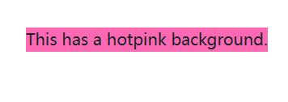
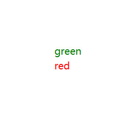
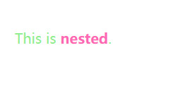
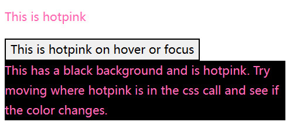
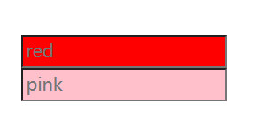
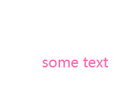

# 22 【在react中使用Emotion】

## 1.CSS in JS 的优点

[CSS in JS](https://link.juejin.cn?target=https%3A%2F%2Fgithub.com%2FMicheleBertoli%2Fcss-in-js) 已逐渐发展为 React 应用中写样式的一个主流的方案，著名组件库 [material-ui](https://link.juejin.cn?target=https%3A%2F%2Fgithub.com%2Fmui-org%2Fmaterial-ui) 也已经使用 CSS in JS 来实现。 CSS in JS 的实现方式有两种: 唯一CSS选择器和内联样式。因此

1. 不用关心繁琐的 Class 命名规则
2. 不用担心样式被覆盖
3. 便利的样式复用（样式都是 js 对象或字符串）
4. 减少冗余的 CSS 代码，极致的样式按需加载

[Emotion](https://link.juejin.cn?target=https%3A%2F%2Femotion.sh%2Fdocs%2Fintroduction) 是 CSS in JS 的众多实现方案中的其中一个，下面介绍一下它的使用。

*说明：以下的介绍都来自于[Emotion官方文档](https://link.juejin.cn?target=https%3A%2F%2Femotion.sh%2Fdocs%2Fintroduction)*

**安装**

```shell
 npm i @emotion/styled @emotion/react
```

**使用**

[Emotion](https://link.juejin.cn/?target=https%3A%2F%2Femotion.sh%2Fdocs%2Fintroduction) 有两种写 CSS 的方式：[css-prop](https://link.juejin.cn/?target=https%3A%2F%2Femotion.sh%2Fdocs%2Fcss-prop) 和 [Styled Components](https://link.juejin.cn/?target=https%3A%2F%2Femotion.sh%2Fdocs%2Fstyled)。

## 2.Css Prop

 添加预设或将杂注设置为注释后，`React.createElement`编译后的 jsx 代码将使用` emotion` 的函数而不是` .jsx`

### 2.1 Babel Preset

此方法**不适用于**[创建 React App](https://github.com/facebook/create-react-app) 或其他不允许自定义 Babel 配置的项目。 请改用 [JSX 注释方法](https://emotion.sh/docs/css-prop#jsx-pragma)。

`.babelrc`

```json
{
  "presets": ["@emotion/babel-preset-css-prop"]
}
```

> [完整的`@emotion/babel-preset-css-prop` 文档](https://emotion.sh/docs/@emotion/babel-preset-css-prop)

> If you are using the compatible React version (`>=16.14.0`) then you can opt into using [the new JSX runtimes](https://link.juejin.cn?target=https%3A%2F%2Freactjs.org%2Fblog%2F2020%2F09%2F22%2Fintroducing-the-new-jsx-transform.html) by using such configuration:
>
> 如果 React 版本 `>=16.14.0` , 可以使用如下的配置来使用新的 jsx 运行时。

```json
{
  "presets": [
    [
      "@babel/preset-react",
      { "runtime": "automatic", "importSource": "@emotion/react" }
    ]
  ],
  "plugins": ["@emotion/babel-plugin"]
}
```

### 2.2 JSX 注释

将` jsx 注释`设置在使用道具的源文件的顶部。 此选项最适合测试 prop 功能或在 babel 配置不可配置的项目（create-react-app、codesandbox 等）中。

```jsx
/** @jsx jsx */
import { jsx } from '@emotion/react'
```

`/** @jsx jsx */` 不生效的时候可以改为 `/** @jsxImportSource @emotion/react */` 来尝试。

### 2.3 tsconfig.json

这里指的是使用 [babel 编译 typescript](https://link.juejin.cn?target=https%3A%2F%2Fbabeljs.io%2Fdocs%2Fen%2Fbabel-preset-typescript) 时的配置

```JSON
{
  "compilerOptions": {
    ...
    // "jsx": "react",
    "jsxImportSource": "@emotion/react",
    ...
  }
}
```

### 2.4 Object Styles 和 String Styles

Emotion 支持 **js 对象**和 **js 字符串**两种形式的样式定义。

**Object Styles**

```jsx
/** @jsx jsx */
import { jsx } from '@emotion/react'

render(
  <div
    css={{
      backgroundColor: 'hotpink',
      '&:hover': {
        color: 'lightgreen'
      }
    }}
  >
    This has a hotpink background.
  </div>
)
```



> [Object Style Documentation](https://emotion.sh/docs/object-styles)

**String Styles**

要传递字符串样式，您必须使用 `@emotion/react`导出的`css` ，它可以用作[标记模板文字](https://developer.mozilla.org/en-US/docs/Web/JavaScript/Reference/Template_literals)，如下所示。

```jsx
// this comment tells babel to convert jsx to calls to a function called jsx instead of React.createElement
/** @jsx jsx */
import { css, jsx } from '@emotion/react'

const color = 'darkgreen'

render(
  <div
    css={css`
      background-color: hotpink;
      &:hover {
        color: ${color};
      }
    `}
  >
    This has a hotpink background.
  </div>
)
```


无论是**Object Styles**还是**String Styles**，我们都可以直接在定义样式的时候读取上下文的 js 变量，这个可以让我们很方便地更改样式。

## 3.Styled Components

**Styled Components 基础用法** Styled Components 导出了一些带有 html 标签的内置组件。

### 3.1 写一个带样式的组件

`styled`和`css`非常相似，除了你用 html 标签或 React 组件调用它，然后用字符串样式的模板文字或对象样式的常规函数调用来调用它。

语法：styled.元素名`样式`

```jsx
import styled from '@emotion/styled'
const Button = styled.button`
  color: turquoise;
`
render(<Button>This my button component.</Button>)
```


### 3.2 通过参数控制样式

**Styled Components 的 Props** Styled Components 生成的组件也可以根据传入的 Props 来更改样式

```jsx
import styled from '@emotion/styled'

const Button = styled.button`
  color: ${props => (props.primary ? 'hotpink' : 'turquoise')};
`

const Container = styled.div(props => ({
  display: 'flex',
  flexDirection: props.column && 'column'
}))

render(
  <Container column>
    <Button>This is a regular button.</Button>
    <Button primary>This is a primary button.</Button>
  </Container>
)
```


### 3.3 通过传className创建组件

语法：

```jsx
styled( ({className}) => (<p className={className}>text</
p>) )`样式`
```

 分析：相当于把样式通过className传递给了元素

```jsx
import styled from '@emotion/styled'
const Basic = ({ className }) => (
  <div className={className}>Some text</div>
)
const Fancy = styled(Basic)`
  color: hotpink;
`
render(<Fancy />)
```


### 3.4 创建与某个组件相同的样式

有时您想使用一个组件创建一些样式，然后再次将这些样式用于另一个组件，该方法可用于此目的。

语法：`样式组件.withComponent('元素')`

```jsx
import styled from '@emotion/styled'
const Section = styled.section`
  background: #333;
  color: #fff;
`
// Aside样式跟Section样式相同
const Aside = Section.withComponent('aside')
render(
  <div>
    <Section>This is a section</Section>
    <Aside>This is an aside</Aside>
  </div>
)
```


### 3.5 嵌套写法 

#### 3.5.1 ${子组件}

与[styled-components](https://www.styled-components.com/docs/faqs#can-i-refer-to-other-components)类似，当使用[@emotion/babel-plugin](https://emotion.sh/docs/@emotion/babel-plugin)时，`emotion`允许`emotion components`像常规CSS选择器一样被嵌套。

语法：父组件 = styled.元素`${子组件} {样式}`

```jsx
import styled from '@emotion/styled'

const Child = styled.div`
  color: red;
`

const Parent = styled.div`
  ${Child} {
    color: green;
  }
`

render(
  <div>
    <Parent>
      <Child>Green because I am inside a Parent</Child>
    </Parent>
    <Child>Red because I am not inside a Parent</Child>
  </div>
)
```


#### 3.5.2 对象(键值对)

组件选择器也可以与对象样式一起使用

语法:

```jsx
父组件 = styled.元素(
    {
      [子组件]: {样式}
    }
)
```

```jsx
import styled from '@emotion/styled'

const Child = styled.div({
  color: 'red'
})

const Parent = styled.div({
  [Child]: {
    color: 'green'
  }
})

render(
  <div>
    <Parent>
      <Child>green</Child>
    </Parent>
    <Child>red</Child>
  </div>
)
```



### 3.6 对象样式

```jsx
import styled from '@emotion/styled'
const H1 = styled.h1(
  {
    fontSize: 20
  },
  props => ({ color: props.color,  width:props.width })
)
render(<H1 color="lightgreen" width="200px">This is lightgreen.</H1>)
```


### 3.7 自定义 prop 转发

默认情况下，Emotion 会将所有 props（`theme`除外）传递给自定义组件，并且仅传递作为字符串标签的有效 html 属性的 prop。可以通过传递自定义函数来自定义此设置。您还可以使用`shouldForwardProp`来过滤掉无效的 html 属性。

```jsx
import isPropValid from '@emotion/is-prop-valid'
import styled from '@emotion/styled'

const H1 = styled('h1', {
  shouldForwardProp: prop => isPropValid(prop) && prop !== 'color'
})(props => ({
  color: props.color
}))

render(<H1 color="lightgreen">This is lightgreen.</H1>)
```


### 3.8 动态样式

您可以创建基于 props 的动态样式，并在样式中使用它们。

```jsx
import styled from '@emotion/styled'
import { css } from '@emotion/react'

const dynamicStyle = props =>
  css`
    color: ${props.color};
  `

const Container = styled.div`
  ${dynamicStyle};
`
render(<Container color="lightgreen">This is lightgreen.</Container>)
```


### 3.9 as prop 

要使用样式化组件中的样式但要更改呈现的元素，可以使用as prop。

```jsx
import styled from '@emotion/styled'

const Button = styled.button`
  color: hotpink;
`

render(
  <Button as="a" href="https://github.com/emotion-js/emotion">
    Emotion on GitHub
  </Button>
)
```


### 3.10 嵌套元素样式写法

我们可以使用以下方法嵌套选择器：`&`

```jsx
import styled from '@emotion/styled'
const Example = styled('span')`
  color: lightgreen;
  & > a {
    color: hotpink;
  }
`
render(
  <Example>
    This is <a>nested</a>.
  </Example>
)
```



## 4.Composition

组合是`emotion`中最强大、最有用的模式之一。您可以通过在另一个样式块中插入从`css`返回的值来组合样式。

### 4.1 样式复用

在 Emotion 中，我们可以把通用样式用变量声明，然后在不同的组件中共享。

```jsx
import { css } from '@emotion/react'

const base = css`
  color: hotpink;
`

render(
  <div
    css={css`
      ${base};
      background-color: #eee;
    `}
  >
    This is hotpink.
  </div>
)
```

上面的 `base` 样式在 render 时被使用。如果我们有其它的组件用到 base 样式，我们也可以导入 base 这个变量来使用。

### 4.2 样式优先级

```jsx
import { css } from '@emotion/react'

const danger = css`
  color: red;
`

const base = css`
  background-color: darkgreen;
  color: turquoise;
`

render(
  <div>
    <div css={base}>This will be turquoise</div>
    <div css={[danger, base]}>
      This will be also be turquoise since the base styles overwrite the danger
      styles.
    </div>
    <div css={[base, danger]}>This will be red</div>
  </div>
)
```


写样式的时候难免会需要覆盖样式的情况，这时候我们可以像上面一样调整 `base` 和 `danger` 的先后顺序来覆盖（后面的样式优先级较高）。

## 5.Object Styles

带对象的写作风格是一种直接构建在`emotion`核心的强大模式。您可以使用`camelCase`来编写css属性，而不是像普通css那样使用`kebab-case`大小写，例如背景色将是backgroundColor。对象样式对于css属性特别有用，因为您不需要像字符串样式那样的css调用，但是对象样式也可以与样式一起使用。

### 5.1 使用 css props

```jsx
render(
  <div
    css={{
      color: 'darkorchid',
      backgroundColor: 'lightgray'
    }}
  >
    This is darkorchid.
  </div>
)
```


### 5.2 使用`styled`

```jsx
import styled from '@emotion/styled'

const Button = styled.button(
  {
    color: 'darkorchid'
  },
  props => ({
    fontSize: props.fontSize
  })
)

render(<Button fontSize={16}>This is a darkorchid button.</Button>)
```


### 5.3 子选择器

```jsx
render(
  <div
    css={{
      color: 'darkorchid',
      '& .name': {
        color: 'orange'
      }
    }}
  >
    This is darkorchid.
    <div className="name">This is orange</div>
  </div>
)
```


### 5.4 媒体查询

```jsx
render(
  <div
    css={{
      color: 'darkorchid',
      '@media(min-width: 420px)': {
        color: 'orange'
      }
    }}
  >
    This is orange on a big screen and darkorchid on a small screen.
  </div>
)
```


### 5.5 Numbers

```jsx
render(
  <div
    css={{
      padding: 8,
      zIndex: 200
    }}
  >
    This has 8px of padding and a z-index of 200.
  </div>
)
```


### 5.6 Arrays

嵌套数组被展平

```jsx
render(
  <div
    css={[
      { color: 'darkorchid' },
      { backgroundColor: 'hotpink' },
      { padding: 8 }
    ]}
  >
    This is darkorchid with a hotpink background and 8px of padding.
  </div>
)
```


### 5.7 用`css`

您也可以将`css`与对象样式一起使用。

```jsx
import { css } from '@emotion/react'

const hotpink = css({
  color: 'hotpink'
})

render(
  <div>
    <p css={hotpink}>This is hotpink</p>
  </div>
)
```


### 5.8 Composition - 样式复用

[Learn more composition in Emotion](https://emotion.sh/docs/composition).

```jsx
import { css } from '@emotion/react'

const hotpink = css({
  color: 'hotpink'
})

const hotpinkHoverOrFocus = css({
  '&:hover,&:focus': hotpink
})

const hotpinkWithBlackBackground = css(
  {
    backgroundColor: 'black',
    color: 'green'
  },
  hotpink
)

render(
  <div>
    <p css={hotpink}>This is hotpink</p>
    <button css={hotpinkHoverOrFocus}>This is hotpink on hover or focus</button>
    <p css={hotpinkWithBlackBackground}>
      This has a black background and is hotpink. Try moving where hotpink is in
      the css call and see if the color changes.
    </p>
  </div>
)
```



## 6.Nested Selectors

有时，将选择器嵌套到当前类或 React 组件中的元素很有用。下面显示了带有元素选择器的示例。

```jsx
import { css } from '@emotion/react'

const paragraph = css`
  color: turquoise;

  a {
    border-bottom: 1px solid currentColor;
    cursor: pointer;
  }
`
render(
  <p css={paragraph}>
    Some text. <a>A link with a bottom border.</a>
  </p>
)
```


当组件是子组件时，使用 `&` 来选择自己并设置样式

```jsx
import { css } from '@emotion/react'

const paragraph = css`
  color: turquoise;

  header & {
    color: green;
  }
`
render(
  <div>
    <header>
      <p css={paragraph}>This is green since it's inside a header</p>
    </header>
    <p css={paragraph}>This is turquoise since it's not inside a header.</p>
  </div>
)
```


## 7.Media Queries

在`emotion`中使用媒体查询就像在常规 css 中使用媒体查询一样，只是您不必在块内指定选择器，您可以将 css 直接放在 css 块中。

```jsx
import { css } from '@emotion/react'

render(
  <p
    css={css`
      font-size: 30px;
      @media (min-width: 420px) {
        font-size: 50px;
      }
    `}
  >
    Some text!
  </p>
)
```


## 8.Global Styles

有时您可能希望插入全局 css，例如resets 或 font faces。您可以使用该`Global`组件来执行此操作。它接受一个 `styles`prop，该 prop 接受与`css` prop 相同的值，除了全局插入样式。当样式更改或全局组件卸载时，也会删除全局样式。

```jsx
import { Global, css } from '@emotion/react'

render(
  <div>
    <Global
      styles={css`
        .some-class {
          color: hotpink !important;
        }
      `}
    />
    <Global
      styles={{
        '.some-class': {
          fontSize: 50,
          textAlign: 'center'
        }
      }}
    />
    <div className="some-class">This is hotpink now!</div>
  </div>
)
```


## 9.Keyframes

您可以使用`@emotive/react`中的`keyframes`来定义动画。`keyframe`接受css关键帧定义，并返回一个可以在样式中使用的对象。您可以像`css`一样使用字符串或对象。

```jsx
import { css, keyframes } from '@emotion/react'

const bounce = keyframes`
  from, 20%, 53%, 80%, to {
    transform: translate3d(0,0,0);
  }

  40%, 43% {
    transform: translate3d(0, -30px, 0);
  }

  70% {
    transform: translate3d(0, -15px, 0);
  }

  90% {
    transform: translate3d(0,-4px,0);
  }
`

render(
  <div
    css={css`
      animation: ${bounce} 1s ease infinite;
    `}
  >
    some bouncing text!
  </div>
)
```


## 10.Attaching Props - 附加额外的属性

一些 css-in-js 库提供了将 props 附加到组件的 API，而不是让我们自己的 API 来做到这一点，我们建议创建一个常规的 react 组件，使用 css prop 并像附加任何其他 React 组件一样附加 props。

请注意，如果 css 是通过 props 传递下来的，它将优先于组件中的 css。

```jsx
import { css } from '@emotion/react'

const pinkInput = css`
  background-color: pink;
`
const RedPasswordInput = props => (
  <input
    type="password"
    css={css`
      background-color: red;
      display: block;
    `}
    {...props}
  />
)

render(
  <div>
    <RedPasswordInput placeholder="red" />
    <RedPasswordInput placeholder="pink" css={pinkInput} />
  </div>
)
```



## 11.Theming

主题包含在`@emotion/react`中。
将`ThemeProvider`添加到应用程序的顶层，并在样式组件中使用`props.theme`访问主题，或者提供一个接受主题作为css属性的函数。

### 11.1 css prop

```jsx
import { ThemeProvider } from '@emotion/react'

const theme = {
  colors: {
    primary: 'hotpink'
  }
}

render(
  <ThemeProvider theme={theme}>
    <div css={theme => ({ color: theme.colors.primary })}>some other text</div>
  </ThemeProvider>
)
```


### 11.2 styled

```jsx
import { ThemeProvider } from '@emotion/react'
import styled from '@emotion/styled'

const theme = {
  colors: {
    primary: 'hotpink'
  }
}

const SomeText = styled.div`
  color: ${props => props.theme.colors.primary};
`

render(
  <ThemeProvider theme={theme}>
    <SomeText>some text</SomeText>
  </ThemeProvider>
)
```


### 11.3 useTheme hook

```jsx
import { ThemeProvider, useTheme } from '@emotion/react'

const theme = {
  colors: {
    primary: 'hotpink'
  }
}

function SomeText(props) {
  const theme = useTheme()
  return <div css={{ color: theme.colors.primary }} {...props} />
}

render(
  <ThemeProvider theme={theme}>
    <SomeText>some text</SomeText>
  </ThemeProvider>
)
```



## 12.TypeScript

Emotion包括`@emotion/react` and `@emotion/styled`的TypeScript定义。这些定义通过对象语法、HTML/SVG标记名和属性类型推断css属性的类型。

> **@emotion/react**
>
> 这种方法使用好像比较麻烦，可以去看看官网
>
> [Emotion – Package Summaries](https://emotion.sh/docs/typescript)

`@emotion/styled`与TypeScript配合使用，无需任何额外配置。

### 12.1 HTML/SVG elements

```tsx
import styled from '@emotion/styled'

const Link = styled('a')`
  color: red;
`

const Icon = styled('svg')`
  stroke: green;
`

const App = () => <Link href="#">Click me</Link>
```

------

```tsx
import styled from '@emotion/styled';

const NotALink = styled('div')`
  color: red;
`;

const App = () => (
  <NotALink href="#">Click me</NotALink>
            ^^^^^^^^ Property 'href' does not exist [...]
);
```

`withComponent`

```tsx
import styled from '@emotion/styled'

const NotALink = styled('div')`
  color: red;
`

const Link = NotALink.withComponent('a')

const App = () => <Link href="#">Click me</Link>

// No errors!
```

### 12.2 定义 props 类型

您可以定义`styled components` props 的类型。

```tsx
import styled from '@emotion/styled'

type ImageProps = {
  src: string
  width: number
}

// Using a css block
const Image0 = styled.div<ImageProps>`
  width: ${props => props.width};
  background: url(${props => props.src}) center center;
  background-size: contain;
`
const Image0 = styled('div')<ImageProps>`
  width: ${props => props.width};
  background: url(${props => props.src}) center center;
  background-size: contain;
`

// Or with object styles
const Image1 = styled('div')<ImageProps>(
  {
    backgroundSize: 'contain'
  },
  props => ({
    width: props.width,
    background: `url(${props.src}) center center`
  })
)
```

### 12.3 React Components

`Emotion `还可以设置React组件的样式，并根据预期推断组件 props。

```tsx
import React, { FC } from 'react'
import styled from '@emotion/styled'

interface ComponentProps {
  className?: string
  label: string
}

const Component: FC<ComponentProps> = ({ label, className }) => (
  <div className={className}>{label}</div>
)

const StyledComponent0 = styled(Component)`
  color: ${props => (props.label === 'Important' ? 'red' : 'green')};
`

const StyledComponent1 = styled(Component)({
  color: 'red'
})

const App = () => (
  <div>
    <StyledComponent0 label="Important" />
    <StyledComponent1 label="Yea! No need to re-type this label prop." />
  </div>
)
```

