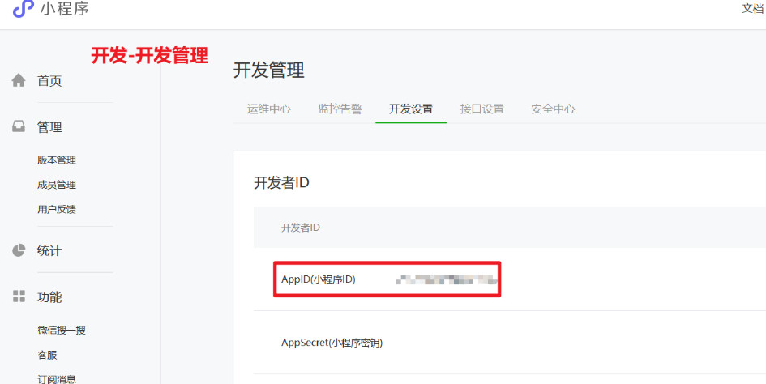
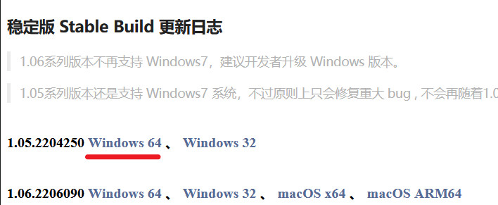
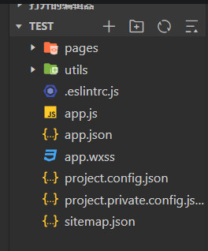
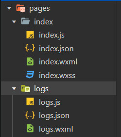
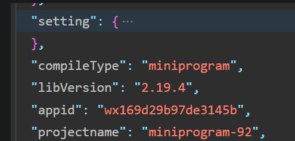
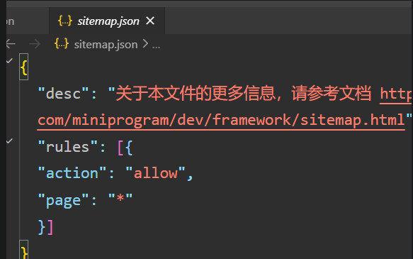

# 01 【微信小程序起步】

## 1.小程序简介

小程序与普通网页开发的区别

1. 运行环境不同
   网页运行在浏览器中
   小程序运行在微信环境中
2. API不同
   由于运行环境不同，所以小程序中无法调用DOM和BOM的API
   但是小程序中可以调用微信环境提供的各种API，例如：
   地理定位
   扫码
   支付
3. 开发模式不同
   网页的开发模式：浏览器+代码编辑器
   小程序：
   申请小程序开发账号
   安装小程序开发者工具
   创建和配置小程序项目

## 2.注册小程序开发账号

使用浏览器打开[`http://mp.weixin.qq.com/`](https://mp.weixin.qq.com/) 点击立即注册

安装步骤填写信息注册即可：

[微信小程序注册入口和注册流程（完整版图文教程）](https://blog.csdn.net/yunweifun/article/details/124222986?ops_request_misc=%7B%22request%5Fid%22%3A%22165576817216782246498462%22%2C%22scm%22%3A%2220140713.130102334..%22%7D&request_id=165576817216782246498462&biz_id=0&utm_medium=distribute.pc_search_result.none-task-blog-2~all~baidu_landing_v2~default-1-124222986-null-null.142^v18^huaweicloudv1,157^v15^new_3&utm_term=微信小程序注册步骤&spm=1018.2226.3001.4187)

个人接口可能权限少一点 不支持微信认证 微信支付以及高级接口相关的内容

## 3.如何获取小程序的AppID

登录之后：

## 4.安装微信开发者工具

推荐下载和安装最新的稳定版的微信开发者工具，下载页面的链接：[下载](https://developers.weixin.qq.com/miniprogram/dev/devtools/stable.html)

安装完成后 微信扫码登录即可
设置-外观 调整主题颜色
设置-编辑器-调整字号以及行距
设置-代理设置-不使用代理直连网络

## 5.第一个小程序

选择javascript模板 不使用云服务开发 创建

可以在模拟器查看项目效果 也可以通过预览-扫描二维码 在手机上查看

主界面有5个组成部分：
菜单栏： 帮助-开发者文档 工具-构建npm
工具栏
模拟器
代码编辑区
测试区

## 6.小程序代码的构成

### 6.1 项目结构

`pages	`	用来存放所有小程序的页面
`utils	`	用来存放工具性质的模块
`app.js`	小程序项目的入口文件
`app.json`	小程序项目的全局配置文件
`app.wxss`	小程序项目的全局样式文件
`project.config.json`	项目的配置文件
`sitemap.json`	用来配置小程序及其页面是否允许被微信索引

### 6.2 小程序页面的组成部分

小程序官方建议把所有小程序的页面 都存放在pages目录中，以单独的文件夹存在

1. `js`文件 页面的脚本文件，存放页面的数据、事件处理函数等
2. `json`文件 当前页面的配置文件，配置窗口的外观、表现等
3. `wxml`文件 页面的模板结构文件
4. `wxss`文件 当前页面的样式表文件

### 6.3 JSON配置文件的作用

json是一种**数据格式**，在实际开发中，json总是以**配置文件**的形式出现
小程序中有4种json配置文件:

1. 项目根目录中的`app.json`配置文件
2. 项目根目录中的`project.config.json`配置文件
3. 项目根目录中的`sitemap.json`配置文件
4. 每个页面文件夹中的`.json`配置文件

#### 6.3.1 app.json

`app.json`是当前小程序的全局配置，包括了小程序所有页面路径、窗口外观、界面表现、底部tab等

`pages`：用来记录当前小程序所有页面的路径
`window`：全局定义小程序所有页面的背景色、文字颜色
`style`：全局定义小程序组件所使用样式的版本
`sitemapLocation`： 用来指明`sitemap.json`的位置

#### 6.3.2 project.config.json

`project.config.json`是项目配置文件，用来记录我们**对小程序开发工具所做的个性化配置**，
例如：

1. `setting`中保存了编译相关的配置
2. `projectname`中保存的是项目名称
3. `appid`保存的是小程序的账号ID

#### 6.3.3 sitemap.json

微信现已开发小程序内搜索，效果类似于PC网页的SEO。 `sitemap.josn`文件用来**配置小程序页面是否允许被微信索引**

#### 6.3.4 页面的json配置文件

**对本页面的窗口外观进行设置**，页面中的配置项会覆盖`app.json`的window中的相同配置项

## 7.新建小程序页面

只需要在`app.json`-> `pages`中新增页面的存放路径，小程序开发者工具即可帮我们自动创建对应的页面文件

### 7.1 修改项目首页

只需要调整`app.json`->`pages`数组中页面路径的前后顺序 ，即可修改项目的首页。
小程序会把排在第一位的页面，当做项目首页进行渲染

### 7.2 什么是wxml

WXML(WeiXin MarkUp Language)是小程序框架设计的一套**标签语言，用来构建小程序页面的结构**，其作用类似于网页开发中的HTML

区别：

1. 标签名称不同
   `HTML(div span img a)`
   `WXMl(view text image navigator)`

2. 属性节点不同
   ``
   `<navigator url="/pages/home/home"></navigator>`

3. 提供了类似于Vue中的模板语法
   数据绑定
   列表渲染
   条件渲染

### 7.3 什么是WXSS

WXSS(WeiXin Style Sheets)是一套`样式语言`，用于描述WXML的组件样式，类似于网页开发中的CSS

区别：

1. 新增了rpx尺寸单位
   css中需要手动进行像素单位换算，例如`rem`
   wxss在底层支持新的尺寸单位`rpx`， 在不同大小的屏幕上小程序会自动进行换算
2. 提供了全局样式和局部样式
   项目根目录中的`app.wxss`会作用于所有的小程序页面
   局部页面的`.wxss`样式仅对当前页面生效
3. WXSS仅支持部分CSS选择器
   class和id
   element
   并集选择器 后代选择器
   ::after和::before等伪类选择器

### 7.4 js逻辑交互

js文件处理用户的交互
小程序中的js文件分为三大类，分别是：

1. app.js
   是**整个小程序项目的入口文件**，通过调用`App()`函数来启动整个小程序
2. 页面的.js
   是**页面的入口文件**，通过调用`Page()`函数来创建并运行页面
3. 普通的.js文件
   是**普通的功能模块文件**，用来封装**公共的函数或属性**供页面使用
   `utils/utils.js`

## 8.小程序的宿主环境

宿主环境指的是**程序运行所必须依赖的环境**
脱离了宿主环境的软件是没有任何意义的

**手机微信**是小程序 的宿主环境
小程序借助**宿主环境提供的能力**，可以完成许多普通网页无法完成的功能，例如：`微信扫码、微信支付、微信登录、地理定位、etc`…

**小程序宿主环境包含的内容**

1. 通信模型
2. 运行机制
3. 组件
4. API

### 8.1 通信模型

小程序中通信的主体是`渲染层`和`逻辑层`其中

1. WXML模板和WXSS样式工作在渲染层
2. JS脚本工作在逻辑层

通信模型分为两个部分
**渲染层**和**逻辑层**之间的通信

**逻辑层**和**第三方服务器**之间的通信
都是有微信客户端进行转发

### 8.2 运行机制

启动的过程：

1. 把小程序的代码包下载到本地
2. 解析app.json全局配置文件
3. 执行app.js小程序入口文件，调用App()创建小程序实例
4. 渲染小程序首页
5. 小程序启动完成

页面渲染过程：

6. 加载解析页面的.json的配置文件
7. 加载页面的.wxml模板和.wxss样式
8. 执行页面的.js文件，调用Page()创建页面实例
9. 页面渲染完成

### 8.3 组件

组件也是由宿主环境提供的
官方把小程序的组件分为了9大类：

1. 视图容器
2. 基础内容
3. 表单组件
4. 导航组件
5. 媒体组件
6. map地图组件
7. canvas画布组件
8. 开放能力
9. 无障碍访问

### 8.4 小程序当中的API

3大分类:
事件监听API
同步API
异步API
[文档](https://developers.weixin.qq.com/miniprogram/dev/framework/app-service/api.html)