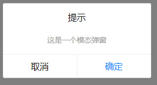
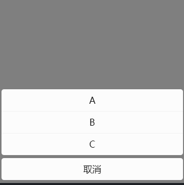
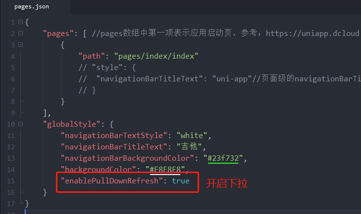
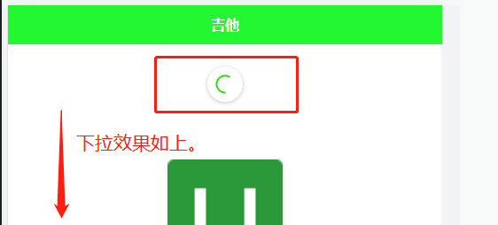
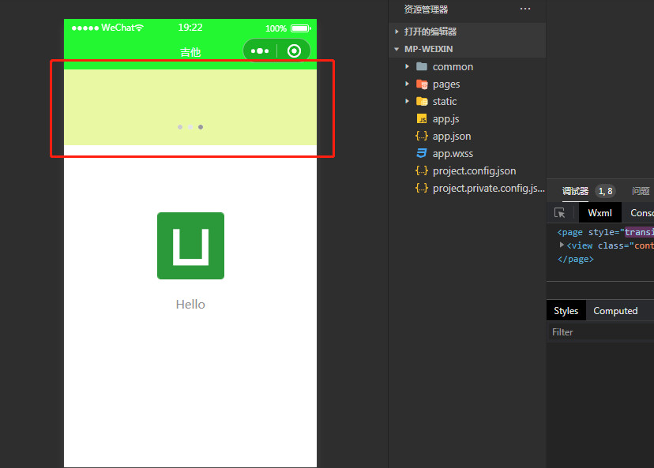

# 05 【uni-app的API】

## 1.概述

`uni-app`的 js API 由标准 ECMAScript 的 js API 和 uni 扩展 API 这两部分组成。

标准 ECMAScript 的 js 仅是最基础的 js。浏览器基于它扩展了 window、document、navigator 等对象。小程序也基于标准 js 扩展了各种 wx.xx、my.xx、swan.xx 的 API。node 也扩展了 fs 等模块。

uni-app 基于 ECMAScript 扩展了 uni 对象，并且 API 命名与小程序保持兼容。

### 1.1 标准 js 和浏览器 js 的区别

`uni-app`的 js 代码，web端运行于浏览器中。非web端（包含小程序和 App），Android 平台运行在 v8 引擎中，iOS 平台运行在 iOS 自带的 jscore 引擎中，都没有运行在浏览器或 webview 里。

非web端，虽然不支持 window、document、navigator 等浏览器的 js API，但也支持标准 ECMAScript。

请注意不要把浏览器里的 js 等价于标准 js。

所以 uni-app 的web端，一样支持标准 js，支持 if、for 等语法，支持字符串、数字、时间、布尔值、数组、自定义对象等变量类型及各种处理方法。仅仅是不支持 window、document、navigator 等浏览器专用对象。

### 1.2 各端特色 API 调用

除了 uni-app 框架内置的跨端 API，各端自己的特色 API 也可通过[条件编译 (opens new window)](https://uniapp.dcloud.io/platform)自由使用。

各端特色 API 规范参考各端的开发文档。其中 App 端的 JS API 参考[html5plus.org (opens new window)](https://www.html5plus.org/doc/h5p.html)；uni-app 也支持通过扩展原生插件来丰富 App 端的开发能力，具体参考[插件开发文档(opens new window)](http://ask.dcloud.net.cn/article/35408)

各平台的 API 新增，不需要 uni-app 升级，开发者就可以直接使用。

### 1.3 说明

- uni.on 开头的 API 是监听某个事件发生的 API 接口，接受一个 CALLBACK 函数作为参数。当该事件触发时，会调用 CALLBACK 函数。
- 如未特殊约定，其他 API 接口都接受一个 OBJECT 作为参数。
- OBJECT 中可以指定 success，fail，complete 来接收接口调用结果。
- **平台差异说明**若无特殊说明，则表示所有平台均支持。
- 异步 API 会返回 `errMsg` 字段，同步 API 则不会。比如：`getSystemInfoSync` 在返回结果中不会有 `errMsg`。

### 1.4 API Promise 化

1. 具体 API `Promise 化` 的策略：

   - 异步的方法，如果不传入 success、fail、complete 等 callback 参数，将以 Promise 返回数据。例如：`uni.getImageInfo()`

   - 异步的方法，且有返回对象，如果希望获取返回对象，必须至少传入一项 success、fail、complete 等 callback 参数。例如：

     ```js
      // 正常使用
      const task = uni.connectSocket(
       success(res){
        console.log(res)
       }
      )
     
      // Promise 化
      uni.connectSocket().then(res => {
        // 此处即为正常使用时 success 回调的 res
        // uni.connectSocket() 正常使用时是会返回 task 对象的，如果想获取 task ，则不要使用 Promise 化
        console.log(res)
      })
     ```

2. 不进行 `Promise 化` 的 API：

   - 同步的方法（即以 sync 结束）。例如：`uni.getSystemInfoSync()`
   - 以 create 开头的方法。例如：`uni.createMapContext()`
   - 以 manager 结束的方法。例如：`uni.getBackgroundAudioManager()`

### 1.5 Vue 2 和 Vue 3 的 API Promise化

[uni-app官网 (dcloud.net.cn)](https://uniapp.dcloud.net.cn/api/#vue-2-和-vue-3-的-api-promise-化)

> Vue 2 和 Vue 3 项目中 `API Promise 化` 返回格式不一致，以下为 `不同点` 和 `返回格式互相转换`

- 不同点

  - Vue2 对部分 API 进行了 Promise 封装，返回数据的第一个参数是错误对象，第二个参数是返回数据。此时使用 `catch` 是拿不到报错信息的，因为内部对错误进行了拦截。
  - Vue3 对部分 API 进行了 Promise 封装，调用成功会进入 `then 方法` 回调。调用失败会进入 `catch 方法` 回调

  **使用示例：**

`vue2`

```js
// 默认方式
uni.request({
  url: "https://www.example.com/request",
  success: (res) => {
    console.log(res.data);
  },
  fail: (err) => {
    console.error(err);
  },
});

// Promise
uni
  .request({
    url: "https://www.example.com/request",
  })
  .then((data) => {
    // data为一个数组
    // 数组第一项为错误信息 即为 fail 回调
    // 第二项为返回数据
    var [err, res] = data;
    console.log(res.data);
  });

// Await
async function request() {
  var [err, res] = await uni.request({
    url: "https://www.example.com/request",
  });
  console.log(res.data);
}
```

`vue3`

````js
// 默认方式
uni.request({
  url: "https://www.example.com/request",
  success: (res) => {
    console.log(res.data);
  },
  fail: (err) => {
    console.error(err);
  },
});

// 使用 Promise then/catch 方式调用
uni
  .request({
    url: "https://www.example.com/request",
  })
  .then((res) => {
    // 此处的 res 参数，与使用默认方式调用时 success 回调中的 res 参数一致
    console.log(res.data);
  })
  .catch((err) => {
    // 此处的 err 参数，与使用默认方式调用时 fail 回调中的 err 参数一致
    console.error(err);
  });

// 使用 Async/Await 方式调用
async function request() {
  try {
    var res = await uni.request({
      url: "https://www.example.com/request",
    });
    // 此处的 res 参数，与使用默认方式调用时 success 回调中的 res 参数一致
    console.log(res);
  } catch (err) {
    // 此处的 err 参数，与使用默认方式调用时 fail 回调中的 err 参数一致
    console.error(err);
  }
}
````

## 2.网络

### 2.1 发起请求

#### 2.1.1 uni.request(OBJECT)

[uni.request(OBJECT) | uni-app官网 (dcloud.net.cn)](https://uniapp.dcloud.net.cn/api/request/request.html#configmtls)

发起网络请求。

> 在各个小程序平台运行时，网络相关的 API 在使用前需要配置域名白名单。

> **success等等函数最好都要用箭头函数，不然拿不到this指定的data数据！**

**OBJECT 参数说明**

| 参数名   | 类型                      | 必填 | 默认值 | 说明                                             | 平台差异说明                                                 |
| :------- | :------------------------ | :--- | :----- | :----------------------------------------------- | :----------------------------------------------------------- |
| url      | String                    | 是   |        | 开发者服务器接口地址                             |                                                              |
| data     | Object/String/ArrayBuffer | 否   |        | 请求的参数                                       | App 3.3.7 以下不支持 ArrayBuffer 类型                        |
| header   | Object                    | 否   |        | 设置请求的 header，header 中不能设置 Referer。   | App、H5端会自动带上cookie，且H5端不可手动修改                |
| method   | String                    | 否   | GET    | 有效值详见下方说明                               |                                                              |
| timeout  | Number                    | 否   | 60000  | 超时时间，单位 ms                                | H5(HBuilderX 2.9.9+)、APP(HBuilderX 2.9.9+)、微信小程序（2.10.0）、支付宝小程序 |
| success  | Function                  | 否   |        | 收到开发者服务器成功返回的回调函数               |                                                              |
| fail     | Function                  | 否   |        | 接口调用失败的回调函数                           |                                                              |
| complete | Function                  | 否   |        | 接口调用结束的回调函数（调用成功、失败都会执行） |                                                              |

**success 返回参数说明**

| 参数       | 类型                      | 说明                                         |
| :--------- | :------------------------ | :------------------------------------------- |
| data       | Object/String/ArrayBuffer | 开发者服务器返回的数据                       |
| statusCode | Number                    | 开发者服务器返回的 HTTP 状态码               |
| header     | Object                    | 开发者服务器返回的 HTTP Response Header      |
| cookies    | `Array.<string>`          | 开发者服务器返回的 cookies，格式为字符串数组 |

**data 数据说明**

最终发送给服务器的数据是 String 类型，如果传入的 data 不是 String 类型，会被转换成 String。转换规则如下：

- 对于 `GET` 方法，会将数据转换为 query string。例如 `{ name: 'name', age: 18 }` 转换后的结果是 `name=name&age=18`。
- 对于 `POST` 方法且 `header['content-type']` 为 `application/json` 的数据，会进行 JSON 序列化。
- 对于 `POST` 方法且 `header['content-type']` 为 `application/x-www-form-urlencoded` 的数据，会将数据转换为 query string。

**示例**

```javascript
uni.request({
    url: 'https://www.example.com/request', //仅为示例，并非真实接口地址。
    data: {
        text: 'uni.request'
    },
    header: {
        'custom-header': 'hello' //自定义请求头信息
    },
    success: (res) => {
        console.log(res.data);
        this.text = 'request success';
    }
});
```

在页面刚加载的时候就请求数据
需要在页面的`onLoad`事件中调用获取数据的函数

```js
 /**
   * 生命周期函数--监听页面加载
   */
  onLoad(options) {
    this.getInfo()
  },
```

**返回值**

如果希望返回一个 `requestTask` 对象，需要至少传入 success / fail / complete 参数中的一个。例如：

```javascript
var requestTask = uni.request({
	url: 'https://www.example.com/request', //仅为示例，并非真实接口地址。
	complete: ()=> {}
});
requestTask.abort();
```

如果没有传入 success / fail / complete 参数，则会返回封装后的 Promise 对象：[Promise 封装](https://uniapp.dcloud.net.cn/api/#promise-封装)

通过 `requestTask`，可中断请求任务。

**requestTask 对象的方法列表**

| 方法               | 参数 | 说明                                                         |
| :----------------- | :--- | :----------------------------------------------------------- |
| abort              |      | 中断请求任务                                                 |
| offHeadersReceived |      | 取消监听 HTTP Response Header 事件，仅`微信小程序平台`支持，[文档详情(opens new window)](https://developers.weixin.qq.com/miniprogram/dev/api/RequestTask.offHeadersReceived.html) |
| onHeadersReceived  |      | 监听 HTTP Response Header 事件。会比请求完成事件更早，仅`微信小程序平台`支持，[文档详情(opens new window)](https://developers.weixin.qq.com/miniprogram/dev/api/RequestTask.onHeadersReceived.html) |

**示例**

```javascript
const requestTask = uni.request({
	url: 'https://www.example.com/request', //仅为示例，并非真实接口地址。
	data: {
        name: 'name',
        age: 18
	},
	success: function(res) {
		console.log(res.data);
	}
});

// 中断请求任务
requestTask.abort();
```

**Tips**

- 请求的 `header` 中 `content-type` 默认为 `application/json`。
- 避免在 `header` 中使用中文，或者使用 encodeURIComponent 进行编码，否则在百度小程序报错。（来自：[快狗打车前端团队 (opens new window)](https://juejin.im/user/2612095359650712)）
- 网络请求的 `超时时间` 可以统一在 `manifest.json` 中配置 [networkTimeout](https://uniapp.dcloud.net.cn/collocation/manifest#networktimeout)。
- H5 端本地调试需注意跨域问题，参考：[调试跨域问题解决方案](https://ask.dcloud.net.cn/article/35267)

- 注意小程序端不支持自动保持 cookie，服务器应避免验证 cookie。如果服务器无法修改，也可以使用一些模拟手段，比如这样的工具[https://github.com/charleslo1/weapp-cookie (opens new window)](https://github.com/charleslo1/weapp-cookie)可以请求时带上 cookie 并将响应的 cookie 保存在本地。
- H5端 cookie 受跨域限制（和平时开发网站时一样），旧版的 uni.request 未支持 withCredentials 配置，可以直接使用 xhr 对象或者其他类库。

## 3.路由和页面跳转

### 3.1 uni.navigateTo(OBJECT)

[uni.navigateTo(OBJECT) | uni-app官网 (dcloud.net.cn)](https://uniapp.dcloud.net.cn/api/router.html#navigateto)

保留当前页面，跳转到应用内的某个页面，使用`uni.navigateBack`可以返回到原页面。

| 参数              | 类型     | 必填 | 默认值 | 说明                                                         | 平台差异说明 |
| :---------------- | :------- | :--- | :----- | :----------------------------------------------------------- | :----------- |
| url               | String   | 是   |        | 需要跳转的应用内非 tabBar 的页面的路径 , 路径后可以带参数。参数与路径之间使用?分隔，参数键与参数值用=相连，不同参数用&分隔；如 'path?key=value&key2=value2'，path为下一个页面的路径，下一个页面的onLoad函数可得到传递的参数 |              |
| animationType     | String   | 否   | pop-in | 窗口显示的动画效果，详见：[窗口动画](https://uniapp.dcloud.net.cn/api/router#animation) | App          |
| animationDuration | Number   | 否   | 300    | 窗口动画持续时间，单位为 ms                                  | App          |
| events            | Object   | 否   |        | 页面间通信接口，用于监听被打开页面发送到当前页面的数据。2.8.9+ 开始支持。 |              |
| success           | Function | 否   |        | 接口调用成功的回调函数                                       |              |
| fail              | Function | 否   |        | 接口调用失败的回调函数                                       |              |
| complete          | Function | 否   |        | 接口调用结束的回调函数（调用成功、失败都会执行）             |              |

**示例**

```javascript
//在起始页面跳转到test.vue页面并传递参数
uni.navigateTo({
	url: 'pages/test?id=1&name=uniapp'
});
```

```javascript
// 在test.vue页面接受参数
export default {
	onLoad: function (option) { //option为object类型，会序列化上个页面传递的参数
		console.log(option.id); //打印出上个页面传递的参数。
		console.log(option.name); //打印出上个页面传递的参数。
	}
}
```

```js
// 在起始页面跳转到test.vue页面，并监听test.vue发送过来的事件数据
uni.navigateTo({
  url: 'pages/test?id=1',
  events: {
    // 为指定事件添加一个监听器，获取被打开页面传送到当前页面的数据
    acceptDataFromOpenedPage: function(data) {
      console.log(data)
    },
    someEvent: function(data) {
      console.log(data)
    }
    ...
  },
  success: function(res) {
    // 通过eventChannel向被打开页面传送数据
    res.eventChannel.emit('acceptDataFromOpenerPage', { data: 'data from starter page' })
  }
})

// 在test.vue页面，向起始页通过事件传递数据
onLoad: function(option) {
  const eventChannel = this.getOpenerEventChannel();
  eventChannel.emit('acceptDataFromOpenedPage', {data: 'data from test page'});
  eventChannel.emit('someEvent', {data: 'data from test page for someEvent'});
  // 监听acceptDataFromOpenerPage事件，获取上一页面通过eventChannel传送到当前页面的数据
  eventChannel.on('acceptDataFromOpenerPage', function(data) {
    console.log(data)
  })
}
```

**注意：**

- 页面跳转路径有层级限制，不能无限制跳转新页面
- 跳转到 tabBar 页面只能使用 switchTab 跳转
- 路由API的目标页面必须是在pages.json里注册的vue页面。如果想打开web url，在App平台可以使用 [plus.runtime.openURL (opens new window)](http://www.html5plus.org/doc/zh_cn/runtime.html#plus.runtime.openURL)或web-view组件；H5平台使用 window.open；小程序平台使用web-view组件（url需在小程序的联网白名单中）。在hello uni-app中有个组件ulink.vue已对多端进行封装，可参考。

### 3.2 uni.redirectTo(OBJECT)

关闭当前页面，跳转到应用内的某个页面。

**OBJECT参数说明**

| 参数     | 类型     | 必填 | 说明                                                         |
| :------- | :------- | :--- | :----------------------------------------------------------- |
| url      | String   | 是   | 需要跳转的应用内非 tabBar 的页面的路径，路径后可以带参数。参数与路径之间使用?分隔，参数键与参数值用=相连，不同参数用&分隔；如 'path?key=value&key2=value2' |
| success  | Function | 否   | 接口调用成功的回调函数                                       |
| fail     | Function | 否   | 接口调用失败的回调函数                                       |
| complete | Function | 否   | 接口调用结束的回调函数（调用成功、失败都会执行）             |

**示例**

```javascript
uni.redirectTo({
	url: 'test?id=1'
});
```

复制代码

**注意：**

- 跳转到 tabBar 页面只能使用 switchTab 跳转

### 3.3 uni.reLaunch(OBJECT)

关闭所有页面，打开到应用内的某个页面。

**注意：** 如果调用了 [uni.preloadPage(OBJECT) (opens new window)](https://uniapp.dcloud.net.cn/api/preload-page)不会关闭，仅触发生命周期 `onHide`

**OBJECT参数说明**

| 参数     | 类型     | 必填 | 说明                                                         |
| :------- | :------- | :--- | :----------------------------------------------------------- |
| url      | String   | 是   | 需要跳转的应用内页面路径 , 路径后可以带参数。参数与路径之间使用?分隔，参数键与参数值用=相连，不同参数用&分隔；如 'path?key=value&key2=value2'，如果跳转的页面路径是 tabBar 页面则不能带参数 |
| success  | Function | 否   | 接口调用成功的回调函数                                       |
| fail     | Function | 否   | 接口调用失败的回调函数                                       |
| complete | Function | 否   | 接口调用结束的回调函数（调用成功、失败都会执行）             |

**示例**

```javascript
uni.reLaunch({
	url: 'test?id=1'
});
```

```javascript
export default {
	onLoad: function (option) {
		console.log(option.id);
	}
}
```

Tips：

- H5端调用`uni.reLaunch`之后之前页面栈会销毁，但是无法清空浏览器之前的历史记录，此时`navigateBack`不能返回，如果存在历史记录的话点击浏览器的返回按钮或者调用`history.back()`仍然可以导航到浏览器的其他历史记录。

### 3.4 uni.switchTab(OBJECT)

跳转到 tabBar 页面，并关闭其他所有非 tabBar 页面。

**注意：** 如果调用了 [uni.preloadPage(OBJECT) (opens new window)](https://uniapp.dcloud.net.cn/api/preload-page)不会关闭，仅触发生命周期 `onHide`

**OBJECT参数说明**

| 参数     | 类型     | 必填 | 说明                                                         |
| :------- | :------- | :--- | :----------------------------------------------------------- |
| url      | String   | 是   | 需要跳转的 tabBar 页面的路径（需在 pages.json 的 tabBar 字段定义的页面），路径后不能带参数 |
| success  | Function | 否   | 接口调用成功的回调函数                                       |
| fail     | Function | 否   | 接口调用失败的回调函数                                       |
| complete | Function | 否   | 接口调用结束的回调函数（调用成功、失败都会执行）             |

**示例**

pages.json

```javascript
{
  "tabBar": {
    "list": [{
      "pagePath": "pages/index/index",
      "text": "首页"
    },{
      "pagePath": "pages/other/other",
      "text": "其他"
    }]
  }
}
```

other.vue

```javascript
uni.switchTab({
	url: '/pages/index/index'
});
```

### 3.5 uni.navigateBack(OBJECT)

关闭当前页面，返回上一页面或多级页面。可通过 `getCurrentPages()` 获取当前的页面栈，决定需要返回几层。

**OBJECT参数说明**

| 参数              | 类型     | 必填 | 默认值                                           | 说明                                                         | 平台差异说明 |
| :---------------- | :------- | :--- | :----------------------------------------------- | :----------------------------------------------------------- | :----------- |
| delta             | Number   | 否   | 1                                                | 返回的页面数，如果 delta 大于现有页面数，则返回到首页。      |              |
| animationType     | String   | 否   | pop-out                                          | 窗口关闭的动画效果，详见：[窗口动画](https://uniapp.dcloud.net.cn/api/router#animation) | App          |
| animationDuration | Number   | 否   | 300                                              | 窗口关闭动画的持续时间，单位为 ms                            | App          |
| success           | Function | 否   | 接口调用成功的回调函数                           |                                                              |              |
| fail              | Function | 否   | 接口调用失败的回调函数                           |                                                              |              |
| complete          | Function | 否   | 接口调用结束的回调函数（调用成功、失败都会执行） |                                                              |              |

**示例**

```javascript
// 注意：调用 navigateTo 跳转时，调用该方法的页面会被加入堆栈，而 redirectTo 方法则不会。见下方示例代码

// 此处是A页面
uni.navigateTo({
	url: 'B?id=1'
});

// 此处是B页面
uni.navigateTo({
	url: 'C?id=1'
});

// 在C页面内 navigateBack，将返回A页面
uni.navigateBack({
	delta: 2
});
```

### 3.6 EventChannel

2.8.9+ 支持 页面间事件通信通道

**方法**

#### [#](https://uniapp.dcloud.net.cn/api/router.html#eventchannel-emit)EventChannel.emit(string eventName, any args)

触发一个事件

string eventName 事件名称

any args 事件参数

#### [#](https://uniapp.dcloud.net.cn/api/router.html#eventchannel-off)EventChannel.off(string eventName, function fn)

取消监听一个事件。给出第二个参数时，只取消给出的监听函数，否则取消所有监听函数

string eventName 事件名称

function fn 事件监听函数

参数 any args 触发事件参数

#### [#](https://uniapp.dcloud.net.cn/api/router.html#eventchannel-on)EventChannel.on(string eventName, function fn)

持续监听一个事件

string eventName 事件名称

function fn 事件监听函数

参数 any args 触发事件参数

#### [#](https://uniapp.dcloud.net.cn/api/router.html#eventchannel-once)EventChannel.once(string eventName, function fn)

监听一个事件一次，触发后失效

string eventName 事件名称

function fn 事件监听函数

参数 any args 触发事件参数

Tips：

- `navigateTo`, `redirectTo` 只能打开非 tabBar 页面。
- `switchTab` 只能打开 `tabBar` 页面。
- `reLaunch` 可以打开任意页面。
- 页面底部的 `tabBar` 由页面决定，即只要是定义为 `tabBar` 的页面，底部都有 `tabBar`。
- 不能在 `App.vue` 里面进行页面跳转。
- H5端页面刷新之后页面栈会消失，此时`navigateBack`不能返回，如果一定要返回可以使用`history.back()`导航到浏览器的其他历史记录。

**参考事项**

- 页面路由拦截和管理，插件市场有很多封装好的工具类，搜索[路由](https://ext.dcloud.net.cn/search?q=路由)

## 4.数据缓存

### 4.1 uni.setStorageSync(KEY,DATA)

将 data 存储在本地缓存中指定的 key 中，会覆盖掉原来该 key 对应的内容，这是一个同步接口。

**参数说明**

| 参数 | 类型   | 必填 | 说明                                                         |
| :--- | :----- | :--- | :----------------------------------------------------------- |
| key  | String | 是   | 本地缓存中的指定的 key                                       |
| data | Any    | 是   | 需要存储的内容，只支持原生类型、及能够通过 JSON.stringify 序列化的对象 |

```javascript
try {
	uni.setStorageSync('storage_key', 'hello');
} catch (e) {
	// error
}
```

**注意**

- `uni-`、`uni_`、`dcloud-`、`dcloud_`为前缀的key，为系统保留关键前缀。如`uni_deviceId`、`uni_id_token`，请开发者为key命名时避开这些前缀。

### 4.2 uni.getStorageSync(KEY)

从本地缓存中同步获取指定 key 对应的内容。

**参数说明**

| 参数 | 类型   | 必填 | 说明                   |
| :--- | :----- | :--- | :--------------------- |
| key  | String | 是   | 本地缓存中的指定的 key |

**示例**

```javascript
try {
	const value = uni.getStorageSync('storage_key');
	if (value) {
		console.log(value);
	}
} catch (e) {
	// error
}
```

### 4.3 uni.removeStorageSync(KEY)

从本地缓存中同步移除指定 key。

**参数说明**

| 参数名 | 类型   | 必填 | 说明                   |
| :----- | :----- | :--- | :--------------------- |
| key    | String | 是   | 本地缓存中的指定的 key |

**示例**

```javascript
try {
	uni.removeStorageSync('storage_key');
} catch (e) {
	// error
}
```

### 4.4 uni.clearStorageSync()

同步清理本地数据缓存。

**示例**

```javascript
try {
	uni.clearStorageSync();
} catch (e) {
	// error
}
```

**注意**

uni-app的Storage在不同端的实现不同：

- H5端为localStorage，浏览器限制5M大小，是缓存概念，可能会被清理
- App端为原生的plus.storage，无大小限制，不是缓存，是持久化的
- 各个小程序端为其自带的storage api，数据存储生命周期跟小程序本身一致，即除用户主动删除或超过一定时间被自动清理，否则数据都一直可用。
- 微信小程序单个 key 允许存储的最大数据长度为 1MB，所有数据存储上限为 10MB。

## 5.界面

### 5.1 交互反馈

#### 5.1.1 uni.showToast(OBJECT)

[uni.showToast(OBJECT) | uni-app官网 (dcloud.net.cn)](https://uniapp.dcloud.net.cn/api/ui/prompt.html#showtoast)

显示消息提示框。

**OBJECT参数说明**

| 参数     | 类型     | 必填 | 说明                                                         | 平台差异说明                    |
| :------- | :------- | :--- | :----------------------------------------------------------- | :------------------------------ |
| title    | String   | 是   | 提示的内容，长度与 icon 取值有关。                           |                                 |
| icon     | String   | 否   | 图标，有效值详见下方说明。                                   |                                 |
| image    | String   | 否   | 自定义图标的本地路径（app端暂不支持gif）                     | App、H5、微信小程序、百度小程序 |
| mask     | Boolean  | 否   | 是否显示透明蒙层，防止触摸穿透，默认：false                  | App、微信小程序                 |
| duration | Number   | 否   | 提示的延迟时间，单位毫秒，默认：1500                         |                                 |
| position | String   | 否   | 纯文本轻提示显示位置，填写有效值后只有 `title` 属性生效，且不支持通过 uni.hideToast 隐藏。有效值详见下方说明。 | App                             |
| success  | Function | 否   | 接口调用成功的回调函数                                       |                                 |
| fail     | Function | 否   | 接口调用失败的回调函数                                       |                                 |
| complete | Function | 否   | 接口调用结束的回调函数（调用成功、失败都会执行）             |                                 |

**icon 值说明**

| 值        | 说明                                                         | 平台差异说明                                                 |
| :-------- | :----------------------------------------------------------- | :----------------------------------------------------------- |
| success   | 显示成功图标，此时 title 文本在`小程序`平台最多显示 7 个汉字长度。 | 支付宝小程序无长度无限制                                     |
| error     | 显示错误图标，此时 title 文本在`小程序`平台最多显示 7 个汉字长度。 | 支付宝小程序、快手小程序、字节小程序、百度小程序、京东小程序、QQ小程序不支持 |
| fail      | 显示错误图标，此时 title 文本无长度显示。                    | 支付宝小程序、字节小程序                                     |
| exception | 显示异常图标。此时 title 文本无长度显示。                    | 支付宝小程序                                                 |
| loading   | 显示加载图标，此时 title 文本在`小程序`平台最多显示 7 个汉字长度。 | 支付宝小程序不支持                                           |
| none      | 不显示图标，此时 title 文本在`小程序`最多可显示两行，`App`仅支持单行显示。 |                                                              |

**示例**

```javascript
uni.showToast({
	title: '标题',
	duration: 2000
});
```

**position 值说明（仅App生效）**

| 值     | 说明     |
| :----- | :------- |
| top    | 居上显示 |
| center | 居中显示 |
| bottom | 居底显示 |

#### 5.1.2 uni.hideToast()

隐藏消息提示框。

**示例**

```javascript
uni.hideToast();
```

####  5.1.3 uni.showLoading(OBJECT)

显示 loading 提示框, 需主动调用 [uni.hideLoading](https://uniapp.dcloud.net.cn/api/ui/prompt#hideloading) 才能关闭提示框。

**OBJECT参数说明**

| 参数     | 类型     | 必填 | 说明                                             | 平台差异说明                    |
| :------- | :------- | :--- | :----------------------------------------------- | :------------------------------ |
| title    | String   | 是   | 提示的文字内容，显示在loading的下方              |                                 |
| mask     | Boolean  | 否   | 是否显示透明蒙层，防止触摸穿透，默认：false      | H5、App、微信小程序、百度小程序 |
| success  | Function | 否   | 接口调用成功的回调函数                           |                                 |
| fail     | Function | 否   | 接口调用失败的回调函数                           |                                 |
| complete | Function | 否   | 接口调用结束的回调函数（调用成功、失败都会执行） |                                 |

**示例**

```javascript
uni.showLoading({
	title: '加载中'
});
```

#### 5.1.4 uni.hideLoading()

隐藏 loading 提示框。

**示例**

```javascript
uni.showLoading({
	title: '加载中'
});

setTimeout(function () {
	uni.hideLoading();
}, 2000);
```

#### 5.1.5 uni.showModal(OBJECT)

[uni.showToast(OBJECT) | uni-app官网 (dcloud.net.cn)](https://uniapp.dcloud.net.cn/api/ui/prompt.html#showmodal)

显示模态弹窗，可以只有一个确定按钮，也可以同时有确定和取消按钮。类似于一个API整合了 html 中：alert、confirm。

**success返回参数说明**

| 参数    | 类型    | 说明                                                         |
| :------ | :------ | :----------------------------------------------------------- |
| confirm | Boolean | 为 true 时，表示用户点击了确定按钮                           |
| cancel  | Boolean | 为 true 时，表示用户点击了取消（用于 Android 系统区分点击蒙层关闭还是点击取消按钮关闭） |

**示例**

```javascript
uni.showModal({
	title: '提示',
	content: '这是一个模态弹窗',
	success: function (res) {
		if (res.confirm) {
			console.log('用户点击确定');
		} else if (res.cancel) {
			console.log('用户点击取消');
		}
	}
});
```



#### 5.1.6 uni.showActionSheet(OBJECT)

[uni.showToast(OBJECT) | uni-app官网 (dcloud.net.cn)](https://uniapp.dcloud.net.cn/api/ui/prompt.html#showactionsheet)

从底部向上弹出操作菜单

**success返回参数说明**

| 参数     | 类型   | 说明                                    |
| :------- | :----- | :-------------------------------------- |
| tapIndex | Number | 用户点击的按钮，从上到下的顺序，从0开始 |

**示例**

```javascript
uni.showActionSheet({
	itemList: ['A', 'B', 'C'],
	success: function (res) {
		console.log('选中了第' + (res.tapIndex + 1) + '个按钮');
	},
	fail: function (res) {
		console.log(res.errMsg);
	}
});
```



### 5.2 下拉刷新

#### 5.2.1 基本配置

| 属性                  | 类型     | 默认值  | 描述                                                         | 平台差异说明 |
| --------------------- | -------- | ------- | ------------------------------------------------------------ | ------------ |
| backgroundColor       | HexColor | #ffffff | 下拉显示出来的窗口的背景色                                   | 微信小程序   |
| backgroundTextStyle   | String   | dark    | 下拉 loading 的样式，仅支持 dark / light                     | 微信小程序   |
| enablePullDownRefresh | Boolean  | false   | 是否开启下拉刷新，详见[页面生命周期](https://uniapp.dcloud.net.cn/tutorial/page.html#lifecycle)。 |              |



```json
{
    "enablePullDownRefresh": true,
    "backgroundColor": "#bfa",
    "backgroundTextStyle": "dark"
}
```

**网页页面显示如下：**



**小程序页面如下：**



**onPullDownRefresh**

在 js 中定义 onPullDownRefresh 处理函数（和onLoad等生命周期函数同级），监听该页面用户下拉刷新事件。

- 需要在 `pages.json` 里，找到的当前页面的pages节点，并在 `style` 选项中开启 `enablePullDownRefresh`。
- 当处理完数据刷新后，`uni.stopPullDownRefresh` 可以停止当前页面的下拉刷新。

#### 5.2.2 [#](https://uniapp.dcloud.net.cn/api/ui/pulldown.html#startpulldownrefresh)uni.startPullDownRefresh

开始下拉刷新，调用后触发下拉刷新动画，效果与用户手动下拉刷新一致。

**OBJECT 参数说明**

| 参数名   | 类型     | 必填 | 说明                                             |
| :------- | :------- | :--- | :----------------------------------------------- |
| success  | Function | 否   | 接口调用成功的回调                               |
| fail     | Function | 否   | 接口调用失败的回调函数                           |
| complete | Function | 否   | 接口调用结束的回调函数（调用成功、失败都会执行） |

**success 返回参数说明**

| 参数   | 类型   | 说明         |
| :----- | :----- | :----------- |
| errMsg | String | 接口调用结果 |

#### 5.2.3 [#](https://uniapp.dcloud.net.cn/api/ui/pulldown.html#stoppulldownrefresh)uni.stopPullDownRefresh

停止当前页面下拉刷新。

**示例**

第一步：开启下拉刷新。需要在 pages.json 里，找到的当前页面的pages节点，并在 style 选项中开启 enablePullDownRefresh。

第二步：onPullDownRefresh 处理函数（和onLoad等生命周期函数同级），该函数的作用就是用来监听该页面用户下拉刷新事件。

第三步：对应的停止uni.stopPullDownRefresh() 和 开始uni.startPullDownRefresh(OBJECT)下拉刷新的函数。

pages.json

```javascript
{
    "pages": [
        {
        	"path": "pages/index/index",
        	"style": {
        		"navigationBarTitleText": "uni-app",
        		"enablePullDownRefresh": true
        	}
        }
    ],
    "globalStyle": {
    	"navigationBarTextStyle": "white",
    	"navigationBarBackgroundColor": "#0faeff",
    	"backgroundColor": "#fbf9fe"
    }
}
```

index.vue

```javascript
// 仅做示例，实际开发中延时根据需求来使用。
export default {
	data() {
		return {
			text: 'uni-app'
		}
	},
	onLoad: function (options) {
		setTimeout(function () {
			console.log('start pulldown');
		}, 1000);
		uni.startPullDownRefresh();
	},
    //一旦触发下拉刷新就会执行下面方法。
	onPullDownRefresh() {
		console.log('refresh');
		setTimeout(function () {
			uni.stopPullDownRefresh();
		}, 1000);
        //上面虽然睡眠了，但是依然会继续执行下面的代码。
		console.log('验证代码继续执行')
	}
}
```

**注意**

- 支付宝小程序`startPullDownRefresh`在开发者工具里会提示`暂未开放，请勿使用`
- 支付宝小程序`startPullDownRefresh`请使用真机调试（非真机预览）
- 后续支付宝小程序开发工具更新可能会有所修改

## 6.页面和窗体

### 6.1 页面

#### 6.1.1 getCurrentPages()

`getCurrentPages()` 函数用于获取当前页面栈的实例，以数组形式按栈的顺序给出，第一个元素为首页，最后一个元素为当前页面。

**注意：**

- `getCurrentPages()`仅用于展示页面栈的情况，请勿修改页面栈，以免造成页面状态错误。 
- 不要在 App.onLaunch 的时候调用 getCurrentPages()，此时page 还没有生成。(要在方法里或者onshow里写，将此页面存入栈空间)

每个页面实例的方法属性列表：

| 方法                  | 描述                          | 平台说明 |
| --------------------- | ----------------------------- | -------- |
| page.$getAppWebview() | 获取当前页面的webview对象实例 | App      |
| page.route            | 获取当前页面的路由            |          |

熟悉页面栈后才能更好的使用getCurrentPages()，下面将列举几种常用的使用场景：
 1.利用页面栈的长度
 例如：进入小程序非默认首页时，需要提供返回首页的按钮或者执行其它事件

```js
onShow() {
     let pages = getCurrentPages(); //当前页面栈
     if (pages.length == 1) {
        //todo
     }
},
```

2、跨页面赋值

```js
 let pages = getCurrentPages();//当前页面栈
 let prevPage = pages[pages.length - 2];//上一页面
 //直接给上移页面赋值
 prevPage.list = [...]; 
```

3、页面跳转后自动刷新

```js
 //举例
 uni.switchTab({
     url: '../index/index',
     success: function (e) {
         var page = getCurrentPages().pop(); //当前页面
         if (page == undefined || page == null) return;
         page.onLoad(); //或者其它操作
     }
 })
```

4、获取当前页面相关信息

```js
let pages = getCurrentPages(); //当前页面栈
//当前页面为页面栈的最后一个元素
let prevPage = pages[pages.length - 1];//当前页面
// or
// pop() 方法用于删除并返回数组的最后一个元素
let prevPage = pages.pop();//当前页面

console.log( prevPage.route) //举例：输出为‘pages/index/index

```

#### 6.1.2 getApp()

`getApp()` 函数用于获取当前应用实例，一般用于获取globalData 。

**实例**

```javascript
const app = getApp()
console.log(app.globalData) 
```

**注意：**

- 不要在定义于 `App()` 内的函数中，或调用 `App` 前调用 `getApp()` ，可以通过 `this.$scope` 获取对应的app实例
- 通过 `getApp()` 获取实例之后，不要私自调用生命周期函数。
- 当在首页`nvue`中使用`getApp()`不一定可以获取真正的`App`对象。对此提供了`const app = getApp({allowDefault: true})`用来获取原始的`App`对象，可以用来在首页对`globalData`等初始化

### 6.2 页面通讯

#### 6.2.1 uni.$emit(eventName,OBJECT)

触发全局的自定义事件，附加参数都会传给监听器回调函数。

| 属性      | 类型   | 描述                   |
| --------- | ------ | ---------------------- |
| eventName | String | 事件名                 |
| OBJECT    | Object | 触发事件携带的附加参数 |

**代码示例**

```javascript
uni.$emit('update',{msg:'页面更新'})
```

复制代码

#### 6.2.2 uni.$on(eventName,callback)

监听全局的自定义事件，事件由 `uni.$emit` 触发，回调函数会接收事件触发函数的传入参数。

| 属性      | 类型     | 描述           |
| --------- | -------- | -------------- |
| eventName | String   | 事件名         |
| callback  | Function | 事件的回调函数 |

**代码示例**

```javascript
uni.$on('update',function(data){
    console.log('监听到事件来自 update ，携带参数 msg 为：' + data.msg);
})
```

复制代码

#### 6.2.3 uni.$once(eventName,callback)

监听全局的自定义事件，事件由 `uni.$emit` 触发，但仅触发一次，在第一次触发之后移除该监听器。

| 属性      | 类型     | 描述           |
| --------- | -------- | -------------- |
| eventName | String   | 事件名         |
| callback  | Function | 事件的回调函数 |

**代码示例**

```javascript
uni.$once('update',function(data){
    console.log('监听到事件来自 update ，携带参数 msg 为：' + data.msg);
})
```

复制代码

#### 6.2.3 uni.$off([eventName, callback])

移除全局自定义事件监听器。

| 属性      | 类型            | 描述           |
| --------- | --------------- | -------------- |
| eventName | Array＜String＞ | 事件名         |
| callback  | Function        | 事件的回调函数 |

**Tips**

- 如果uni.$off没有传入参数，则移除App级别的所有事件监听器；
- 如果只提供了事件名（eventName），则移除该事件名对应的所有监听器；
- 如果同时提供了事件与回调，则只移除这个事件回调的监听器；
- 提供的回调必须跟$on的回调为同一个才能移除这个回调的监听器；

**代码示例**

`list.vue`

```vue
<template>
	<view>
		<button type="default" @click="goTestPage">uniApi跳转到测试</button>
	</view>
</template>

<script>
	export default {
		methods: {
			goTestPage() {
				uni.navigateTo({
					url: "/pages/test/test"
				}).then(res => {
					console.log(res);
					uni.$emit('cc', {
						a: "aa",
						b: "bb"
					})

				})
			}
		}
	}
</script>
```

`test.vue`

```js
export default {
    onLoad() {
        uni.$on("cc", function(data) {
            console.log(data);
        });
    },
    onUnload() {
        // 移除监听事件  
        uni.$off('cc');
    }
}
```


**注意事项**

- uni.$emit、 uni.$on 、 uni.$once 、uni.$off 触发的事件都是 App 全局级别的，跨任意组件，页面，nvue，vue 等
- 使用时，注意及时销毁事件监听，比如，页面 onLoad 里边 uni.$on 注册监听，onUnload 里边 uni.$off 移除，或者一次性的事件，直接使用 uni.$once 监听
- 注意 uni.$on 定义完成后才能接收到 uni.$emit 传递的数据