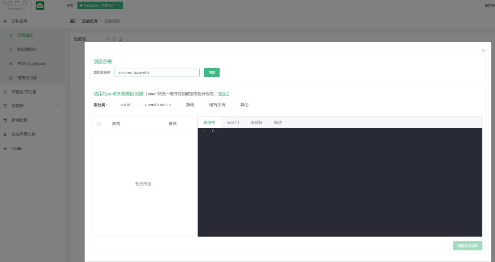
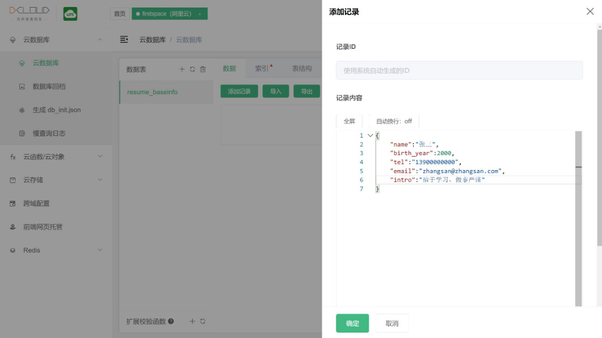

# 08 【云数据库】

## 1 入门

### 1.1 基础概念

`uniCloud`提供了一个 JSON 格式的文档型数据库。顾名思义，数据库中的每条记录都是一个 JSON 格式的文档。

它是 nosql 非关系型数据库，如果您之前熟悉 sql 关系型数据库，那么两者概念对应关系如下表：

| 关系型              | JSON 文档型                                             |
| :------------------ | :------------------------------------------------------ |
| 数据库 database     | 数据库 database                                         |
| 表 table            | 集合 collection。但行业里也经常称之为“表”。无需特意区分 |
| 行 row              | 记录 record / doc                                       |
| 字段 column / field | 字段 field                                              |
| 使用sql语法操作     | 使用MongoDB语法或jql语法操作                            |

- 一个`uniCloud`服务空间，有且只有一个数据库；
- 一个数据库可以有多个表；
- 一个表可以有多个记录；
- 一个个记录可以有多个字段。

例如，数据库中有一个表，名为user，存放用户信息。表user的数据内容如下：

```json
{"name":"张三","tel":"13900000000"}
{"name":"李四","tel":"13911111111"}
```

复制代码

上述数据中，每行数据表示一个用户的信息，被称之为“记录(record/doc)”。name和tel称之为“字段(field)”。而“13900000000”则是第一条记录的字段tel的值。

每行记录，都是一个完整的json文档，获取到记录后可以使用常规json方式操作。但表并非json文档，表是多个json文档的汇总，获取表需要使用专门的API。

与关系型数据库的二维表格式不同，json文档数据库支持不同记录拥有不同的字段、支持多层嵌套数据。

仍然以user表举例，要在数据库中存储每个人的每次登录时间和登录ip，则变成如下：

```json
{
	"name":"张三","tel":"13900000000",
	"login_log":[
		{"login_date":1604186605445,"login_ip":"192.168.1.1"},
		{"login_date":1604186694137,"login_ip":"192.168.1.2"}
	]
}
{"name":"李四","tel":"13911111111"}
```

上述数据表示张三登录了2次，login_date里的值是时间戳(timestamp)格式，在数据库内timestamp就是一个数字类型的数据。而李四没有登录过。

可以看出json文档数据库相对于关系型数据库的灵活，李四可以没有login_log字段，也可以有这个字段但登录次数记录与张三不同。

*此处仅为举例，实际业务中，登录日志单独存放在另一个表更合适*

对于初学者，如果不了解数据库设计，可以参考[opendb](https://uniapp.dcloud.net.cn/uniCloud/opendb)，已经预置了大量常见的数据库设计。

对于不熟悉传统数据库，但掌握json的js工程师而言，uniCloud的云数据库更亲切，没有传统数据库高昂的学习成本。

在uniCloud web控制台新建表时，在下面的模板中也可以选择各种`opendb`表模板，直接创建。

uniCloud同时支持阿里云和腾讯云，它们的数据库大体相同，有细微差异。阿里云的数据库是mongoDB4.0，腾讯云则使用自研的文档型数据库（兼容mongoDB 4.0版本）。uniCloud基本抹平了不同云厂商的差异，有差异的部分会在文档中单独标注。

### 1.2 创建第一个表

1. 打开 uniCloud web控制台 [https://unicloud.dcloud.net.cn/(opens new window)](https://unicloud.dcloud.net.cn/)
2. 创建或进入一个已存在的服务空间，选择 云数据库->云数据库，创建一个新表

比如我们创建一个简历表，名为 `resume`。点击上方右侧的 创建 按钮即可。



新建表时，支持选择现成的 [opendb](https://uniapp.dcloud.net.cn/uniCloud/opendb) 表模板，选择一个或多个模板表，可以点击右下方按钮创建。

创建表一共有3种方式：

1. 在web控制台创建
2. 在HBuilderX中，项目根目录/uniCloud/database点右键新建schema，上传时创建
3. 在代码中也可以创建表，但不推荐使用。

### 1.3 数据表的3个组成部分

每个数据表，包含3个部分：

- data：数据内容
- index：索引
- schema：数据表格式定义

在uniCloud的web控制台可以看到一个数据表的3部分内容。

1. 数据内容

data，就是存放的数据记录(record)。里面是一条一条的json文档。

record可以增删改查、排序统计。后续有API介绍。

可以先在 web控制台 为之前的 `resume` 表创建一条记录。

输入一个json

```json
{
    "name": "张三",
    "birth_year": 2000,
    "tel": "13900000000",
    "email": "zhangsan@zhangsan.com",
    "intro": "擅于学习，做事严谨"
}
```



创建一条新记录，是不管在web控制台创建，还是通过API创建，每条记录都会自带一个`_id`字段用以作为该记录的唯一标志。

`_id`字段是每个数据表默认自带且不可删除的字段。同时，它也是数据表的索引。


阿里云使用的是标准的mongoDB，`_id`是自增的，后创建的记录的`_id`总是大于先生成的`_id`。传统数据库的自然数自增字段在多物理机的大型数据库下很难保持同步，大型数据库均使用`_id`这种长度较长、不会重复且仍然保持自增规律的方式。

**腾讯云使用的是兼容mongoDB的自研数据库，`_id`并非自增**

插入/导入数据时也可以自行指定`_id`而不使用自动生成的`_id`，这样可以很方便的将其他数据库的数据迁移到uniCloud云数据库。

2. 数据库索引

所谓索引，是指在数据表的众多字段中挑选一个或多个字段，让数据库引擎优先处理这些字段。

设置为索引的字段，在通过该字段查询(where)或排序(orderBy)时可以获得更快的查询速度。

但设置过多索引也不合适，会造成数据新增和删除变慢。

新建的表，默认只有一个索引`_id`。

一个数据表可以有多个字段被设为索引。

索引分唯一型和非唯一型。

唯一型索引要求整个数据表多个记录的该字段的值不能重复。比如`_id`就是唯一型索引。

假使有2个人都叫“张三”，那么他们在user数据表里的区分就是依靠不同的`_id`来区分。

如果我们要根据name字段来查询，为了提升查询速度，此时可以把name字段设为非唯一索引。

索引内容较多，还有“组合索引”、“稀疏索引”、“地理位置索引”、“TTL索引”等概念。有单独的文档详细讲述索引，另见：[数据库索引](https://uniapp.dcloud.net.cn/uniCloud/db-index)

**在web控制台添加上述索引**


**注意**

- 如果记录中已经存在多个记录某字段相同的情况，那么将该字段设为唯一型索引会失败。
- 如果已经设置某字段为唯一索引，在新增和修改记录时如果该字段的值之前在其他记录已存在，会失败。
- 假如记录中不存在某个字段，则对索引字段来说其值默认为 null，如果该索引字段设为唯一型索引，则不允许存在两个或以上的该字段为null或不存在该字段的记录。此时需要设置稀疏索引来解决多个null重复的问题

3. 数据表格式定义

`DB Schema`是表结构描述。描述数据表有哪些字段、值域类型是什么、是否必填、数据操作权限等很多内容。

因为 MongoDB 的灵活性，理论上`DB Schema`不是必须的，使用传统 MongoDB API 操作数据库不需要`DB Schema`。

但如果使用 JQL，那`DB Schema`就是必须的。

`DB Schema`涉及内容较多，另见文档：[https://uniapp.dcloud.io/uniCloud/schema](https://uniapp.dcloud.net.cn/uniCloud/schema)

### 1.4 获取数据库对象的API

想要通过代码操作数据库，第一步要获取服务空间里的数据库对象。

```js
const db = uniCloud.database(); //代码块为cdb
```

js中敲下代码块`cdb`，即可快速输入上述代码。

其中，云函数内使用JQL扩展库时，还需要做一个工作，就是指定操作用户身份。[详见](https://uniapp.dcloud.net.cn/uniCloud/jql-cloud#use-in-object)

```js
// 云函数中JQL使用示例
'use strict';
exports.main = async (event, context) => {
	const dbJQL = uniCloud.databaseForJQL({ // 获取JQL database引用，此处需要传入云函数的event和context，必传
		event,
		context 
	})
	return {
		dbJQL.collection('book').get() // 直接执行数据库操作
	}
};
```

### 1.5 创建集合/表的API

- 阿里云

调用add方法，给某数据表新增数据记录时，如果该数据表不存在，会自动创建该数据表。如下代码给table1数据表新增了一条数据，如果table1不存在，会自动创建。

```js
const db = uniCloud.database();
db.collection("table1").add({name: 'Ben'})
```

- 腾讯云

腾讯云提供了专门的创建数据表的API，此API仅支持云函数内运行，不支持clientDB调用。

```js
const db = uniCloud.database();
db.createCollection("table1")
```

**注意**

- 如果数据表已存在，腾讯云调用createCollection方法会报错
- 腾讯云调用collection的add方法不会自动创建数据表，不存在的数据表会报错
- 阿里云没有createCollection方法
- **使用代码方式创建的表没有索引、schema，性能和功能都受影响，不建议使用这种方式**

## 2 云函数通过传统方式操作数据库

### 2.1 获取集合的引用

```js
const db = uniCloud.database();
// 获取 `user` 集合的引用
const collection = db.collection('user');
```

1. 集合 Collection

通过 `db.collection(name)` 可以获取指定集合的引用，在集合上可以进行以下操作

| 类型     | 接口    | 说明                                                         |
| -------- | ------- | ------------------------------------------------------------ |
| 写       | add     | 新增记录（触发请求）                                         |
| 计数     | count   | 获取符合条件的记录条数                                       |
| 读       | get     | 获取集合中的记录，如果有使用 where 语句定义查询条件，则会返回匹配结果集 (触发请求) |
| 引用     | doc     | 获取对该集合中指定 id 的记录的引用                           |
| 查询条件 | where   | 通过指定条件筛选出匹配的记录，可搭配查询指令（eq, gt, in, ...）使用 |
|          | skip    | 跳过指定数量的文档，常用于分页，传入 offset                  |
|          | orderBy | 排序方式                                                     |
|          | limit   | 返回的结果集(文档数量)的限制，有默认值和上限值               |
|          | field   | 指定需要返回的字段                                           |

查询及更新指令用于在 `where` 中指定字段需满足的条件，指令可通过 `db.command` 对象取得。

2. 记录 Record / Document

通过 `db.collection(collectionName).doc(docId)` 可以获取指定集合上指定 _id 的记录的引用，在记录上可以进行以下操作

| 接口 | 说明   |                                                              |
| ---- | ------ | ------------------------------------------------------------ |
| 写   | update | 局部更新记录(触发请求)只更新传入的字段。如果被更新的记录不存在，会直接返回更新失败 |
|      | set    | 覆写记录;会删除操作的记录中的所有字段，创建传入的字段。如果操作的记录不存在，会自动创建新的记录 |
|      | remove | 删除记录(触发请求)                                           |
| 读   | get    | 获取记录(触发请求)                                           |

doc(docId)方法的参数只能是字符串，即数据库默认的_id字段。

如需要匹配多个`_id`的记录，应使用where方法。可以在where方法里用in指令匹配一个包含`_id`的数组。

新增文档时数据库会自动生成_id字段，也可以自行将_id设置为其他值

3. 查询筛选指令 Query Command

以下指令挂载在 `db.command` 下

| 类型     | 接口 | 说明                               |
| -------- | ---- | ---------------------------------- |
| 比较运算 | eq   | 字段等于 ==                        |
|          | neq  | 字段不等于 !=                      |
|          | gt   | 字段大于 >                         |
|          | gte  | 字段大于等于 >=                    |
|          | lt   | 字段小于 <                         |
|          | lte  | 字段小于等于 <=                    |
|          | in   | 字段值在数组里                     |
|          | nin  | 字段值不在数组里                   |
| 逻辑运算 | and  | 表示需同时满足指定的所有条件       |
|          | or   | 表示需同时满足指定条件中的至少一个 |

如果你熟悉SQL，可查询[mongodb与sql语句对照表 (opens new window)](https://blog.csdn.net/xinghebuluo/article/details/7012788/)进行学习。

4. 字段更新指令 Update Command

以下指令挂载在 `db.command` 下

| 类型 | 接口    | 说明                             |
| ---- | ------- | -------------------------------- |
| 字段 | set     | 设置字段值                       |
|      | remove  | 删除字段                         |
|      | inc     | 加一个数值，原子自增             |
|      | mul     | 乘一个数值，原子自乘             |
|      | push    | 数组类型字段追加尾元素，支持数组 |
|      | pop     | 数组类型字段删除尾元素，支持数组 |
|      | shift   | 数组类型字段删除头元素，支持数组 |
|      | unshift | 数组类型字段追加头元素，支持数组 |

### 2.2 新增文档

**方法1： collection.add(data)**

参数说明

| 参数 | 类型            | 必填 | 说明                                     |
| ---- | --------------- | ---- | ---------------------------------------- |
| data | object \| array | 是   | {_id: '10001', 'name': 'Ben'} _id 非必填 |

响应参数

单条插入时

| 参数 | 类型   | 说明         |
| ---- | ------ | ------------ |
| id   | String | 插入记录的id |

批量插入时

| 参数 | 类型  | 说明                 |
| ---- | ----- | -------------------- |
| ids  | Array | 批量插入所有记录的id |

示例：

```js
const collection = db.collection('unicloud-test')
// 单条插入数据
let res = await collection.add({
  name: 'Ben'
})
// 批量插入数据
let res = await collection.add([{
  name: 'Alex'
},{
  name: 'Ben'
},{
  name: 'John'
}])
```

**方法2： collection.doc().set(data)**

也可通过 `set` 方法新增一个文档，需先取得文档引用再调用 `set` 方法。 如果文档不存在，`set` 方法会创建一个新文档。

**参数说明**

| 参数 | 类型   | 必填 | 说明                              |
| ---- | ------ | ---- | --------------------------------- |
| data | object | 是   | 更新字段的Object，{'name': 'Ben'} |

**响应参数**

| 参数       | 类型   | 说明                                        |
| ---------- | ------ | ------------------------------------------- |
| updated    | Number | 更新成功条数，数据更新前后没变化时也会返回1 |
| upsertedId | String | 创建的文档id                                |

```js
let res = await collection.doc('doc-id').set({
  name: "Hey"
});
```

### 2.3 查询文档

支持 `where()`、`limit()`、`skip()`、`orderBy()`、`get()`、`field()`、`count()` 等操作。

只有当调用`get()`时才会真正发送查询请求。

limit，即返回记录的最大数量，默认值为100，也就是不设置limit的情况下默认返回100条数据。

设置limit有最大值，腾讯云限制为最大1000条，阿里云限制为最大500条。

如需查询更多数据，需要分页多次查询。

**get响应参数**

| 参数 | 类型  | 说明         |
| ---- | ----- | ------------ |
| data | Array | 查询结果数组 |

#### 2.3.1 添加查询条件

collection.where()

**在聚合操作中请使用match**

设置过滤条件，where 可接收对象作为参数，表示筛选出拥有和传入对象相同的 key-value 的文档。比如筛选出所有类型为计算机的、内存为 8g 的商品：

```js
let res = await db.collection('goods').where({
  category: 'computer',
  type: {
    memory: 8,
  }
}).get()
```

如果要表达更复杂的查询，可使用高级查询指令，比如筛选出所有内存大于 8g 的计算机商品：

```js
const dbCmd = db.command // 取指令
db.collection('goods').where({
  category: 'computer',
  type: {
    memory: dbCmd.gt(8), // 表示大于 8
  }
})
```

在SQL里使用字符串表达式操作。但在NOSQL中使用json操作。这使得 等于 的表达，从 `=` 变成了 `:`；而大于的表达，从 `>` 变成了 `dbCmd.gt()`

所有的比较符，详见[表格(opens new window)](https://uniapp.dcloud.io/uniCloud/cf-database-dbcmd?id=查询筛选指令-query-command)

`where` 还可以使用正则表达式来查询文档，比如一下示例查询所有`name`字段以ABC开头的用户

```js
db.collection('user').where({
  name: new RegExp('^ABC')
})
```

**按照数组内的值查询**

mongoDB内按照数组内的值查询可以使用多种写法，以下面的数据为例

```js
{
  arr:[{
    name: 'item-1',
  },{
    name: 'item-2',
  }]
}

{
  arr:[{
    name: 'item-3',
  },{
    name: 'item-4',
  }]
}
```

如果想查询arr内第一个元素的name为item-1的记录可以使用如下写法

```js
const res = await db.collection('test').where({
  'arr.0.name': 'item-1'
})

res = {
  data:[{
    arr:[{
      name: 'item-1',
    },{
      name: 'item-2',
    }]
  }]
}
```

如果想查询arr内某个元素的name为item-1的记录（可以是数组内的任意一条name为item-1）可以使用如下写法

```js
const res = await db.collection('test').where({
  'arr.name': 'item-1'
})

res = {
  data:[{
    arr:[{
      name: 'item-1',
    },{
      name: 'item-2',
    }]
  }]
}
```

#### 2.3.2 获取查询数量

collection.count()

```js
let res = await db.collection('goods').where({
  category: 'computer',
  type: {
    memory: 8,
  }
}).count()
```

响应参数

| 字段  | 类型   | 必填 | 说明     |
| ----- | ------ | ---- | -------- |
| total | Number | 否   | 计数结果 |

**注意：**

- 数据量很大的情况下，带条件运算count全表的性能会很差，尽量使用其他方式替代，比如新增一个字段专门用来存放总数。不加条件时count全表不存在性能问题。

#### 2.3.3 设置记录数量

collection.limit()

参数说明

| 参数  | 类型   | 必填 | 说明           |
| ----- | ------ | ---- | -------------- |
| value | Number | 是   | 返回的数据条数 |

```js
let res = await collection.limit(1).get() // 只返回第一条记录
```

**注意**

- limit不设置的情况下默认返回100条数据；设置limit有最大值，腾讯云限制为最大1000条，阿里云限制为最大500条。

#### 2.3.4 设置起始位置

collection.skip(value)

参数说明

| 参数  | 类型   | 必填 | 说明                               |
| ----- | ------ | ---- | ---------------------------------- |
| value | Number | 是   | 跳过指定的位置，从位置之后返回数据 |

使用示例

```js
let res = await collection.skip(4).get()
```

**注意：数据量很大的情况下，skip性能会很差，尽量使用其他方式替代，参考：[skip性能优化](https://uniapp.dcloud.net.cn/uniCloud/db-performance#skip)**

#### 2.3.5 对结果排序

collection.orderBy(field, orderType)

参数说明

| 参数      | 类型   | 必填 | 说明                                |
| --------- | ------ | ---- | ----------------------------------- |
| field     | string | 是   | 排序的字段                          |
| orderType | string | 是   | 排序的顺序，升序(asc) 或 降序(desc) |

如果需要对嵌套字段排序，需要用 "点表示法" 连接嵌套字段，比如 style.color 表示字段 style 里的嵌套字段 color。

同时也支持按多个字段排序，多次调用 orderBy 即可，多字段排序时的顺序会按照 orderBy 调用顺序先后对多个字段排序

使用示例

```js
let res = await collection.orderBy("name", "asc").get()
```

**注意**

- 排序字段存在多个重复的值时排序后的分页结果，可能会出现某条记录在上一页出现又在下一页出现的情况。这时候可以通过指定额外的排序条件比如`.orderBy("name", "asc").orderBy("_id", "asc")`来规避这种情况。

#### 2.3.6 指定返回字段

collection.field()

从查询结果中，过滤掉不需要的字段，或者指定要返回的字段。

参数说明

| 参数 | 类型   | 必填 | 说明                                                      |
| ---- | ------ | ---- | --------------------------------------------------------- |
| -    | object | 是   | 过滤字段对象，包含字段名和策略，不返回传false，返回传true |

使用示例

```js
collection.field({ 'age': true }) //只返回age字段、_id字段，其他字段不返回
```

**注意**

- field内指定是否返回某字段时，不可混用true/false。即{'a': true, 'b': false}是一种错误的参数格式
- 只有使用{ '_id': false }明确指定不要返回_id时才会不返回_id字段，否则_id字段一定会返回。

#### 2.3.7 查询指令

查询指令以dbCmd.开头，包括等于、不等于、大于、大于等于、小于、小于等于、in、nin、and、or。

[uni-app官网 (dcloud.net.cn)](https://uniapp.dcloud.net.cn/uniCloud/cf-database.html#query)

#### 2.3.8 正则表达式查询

根据正则表达式进行筛选

例如下面可以筛选出 `version` 字段开头是 "数字+s" 的记录，并且忽略大小写：

```js
// 可以直接使用正则表达式
db.collection('articles').where({
  version: /^\ds/i
})

// 也可以使用new RegExp
db.collection('user').where({
  name: new RegExp('^\\ds', 'i')
})

// 或者使用new db.RegExp，这种方式阿里云不支持
db.collection('articles').where({
  version: new db.RegExp({
    regex: '^\\ds',   // 正则表达式为 /^\ds/，转义后变成 '^\\ds'
    options: 'i'    // i表示忽略大小写
  }) 
})
```

#### 2.3.9 查询数组字段

[uni-app官网 (dcloud.net.cn)](https://uniapp.dcloud.net.cn/uniCloud/cf-database.html#querywitharr)

### 2.4 删除文档

**方式1 通过指定文档ID删除**

collection.doc(_id).remove()

```js
// 清理全部数据
let res = await collection.get()
res.data.map(async(document) => {
  return await collection.doc(document.id).remove();
});
```

**方式2 条件查找文档然后直接批量删除**

collection.where().remove()

```js
// 删除字段a的值大于2的文档
const dbCmd = db.command
let res = await collection.where({
  a: dbCmd.gt(2)
}).remove()

// 清理全部数据
const dbCmd = db.command
let res = await collection.where({
  _id: dbCmd.exists(true)
}).remove()
```

响应参数

| 字段    | 类型   | 必填 | 说明           |
| ------- | ------ | ---- | -------------- |
| deleted | Number | 否   | 删除的记录数量 |

示例：判断删除成功或失败，打印删除的记录数量

```js
const db = uniCloud.database();
db.collection("table1").doc("5f79fdb337d16d0001899566").remove()
	.then((res) => {
		console.log("删除成功，删除条数为: ",res.deleted);
	})
	.catch((err) => {
		console.log( err.message )
	})
	.finally(() => {
		
	})
```

### 2.5 更新文档

#### 2.5.1 更新指定文档

**使用腾讯云时更新方法必须搭配doc、where方法使用，`db.collection('test').update()`会报如下错误：`param should have required property 'query'`**

collection.doc().update(Object data)

> 未使用set、remove更新操作符的情况下，此方法不会删除字段，仅将更新数据和已有数据合并。

**参数说明**

| 参数 | 类型   | 必填 | 说明                                         |
| ---- | ------ | ---- | -------------------------------------------- |
| data | object | 是   | 更新字段的Object，{'name': 'Ben'} _id 非必填 |

**响应参数**

| 参数    | 类型   | 说明                                      |
| ------- | ------ | ----------------------------------------- |
| updated | Number | 更新成功条数，数据更新前后没变化时会返回0 |

```js
let res = await collection.doc('doc-id').update({
  name: "Hey",
  count: {
    fav: 1
  }
});
```

```json
// 更新前
{
  "_id": "doc-id",
  "name": "Hello",
  "count": {
    "fav": 0,
    "follow": 0
  }
}

// 更新后
{
  "_id": "doc-id",
  "name": "Hey",
  "count": {
    "fav": 1,
    "follow": 0
  }
}
```

更新数组时，已数组下标作为key即可，比如以下示例将数组arr内下标为1的值修改为 uniCloud

```js
let res = await collection.doc('doc-id').update({
  arr: {
    1: "uniCloud"
  }
})
```

```json
// 更新前
{
  "_id": "doc-id",
  "arr": ["hello", "world"]
}
// 更新后
{
  "_id": "doc-id",
  "arr": ["hello", "uniCloud"]
}
```

#### 2.5.2 更新文档，如果不存在则创建

collection.doc().set()

**注意：**

> 此方法会覆写已有字段，需注意与`update`表现不同，比如以下示例执行`set`之后`follow`字段会被删除

```js
let res = await collection.doc('doc-id').set({
  name: "Hey",
  count: {
    fav: 1
  }
})
```

```json
// 更新前
{
  "_id": "doc-id",
  "name": "Hello",
  "count": {
    "fav": 0,
    "follow": 0
  }
}

// 更新后
{
  "_id": "doc-id",
  "name": "Hey",
  "count": {
    "fav": 1
  }
}
```

#### 2.5.3 批量更新文档

`collection.update()`

```js
const dbCmd = db.command
let res = await collection.where({name: dbCmd.eq('hey')}).update({
  age: 18,
})
```

#### 2.5.4 更新并返回更新后的数据

> 新增于HBuilderX 3.2.0

此接口仅会操作一条数据，有多条数据匹配的情况下会只更新匹配的第一条并返回

**示例**

```js
const db = uniCloud.database()
await db.collection('test').where({
  uid: '1'
}).updateAndReturn({
  score: db.command.inc(2)
})

// 更新前
{
  _id: 'xx',
  uid: '1',
  score: 0
}
// 更新后
{
  _id: 'xx',
  uid: '1',
  score: 2
}

// 接口返回值
{
  updated: 1,
  doc: {
    _id: 'xx',
    uid: '1',
    score: 2
  }
}
```

**注意**

- 使用updateAndReturn时，不可使用field方法
- 可以在事务中使用，可以使用`transaction.where().updateAndReturn()`以及`transaction.doc().updateAndReturn()`
- 不同于update接口，此接口返回的updated不表示数据真的进行了更新
- 腾讯云暂不支持`doc().updateAndReturn()`的写法可以使用`where().updateAndReturn()`替代

#### 2.5.5 更新数组内指定下标的元素

```js
const res = await db.collection('query').doc('1').update({
  // 更新students[1]
  ['students.' + 1]: {
    name: 'wang'
  }
})
```

```js
// 更新前
{
  "_id": "1",
  "students": [
    {
      "name": "zhang"
    },
    {
      "name": "li"
    }
  ]
}

// 更新后
{
  "_id": "1",
  "students": [
    {
      "name": "zhang"
    },
    {
      "name": "wang"
    }
  ]
}
```

#### 2.5.6 更新数组内匹配条件的元素

**注意：只可确定数组内只会被匹配到一个的时候使用**

```js
const res = await db.collection('query').where({
	'students.id': '001'
}).update({
  // 将students内id为001的name改为li，$代表where内匹配到的数组项的序号
	'students.$.name': 'li'
})
```

```js
// 更新前
{
  "_id": "1",
  "students": [
    {
      "id": "001",
      "name": "zhang"
    },
    {
      "id": "002",
      "name": "wang"
    }
  ]
}

// 更新后
{
  "_id": "1",
  "students": [
    {
      "id": "001",
      "name": "li"
    },
    {
      "id": "002",
      "name": "wang"
    }
  ]
}
```

#### 2.5.7 更新操作符

更多数据库操作符请查看[数据库操作符](https://uniapp.dcloud.net.cn/uniCloud/cf-database.html#dbcmd)

[uni-app官网 (dcloud.net.cn)](https://uniapp.dcloud.net.cn/uniCloud/cf-database.html#update-operator)
