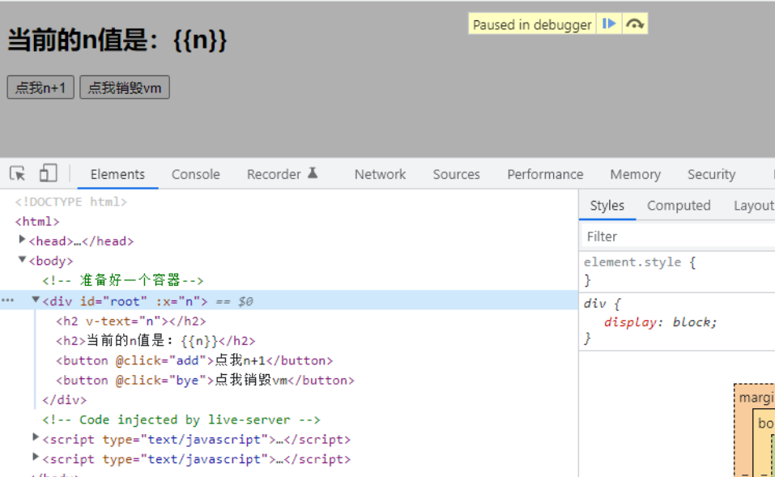
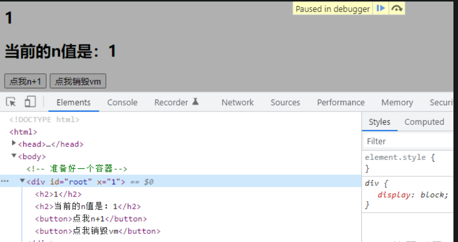
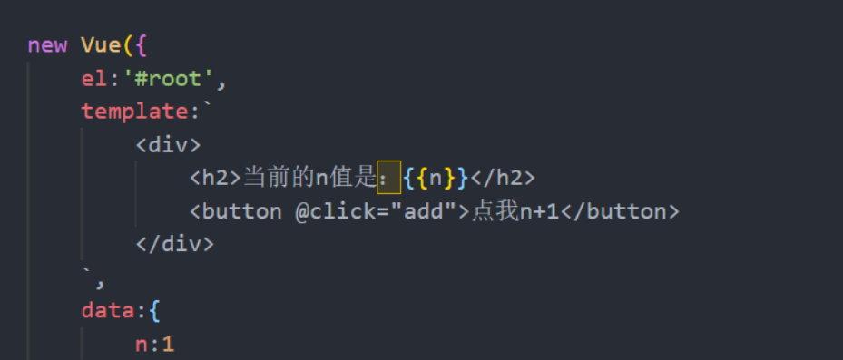
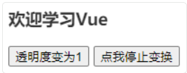
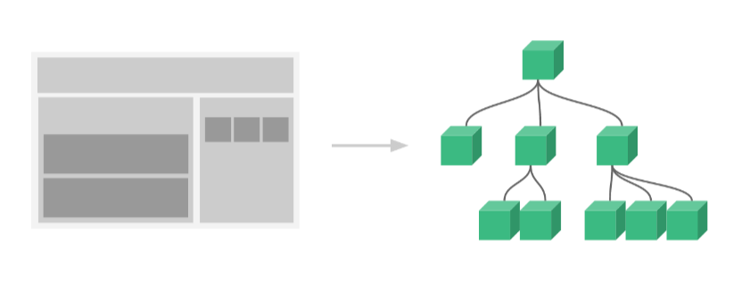
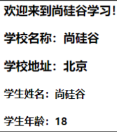
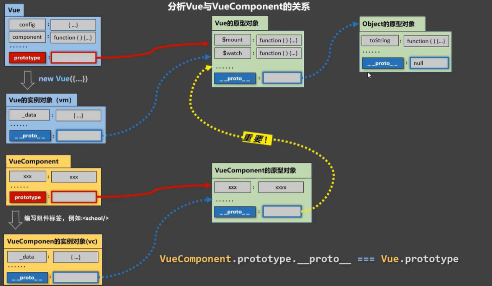

# 08 【生命周期 组件】

## 1.生命周期

### 1.1引出生命周期

**生命周期**

1. 又名**生命周期回调函数**、生命周期函数、生命周期钩子
2. 是什么：Vue在关键时刻帮我们调用的一些特殊名称的函数
3. **生命周期函数的名字不可更改**，但函数的具体内容是程序员根据需求编写的
4. 生命周期函数中的`this `指向是`vm`或`组件实例对象`

```html
<div id="root">
  <h2 v-if="a">你好啊</h2>
  <h2 :style="{opacity}">看笔记学Vue</h2>
</div>

<script type="text/javascript">
  Vue.config.productionTip = false
  new Vue({
    el: '#root',
    data: {
      a: false,
      opacity: 1
    },
    methods: {
    },
    // Vue 完成模板的解析并把初始的真实 DOM 元素放入页面后（挂载完毕）调用 mounted
    mounted() {
      console.log('mounted', this)
      setInterval(() => {
        this.opacity -= 0.01
        if(this.opacity <= 0) this.opacity = 1
      }, 16)
    },
  })

  // 通过外部的定时器实现（不推荐）
  // setInterval(() => {
  // 		vm.opacity -= 0.01
  // 		if(vm.opacity <= 0) vm.opacity = 1
  // },16)
</script>
```


### 1.2分析生命周期


```html
<title>分析生命周期</title>
	<script type="text/javascript" src="../js/vue.js"></script>

	<div id="root" :x="n">
		<h2 v-text="n"></h2>
		<h2>当前的n值是：{{ n }}</h2>
		<button @click="add">点我n+1</button>
		<button @click="bye">点我销毁vm</button>
	</div>

<script type="text/javascript">
	Vue.config.productionTip = false

	new Vue({
		el: '#root',
		// template:`
		// 	<div>
		// 		<h2>当前的n值是：{{n}}</h2>
		// 		<button @click="add">点我n+1</button>
		// 	</div>
		// `,
		data: {
			n: 1
		},
		methods: {
			add() { console.log('add')
				this.n++
			},
			bye() {
				console.log('bye')
				this.$destroy()
			}
		},
		watch: {
			n() {
				console.log('n变了')
			}
		},
		beforeCreate() {console.log('beforeCreate')},
		created() {console.log('created')},
		beforeMount() {console.log('beforeMount')},
		mounted() {console.log('mounted')},
		beforeUpdate() {console.log('beforeUpdate')},
		updated() {console.log('updated')},
		beforeDestroy() {console.log('beforeDestroy')},
		destroyed() {console.log('destroyed')},
	})
</script>
```

> 来讲一下图中间大框框的内容


先判断有没有` el` 这个配置项，没有就调用 `vm.$mount(el)`，如果两个都没有就一直卡着，显示的界面就是最原始的容器的界面。有` el `这个配置项，就进行判断有没有` template `这个配置项，没有` template` 就将` el `绑定的容器编译为 `vue `模板，来个对比图。

**没编译前的：**



**编译后：**



 **template 的作用**

**第一种情况，有 template：**

如果 el 绑定的容器没有任何内容，就一个空壳子，但在 Vue 实例中写了 template，就会编译解析这个 template 里的内容，生成虚拟 DOM，最后将 虚拟 DOM 转为 真实 DOM 插入页面（其实就可以理解为 template 替代了 el 绑定的容器的内容）。



**第二种情况，没有 template：**

没有 template，就编译解析 el 绑定的容器，生成虚拟 DOM，后面就顺着生命周期执行下去。

### 1.3总结生命周期

1. **beforeCreate（创建前）**：数据监测(getter和setter)和初始化事件还未开始，此时 data 的响应式追踪、event/watcher 都还没有被设置，也就是说不能访问到data、computed、watch、methods上的方法和数据。
2. **created（创建后）**：实例创建完成，实例上配置的 options 包括 data、computed、watch、methods 等都配置完成，但是此时渲染得节点还未挂载到 DOM，所以不能访问到 `$el`属性。
3. **beforeMount（挂载前）**：在挂载开始之前被调用，相关的render函数首次被调用。此阶段Vue开始解析模板，生成虚拟DOM存在内存中，还没有把虚拟DOM转换成真实DOM，插入页面中。所以网页不能显示解析好的内容。
4. **mounted（挂载后）**：在el被新创建的 vm.$el（就是真实DOM的拷贝）替换，并挂载到实例上去之后调用（将内存中的虚拟DOM转为真实DOM，真实DOM插入页面）。此时页面中呈现的是经过Vue编译的DOM，这时在这个钩子函数中对DOM的操作可以有效，但要尽量避免。一般在这个阶段进行：开启定时器，发送网络请求，订阅消息，绑定自定义事件等等
5. **beforeUpdate（更新前）**：响应式数据更新时调用，此时虽然响应式数据更新了，但是对应的真实 DOM 还没有被渲染（数据是新的，但页面是旧的，页面和数据没保持同步）。
6. **updated（更新后）** ：在由于数据更改导致的虚拟DOM重新渲染和打补丁之后调用。此时 DOM 已经根据响应式数据的变化更新了。调用时，组件 DOM已经更新，所以可以执行依赖于DOM的操作。然而在大多数情况下，应该避免在此期间更改状态，因为这可能会导致更新无限循环。该钩子在服务器端渲染期间不被调用。
7. **beforeDestroy（销毁前）**：实例销毁之前调用。这一步，实例仍然完全可用，`this` 仍能获取到实例。在这个阶段一般进行关闭定时器，取消订阅消息，解绑自定义事件。
8. **destroyed（销毁后）**：实例销毁后调用，调用后，Vue 实例指示的所有东西都会解绑定，所有的事件监听器会被移除，所有的子实例也会被销毁。该钩子在服务端渲染期间不被调用。

常用的生命周期钩子

- **mounted**发送ajax请求、启动定时器、绑定自定义事件、订阅消息等初始化操作 

- **beforeDestroy**清除定时器、解绑自定义事件、取消订阅消息等收尾工作 

关于**销毁Vue**实例

  - 销毁后借助Vue开发者工具看不到任何信息
  - 销毁后自定义事件会失效，但原生DOM事件依然有效
  - 一般不会在`beforeDestroy`操作数据，因为即便操作数据，也不会再触发更新流程了

```html
<div id="root">
  <h2 :style="{opacity}">欢迎学习Vue</h2>
  <button @click="opacity = 1">透明度设置为1</button>
  <button @click="stop">点我停止变换</button>
</div>

<script type="text/javascript">
  Vue.config.productionTip = false
  new Vue({
    el: '#root',
    data: {
      opacity: 1
    },
    methods: {
      stop() {
        //摧毁整个Vue实例，直接停掉还能通过别人方法修改，使用这个就是完全摧毁
        this.$destroy()
      }
    },
    // Vue完成模板的解析并把初始的真实DOM元素放入页面后（挂载完毕）调用mounted
    mounted() {
      console.log('mounted', this)
      this.timer = setInterval(() => {
        console.log('setInterval')
        this.opacity -= 0.01
        if (this.opacity <= 0) this.opacity = 1
      }, 16)
    },
    beforeDestroy() {
      clearInterval(this.timer)
      console.log('vm即将驾鹤西游了')
    },
  })
</script>
```




## 2.组件

### 2.1模块与组件、模块化与组件化


**模块**

1. 理解：向外提供特定功能的 js 程序，一般就是一个 js 文件

2. 为什么：js 文件很多很复杂

3. 作用：复用、简化 js 的编写，提高 js 运行效率

**组件**

1. 定义：**用来实现局部功能的代码和资源的集合**（html/css/js/image…）
2. 为什么：一个界面的功能很复杂
3. 作用：复用编码，简化项目编码，提高运行效率

模块化
   当应用中的 js 都以模块来编写的，那这个应用就是一个模块化的应用
组件化
   当应用中的功能都是多组件的方式来编写的，那这个应用就是一个组件化的应用

### 2.2非单文件组件

**非单文件组件**：一个文件中包含有 n 个组件
**单文件组件**：一个文件中只包含有 1 个组件

#### 2.2.1基本使用

Vue中使用组件的三大步骤：

* 定义组件(创建组件)
* 注册组件
* 使用组件(写组件标签)

##### 定义组件

使用**`Vue.extend(options)`**创建，其中`options`和`new Vue(options)`时传入的那个options几乎一样，但也有点区别；

区别如下：

* **el**不要写，为什么？ ——— 最终所有的组件都要经过一个`vm`的管理，由`vm`中的`el`决定服务哪个容器。
* **data**必须写成函数，为什么？ ———— 避免组件被复用时，数据存在引用关系。

讲解一下面试小问题：data必须写成函数：

这是` js `底层设计的原因：举个例子

> 对象形式

```js
let data = {
    a: 99,
    b: 100
}

let x = data;
let y = data;
// x 和 y 引用的都是同一个对象，修改 x 的值， y 的值也会改变
x.a = 66;
console.loh(x); // a:66 b:100
console.log(y); // a:66 b:100
```

> 函数形式

```js
function data() {
    return {
        a: 99,
        b: 100
    }
}
let x = data();
let y = data();
console.log(x === y); // false
// 我的理解是函数每调用一次就创建一个新的对象返回给他们
```

> 备注：使用template可以配置组件结构。

创建一个组件案例：Vue.extend() 创建

```vue
<script type="text/javascript">
    Vue.config.productionTip = false

    //第一步：创建school组件
    const school = Vue.extend({
        template:`
				<div class="demo">
					<h2>学校名称：{{schoolName}}</h2>
					<h2>学校地址：{{address}}</h2>
					<button @click="showName">点我提示学校名</button>	
    </div>
			`,
        // el:'#root', //组件定义时，一定不要写el配置项，因为最终所有的组件都要被一个vm管理，由vm决定服务于哪个容器。
        data(){
            return {
                schoolName:'尚硅谷',
                address:'北京昌平'
            }
        },
        methods: {
            showName(){
                alert(this.schoolName)
            }
        },
    })

    //第一步：创建student组件
    const student = Vue.extend({
        template:`
				<div>
					<h2>学生姓名：{{studentName}}</h2>
					<h2>学生年龄：{{age}}</h2>
    </div>
			`,
        data(){
            return {
                studentName:'张三',
                age:18
            }
        }
    })

    //第一步：创建hello组件
    const hello = Vue.extend({
        template:`
				<div>	
					<h2>你好啊！{{name}}</h2>
    </div>
			`,
        data(){
            return {
                name:'Tom'
            }
        }
    })
</script>
```

##### 注册组件

* 局部注册：靠new Vue的时候传入components选项
* 全局注册：靠`Vue.component`('组件名',组件)

> 局部注册(只有注册了那个组件的才能使用)

```vue
<script>
	//创建vm
    new Vue({
        el: '#root',
        data: {
            msg:'你好啊！'
        },
        //第二步：注册组件（局部注册）
        components: {
            //左边才是组件名
            school: school,
            student: student
            // ES6简写形式
            // school,
            // student
        }
    })
</script>
```

> 全局注册（所有的都可以使用）

```vue
<script>
	//第二步：全局注册组件
	Vue.component('hello', hello)
</script>
```

##### 使用组件

```vue
<!-- 准备好一个容器-->
<div id="root">
    <hello></hello>
    <hr>
    <h1>{{msg}}</h1>
    <hr>
    <!-- 第三步：编写组件标签 -->
    <school></school>
    <hr>
    <!-- 第三步：编写组件标签 -->
    <student></student>
</div>
```

#### 2.2.2组件注意事项

**关于组件名：**

一个单词组成：

* 第一种写法(首字母小写)：school
* 第二种写法**(首字母大写)**：School(推荐)

多个单词组成：

* 第一种写法**(kebab-case命名)**：my-school
* 第二种写法**(CamelCase命名)**：MySchool (需要Vue脚手架支持)(推荐)

>  备注：
>
>  (1).组件名尽可能回避HTML中已有的元素名称，例如：h2、H2都不行。
>
>  (2).可以使用`name`配置项指定组件在开发者工具中呈现的名字。

**关于组件标签:**

第一种写法：`<school></school>`

第二种写法：`<school/>`

> 备注：不用使用脚手架时，<school/>会导致后续组件不能渲染。

**一个简写方式：**

`const school = Vue.extend(options) `可简写为：`const school = options`

```html
	<div id="root">
		<h2>{{msg}}</h2>
		<school></school>
	</div>

<script type="text/javascript">
	Vue.config.productionTip = false

	//定义组件
	const school = Vue.extend({
		name: 'atguigu', // 组件给自己起个名字，用于在浏览器开发工具上显示
		template: `
				<div>
					<h3>学校名称：{{name}}</h3>	
					<h3>学校地址：{{address}}</h3>	
				</div>
			`,
		data() {
			return {
				name: 'dselegent',
				address: '长沙'
			}
		}
	})

	new Vue({
		el: '#root',
		data: {
			msg: '欢迎学习Vue!'
		},
		components: {
			school
		}
	})
</script>
```

#### 2.2.3组件的嵌套



```html
<div id="root"></div>

<script type="text/javascript">
  Vue.config.productionTip = false

  //定义student组件
  const student = Vue.extend({
    name: 'student',
    template: `
				<div>
					<h4>学生姓名：{{name}}</h4>	
					<h4>学生年龄：{{age}}</h4>	
  			</div>
			`,
    data() {return {name: '尚硅谷',age: 18}}
  })

  //定义school组件
  const school = Vue.extend({
    name: 'school',
    template: `
				<div>
					<h3>学校名称：{{name}}</h3>	
					<h3>学校地址：{{address}}</h3>	
					<student></student>
 			  </div>
			`,
    data() {return {name: '尚硅谷',address: '北京'}},
    //注册组件（局部）
    components: { student }
  })

  //定义hello组件
  const hello = Vue.extend({
    template: `<h3>{{msg}}</h3>`,
    data() {return {msg: '欢迎来到尚硅谷学习！'}}
  })

  //定义app组件
  const app = Vue.extend({
    template: `
				<div>	
					<hello></hello>
					<school></school>
  			</div>
			`,
    components: { school, hello }
  })

  //创建vm
  new Vue({
    el: '#root',
    template: '<app></app>',
    //注册组件（局部）
    components: { app }
  })
</script>
```



#### 2.2.4VueComponent

* school组件本质是一个名为`VueComponent`的构造函数，且不是程序员定义的，是`Vue.extend`生成的。
* 我们只需要写`<school/>`或`<school></school>`，**Vue解析时会帮我们创建school组件的实例对象**，即Vue帮我们执行的：`new VueComponent(options)`。
* 特别注意：每次调用`Vue.extend`，返回的都是一个全新的`VueComponent`,即不同组件是不同的对象
* 关于this指向：
  * 组件配置中：data函数、methods中的函数、watch中的函数、computed中的函数 它们的this均是`VueComponent`实例对象。
  * `new Vue(options)`配置中：data函数、methods中的函数、watch中的函数、computed中的函数 它们的this均是`Vue实例对象`。
* `VueComponent`的实例对象，以后简称`vc`（也可称之为：组件实例对象）。`Vue`的实例对象，以后简称`vm`。

```html
<div id="root">
  <school></school>
  <hello></hello>
</div>

<script type="text/javascript">
  Vue.config.productionTip = false

  // 定义school组件
  const school = Vue.extend({
    name: 'school',
    template: `
				<div>
					<h2>学校名称：{{name}}</h2>	
					<h2>学校地址：{{address}}</h2>	
					<button @click="showName">点我提示学校名</button>
  			</div>
			`,
    data() {return {name: '尚硅谷',address: '北京'}},
    methods: {showName() {console.log('showName', this)}},
  })

  const test = Vue.extend({
    template: `<span>atguigu</span>`
  })

  // 定义hello组件
  const hello = Vue.extend({
    template: `
				<div>
					<h2>{{msg}}</h2>
					<test></test>	
  			</div>
			`,
    data() {return {msg: '你好啊！'}},
    components: { test }
  })

  // console.log('@',school)
  // console.log('#',hello)

  // 创建vm
  const vm = new Vue({
    el: '#root',
    components: { school, hello }
  })
</script>
```

**Vue 在哪管理 VueComponent**


#### 2.2.5一个重要的内置关系

- 一个重要的内置关系：VueComponent.prototype.**proto** === Vue.prototype
- 为什么要有这个关系：让组件实例对象（vc）可以访问到 Vue原型上的属性、方法。



> 例:`main.js`中`Vue.prototype.Axios = Axios;`
>
> 组件`xxx.vue`中`this.Axios({});`

### 2.3单文件组件

单文件组件就是将一个组件的代码写在 .vue 这种格式的文件中，webpack 会将 .vue 文件解析成 html,css,js这些形式。

来做个单文件组件的案例：

**School.vue**

```vue
<template>
	<div class="demo">
		<h2>学校名称：{{name}}</h2>
		<h2>学校地址：{{address}}</h2>
		<button @click="showName">点我提示学校名</button>	
	</div>
</template>

<script>
	 export default {
		name:'School',
		data(){
			return {
				name:'尚硅谷',
				address:'北京昌平'
			}
		},
		methods: {
			showName(){
				alert(this.name)
			}
		},
	}
    //上面是下面的精简版
    const school = Vue.extend({
		name:'School',
		data(){
			return {
				name:'尚硅谷',
				address:'北京昌平'
			}
		},
		methods: {
			showName(){
				alert(this.name)
			}
		},
	})
    export default school;
</script>

<style>
	.demo{
		background-color: orange;
	}
</style>
```

**Student.vue**

```vue
<template>
	<div>
		<h2>学生姓名：{{name}}</h2>
		<h2>学生年龄：{{age}}</h2>
	</div>
</template>

<script>
	 export default {
		name:'Student',
		data(){
			return {
				name:'张三',
				age:18
			}
		}
	}
</script>
```

**App.vue**

用来汇总所有的组件(大总管)

```vue
<template>
	<div>
		<School></School>
		<Student></Student>
	</div>
</template>

<script>
	//引入组件
	import School from './School.vue'
	import Student from './Student.vue'

	export default {
		name:'App',
		components:{
			School,
			Student
		}
	}
</script>
```

**main.js**

在这个文件里面创建 vue 实例

```js
import App from './App.vue'

new Vue({
	el:'#root',
	template:`<App></App>`,//因为这里没有多个标签，App就是根标签
	components:{App},
})
```

**index.html**

在这写 vue 要绑定的容器

```html
<!DOCTYPE html>
<html>
	<head>
		<meta charset="UTF-8" />
		<title>练习一下单文件组件的语法</title>
	</head>
	<body>
		<!-- 准备一个容器 -->
		<div id="root"></div>
        <script type="text/javascript" src="../js/vue.js"></script>
		<script type="text/javascript" src="./main.js"></script>
	</body>
</html>
```

