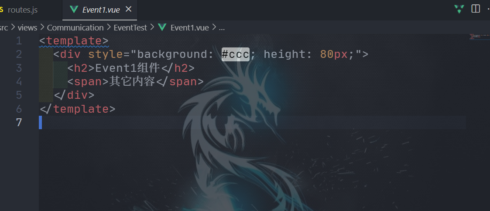

# 10 【组件编码流程 组件自定义事件 全局事件总线】

## 1.组件编码流程

1. 组件化编码流程：

   ​	(1).拆分静态组件：组件要按照功能点拆分，命名不要与html元素冲突。

   ​	(2).实现动态组件：考虑好数据的存放位置，数据是一个组件在用，还是一些组件在用：

   ​			1).一个组件在用：放在组件自身即可。

   ​			2). 一些组件在用：放在他们共同的父组件上（<span style="color:red">状态提升</span>）。

   ​	(3).实现交互：从绑定事件开始。

2. props适用于：

   ​	(1).父组件 ==> 子组件 通信

   ​	(2).子组件 ==> 父组件 通信（要求父先给子一个函数）

3. 使用v-model时要切记：v-model绑定的值不能是props传过来的值，因为props是不可以修改的！

4. props传过来的若是对象类型的值，修改对象中的属性时Vue不会报错，但不推荐这样做。

## 2.组件自定义事件

组件自定义事件是一种组件间通信的方式，适用于：<strong style="color:red">子组件 ===> 父组件</strong>

**使用场景**

A是父组件，B是子组件，B想给A传数据，那么就要在A中给B绑定自定义事件（<span style="color:red">事件的回调在A中</span>）。

### 2.1绑定自定义事件

第一种方式，在父组件中：```<Demo @atguigu="test"/>```  或 ```<Demo v-on:atguigu="test"/>```

> 具体代码

App.vue

```vue
<template>
	<div class="app">
		<!-- 通过父组件给子组件绑定一个自定义事件实现：子给父传递数据（第一种写法，使用@或v-on） -->
		<Student @atguigu="getStudentName"/> 
	</div>
</template>

<script>
	import Student from './components/Student'

	export default {
		name:'App',
		components:{Student},
		data() {
			return {
				msg:'你好啊！',
				studentName:''
			}
		},
		methods: {
			getStudentName(name,...params){
				console.log('App收到了学生名：',name,params)
				this.studentName = name
			}
		}
	}
</script>

<style scoped>
	.app{
		background-color: gray;
		padding: 5px;
	}
</style>

```

Student.vue

```vue
<template>
	<div class="student">
		<button @click="sendStudentlName">把学生名给App</button>
	</div>
</template>

<script>
	export default {
		name:'Student',
		data() {
			return {
				name:'张三',
			}
		},
		methods: {
			sendStudentlName(){
				//触发Student组件实例身上的atguigu事件
				this.$emit('atguigu',this.name,666,888,900)
			}
		},
	}
</script>

<style lang="less" scoped>
	.student{
		background-color: pink;
		padding: 5px;
		margin-top: 30px;
	}
</style>

```


第二种方式，在父组件中：

使用 **this.$refs.xxx.$on**() 这样写起来更灵活，比如可以加定时器啥的。

> 具体代码

App.vue

```vue
<template>
	<div class="app">
		<!-- 通过父组件给子组件绑定一个自定义事件实现：子给父传递数据（第二种写法，使用ref） -->
		<Student ref="student"/>
	</div>
</template>

<script>
	import Student from './components/Student'

	export default {
		name:'App',
		components:{Student},
		data() {
			return {
				studentName:''
			}
		},
		methods: {
			getStudentName(name,...params){
				console.log('App收到了学生名：',name,params)
				this.studentName = name
			},
		},
		mounted() {
			this.$refs.student.$on('atguigu',this.getStudentName) //绑定自定义事件
			// this.$refs.student.$once('atguigu',this.getStudentName) //绑定自定义事件（一次性）
		},
	}
</script>

<style scoped>
	.app{
		background-color: gray;
		padding: 5px;
	}
</style>

```

Student.vue

```vue
<template>
	<div class="student">
		<button @click="sendStudentlName">把学生名给App</button>
	</div>
</template>

<script>
	export default {
		name:'Student',
		data() {
			return {
				name:'张三',
			}
		},
		methods: {
			sendStudentlName(){
				//触发Student组件实例身上的atguigu事件
				this.$emit('atguigu',this.name,666,888,900)
			}
		},
	}
</script>

<style lang="less" scoped>
	.student{
		background-color: pink;
		padding: 5px;
		margin-top: 30px;
	}
</style>

```

> 若想让自定义事件只能触发一次，可以使用```once```修饰符，或```$once```方法。
>
> 触发自定义事件：```this.$emit('atguigu',数据)```		
>
> 使用 this.$emit() 就可以子组件向父组件传数据

> 注意：通过```this.$refs.xxx.$on('atguigu',回调)```绑定自定义事件时，回调<span style="color:red">要么配置在methods中</span>，<span style="color:red">要么用箭头函数</span>，否则this指向会出问题！

### 2.2解绑自定义事件

```this.$off('atguigu')```

> 代码

```js
this.$off('atguigu') //解绑一个自定义事件
// this.$off(['atguigu','demo']) //解绑多个自定义事件
// this.$off() //解绑所有的自定义事件
```

### 2.3组件使用原生事件

**组件上也可以绑定原生DOM事件，需要使用```native```修饰符。**

> 如果不用.native修饰符就会被当成自定义事件

```vue
<!-- 通过父组件给子组件绑定一个自定义事件实现：子给父传递数据（第二种写法，使用ref） -->
    <Event1 @click.native="handler1"></Event1>
```

> 1:原生DOM---button可以绑定系统事件----click单击事件等等
>
> 2:组件标签--- event1可以绑定系统事件(不起作用,因为属于自定义事件)----native(可以把自定义事件变为原生DOM事件)

利用[native](https://so.csdn.net/so/search?q=native&spm=1001.2101.3001.7020)触发---原理是事件委派

在`views/Communication/EventTest/Event1.vue`中:

他的结构是这样的,但是我们在页面中,不管是点击Event1组件,还是其他内容,都可以触发打印,那是因为当前原生DOMclick事件,其实是给子组件的根节点div绑定了点击事件----利用事件委派,所以里面的h2和span也是可以触发打印的



> 注意:给**原生DOM绑定自定义事件没有任何意义的**,因为没有办法触发$emit函数
>
> 一般是给组件绑定自定义事件在结合$on,$emit使用

### 2.4自定义组件中的$event

一般子组件传给父组件的值在methods对象中的函数接收，然而有时想从当前组件传些数据，但是这样就无法接收子组件传来的数据了

这时可以使用$event

```js
子组件 传值
export default {
    methods: {
        customEvent() {
            this.$emit( custom-event ,  value )
        }
    }
}
 
 
父组件 
接收自定义事件
<template>
    <div>
        <my-item v-for="(item, index) in list" @custom-event="customEvent(index, $event)">
            </my-list>
    </div>
</template>
 
 
接收$event
export default {
    methods: {
        //e就是接收过来的$event 现在他就是子组件传过来的值 不再是 对象事件 
        customEvent(index, e) {
            console.log(e) //  some value
        }
    }
}
```


## 3.全局事件总线

**一种可以在任意组件间通信的方式**，本质上就是一个对象，它必须满足以下条件

1. 所有的组件对象都必须能看见他 
2. 这个对象必须能够使用$on$emit$off方法去绑定、触发和解绑事件

**使用步骤**

1. 一种组件间通信的方式，适用于<span style="color:red">任意组件间通信</span>。

2. 安装全局事件总线：

   ```js
   new Vue({
   	......
   	beforeCreate() {
   		Vue.prototype.$bus = this //安装全局事件总线，$bus就是当前应用的vm
   	},
       ......
   }) 
   ```

3. 使用事件总线：

   1. 接收数据：A组件想接收数据，则在A组件中给$bus绑定自定义事件，事件的<span style="color:red">回调留在A组件自身。</span>

      ```js
      methods(){
        demo(data){......}
      }
      ......
      mounted() {
        this.$bus.$on('xxxx',this.demo)
      }
      ```

   2. 提供数据：```this.$bus.$emit('xxxx',数据)```

4. 最好在`beforeDestroy`钩子中，用$off去解绑<span style="color:red">当前组件所用到的</span>事件。

   > 因为销毁的时候只会把组件销毁，不会把$bus上的销毁，下车要把东西带走。