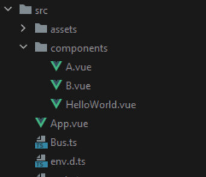

# 18 【Vue3组件通信方总结式】

> **通信仓库地址:**[**https://gitee.com/jch1011/vue3_communication.git**](https://gitee.com/jch1011/vue3_communication.git)
>
> 不管是vue2还是vue3,组件通信方式很重要,不管是项目还是面试都是经常用到的知识点。

## 1.props

`props`可以实现父子组件通信,在`vue3`中我们可以通过`defineProps`获取父组件传递的数据。且在组件内部不需要引入`defineProps`方法可以直接使用！

**父组件给子组件传递数据**

```vue
<Child info="我爱祖国" :money="money"></Child>
```

**子组件获取父组件传递数据:方式1**

```js
const props = defineProps({
  info:{
    type:String,//接受的数据类型
    default:'默认参数',//接受默认数据
  },
  money:{
    type:Number,
    default:0
  }})
```

**子组件获取父组件传递数据:方式2**

```js
const props = defineProps(["info",'money']);
```

子组件获取到props数据就可以在模板中使用了,但是切记props是只读的(只能读取，不能修改)

```vue
<p>{{ info  }}</p>
<p>{{ money  }}</p>
<!-- 推荐使用上面这种使用方式  -->
<p>{{ props.info  }}</p>
<p>{{ props.money  }}</p>
```

## 2.自定义事件

在vue框架中事件分为两种:一种是原生的DOM事件，另外一种自定义事件。

原生DOM事件可以让用户与网页进行交互，比如click、dbclick、change、mouseenter、mouseleave....

自定义事件可以实现子组件给父组件传递数据

### 2.1 原生DOM事件

代码如下:

```vue
<pre @click="handler">
  		   我是祖国的老花骨朵
</pre>
```

当前代码级给`pre`标签绑定原生DOM事件点击事件，默认会给事件回调注入event事件对象。当然点击事件想注入多个参数可以按照下图操作。但是切记注入的事件对象务必叫做`$event`。

```vue
<div @click="handler1(1,2,3,$event)">我要传递多个参数</div>
```

在`vue3`框架`click、dbclick、change`(这类原生DOM事件)，不管是在标签、自定义标签上(组件标签)都是原生DOM事件。

**vue2中却不是这样的,在vue2中组件标签需要通过.native修饰符才能变为原生DOM事件**

### 2.2 自定义事件

自定义事件可以实现子组件给父组件传递数据.在项目中是比较常用的。

比如在父组件内部给子组件(Event2)绑定一个自定义事件

```vue
<Event2  @xxx="handler3"></Event2>
```

在Event2子组件内部触发这个自定义事件

> **`Vue3`移除**`v-on.native`修饰符，那如何在组件上触发原生事件呢？
>
> 其实可以利用属性继承，详细可以看`Attributes 继承`。
>
> **注意要写根标签，因为这个事件只会继承在根标签**，**因为`Vue3`不强制写根标签**，所以会出现多个标签，这时这个事件找不到根标签会发出警告，解决的方法在`Attributes 继承`里面说了。

```vue
<template>
  <div>
    <h1>我是子组件2</h1>
    <button @click="handler">点击我触发xxx自定义事件</button>
    <button @click='$emit("xxx", "法拉利", "茅台")'>点击我触发xxx自定义事件</button>
  </div>
</template>

<script setup lang="ts">
  const emit = defineEmits(["xxx"]);
  const handler = () => {
    emit("xxx", "法拉利", "茅台");
  };
</script>
<style scoped>
</style>
```

我们会发现在script标签内部，使用了`defineEmits`方法，此方法是vue3提供的方法,不需要引入直接使用。`defineEmits`方法执行，传递一个数组，数组元素即为将来组件需要触发的自定义事件类型，此方执行会返回一个$emit方法用于触发自定义事件。

当点击按钮的时候，事件回调内部调用`emit`方法去触发自定义事件,第一个参数为触发事件类型，第二个、三个、N个参数即为传递给父组件的数据。在组件的模板表达式中，也可以直接使用 `$emit` 方法触发自定义事件。

需要注意的是:代码如下

```vue
<Event2  @xxx="handler3" @click="handler"></Event2>
```

正常说组件标签书写`@click`应该为`原生DOM`事件，但是如果子组件内部通过`defineEmits`定义就变为自定义事件了。

> 简单来说就是不用`defineEmits`声明就不会当成自定义事件。

```js
const emit = defineEmits(["xxx",'click']);
```

## 3.全局事件总线

#### 3.1 插件

1. 在vue3中，创建方法改成了`createApp({})`，`prototype`属性也被取消了，因此无法使用之前`Vue.prototype.$bus = new Vue()`的方式使用事务总线。

2. 且在vue3中移除了`$on,$off`方法，因此官方推荐：事件总线模式可以被替换为使用外部的、实现了事件触发器接口的库，例如 `mitt `或 `tiny-emitter`。

3. 首先安装`mitt`

   ```bash 
   npm install --save mitt
   ```

4. 在代码中使用：

```js
import mitt from "mitt"
import {createApp} from "vue"
 
const app = createApp(App)//正常配置
//挂载事务总线
app.config.globalProperties.$bus = mitt()
 
//在组件A中使用事务总线触发某个动作
import {getCurrentInstance } from 'vue';
const instance = getCurrentInstance();
function send() {
  instance.proxy.$bus.emit('receive', '你是一个瓜皮');
}
 
//在组件B中监听动作的发生
import { getCurrentInstance } from 'vue';
let data = ref('');

// const instance = getCurrentInstance();
const { $bus }: any = getCurrentInstance().appContext.config.globalProperties

$bus.on('receive', str => {
  console.log('来数据了');
  data.value = str;
});

```

**在ts项目中的用法**

```typescript
import { createApp } from 'vue'
import App from './App.vue'
import mitt from 'mitt'
 
const Mitt = mitt()
 
//TypeScript注册
// 由于必须要拓展ComponentCustomProperties类型才能获得类型提示
declare module "vue" {
    export interface ComponentCustomProperties {
        $bus: typeof Mitt
    }
}
 
const app = createApp(App)
 
//Vue3挂载全局API
app.config.globalProperties.$Bus = Mitt
 
app.mount('#app')
```

#### 3.2 手写

`Bus.ts`

```typescript
import * as Console from 'console'


type BusClass = {
    emit: (name: string) => void,
    on: (name: string, callback: Function) => void
}

type CallbackName = string | number | symbol

type List = {
    [key: CallbackName]: Array<Function>
}

class Bus implements BusClass {
    list: List

    constructor() {
        this.list = {}
    }

    emit(name: string, ...args: Array<any>) {
        let callbacks: Array<Function> | undefined = this.list[name]
        if (callbacks === undefined) {
            console.warn(`event "${name}" is not bound`)
            return
        }
        callbacks.forEach(callback => {
            console.log('emit', this)
            callback.apply(this, args)  // this 为 Bus.ts 导出的实例, on方法如果使用ArrowFunction, 则无法使用this
        })
    }

    on(name: string, callback: Function) {
        let callbacks: Array<Function> = this.list[name] || []
        callbacks.push(callback)
        this.list[name] = callbacks
    }
}

export default new Bus()
```

> 挂载到全局`Vue config`或者单独的页面引入`import Bus from ‘bus.ts’`
> `Bus.emit `触发，`Bus.on`监听



`main.ts`

```ts
import { createApp } from 'vue'
import App from './App.vue'
import Bus from "./utils/Bus"
const app = createApp(App);
app.config.globalProperties.$bus = Bus;
app.mount('#app')
```

使用方法和插件一模一样

## 4.v-model

`v-model`指令可是收集表单数据(数据双向绑定)，除此之外它也可以实现父子组件数据同步。

而`v-model`实指利用参数`modelValue`与自定义事件`update:modelValue`实现的。

下方代码:相当于给组件`Child`传递一个`props`与绑定一个`自定义事件`。

父组件：

```vue
<Child :modelValue="msg" @update:modelValue="msg = value"></Child>
<Child v-model="msg"></Child>
```

子组件：

```vue
<template>
	   <div>
         <p>{{ msg }}</p>
         <button @click="$emit('update:modelValue', '已被子组件修改')"> 点击修改msg的值 </button>
    </div>
</template>

<script setup>
	  defineProps(['msg'])
   defineEmits(['update:modelValue'])
</script>
```

在`vue3`中一个组件可以通过使用多个`v-model`，让父子组件多个数据同步，下方代码相当于给组件Child**传递两个props**分别是`pageNo`与`pageSize`，以及**绑定两个自定义**事件`update:pageNo`与`update:pageSize`实现父子数据同步

```vue
<Child v-model:pageNo="msg" v-model:pageSize="msg1"></Child>
```

```vue
<template>
	   <div>
         <p>{{ pageNo }}</p>
         <button @click="$emit('update:pageNo', pageNo+1)"> 点击修改pageNo的值 </button>
         <p>{{ pageSize }}</p>
         <button @click="$emit('update:pageSize', pageSize+2)"> 点击修改pageSize的值 </button>
    </div>
</template>

<script setup>
	  defineProps(['pageNo', 'pageSize'])
   defineEmits(['update:pageNo', 'update:pageSize'])
</script>
```

## 5.$attrs 和 useAttrs

在Vue3中可以利用`useAttrs`方法获取组件的属性与事件(包含:原生DOM事件或者自定义事件)，类似于Vue2框架中`$attrs属性`与`$listeners方法`。

首先在组件选项中设置 `inheritAttrs: false`，阻止一个组件自动地继承 `attribute`。

从 3.3 开始你也可以直接在 `<script setup>` 中使用 [`defineOptions`](https://cn.vuejs.org/api/sfc-script-setup.html#defineoptions)：

```vue
<script setup>
defineOptions({
  inheritAttrs: false
})
// ...setup 逻辑
</script>
```

最常见的需要禁用 attribute 继承的场景就是 attribute 需要应用在根节点以外的其他元素上。通过设置 `inheritAttrs` 选项为 `false`，你可以完全控制透传进来的 attribute 被如何使用。

这些透传进来的 attribute 可以在模板的表达式中直接用 `$attrs` 访问到。

```vue
<span>Fallthrough attribute: {{ $attrs }}</span>
```

这个 `$attrs` 对象包含了除组件所声明的 `props` 和 `emits` 之外的所有其他 attribute，例如 `class`，`style`，`v-on` 监听器等等。

有几点需要注意：

- 和 props 有所不同，透传 attributes 在 JavaScript 中保留了它们原始的大小写，所以像 `foo-bar` 这样的一个 attribute 需要通过 `$attrs['foo-bar']` 来访问。
- 像 `@click` 这样的一个 `v-on` 事件监听器将在此对象下被暴露为一个函数 `$attrs.onClick`。

比如:在父组件内部使用一个子组件`my-button`。

```vue
<my-button type="success" size="small" title='标题' @click="handler"></my-button>
```

我们想要所有像 `class` 和 `v-on` 监听器这样的透传 attribute 都应用在内部的 `<button>` 上而不是外层的 `<div>` 上。我们可以通过设定 `inheritAttrs: false` 和使用 `v-bind="$attrs"` 来实现：

```vue
<div class="btn-wrapper">
  	  <el-button  v-bind="$attrs">click me</el-button>
</div>
```

小提示：[没有参数的 `v-bind`](https://cn.vuejs.org/guide/essentials/template-syntax.html#dynamically-binding-multiple-attributes) 会将一个对象的所有属性都作为 attribute 应用到目标元素上。

也可以利用`useAttrs`方法实现：

```vue
<template>
    <div class="btn-wrapper">
        <el-button v-bind="attrs">click me</el-button>
    </div>
</template>

<script setup lang="ts">
import {useAttrs} from 'vue';
    
const attrs = useAttrs();
</script>
```

**需要注意如果`defineProps`接收了某一个属性，`useAttrs`方法返回的对象身上就没有相应属性与属性值。**

## 6.ref 和 $parent

提及到`ref`可能会想到它可以获取元素的DOM或者获取子组件实例的VC。既然可以在父组件内部通过ref获取子组件实例VC，那么子组件内部的方法与响应式数据父组件可以使用的。

比如:在父组件挂载完毕获取组件实例

父组件内部代码:

```vue
<template>
    <div>
        <h1>ref与$parent</h1>
        <Son ref="son"></Son>
    </div>
 </template>

<script setup lang="ts"> 
import Son from "./Son.vue";
import { onMounted, ref } from "vue";
    
const son = ref();
onMounted(() => {
  console.log(son.value);
});
</script>
```

但是需要注意，如果想让父组件获取子组件的数据或者方法需要通过`defineExpose`对外暴露，因为vue3中组件内部的数据对外“关闭的”，外部不能访问。

```vue
<script setup lang="ts">
import { ref } from "vue";
    
//数据
let money = ref(1000);
//方法
const handler = ()=>{
}
defineExpose({
  money,
  handler
})
  </script>
```

`$parent`可以获取某一个组件的父组件实例VC,因此可以使用父组件内部的数据与方法。必须子组件内部拥有一个按钮点击时候获取父组件实例，当然父组件的数据与方法需要通过`defineExpose方法`对外暴露

```html
<button @click="handler($parent)">点击我获取父组件实例</button>
```

## 7.provide 与 inject

**provide[提供]**

**inject[注入]**

vue3提供两个方法`provide`与`inject`,可以实现隔辈组件传递参数。

组件组件提供数据:

`provide`方法用于提供数据，此方法执需要传递两个参数,分别提供数据的`key`与提供数据`value`。

注意：后代组件修改的时候，源数据也会修改

```vue
<script setup lang="ts">
import {provide} from 'vue'
provide('token','admin_token');
</script>
```

后代组件可以通过`inject`方法获取数据,通过`key`获取存储的数值

```vue
<script setup lang="ts">
import {inject} from 'vue'
let token = inject('token');
</script>
```

## 8.pinia

**pinia官网：https://pinia.web3doc.top/**

pinia也是集中式管理状态容器,类似于vuex。但是核心概念没有mutation、modules，使用方式参照官网。

## 9.slot

插槽：默认插槽、具名插槽、作用域插槽可以实现父子组件通信.

**默认插槽:**

在子组件内部的模板中书写slot全局组件标签

```vue
<template>
  <div>
    <slot></slot>
  </div>
</template>
<script setup lang="ts">
</script>
```

在父组件内部提供结构：Todo即为子组件,在父组件内部使用的时候，在双标签内部书写结构传递给子组件

注意开发项目的时候默认插槽一般只有一个

```vue
<Todo>
  <h1>我是默认插槽填充的结构</h1>
</Todo>
```

**具名插槽：**

顾名思义，此插槽带有名字在组件内部留多个指定名字的插槽。

下面是一个子组件内部,模板中留两个插槽

```vue
<template>
  <div>
    <h1>todo</h1>
    <slot name="a"></slot>
    <slot name="b"></slot>
  </div>
</template>

<script setup lang="ts">
</script>
```

父组件内部向指定的具名插槽传递结构。需要注意v-slot：可以替换为#

```vue
<template>
  <div>
    <h1>slot</h1>
    <Todo>
      <template v-slot:a>
        <div>填入组件A部分的结构</div>
      </template>
      <template #b>
        <div>填入组件B部分的结构</div>
      </template>
    </Todo>
  </div>
</template>

<script setup lang="ts">
  import Todo from './Todo.vue'
</script>
```

**作用域插槽**

作用域插槽：可以理解为，子组件数据由父组件提供，但是子组件内部决定不了自身结构与外观(样式)

子组件Todo代码如下:

```vue
<template>
  <div>
    <h1>todo</h1>
    <ul>
      <!--组件内部遍历数组-->
      <li v-for="(item,index) in todos" :key="item.id">
        <!--作用域插槽将数据回传给父组件-->
        <slot :$row="item" :$index="index"></slot>
      </li>
    </ul>
  </div>
</template>

<script setup lang="ts">
  defineProps(['todos']);//接受父组件传递过来的数据
</script>
```

父组件内部代码如下:

```vue
<template>
  <div>
    <h1>slot</h1>
    <Todo :todos="todos">
      <template v-slot="{ $row, $index }">
        <!--父组件决定子组件的结构与外观-->
        <span :style="{ color: $row.done ? 'green' : 'red' }">{{ $row.title }}</span>
      </template>
    </Todo>
  </div>
</template>

<script setup lang="ts">
  import Todo from './Todo.vue'
  import { ref } from 'vue'
  //父组件内部数据
  let todos = ref([
    { id: 1, title: '吃饭', done: true },
    { id: 2, title: '睡觉', done: false },
    { id: 3, title: '打豆豆', done: true },
  ])
</script>
<style scoped></style>

```

