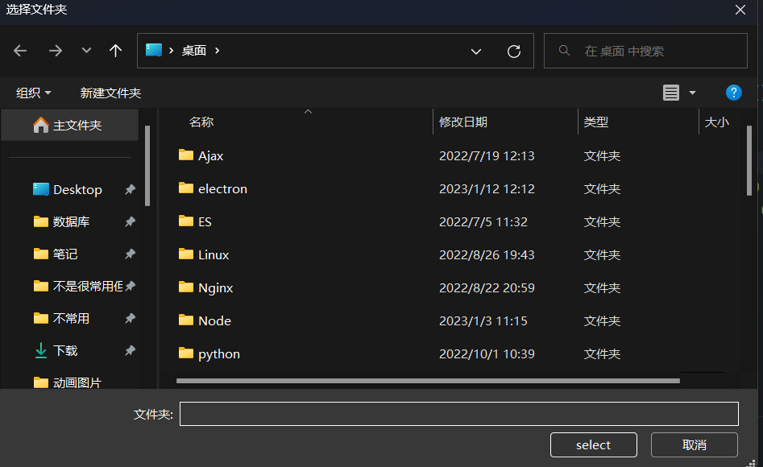
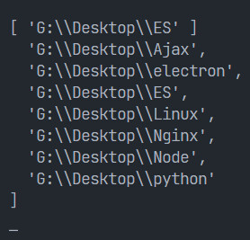
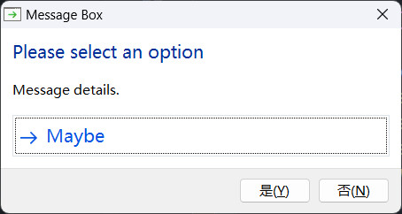

# 06 【electron对话框】

> 显示用于打开和保存文件、警报等的本机系统对话框

## 1.选择文件

`browserWindow` 参数允许该对话框将自身附加到父窗口, 作为父窗口的模态框。

`dialog.showOpenDialog([browserWindow, ]options)`

- `browserWindow` [BrowserWindow](https://www.electronjs.org/zh/docs/latest/api/browser-window) (可选)
- `选项` 对象
  - `title` string (可选) - 对话框窗口的标题
  - `defaultPath` string (可选) - 对话框的默认展示路径
  - `buttonLabel` string (可选) - 「确认」按钮的自定义标签, 当为空时, 将使用默认标签。
  - `filters` [FileFilter[\]](https://www.electronjs.org/zh/docs/latest/api/structures/file-filter) (可选)
  - `properties` string[] (可选) - 包含对话框相关属性。 支持以下属性值:
    - `openFile` - 允许选择文件
    - `openDirectory` - 允许选择文件夹
    - `multiSelections`-允许多选。
    - `showHiddenFiles`-显示对话框中的隐藏文件。
    - `createDirectory` *macOS* -允许你通过对话框的形式创建新的目录。
    - `promptToCreate` *Windows*-如果输入的文件路径在对话框中不存在, 则提示创建。 这并不是真的在路径上创建一个文件，而是允许返回一些不存在的地址交由应用程序去创建。
    - `noResolveAliases` *macOS*-禁用自动的别名路径(符号链接) 解析。 所选别名现在将会返回别名路径而非其目标路径。
    - `treatPackageAsDirectory` *macOS* -将包 (如 `.app `文件夹) 视为目录而不是文件。
    - `dontAddToRecent` *Windows* - 不要将正在打开的项目添加到最近的文档列表中。
  - `message` string (可选) *macOS* -显示在输入框上方的消息。
  - `securityScopedBookmarks` boolean (可选) *macOS* *mas* - 在打包提交到Mac App Store时创建 [security scoped bookmarks](https://developer.apple.com/library/content/documentation/Security/Conceptual/AppSandboxDesignGuide/AppSandboxInDepth/AppSandboxInDepth.html#//apple_ref/doc/uid/TP40011183-CH3-SW16)

返回 `Promise<Object>` - resolve包含以下内容的object：

- `canceled` boolean - 对话框是否被取消。
- `filePaths` string[] - 用户选择的文件路径的数组. 如果对话框被取消，这将是一个空的数组。
- `bookmarks` string[] (optional) *macOS* *mas* - 一个数组， `filePaths` 数组，base64编码字符串包含安全范围书签数据。 `securityScopedBookmarks` 必须启用才能捕获数据。 (返回值见 [这里的表格](https://www.electronjs.org/zh/docs/latest/api/dialog#bookmarks-array)。)

`filters` 指定一个文件类型数组，用于规定用户可见或可选的特定类型范围。 例如：

```javascript
{
  filters: [
    { name: 'Images', extensions: ['jpg', 'png', 'gif'] },
    { name: 'Movies', extensions: ['mkv', 'avi', 'mp4'] },
    { name: 'Custom File Type', extensions: ['as'] },
    { name: 'All Files', extensions: ['*'] }
  ]
}
```

`extensions` 数组应为没有通配符或点的扩展名 (例如, `"png"` 是正确的, 而 `".png"` 和 `*. png "` 就是错误的)。 若要显示所有文件, 请使用 `"*"` 通配符 (不支持其他通配符)。

**注意:** 在 Windows 和 Linux 上, 打开对话框不能同时是文件选择器和目录选择器, 因此如果在这些平台上将 `properties` 设置为`["openFile"、"openDirectory"]`, 则将显示为目录选择器。

```js
dialog.showOpenDialog(mainWindow, {
  properties: ['openFile', 'openDirectory']
}).then(result => {
  console.log(result.canceled)
  console.log(result.filePaths)
}).catch(err => {
  console.log(err)
})
```

例子：

```js
const {app, BrowserWindow, dialog} = require('electron')

mainWindow.webContents.on('did-finish-load', () => {
  dialog.showOpenDialog({
    buttonLabel: 'select',
    defaultPath: app.getPath('desktop'),
    properties: ['multiSelections', 'createDirectory', 'openFile', 'openDirectory']
  }).then((result)=> {
    console.log(result.filePaths)
  })
})
```



终端输出：



## 2.保存文件

`browserWindow` 参数允许该对话框将自身附加到父窗口, 作为父窗口的模态框。

`dialog.showSaveDialog([browserWindow, ]options)`

- `browserWindow` [BrowserWindow](https://www.electronjs.org/zh/docs/latest/api/browser-window) (可选)
- `选项` 对象
  - `title` string (可选) - 对话框标题。 无法在一些 *Linux* 桌面环境中显示。
  - `defaultPath` string (可选) - 默认情况下使用的绝对目录路径、绝对文件路径或文件名。
  - `buttonLabel` string (可选) - 「确认」按钮的自定义标签, 当为空时, 将使用默认标签。
  - `filters` [FileFilter[\]](https://www.electronjs.org/zh/docs/latest/api/structures/file-filter) (可选)
  - `message` string (可选) *macOS* -显示在对话框上的消息。
  - `nameFieldLabel` string (可选) *macOS* - 文件名输入框对应的自定义标签名。
  - `showsTagField` boolean (可选) *macOS* - 显示标签输入框，默认为 `true`。
  - `properties` string[] (可选)
    - `showHiddenFiles`-显示对话框中的隐藏文件。
    - `createDirectory` *macOS* -允许你通过对话框的形式创建新的目录。
    - `treatPackageAsDirectory` *macOS* -将包 (如 `.app `文件夹) 视为目录而不是文件。
    - `showOverwriteConfirmation` *Linux* - 设置如果用户输入了已存在的文件名，是否会向用户显示确认对话框。
    - `dontAddToRecent` *Windows* - 不要将正在保存的项目添加到最近的文档列表中。
  - `securityScopedBookmarks` boolean (可选) *macOS* *mas* - 在打包提交到Mac App Store时创建 [security scoped bookmarks](https://developer.apple.com/library/content/documentation/Security/Conceptual/AppSandboxDesignGuide/AppSandboxInDepth/AppSandboxInDepth.html#//apple_ref/doc/uid/TP40011183-CH3-SW16) 当该选项被启用且文件尚不存在时，那么在选定的路径下将创建一个空文件。

返回 `Promise<Object>` - resolve包含以下内容的object：

- `canceled` boolean - 对话框是否被取消。
- `filePath` string (可选) - 如果对话框被取消，该值为 `undefined`。
- `bookmark` string(optional) *macOS* *mas* - 包含了安全作用域的书签数据 Base64 编码的字符串来保存文件。 `securityScopedBookmarks` 必须启用才有效。 (返回值见 [这里的表格](https://www.electronjs.org/zh/docs/latest/api/dialog#bookmarks-array)。)

`filters` 可以指定可显示文件的数组类型，详见 `dialog.showOpenDialog` 事例

**注意：** 在macOS上，建议使用异步版本，以避免展开和折叠对话框时出现问题。


```js
dialog.showSaveDialog().then(result => {
  console.log(result)
  fs.writeFileSync(result.filePath, 'dselegent')
})
```


## 3.消息框

显示一个消息框

`browserWindow` 参数允许该对话框将自身附加到父窗口, 作为父窗口的模态框。

`dialog.showMessageBox([browserWindow, ]options)`

- `browserWindow` [BrowserWindow](https://www.electronjs.org/zh/docs/latest/api/browser-window) (可选)
- `选项` 对象
  - `message` string - message box 的内容.
  - `type` string (可选) - 可以为 `"none"`, `"info"`, `"error"`, `"question"` 或者 `"warning"`. 在 Windows 上, `"question"` 与`"info"`显示相同的图标, 除非你使用了 `"icon"` 选项设置图标。 在 macOS 上, `"warning"` 和 `"error"` 显示相同的警告图标
  - `buttons` string[] (可选) - 按钮文本数组。 在 Windows上，一个空数组将导致按钮被标为“OK”。
  - `defaultId` Integer (可选) - 在 message box 对话框打开的时候，设置默认选中的按钮，值为在 buttons 数组中的索引.
  - `signal` AbortSignal (可选) - 通过 [AbortSignal](https://nodejs.org/api/globals.html#globals_class_abortsignal) 信号实例可选地关闭消息框，消息框的行为就像用户点击取消一样。 在 macOS, `signal` 不适用于没有父窗口的消息框。因为平台限制，这些消息框同步运行
  - `title` string (可选) - message box 的标题，一些平台不显示.
  - `detail` string (可选) - 额外信息.
  - `checkboxLabel` string (可选) - 如果使用了，消息框将包含带有给定标签的复选框。
  - `checkboxChecked` boolean (可选) - checkbox 的初始值。 默认值为 `false`
  - `icon` ([NativeImage](https://www.electronjs.org/zh/docs/latest/api/native-image) | string) (可选)
  - `textWidth` Integer (可选) *macOS* - 自定义消息框中文本的宽度
  - `cancelId` Integer (可选) - 用于取消对话框的按钮的索引，例如 `Esc` 键. 默认情况下，它被分配给第一个按钮，文字为 “cancel” 或 “no”。 如果不存在这个标签的按钮，同时该选项又未设置，返回值为`0`。
  - `noLink` boolean (可选) - 在Windows上，应用将尝试找出哪个 `buttons` 是常用按钮(例如 "Cancel" 或 "Yes")，然后在对话框中以链接命令的方式展现其它的按钮。 这可以使对话框以现代Windows应用程序的风格显示。 如果你不喜欢这个行为, 你可以设置 `noLink` 为 `true`.
  - `normalizeAccessKeys` boolean (可选) -规范跨平台的键盘访问键。 默认值为 `false`. 用 `&` 连接和转换键盘访问键, 以便它们在每个平台上正常工作.`&` 字符会在macOS上被删除，在 Linux 上会被转换为 `_`，在 Windows 上保持不变。 例如 `Vie&w` 的按钮标签在 Linux 上会被转换为 `Vie_w`，在 macOS 转换为 `View` 并且可以被选择。而Windows和Linux上表示 `Alt-W` 。

返回 `Promise<Object>` - resolve包含以下属性的promise：

- `response` number - 点击的按钮的索引。
- `checkboxChecked` boolean - 如果设置了 `checkboxLabel`，返回复选框是否被选中的状态。 否则，返回 `false`。

```js
const answers = ['Yes', 'No', 'Maybe']
dialog.showMessageBox({
  title: 'Message Box',
  message: 'Please select an option',
  detail: 'Message details.',
  buttons: answers
}).then(({response}) => {
  console.log(`User selected: ${answers[response]}`)
})
```

