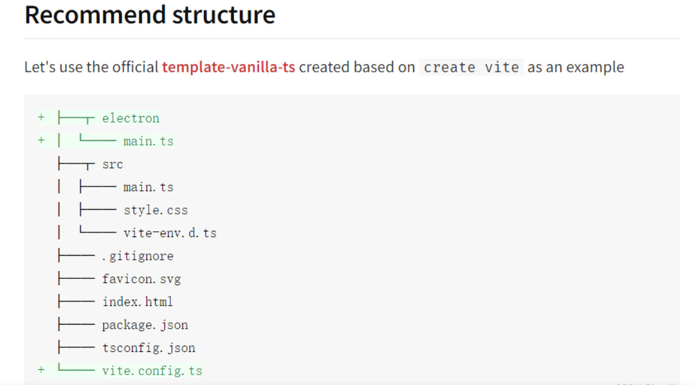
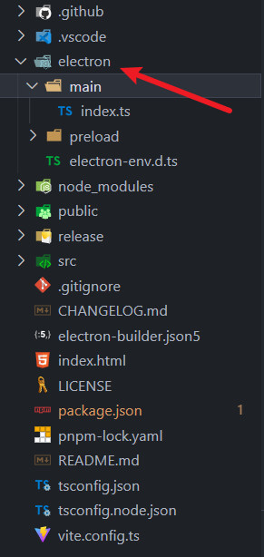
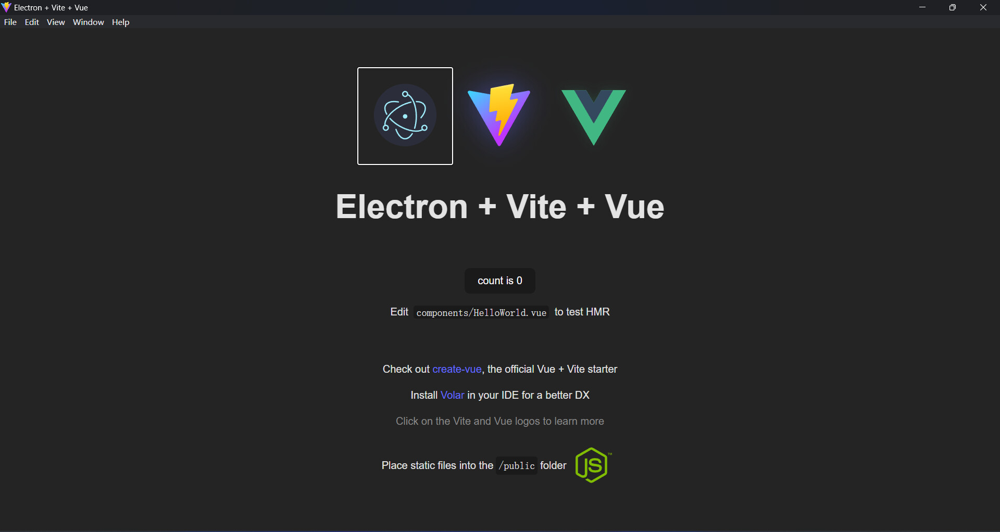
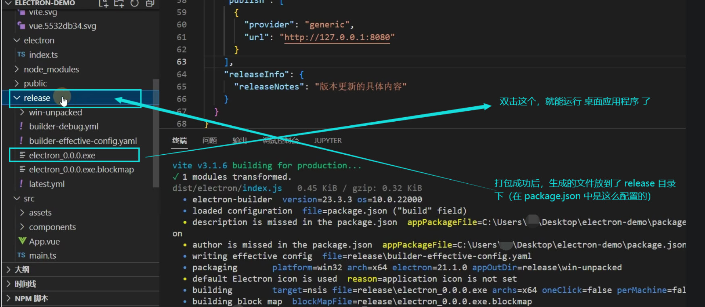

# 10 【Vite + Vue3 + Electron 创建打包桌面程序】

## 1.使用 Vite 构建 Electron 项目

### 1.1 创建 Vite 应用，安装 Electron 依赖

创建一个 Vite 项目

```bash
npm init vite@latest
```

安装 Electron 相关依赖

```bash
npm install electron -D
npm install vite-plugin-electron -D 
```

### 1.2 在 vite.config.ts 中，配置 Electron 入口文件



根据上方官网提示，创建 `electron/main/index.ts`，与 src 目录同级



配置 Electron 入口文件 —— 打开 vite.config.ts，引入 `electron/main/index.ts`

```ts
import { defineConfig } from 'vite'
import vue from '@vitejs/plugin-vue'
import electron from 'vite-plugin-electron'
 
export default defineConfig({
  plugins: [vue(), electron({
    main: {
      // 配置 Electron 入口文件
			entry: 'electron/main/index.ts',    
    }
  })]
})
```

这么配置，就启动一个 Vite 应用就行。

### 1.3 编写 electron / index.ts

#### 1.3.1 app、BrowserWindow

在 electron 依赖中，可以引入 app、BrowserWindow：

- app 控制应用程序的事件生命周期（相当于应用程序）
- BrowserWindow 创建并控制浏览器窗口（相当于打开桌面弹框）

实例化 BrowserWindow 对象，创建一个窗口，在内部通过 nodeIntegration、contextIsolation 集成网页和 Node.js（也就是在渲染进程中，可以调用 Node.js 方法）

#### 1.3.2 使用 win.loadURL 加载窗口 / Vite 环境变量

使用 win.loadURL 加载窗口，接收的网址是指：Vite 启动后，会在本地运行一个服务，把这个服务网址丢进去就行

- 使用 Vite 自带的环境变量 VITE_DEV_SERVER_HOST
- 如果是 undefined，就换成 VITE_DEV_SERVER_HOSTNAME（现在应该采用这个了）
- ps：在 Vite 3.2.41中，使用 VITE_DEV_SERVER_URL 表示 Vite 服务器本地路径

关于 Vite 环境变量，可以去终端看下


#### 1.3.3 使用 app.whenReady() 初始化app

最后，使用 `app.whenReady()` 初始化app（在 Electron 完成初始化时触发）

初始化完成后，再挂载上面创建的 桌面应用程序窗口

### 1.3.4 整理 electron/main/index.ts

- 开发环境下，我们访问的是 Vite 本地服务
- 打包之后，我们访问的是 dist 静态文件

要修改 win.loadURL 中的路径参数，判断下当前是生产环境，还是开发环境

在 `electron/main/index.ts`中，写入下方代码

```ts
// app 控制应用程序的事件生命周期（相当于应用程序）
// BrowserWindow 创建并控制浏览器窗口（相当于打开桌面弹框）
import { app, BrowserWindow } from 'electron'
import { join } from 'node:path'
 
// 定义全局变量，获取窗口实例
let win: BrowserWindow | null;
 
/**
 * 创建一个窗口
 */
const createWindow = () => {
  win = new BrowserWindow({
    title: 'Main window',
    icon: join(process.env.PUBLIC, 'favicon.ico'),
    webPreferences: {
      preload: join(__dirname, '../preload/index.js'),
      // 集成网页和 Node.js，也就是在渲染进程中，可以调用 Node.js 方法
      nodeIntegration: true,
      contextIsolation: false,
    }
  })
  
    // 集成网页和 Node.js 后，需要加载
    // 这里接收的网址是指：Vite 启动后，会在本地运行一个服务，把这个服务网址丢进去就行
  if (process.env.VITE_DEV_SERVER_URL) {
    win.loadURL(process.env.VITE_DEV_SERVER_URL)
    // Open devTool if the app is not packaged
    win.webContents.openDevTools()
  } else {
    win.loadFile(join(process.env.DIST, 'index.html'))
  }
  
}
 
// 初始化app（在 Electron 完成初始化时触发），挂载上面创建的 桌面应用程序窗口
app.whenReady().then(createWindow)
```

### 1.4 配置 package json，运行项目

#### 1.4.1 运行项目后，出现的两个报错

启动项目后，出现下面两个报错


综上所述，需要在 package.json 中，增加 main 字段，去掉 type 字段

```json
{
  "name": "electron-vue-vite",
  "version": "1.0.0",
  "main": "dist-electron/main/index.js",
  "description": "Electron + Vue + Vite.",
  "author": "dselegent",
  "license": "MIT",
  "keywords": [
    "electron",
    "rollup",
    "vite",
    "vue3",
    "vue"
  ],
  "scripts": {
    "dev": "vite",
    "build": "vue-tsc --noEmit && vite build",
    "preview": "vite preview"
  },
  "devDependencies": {
    "@vitejs/plugin-vue": "^4.0.0",
    "electron": "^22.0.0",
    "electron-builder": "^23.6.0",
    "typescript": "^4.9.4",
    "vite": "^4.0.3",
    "vite-plugin-electron": "^0.11.1",
    "vite-plugin-electron-renderer": "^0.11.4",
    "vue": "^3.2.45",
    "vue-tsc": "^1.0.16"
  }
}
```

#### 1.4.2 开发环境运行效果

运行项目 `npm run dev`



## 2.打包 Electron 桌面程序

### 3.1 安装打包依赖，调整打包命令

安装打包依赖 `electron-builder`

```bash
npm install electron-builder -D 
```

安装完成后，在 package json 中，配置 build 命令

`"build": "vue-tsc --noEmit && vite build && electron-builder"`, 

### 3.2 增加 electron-builder 相关配置

appId、productName... —— 应用基本信息信息

win、mac —— 不同类型设备配置

nsis—— 桌面应用程序安装过程的配置

在根目录配置`electron-builder.json5`

```json
/**
 * @see https://www.electron.build/configuration/configuration
 */
{
  appId: 'com.electron.desktop',
  asar: true,
  icon: 'public/favicon.ico',
  copyright: 'Copyright © 2022 electron',
  directories: {
    // 输出路径
    output: 'release/${version}',
  },
  productName: 'electron',
  files: ['dist-electron', 'dist'],
  // mac 配置
  mac: {
    artifactName: '${productName}_${version}.${ext}',
    target: ['dmg'],
  },
  // windows 配置
  win: {
    target: [
      {
        target: 'nsis',
        arch: ['x64'],
      },
    ],
    artifactName: '${productName}_${version}.${ext}',
  },
  // 应用程序的安装过程配置
  nsis: {
    // 关闭了一键集成，因此会走 下一步、下一步、下一步... 进行安装
    oneClick: false,
    perMachine: false,
    allowToChangeInstallationDirectory: true,
    deleteAppDataOnUninstall: false,
  },
}
```

### 3.3 nsis（桌面应用程序安装过程）配置一览

```json
{ 
  // 一键安装程序、或者辅助安装程序（默认是一键安装）
  "oneClick": false,
  // 是否允许请求提升，如果为 false，则用户必须使用提升的权限重新启动安装程序（仅作用于辅助安装程序）
  "allowElevation": true, 
  // 是否允许修改安装目录（仅作用于辅助安装程序）
  "allowToChangeInstallationDirectory": true,
  // 安装程序图标的路径
  "installerIcon": "public/timg.ico",
  // 卸载程序图标的路径
  "uninstallerIcon": "public/timg.ico",
  // 安装时头部图片路径（仅作用于辅助安装程序）
  "installerHeader": "public/timg.ico",
  // 安装时标题图标（进度条上方）的路径（仅作用于一键安装程序）
  "installerHeaderIcon": "public/timg.ico",
  // 安装完毕界面图片的路径，图片后缀.bmp，尺寸 164*314（仅作用于辅助安装程序）
  "installerSidebar": "public/installerSiddebar.bmp",
  // 开始卸载界面图片的路径，图片后缀.bmp，尺寸 164*314（仅作用于辅助安装程序）
  "uninstallerSidebar": "public/uninstallerSiddebar.bmp",
  // 控制面板中的卸载程序显示名称
  "uninstallDisplayName": "${productName}${version}",
  // 是否创建桌面快捷方式
  "createDesktopShortcut": true,
  // 是否创建开始菜单快捷方式
  "createStartMenuShortcut": true,
  // 用于快捷方式的名称，默认为应用程序名称
  "shortcutName": "TestApp",
  // NSIS 包含定制安装程序脚本的路径，安装过程中自行调用 (可用于写入注册表 开机自启动等操作)
  "include": "script/installer.nsi",
  // 用于自定义安装程序的 NSIS 脚本的路径
  "script": "script/installer.nsi",
  // 是否在卸载时删除应用程序数据（仅作用于一键安装程序）
  "deleteAppDataOnUninstall": false,
  // 完成后是否运行已安装的应用程序（对于辅助安装程序，应删除相应的复选框）
  "runAfterFinish": true,
  // 是否为开始菜单快捷方式和程序文件目录创建子菜单，如果为 true，则使用公司名称
  "menuCategory": false,
}
```

### 3.4 执行打包，安装应用

> npm run build

打包成功后，生成的文件都放到了 release 目录下（之前是这么配置的）

双击 exe 结尾的文件，就能运行桌面应用程序了



### 3.5 主进程接收渲染进程消息时，在控制台输出乱码

加上` chcp 65001` 输出中文

加上` cross-env NODE_ENV=development` 实现自定义开发时的环境变量

最终 dev 命令如下：

```json
"dev": "chcp 65001 && cross-env NODE_ENV=development vite"
```

## 4.实现 渲染进程 / 主进程 通信（IPC）

### 4.1 让 Vite 支持 ipcRenderer

使用 ipcRenderer 进行通信

默认情况下，Vite 不支持 ipcRenderer，得安装插件` vite-plugin-electron-renderer` 让他支持，同时安装了` vite-plugin-electron-renderer`。

修改 `vite.config.ts`

```ts
import { defineConfig } from 'vite'
import vue from '@vitejs/plugin-vue'
import electron from 'vite-plugin-electron'
import renderer from 'vite-plugin-electron-renderer'
 
export default defineConfig({
  plugins: [vue(), electron({
    main: {
       entry: 'electron/main/index.ts',
    }
  }), 
   // Use Node.js API in the Renderer-process
  renderer({
    nodeIntegration: true,
  }),
 ],
  build:{
    emptyOutDir: false,
  }
})
```

这样，就实现了让 Vite 支持 ipcRenderer

## 4.2 渲染进程发送消息，主进程接收消息

渲染进程使用 ipcRenderer.send() 发送消息

在 vue 文件中，添加一个按钮，点击后通过 ipcRenderer 给主进程发消息

```js
import { ipcRenderer } from 'electron'

const open = () => {
 ipcRenderer.send('message', 12321)
}
```

主进程使用 ipcMain.on() 接收消息

在` electron/ main/index.ts `文件中，引入` ipcMain`，监听` .vue `文件发出的消息

```ts
import { app, BrowserWindow, ipcMain } from 'electron'
 
// 这段代码在 createWindow 创建窗口函数内执行
ipcMain.on('message', (_, value) => {
    console.log(value, '来了')
})
```

