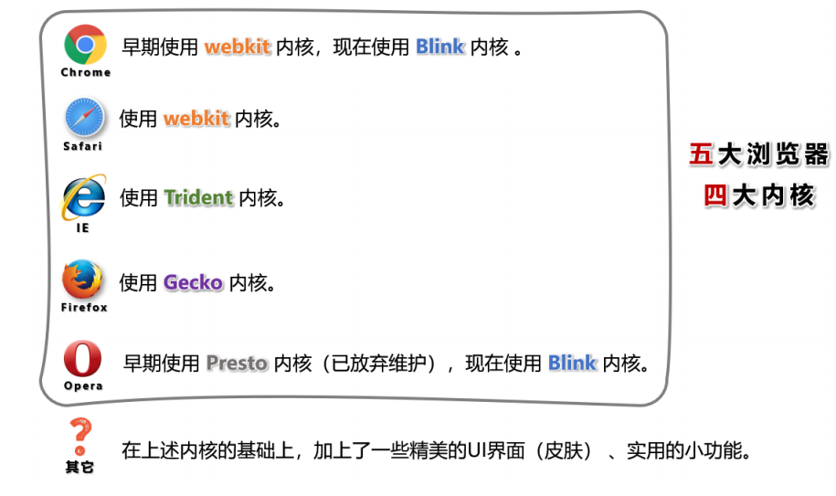

## 浏览器相关知识

> 浏览器是网页运行的平台，常见的浏览器有： 谷歌(Chrome) 、 Safari 、 IE 、 火狐(Firefox) 、 欧朋(Opera) 等，以上这些是常用的五大浏览器。

## 常见浏览器的内核



## 网页相关概念

1.网址：我们在浏览器中输入的地址。

2.网页：浏览器所呈现的每一个页面。

3.网站：多个网页构成了一个网站。

4.网页标准： html (结构)、css(表现)、javaScript(行为)

HTML简介

1.什么是HTML？

全称：HyperTextMarkupLanguage（超文本标记语言）。

>超文本：为“超链接”，和普通文本比，内容更丰富。
>
>标记：文本要变成超文本，就需要用到各种标记符号。
>
>语言：每一个标记的写法、读音、使用规则，组成了一个标记语言。

## 相关国际组织

**IETF**

>全称：InternetEngineeringTaskForce（国际互联网工程任务组），成立于1985年底，是一个权威的互联网技术标准化组织，主要负责互联网相关技术规范的研发和制定，当前绝大多数国际互联网技术标准均出自IETF。官网：**https://www.ietf.org**

**W3C**

>全称：WorldWideWebConsortium（万维网联盟），创建于1994年，是目前Web技术领域，最具影响力的技术标准机构。共计发布了200多项技术标准和实施指南，对互联网技术的发展和应用起到了基础性和根本性的支撑作用，官网：**https://www.w3.org**

**WHATWF**

>全称：WebHypertextApplicationTechnologyWorkingGroup（网页超文本应用技术工作小组）成立于2004年，是一个以推动网络HTML5标准为目的而成立的组织。由Opera、Mozilla基金会、苹果，等这些浏览器厂商组成。官网：**https://whatwg.org/**


## HTML发展历史（了解）

从HTML1.0开始发展，期间经历了很多版本，目前HTML的最新标准是：HMTL5，具体发展史如图（了解即可）。


## HTML标签

1.**标签**又称**元素**，是HTML的基本组成单位。

2.标签分为：**双标签**与**单标签**（绝大多数都是双标签）。

3.标签名不区分大小写，但推荐小写，因为小写更规范。

4.双标签：


```html
<marquee>跑马灯效果，已经弃用</marquee>
```

5.单标签：


```html
<input />
```

6.标签之间的关系：并列关系、嵌套关系，可以使用tab键进行缩进：

```html
<marquee>
  跑马灯效果，已经弃用
  <input />
</marquee>
<input />
```

## HTML标签属性

1.用于给标签提供**附加信息**。

2.可以写在：**起始标签**或**单标签中**，形式如下：


```html
<marqueeloop="1" bgcolor="orange">跑马灯效果，已经弃用</marquee><inputtype="password">
```

3.有些特殊的属性，没有属性名，只有属性值，例如：

```html
<input disabled>
```

4.注意点：

1.不同的标签，有不同的属性；也有一些通用属性（在任何标签内都能写，后面会详细总结）。

2.属性名、属性值不能乱写，都是W3C规定好的。

3.属性名、属性值，都不区分大小写，但推荐小写。

4.双引号，也可以写成单引号，甚至不写都行，但还是推荐写双引号。

5.标签中不要出现同名属性，否则后写的会失效，例如：

```html
<input type="text" type="password" />
```

## HTML基本结构

1. 在网页中，如何查看某段结构的具体代码？—— 点击鼠标右键，选择“检查”。 

2. 【检查】 和 【查看网页源代码】的区别：

>查看网页源代码】看到的是：程序员编写的源代码。【检查】看到的是：经过浏览器“处理”后的源代码。备注：日常开发中，【检查】用的最多。

3. 网页的**基本结构**如下：

   1. 想要呈现在网页中的内容写在 body 标签中。 
   2. head 标签中的内容不会出现在网页中。
   3. head 标签中的 title 标签可以指定网页的标题。

4.图示：


5. 代码：

```html
<html>
<head>
<title>网页标题</title>
</head>
<body>
......
</body>
</html>
```

## HTML注释

1.特点：注释的内容会被浏览器所忽略，不会呈现到页面中，但源代码中依然可见。

2.作用：对代码进行解释和说明。

3.写法：

```html
<!-- 下面的文字只能滚动一次-->
<marquee loop="1">跑马灯</marquee>
<!-- 下面的文字可以无限滚动-->
<marquee>跑马灯</marquee>
```

4.注释不可以嵌套，以下这么写是错的（反例）。

```html
<!--
我是一段注释
<!-- 我是一段注释 -->
-->
```

## HTML 文档声明

1. 作用：告诉浏览器当前网页的版本。 

2. 写法： 

   * 旧写法：要依网页所用的HTML版本而定，写法有很多。
     > 具体有哪些写法请参考：**W3C**官网文档声明（了解即可，千万别背！）
     >
   * **新写法：**一切都变得简单了！W3C推荐使用HTML5的写法。
      ```html
         <!DOCTYPE html>
         或
         <!DOCTYPE HTML>
         或
         <!doctype html>
      ```

3. 注意：文档声明，必须在网页的第一行，且在 html 标签的外侧。

## HTML 字符编码

1. 计算机对数据的操作：
   * 存储时，对数据进行：编码。 
   * 读取时，对数据进行：解码。
2. 编码、解码，会遵循一定的规范 —— 字符集。 
3.  字符集有很多中，常见的有（了解）：
   -  ASCII：大写字母、小写字母、数字、一些符号，共计128个。 
   -  ISO8859-1：在 ASCII 基础上，扩充了一些希腊字符等，共计是256个。 
   -  GB2312：继续扩充，收录了 6763 个常用汉字、682个字符。 
   -  GBK：收录了的汉字和符号达到 20000+ ，支持繁体中文。 
   -  UTF-8：包含世界上所有语言的：所有文字与符号。—— 很常用。

4. 使用原则是怎样的？
   原则1：存储时，务必采用合适的字符编码 。 
   否则：无法存储，数据会丢失！

   原则2：存储时采用哪种方式编码 ，读取时就采用哪种方式解码。 
   否则：数据错乱（乱码）！
      ```txt
      例如下面文字中，包含有：中文、英文、泰文、缅甸文
      我爱你
      I love you!
      ฉันรักเธอนะ
      ကနမ် ကိ ချစ်တယ။်

      若使用 ISO8859-1 编码存储，在存入的那一刻，就出问题了，因为 ISO8859-1 仅支持英文！
      为保证所有的输入，都能正常存储和读取，现在几乎全都采用： UFT-8 编码。
      所以我们编写 html 文件时，也都统一用 UFT-8 编码。
      ```

5. 总结： 

   * 平时编写代码时，统一采用 UTF-8 编码（最稳妥）。 
   * 为了让浏览器在渲染 html 文件时，不犯错误，可以通过 meta 标签配合 charset 属性指 定字符编码。
   ```html
     <head>
        <meta charset="UTF-8"/>
     </head>
   ```


## HTML 设置语言

1. 主要作用：
   * 让浏览器显示对应的翻译提示。 
   * 有利于搜索引擎优化。 
2. 具体写法：
   ```html
   <html lang="zh-CN">
   ```
3.  扩展知识： lang 属性的编写规则（作为一个课外扩展知识，了解即可）。
   1. 第一种写法（ 语言-国家/地区 ），例如： 
      * zh-CN：中文-中国大陆（简体中文） 
      * zh-TW：中文-中国台湾（繁体中文） 
      * zh：中文 
      * en-US：英语-美国 
      * en-GB：英语-英国 
      
   2. 第二种写法（ 语言—具体种类）已不推荐使用，例如： 
      * zh-Hans ：中文—简体 
      * zh-Hant ：中文—繁体 
      
   3. W3School 上的说明：《语言代码参考手册》、《国家/地区代码参考手册》 
   
   4. W3C官网上的说明：《Language tags in HTML》
   
      

## HTML标准结构

1. HTML标准结构如下：

   ```html
   <!DOCTYPE html>
   <html lang="zh-CN">
   <head>
   <meta charset="UTF-8">
   <title>我是一个标题</title>
   </head>
   <body>
   </body>
   </html>
   ```

2. 输入 ! ，随后回车即可快速生成标准结构。
3. 配置 VScode 的内置插件 emmet ，可以对生成结构的属性进行定制。 
4. 在存放代码的文件夹中，存放一个 favicon.ico 图片，可配置网站图标。

## HTML 基础

   1.  开发者文档
      * W3C官网： www.w3c.org 
      * W3School： www.w3school.com.cn 
      * MDN： developer.mozilla.org —— 平时用的最多。

   2. 排版标签

      | 标签名称 | 标签含义 | 单/双标签 |
      | :--------: | :--------: | :---------: |
      | h1 - h6  | 标题     | 双        |
      | p  | 段落     | 双        |
      | div  | 没有任何含义，用于整体布局（生活中的包装袋）。     | 双        |

      1. h1 最好写一个， h2~h6 能适当多写。
      2. h1~h6 不能互相嵌套，例如： h1 标签中最好不要写 h2 标签了。
      3. p 标签很特殊！它里面不能有： h1~h6 、 p 、 div 标签（暂时先这样记，后面会说规律）。
      
   3.  语义化标签

      * 概念：用特定的标签，去表达特定的含义。
      *  原则：标签的默认效果不重要（后期可以通过 CSS 随便控制效果），语义最重要！
      *  举例：对于 h1 标签，效果是文字很大（不重要），语义是网页主要内容（很重要）。 

      * 优势： 
         -  代码结构清晰可读性强。 
         -  有利于 SEO（搜索引擎优化）。 
         -  方便设备解析（如屏幕阅读器、盲人阅读器等）。

   4. 块级元素 与 行内元素

      1. 块级元素：独占一行（排版标签都是块级元素）。
      2. 行内元素：不独占一行（目前只学了： input ，稍后会学习更多）。
      3. 使用原则：
         1. 块级元素 中能写 行内元素 和 块级元素（简单记：块级元素中几乎什么都能写）。
         2. 行内元素 中能写 行内元素，但不能写 块级元素。
         3. 一些特殊的规则：
            - h1~h6 不能互相嵌套。
            - p 中不要写块级元素。
         **备注：** marquee 元素设计的初衷是：让文字有动画效果，但如今我们可以通过 CSS 来实现了，而且还可以实现的更加炫酷，所以 marquee 标签已经：过时了（废弃了），不推荐使用。我们只是在开篇的时候，用他做了一个引子而已，在后续的学习过程中，这些已经废弃的标签，我们直接跳过。

   5. 文本标签_常用的
      1. 用于包裹：词汇、短语等。
      2. 通常写在排版标签里面。
      3. 排版标签更宏观（大段的文字），文本标签更微观（词汇、短语）。
      4. 文本标签通常都是行内元素。
      | 标签名称 | 标签语义 | 单/双标签 |
      | :--------: | :--------: | :---------: |
      | em  | 要着重阅读的内容     | 双        |
      | strong  | 十分重要的内容（语气比em要强）     | 双        |
      | span  | 没有语义，用于包裹短语的通用容器     | 双        |
      生活中的例子： div 是大包装袋， span 是小包装袋。
   6. 文本标签_不常用的
      | 标签名 |标签语义|单/双标签|
      | :--------: | :--------: | :---------: |
      | cite   |  作品标题（书籍、歌曲、电影、电视节目、绘画、雕塑）|双|
      | dfn    |  特殊术语 ，或专属名词 |双|
      | del与 ins |  删除的文本 【与】 插入的文本 |双|
      | sub与 sup |  下标文字 【与】 上标文字 |双|
      | code   |  一段代码 |双|
      | samp   |  从正常的上下文中，将某些内容提取出来，例如：标识设备输出 |双|
      | kbd    |  键盘文本，表示文本是通过键盘输入的，经常用在与计算机相关的手册中 |双|
      | abbr   |  缩写，最好配合上 title 属性 |双|
      | bdo    |  更改文本方向，要配合 dir 属性，可选值: ltr （默认值）、rtl |双|
      | var    |  标记变量，可以与 code 标签一起使用 |双|
      | smal   |  附属细则，例如：包括版权、法律文本。—— 很少使用 |双|
      | b      |  摘要中的关键字、评论中的产品名称。—— 很少使用 |双|
      | i      |  本意是：人物的思想活动、所说的话等等。现在多用于：呈现字体图标（后面要讲的内容）。|双|
      | u      |  与正常内容有反差文本，例如：错的单词、不合适的描述等。——很少使用 |双|
      | q      |  短引用 —— 很少使用 |双|
      | blockqu|  长引用 —— 很少使用 |双|
      | address|  地址信息 |双|
      **备注：**
         1. 这些不常用的文本标签，编码时不用过于纠结（酌情而定，不用也没毛病）。
         2. blockquote 与 address 是块级元素，其他的文本标签，都是行内元素。
         3. 有些语义感不强的标签，我们很少使用，例如：
            small 、 b 、 u 、 q 、 blockquote
         4. HTML标签太多了！记住那些：重要的、语义感强的标签即可；截止目前，有这些：
            h1~h6 、 p 、 div 、 em 、 strong 、 span
   7. 图片标签
      1. 基本使用
         | 标签名称 | 标签语义 | 常用属性 | 单/双标签 |
         | :--------: | :--------: | :---------: | :---------: |
         | img  | 图片     |src：图片路径（又称：图片地址）—— 图片的具体位置  alt：图片描述 width：图片宽度，单位是像素，例如：200px 或 200    height：图片高度，单位是像素，例如：200px 或 200| 双|
      2. 路径的分类
         1. 相对路径：以当前位置作为参考点，去建立路径。
            | 符号 | 含义 |
            | :--------: | :--------: |
            | ./| 同级|
            | / | 下一级|
            |../|上一级|
            **注意点：**
                  相对路径中的 ./ 可以省略不写。
                  相对路径依赖的是当前位置，后期若调整了文件位置，那么文件中的路径也要修改。
         2. 绝对路径：以根位置作为参考点，去建立路径。
            - 本地绝对路径： E:/a/b/c/奥特曼.jpg 。（很少使用）
            - 网络绝对路径： http://www.baidu.com/images/index_new/logo.png 。
            **注意点：**
                  使用本地绝对路径，一旦更换设备，路径处理起来比较麻烦，所以很少使用。
                  使用网络绝对路径，确实方便，但要注意：若服务器开启了防盗链，会造成图片引入失败。
      3. 常见图片格式
         1. jpg 格式：
            > 概述：扩展名为 .jpg 或 .jpeg ，是一种有损的压缩格式（把肉眼不容易观察出来的细节丢弃了）。
            >
            > 主要特点：支持的颜色丰富、占用空间较小、不支持透明背景、不支持动态图。
            >
            > 使用场景：对图片细节没有极高要求的场景，例如：网站的产品宣传图等 。—— 该格式网页中很常见。
         2. png 格式：
            > 概述：扩展名为 .png ，是一种无损的压缩格式，能够更高质量的保存图片。
            > 
            > 主要特点：支持的颜色丰富、占用空间略大、支持透明背景、不支持动态图。 
            >
            > 使用场景：①想让图片有透明背景；②想更高质量的呈现图片；例如 ：公司logo图、重要配 图等。
         3. bmp 格式：
            > 概述：扩展名为 .bmp ，不进行压缩的一种格式，在最大程度上保留图片更多的细节。
            >
            > 主要特点：支持的颜色丰富、保留的细节更多、占用空间极大、不支持透明背景、不支持动态图。
            >
            > 使用场景：对图片细节要求极高的场景，例如：一些大型游戏中的图片 。（网页中很少使用）
         4. gif 格式：
            > 概述：扩展名为 .gif ，仅支持256种颜色，色彩呈现不是很完整。
            >
            > 主要特点：支持的颜色较少、支持简单透明背景、支持动态图。
            >
            > 使用场景：网页中的动态图片。
         5. webp 格式：
            > 概述：扩展名为 .webp ，谷歌推出的一种格式，专门用来在网页中呈现图片。
            >
            > 主要特点：具备上述几种格式的优点，但兼容性不太好，一旦使用务必要解决兼容性问题。
            >
            > 使用场景：网页中的各种图片。
         6. base64 格式:
            > 1. 本质：一串特殊的文本，要通过浏览器打开，传统看图应用通常无法打开。
            > 2. 原理：把图片进行 base64 编码，形成一串文本。
            > 3. 如何生成：靠一些工具或网站。
            > 4. 如何使用：直接作为 img 标签的 src 属性的值即可，并且不受文件位置的影响。
            > 5. 使用场景：一些较小的图片，或者需要和网页一起加载的图片。
         **图片的格式非常多，上面这些，只是一些常见的。**
   8. 超链接
      > 主要作用：从当前页面进行跳转。
      可以实现：①跳转到指定页面、②跳转到指定文件（也可触发下载）、③跳转到锚点位置、④唤起指定应用。
      | 标签名称 | 标签语义 | 常用属性 |单/双标签 |
      | :--------: | :--------: | :---------: | :---------: |
      | a  | 超链接  | href ： 指定要跳转到的具体目标。target ： 控制跳转时如何打开页面，常用值如下:_self ：在本窗口打开。_blank ：在新窗口打开。id ： 元素的唯一 标识，可用于设置锚点。name ： 元素的名字，写在 a 标签中，也能设置锚点。 | 双 |
      1. 跳转到页面
         ```html
         <!-- 跳转其他网页 -->
         <a href="https://www.jd.com/" target="_blank">去京东</a>
         <!-- 跳转本地网页 -->
         <a href="./10_HTML排版标签.html" target="_self">去看排版标签</a>
         ```
         **注意点：**
            1. 代码中的多个空格、多个回车，都会被浏览器解析成一个空格！
            2. 虽然 a 是行内元素，但 a 元素可以包裹除它自身外的任何元素！
               想展示多个回车或空格，怎么办呢？ —— 后面会讲。
      2. 跳转到文件
         ```html
         <!-- 浏览器能直接打开的文件 -->
         <a href="./resource/自拍.jpg">自拍</a>
         <a href="./resource/电影.mp4">电影</a>
         <a href="./resource/图片.gif">图片</a>
         <a href="./resource/暴富.pdf">暴富</a>
         <!-- 浏览器不能打开的文件，会自动触发下载 -->
         <a href="./resource/内部资源.zip">内部资源</a>
         <!-- 强制触发下载 -->
         <a href="./resource/电影.mp4" download="电影片段.mp4">下载电影</a>
         ```
         注意1：若浏览器无法打开文件，则会引导用户下载。
         注意2：若想强制触发下载，请使用 download 属性，属性值即为下载文件的名称。
      3. 跳转到锚点
         什么是锚点？—— 网页中的一个标记点。
         具体使用方式：
         * 第一步：设置锚点
            ```html
            <!-- 第一种方式：a标签配合name属性 -->
            <a name="test1"></a>
            <!-- 第二种方式：其他标签配合id属性 -->
            <h2 id="test2">我是一个位置</h2>
            ```
         注意点：
            1. 具有 href 属性的 a 标签是超链接，具有 name 属性的 a 标签是锚点。
            2. name 和 id 都是区分大小写的，且 id 最好别是数字开头。
         * 第二步：跳转锚点
            ```html
            <!-- 跳转到test1锚点-->
            <a href="#test1">去test1锚点</a>
            <!-- 跳到本页面顶部 -->
            <a href="#">回到顶部</a>
            <!-- 跳转到其他页面锚点 -->
            <a href="demo.html#test1">去demo.html页面的test1锚点</a>
            <!-- 刷新本页面 -->
            <a href="">刷新本页面</a>
            <!-- 执行一段js,如果还不知道执行什么，可以留空，javascript:; -->
            <a href="javascript:alert(1);">点我弹窗</a>
            ```
      4. 唤起指定应用
         通过 a 标签，可以唤起设备应用程序。
         ```html
         <!-- 唤起设备拨号 -->
         <a href="tel:10010">电话联系</a>
         <!-- 唤起设备发送邮件 -->
         <a href="mailto:10010@qq.com">邮件联系</a>
         <!-- 唤起设备发送短信 -->
         <a href="sms:10086">短信联系</a>
         ```
   9. 列表
      1. 有序列表
      > 概念：有顺序或侧重顺序的列表。
      ```html
      <h2>要把大象放冰箱总共分几步</h2>
         <ol>
         <li>把冰箱门打开</li>
         <li>把大象放进去</li>
         <li>把冰箱门关上</li>
      </ol>
      ```
      2. 无序列表
      > 概念：无顺序或不侧重顺序的列表。
      ```html
      <h2>我想去的几个城市</h2>
      <ul>
         <li>成都</li>
         <li>上海</li>
         <li>西安</li>
         <li>武汉</li>
      </ul>
      ```
      3. 列表嵌套
      > 概念：列表中的某项内容，又包含一个列表（注意：嵌套时，请务必把解构写完整）。
      ```html
      <h2>我想去的几个城市</h2>
      <ul>
         <li>成都</li>
         <li>
            <span>上海</span>
            <ul>
               <li>外滩</li>
               <li>杜莎夫人蜡像馆</li>
               <li>
                  <a href="https://www.opg.cn/">东方明珠</a>
               </li>
               <li>迪士尼乐园</li>
            </ul>
         </li>
         <li>西安</li>
         <li>武汉</li>
      </ul>
      ```
      注意： li 标签最好写在 ul 或 ol 中，不要单独使用。
   10. 自定义列表
      > 概念：所谓自定义列表，就是一个包含术语名称以及术语描述的列表。
      >
      >  一个 dl 就是一个自定义列表，一个 dt 就是一个术语名称，一个 dd 就是术语描述（可以有多个）。
      ```html
      <h2>如何高效的学习？</h2>
      <dl>
         <dt>做好笔记</dt>
            <dd>笔记是我们以后复习的一个抓手</dd>
            <dd>笔记可以是电子版，也可以是纸质版</dd>
         <dt>多加练习</dt>
            <dd>只有敲出来的代码，才是自己的</dd>
         <dt>别怕出错</dt>
            <dd>错很正常，改正后并记住，就是经验</dd>
      </dl>
      ```
   11. 表格
      1. 基本结构
         > 一个完整的表格由：表格标题、表格头部、表格主体、表格脚注，四部分组成。
         >
         **表格涉及到的标签：**
         >
         >  table ：表格
         > 
         >  caption ：表格标题
         > 
         >  thead ：表格头部
         > 
         >  tbody ：表格主体
         > 
         >  tfoot ：表格注脚
         > 
         >  tr ：每一行
         > 
         >  th 、 td ：每一个单元格（备注：表格头部中用 th ，表格主体、表格脚注中用： td）
         >
         **具体编码：**
         ```html
            <table border="1">
               <!-- 表格标题 -->
               <caption>学生信息</caption>
               <!-- 表格头部 -->
               <thead>
                  <tr>
                     <th>姓名</th>
                     <th>性别</th>
                     <th>年龄</th>
                     <th>民族</th>
                     <th>政治面貌</th>
                  </tr>
               </thead>
               <!-- 表格主体 -->
               <tbody>
                  <tr>
                     <td>张三</td>
                     <td>男</td>
                     <td>18</td>
                     <td>汉族</td>
                     <td>团员</td>
                  </tr>
                  <tr>
                     <td>李四</td>
                     <td>女</td>
                     <td>20</td>
                     <td>满族</td>
                     <td>群众</td>
                  </tr>
                  <tr>
                     <td>王五</td>
                     <td>男</td>
                     <td>20</td>
                     <td>回族</td>
                     <td>党员</td>
                  </tr>
                  <tr>
                     <td>赵六</td>
                     <td>女</td>
                     <td>21</td>
                     <td>壮族</td>
                     <td>团员</td>
                  </tr>
               </tbody>
               <!-- 表格脚注 -->
               <tfoot>
                  <tr>
                     <td></td>
                     <td></td>
                     <td></td>
                     <td></td>
                     <td>共计：4人</td>
                  </tr>
               </tfoot>
            </table>
         ```
      2. 常用属性
            | 标签名称 | 标签语义 | 常用属性 | 单/双标签 |
            | :------: | :------: | :------------------------------------------------------------ | :-------: |
            | table    | 表格      | width：设置表格宽度。<br>height：设置表格最小高度，表格最终高度可能比设置的值大。<br>border：设置表格边框宽度。<br>cellspacing：设置单元格之间的间距。 | 双        |
            | thead    | 表格头部  | height：设置表格头部高度。<br>align：设置单元格的水平对齐方式，可选值如下：<br>&nbsp;&nbsp;&nbsp;&nbsp;1. left：左对齐<br>&nbsp;&nbsp;&nbsp;&nbsp;2. center：中间对齐<br>&nbsp;&nbsp;&nbsp;&nbsp;3. right：右对齐<br>valign：设置单元格的垂直对齐方式，可选值如下：<br>&nbsp;&nbsp;&nbsp;&nbsp;1. top：顶部对齐<br>&nbsp;&nbsp;&nbsp;&nbsp;2. middle：中间对齐<br>&nbsp;&nbsp;&nbsp;&nbsp;3. bottom：底部对齐 | 双        |
            | tbody    | 表格主体  | 常用属性与 thead 相同。 | 双        |
            | tr       | 行        | 常用属性与 thead 相同。 | 双        |
            | tfoot    | 表格脚注  | 常用属性与 thead 相同。 | 双        |
            | td       | 普通单元格 | width：设置单元格的宽度，同列所有单元格全都受影响。<br>height：设置单元格的高度，同行所有单元格全都受影响。<br>align：设置单元格的水平对齐方式。<br>valign：设置单元格的垂直对齐方式。<br>rowspan：指定要跨的行数。<br>colspan：指定要跨的列数。 | 双        |
            | th       | 表头单元格 | 常用属性与 td 相同。 | 双        |
            >
            **注意点：**
            ```
            <table> 元素的 border 属性可以控制表格边框，但 border 值的大小，并不控制单元格边框的宽度，只能控制表格最外侧边框的宽度，这个问题如何解决？—— 后期靠 CSS 控制。
            默认情况下，每列的宽度，得看这一列单元格最长的那个文字。
            给某个 th 或 td 设置了宽度之后，他们所在的那一列的宽度就确定了。
            给某个 th 或 td 设置了高度之后，他们所在的那一行的高度就确定了。
            ```
            >   
      3. 跨行跨列
            * rowspan ：指定要跨的行数。
            * colspan ：指定要跨的列数。
   12. 常用标签补充
      | 标签名 | 标签含义 | 单/双标签 |
      | :----: | :-------: | :-------: |
      |  br    | 换行      | 单        |
      |  hr    | 分隔      | 单        |
      |  pre   | 按原文显示（一般用于在页面中嵌入大段代码） | 双 |
      
      **注意点：**
      ```
       1. 不要用 <br> 来增加文本之间的行间隔，应使用 <p> 元素，或后面即将学到的 CSS margin 属性。
       2. <hr> 的语义是分隔，如果不想要语义，只是想画一条水平线，那么应当使用 CSS 完成。
      ```   

   13. 表单

       概念：一个包含交互的区域，用于收集用户提供的数据。
      1. 基本结构
         简单梳理：
         | 标签名  | 标签语义 | 常用属性 | 单/双标签 |
         | :----:  | :-------: | :------: | :-------: |
         |  form   | 表单      | action ：用于指定表单的提交地址（需要与后端人员沟通后确定）。<br>target ：用于控制表单提交后，如何打开页面，常用值如下：<br>&nbsp;&nbsp;&nbsp;&nbsp;_self ：在本窗口打开。<br>&nbsp;&nbsp;&nbsp;&nbsp;_blank ：在新窗口打开。<br>method ：用于控制表单的提交方式，暂时只需了解，在后面 Ajax 的课程中，会详细讲解。 | 双        |
         |  input  | 输入框    | type ：设置输入框的类型，目前用到的值是 text ，表示普通文本。<br>name ：用于指定提交数据的名字，（需要与后端人员沟通后确定）。 | 单        |
         |  button | 按钮      | 本小节暂不涉及 | 双        |

      在本小节，我们先记住表单的整体形式，稍后会对表单控件进行详细讲解。

      **示例代码:**
      ```html
      <form action="https://www.baidu.com/s" target="_blank" method="get">
         <input type="text" name="wd">
         <button>去百度搜索</button>
      </form>
      ```
      2. 常用表单控件
        
         - 文本输入框
         ```html
         <input type="text">
         ```
         
         常用属性如下：
            name 属性：数据的名称。
            value 属性：输入框的默认输入值。
            maxlength 属性：输入框最大可输入长度。

         - 密码输入框
         ```html
         <input type="password">
         ```
         
         常用属性如下：
            name 属性：数据的名称。
            value 属性：输入框的默认输入值（一般不用，无意义）。
            maxlength 属性：输入框最大可输入长度。
         
         - 单选框
         ```html
         <input type="radio" name="sex" value="female">女
         <input type="radio" name="sex" value="male">男
         ```
         
         常用属性如下：
            name 属性：数据的名称，注意：想要单选效果，多个 radio 的 name 属性值要保持一致。
            value 属性：提交的数据值。
            checked 属性：让该单选按钮默认选中。
         
         - 复选框
         ```html
         <input type="checkbox" name="hobby" value="smoke">抽烟
         <input type="checkbox" name="hobby" value="drink">喝酒
         <input type="checkbox" name="hobby" value="perm">烫头
         ```
         
         常用属性如下：
            name 属性：数据的名称。
            value 属性：提交的数据值。
            checked 属性：让该复选框默认选中。
         
         - 隐藏域
         ```html
         <input type="hidden" name="tag" value="100">
         ```
         
         用户不可见的一个输入区域，作用是： 提交表单的时候，携带一些固定的数据。
            name 属性：指定数据的名称。
            value 属性：指定的是真正提交的数据
         
         - 提交按钮
         ```html
         <input type="submit" value="点我提交表单">
         <button>点我提交表单</button>
         ```
         注意：
            1. button 标签 type 属性的默认值是 submit 。
            2. button 不要指定 name 属性
            3. input 标签编写的按钮，使用 value 属性指定按钮文字。
         
         - 重置按钮
         ```html
         <input type="reset" value="点我重置">
         <button type="reset">点我重置</button>
         ```
         注意点：
            1. button 不要指定 name 属性
            2. input 标签编写的按钮，使用 value 属性指定按钮文字。
         
         - 普通按钮
         ```html
         <input type="button" value="普通按钮">
         <button type="button">普通按钮</button>
         ```
         注意点：普通按钮的 type 值为 button ，若不写 type 值是 submit 会引起表单的提交。
         
         - 文本域
         ```html
         <textarea name="msg" rows="22" cols="3">我是文本域</textarea>
         ```
         常用属性如下：
            1. rows 属性：指定默认显示的行数，会影响文本域的高度。
            2. cols 属性：指定默认显示的列数，会影响文本域的宽度。
            3. 不能编写 type 属性，其他属性，与普通文本输入框一致。
         
         - 下拉框
         ```html
         <select name="from">
            <option value="黑">黑龙江</option>
            <option value="辽">辽宁</option>
            <option value="吉">吉林</option>
            <option value="粤" selected>广东</option>
         </select>
         ```
         
         常用属性及注意事项：
            1. name 属性：指定数据的名称。
            2. option 标签设置 value 属性， 如果没有 value 属性，提交的数据是 option 中间的文字；如果设置了 value 属性，提交的数据就是 value 的值（建议设置 value 属性）
            3. option 标签设置了 selected 属性，表示默认选中。
      
      3. 禁用表单控件
         
         给表单控件的标签设置 disabled 既可禁用表单控件。
      
         > input 、 textarea 、 button 、 select 、 option 都可以设置 disabled 属性
      
      4. label 标签
         
         label 标签可与表单控件相关联，关联之后点击文字，与之对应的表单控件就会获取焦点。
         
         两种与 label 关联方式如下：
            1. 让 label 标签的 for 属性的值等于表单控件的 id 。
            2. 把表单控件套在 label 标签的里面。
      
      5. fieldset 与 legend 的使用（了解）
         
         fieldset 可以为表单控件分组、 legend 标签是分组的标题。
         
         ```html
         <fieldset>
            <legend>主要信息</legend>
            <label for="zhanghu">账户：</label>
            <input id="zhanghu" type="text" name="account" maxlength="10">	  <br>
            <label>
               密码：
               <input id="mima" type="password" name="pwd" maxlength="6">
            </label>
            <br>
               性别：
               <input type="radio" name="gender" value="male" id="nan">
            <label for="nan">男</label>
            <label>
               <input type="radio" name="gender" value="female" id="nv">女
            </label>
         </fieldset>
         ```