# 02 【本地库操作】

## 1.git的结构

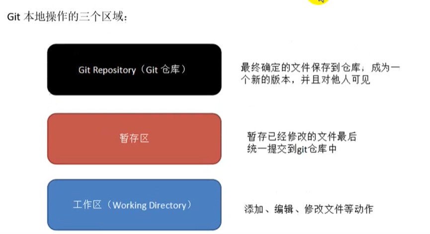

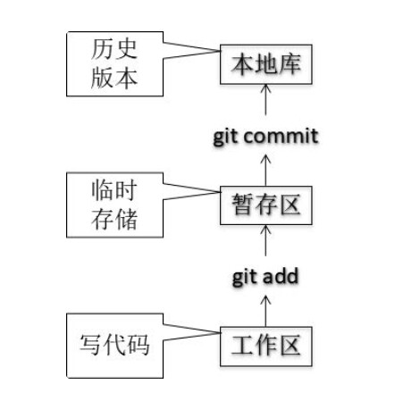

## 2.Git 远程库——代码托管中心

### 2.1 git工作流程

代码托管中心用于维护 Git 的远程库。包括在局域网环境下搭建的 GitLab 服务器，以及在外网环境下的 [GitHub](https://github.com/) 和 [Gitee (码云)](https://gitee.com/)。

一般工作流程如下：

1．从远程仓库中克隆 Git 资源作为本地仓库。

2．从本地仓库中checkout代码然后进行代码修改

3．在提交前先将代码提交到暂存区。

4．提交修改。提交到本地仓库。本地仓库中保存修改的各个历史版本。

5．在修改完成后，需要和团队成员共享代码时，可以将代码push到远程仓库。

**团队内部协作**

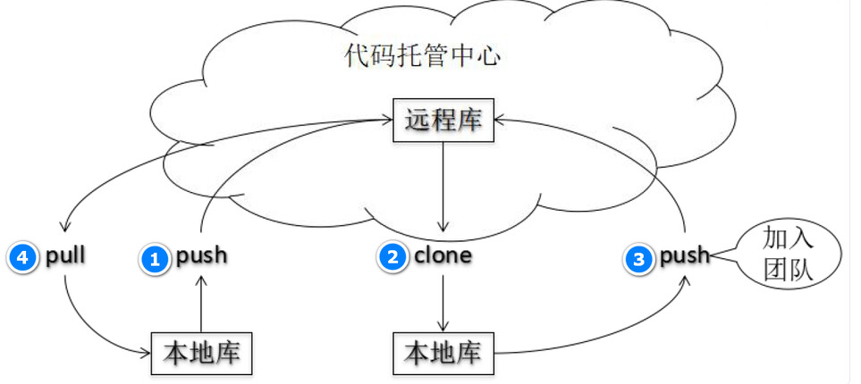

**跨团队协作**

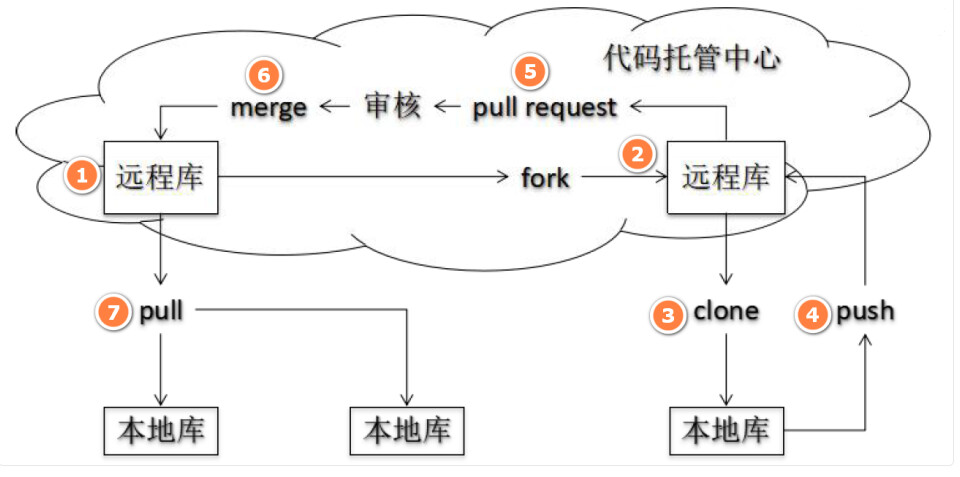

### 2.2 Github:开源社区

**Github线上仓库结构介绍**

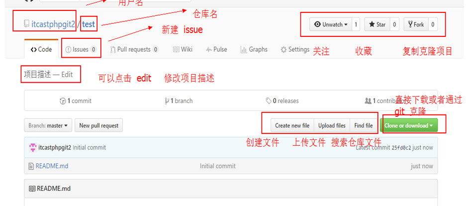

**Github Issues**

==作用==：发现代码BUG，但是目前没有成型代码，需要讨论时用；或者使用开源项目出现问题时使用

**fork与git clone的区别**

1.区别

git clone 是在自己电脑直接敲命令，结果是将github仓库中的项目克隆到自己本地电脑中了(就是下载过来)

fork是直接访问github网站，在项目页面中点击fork，然后自己github项目中就会多出一个复制的项目

2.用法

如果我们想要修改他人github项目的话，我们直接git clone代码到本地是不能push的，所以我们使用fork，先把代码复制到自己的github仓库，然后git clone到本地修改，然后在提交push（这里的push是push到自己github仓库了，我们自己的github仓库中的代码是fork源的一个分支），这时候我们想要把修改的代码提交给他人的话，就可以在自己github上pull requests，等其他人看到后就可以把代码做一个合并

## 3.初始化配置

以本地计算机的`G:\Desktop\git`的工作目录，在其中新建一个项目文件夹`git_demo`后打开。

执行`git init`对git存储库初始化


查看`.git`文件夹中的信息


文件`./.git/config`用于记录该本地库的配置信息。

**注意：.git 目录中存放的是本地库相关的子目录和文件，不要删除，也不要胡 乱修改。**

### 3.1 设置签名

签名由`user. name `(用户名)和`user. email `(Email地址)组成，用于对不同开发者的身份作区分，包括项目/仓库级别、系统用户级别。

> 这里设置的签名和登录远程库(代码托管中心)的账号、密码没有任何关系。
> 项目/仓库级别与系统用户级别必须有一个设置生效。

#### 3.1.1 项目/仓库级别

> 具有更高的优先级签名;
> 各个本地库的签名信息相互独立，互不干扰。

```python
git config user.name "dselegent"
git config user.email dselegent@qq.com
```


配置文件的修改保存在：`<Project>/.git/config`文件中。


#### 3.1.2 系统用户级别

> 若未设置项目/仓库级别的签名时，使用用户级别的签名。

```python
git config --global user.name "dselegent"
git config --global user.email dselegent@qq.com
```

配置文件的修改保存在：`~/.gitconfig`文件中。


**级别优先级**

-  就近原则：项目级别优先于系统用户级别，二者都有时采用项目级别 的签名
- 如果只有系统用户级别的签名，就以系统用户级别的签名为准
- 二者都没有不允许

### 3.2 配置编辑器

使用命令`git config [--global | --system] core.editor [...]`为 Git 的配置编辑器。

### 3.3 配置信息

使用命令`git config --list`查看 Git 的配置信息。


## 4.版本控制

### 4.1 在项目中新建文件

在`G:\Desktop\git`中新建文件`test1.txt`后打开。


```tex
hello git!
```

#### 4.1.1 查看状态

使用`git status`查看工作区、暂存区状态


> 对于master分支，本地库暂未有任何被提交的内容、暂存区亦未有任何可提交的内容(可用`git add`命令追踪新建的文件)， 存在未追踪的文件`test1.txt` (可用`git add <file>...` 命令将文件载入暂存
> 区以待提交)。

#### 4.1.2 添加到暂存区

用`git add test1`命令将文件`test1.txt`添加到暂存区。

> 警告：此时根据转换文本文件行尾换行的配置，默认按照Windows风格检出后用Unix的风格替换提交(将LF转换为CRLF) ，本地工作目录不受这一替换的影响。


对于`master`分支，本地库暂未有任何被提交的内容、暂存区有以下新文件的改变可被提交:`test1.txt` (可用`git rm --cached <fi1e>... `命令将文件撤出暂存区)。

> 从暂存区撤出文件的命令不会影响工作区的文件。

> `touch 文件名`   创建文件
>
> `git add 文件名`  将文件添加到暂存区
>
> `git add 文件名1 文件名2 文件名3` 将多个文件添加到暂存区
>
> `git add .`   添加当前目录下的文件到缓存区，注意有空格在.前面

#### 4.1.3 提交到本地库

用`git commit test1 -m 'first commit'`命令将文件`test1.txt`提交到本地库。


> 在`master`分支上创建了一个根提交(ID号:`da56888`) 。注释内容为: `first commit` 。这次提交修改/新建了1个文件,插入了1行内容。

> 对于`master`分支，暂存区暂未有任何可提交的内容，工作目录的文件系统树完全一致。

### 4.2 修改文件内容

对文件`test.txt`做出 1 处修改后保存：

```tex
hello git!
second
```

#### 4.2.1 查看状态


> 对于`master`分支，存在未暂存的修改: test1.txt (可用`git add <file>... `命令将文件更新到
> 暂存区以待提交或用`git restore <file>... `命令丢弃工作目录的更改)。暂存区没有可提交的修改(可用`git add `命令将修改添加到暂存区或用`git commit -a `将修改暂存后立即提交)。

#### 4.2.2 添加到暂存区

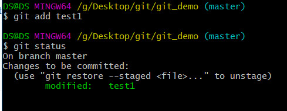

#### 4.2.3 提交修改到本地库

使用`git commit text -m "My second commit”`命令提交修改到本地库，而不必单独用编辑器注释修改。


### 4.3 查看提交的版本记录

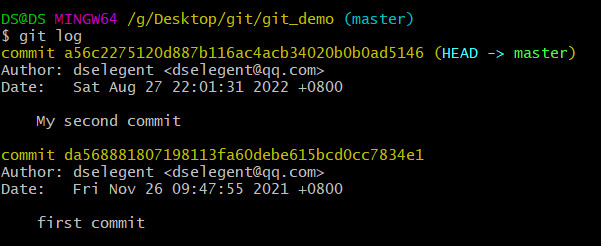

每一个提交记录(`commit`)都有一个hash值作为提交记录的键，与提交人、提交时间以及提交注释对应。在当前的版本中，有`(HEAD -> master)`的标记，即用HEAD指针指向当前版本。

> 版本间的切换通过移动`HEAD`指针完成。

若日志信息太多，可用`空格键`向下翻页、`b`键向上翻页、`q`键退出。

- 可用`git 1og --pretty=oneline `命令以每个提交历史仅占1行的方式显示日志;

- 可用`git 1og --oneline`命令显示更简略的日志信息，此时只截取显示40位hash值的前7位;

- 可用`git reflog` 命令显示带HEAD指针移动次数的简略信息。.

> `git reflog`命令可显示HEAD指针前后的全部提交日志;其他日志查看命令只显示从当前版本往后的提交日志。

```tex
DS@DS MINGW64 /g/Desktop/git/git_demo (master)
$ git log --pretty=oneline
a087691b1b36033551860de2923512caaa593b06 (HEAD -> master) My second commit
da568881807198113fa60debe615bcd0cc7834e1 first commit

DS@DS MINGW64 /g/Desktop/git/git_demo (master)
$ git log --oneline
a087691 (HEAD -> master) My second commit
da56888 first commit

DS@DS MINGW64 /g/Desktop/git/git_demo (master)
$ git reflog
a087691 (HEAD -> master) HEAD@{0}: commit: My second commit
da56888 HEAD@{1}: commit (initial): first commit
```

### 4.4 版本的切换

版本前进后退的本质是`HEAD`指针的位置的移动。

#### 4.4.1 版本的直达

使用`git reset --hard <hash_len_7>`命令。

				

#### 4.4.2 版本后退

**方法一**

使用`git reset --hard HEAD[^...]`执行版本的后退（每个^符号后退 1 版，不加^符号则恢复成当前指针所指位置的状态）。

 git reset --hard HEAD^  表示回退一个版本

 git reset --hard HEAD^^  表示回退两个版本

 git reset --hard HEAD^^^  表示回退三个版本

 git reset --hard HEAD^^^^  表示回退四个版本

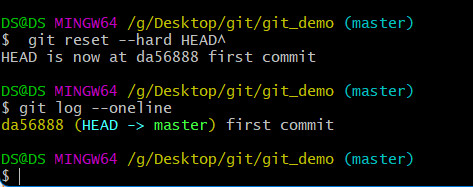

**方法二**

使用`git reset --hard HEAD~[NumberOfSteps]`执行版本的前进（~符号后的数字注明了连续后退的步数）。

git reset --hard~3  表示回退三个版本


> 做了第三次提交之后才回退版本

#### 4.4.3 reset 命令的 3 个参数

> 使用`git help <command>`命令用浏览器查看特定命令的本地帮助文件，如`git help reset`。

**--soft**
仅在本地库移动HEAD指针。


**--mixed**

在本地库移动HEAD指针，且重置暂存区。


**--hard**

在本地库移动HEAD指针，且重置暂存区和工作区。


### 4.5 文件的删除与找回

前提：文件存在时的状态提交到了本地库。
核心：
1.文件删除前已提交到本地库：`git reset --hard <HistoricalRecords>`
2.文件删除前未提交到本地库：`git reset --hard HEAD`。

#### 4.5.1 创建待删除文件

创建`test2.txt`文件，并写入一行内容：test2。

添加到暂存区后提交：

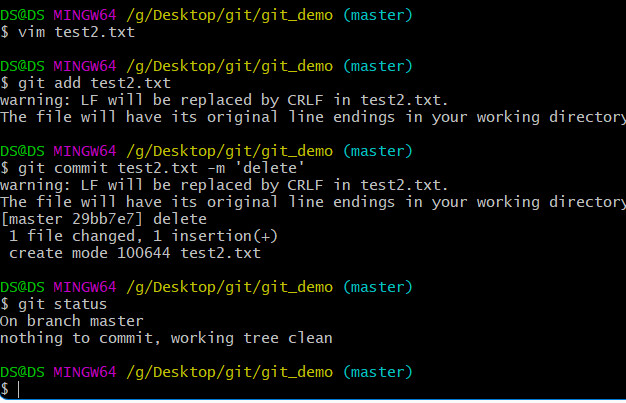

#### 4.5.2 删除文件

**删除文件**

> `rm -rf 文件名`  通知要删除某文件
>
> `git rm 文件名`  删除缓存区的该文件
>
> `git reset .`	清空暂存区所有文件
>
> `git commit -m"注释"` 将仓库文件删除

使用`rm test2.txt`命令删除test2.txt文件。

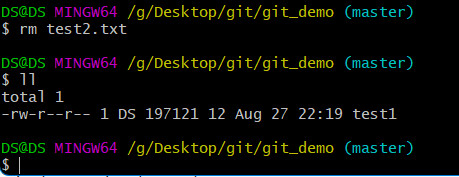

**删除后的状态**


**暂存并提交**

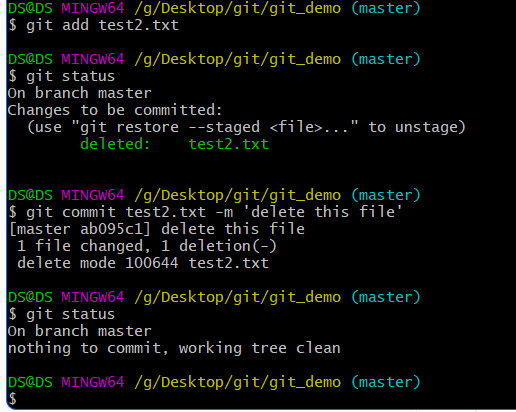

#### 4.5.3 找回文件

将版本回退到删除文件前的那个版本，即可完成对文件的找回。


> 若文件的删除变化只添加 (add) 到了暂存区而未提交 (commit) 到本地库，则可使用git reset --hard HEAD命令找回文件。

### 4.6 文件差异性比较

对于test1.txt文件，修改前：


修改后：


- 使用`git diff <filename>`命令默认用于当前文件与暂存区对应文件的差异比较：

- 若使用`git diff <hash_len_7|HEAD|HEAD^[^...]> <filename>`命令，则可用于当前文件与特定历史版本或已暂存前文件的差异比较。
- 使用不带文件名的diff命令则可比较工作区的所有文件。


### 4.7  分支管理

Git 分支是由指针管理起来的，可以快速创建、切换、合并与删除，适用于大型项目的开发。在分支上开发，调试后合并到主分支的策略使每个人的开发模块式相互独立不影响到其他人。
1.主分支（默认的`master`分支）只用来发布重大版本更新（各版本可以有不同的标签以便于查找）；
2.日常开发应该在其他分支上完成，如`develop`；
3.对于新增功能 (`feature`) 、用于预发布 (`release`) 、Bug 修复 (`bug/hot_fix`) 的临时性分支，应在使用完毕后及时删除，以免分支的混乱。
4.多人开发时，可分别创建自己专属的分支，当阶段性工作完成后应该合并到上级分支。


#### 4.7.1 创建分支

使用`git branch <BranchName>`命令创建名为`<BranchName>`的新分支，如`git branch hot_fix`。

#### 4.7.2 查看分支

使用`git branch -v`命令可查看分支的详细 (verbose) 信息（哈希值和名称）。


> 列出全部分支后，分支名称前以星号*标注的是当前分支。
> 当前分支已在各命令行的括号()中提及。

#### 4.7.3 切换分支

使用`git checkout <BranchName>`切换到指定分支，如`git checkout hot_fix`。

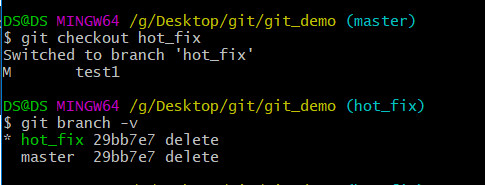

#### 4.7.4 合并分支

在`hot_fix`分支中产生修改：


使用`git checkout master`命令切换到接受合并的分支后，在使用`git merge <BranchName>`命令合并分支：


#### 4.7.5 分支合并的冲突产生

分支的同一位置同时发生不同的修改时，将在相互合并分支时产生冲突。需要执行手动的冲突解决。
在`hot_fix`分支上修改，添加到暂存区后提交：

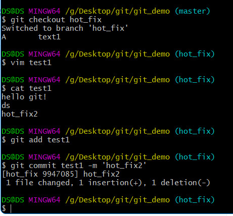

在`master`分支中的同一位置做出不同的修改，添加到暂存区后提交


并尝试将`hot_fix`合并到`master`：


> 自动合并失败；需要手动修复冲突，然后提交结果。

#### 4.7.6 分支合并的冲突解决


> 不同于 SVN，Git 产生冲突后，不会产生新的额外文件。

对于产生冲突的文件，Git 会在冲突发生出做出特定的标记：

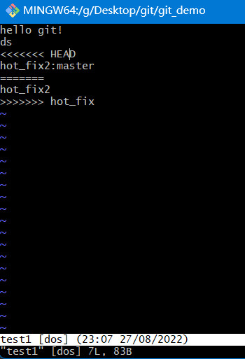

```bash
hello git!
ds
<<<<<<< HEAD         ---
hot_fix2:master		 --- 这是当前分支的内容
=======				
hot_fix2			---
>>>>>>> hot_fix		 --- 这是用于合并的内容

```

1.编辑文件，删除特殊符号，把文件修改到满意为止后保存退出；
2.使用`git add <filename>`命令将此文件添加暂存区；
3.使用`git commit -m "fix merge"`命令提交冲突修复（执行冲突修复时不能添加具体的文件名）。


#### 4.7.7 删除分支

> 注意在删除分支时要退出该分支

1 先切换到别的分支: `git checkout master`

2 删除本地分支： `git branch -d hot_fix`

3 若是删除不了能够强制删除，`git branch -D hot_fix`

4 有必要的状况下，删除远程分支：`git push origin --delete hot_fix`

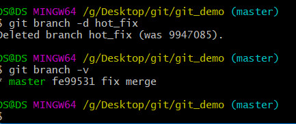										
