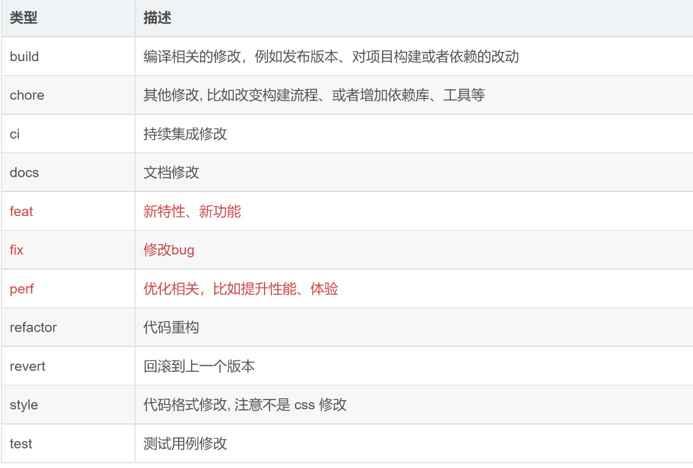
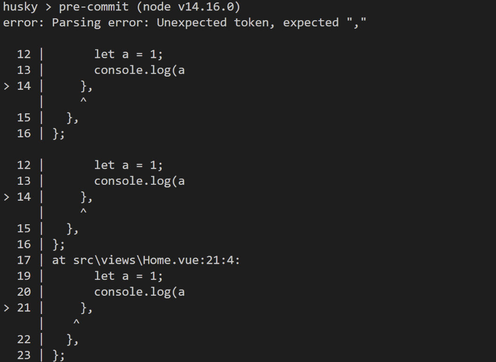

# 03 【Git 提交规范】

## 1.Git提交规范（Commitizen）

### 1.1 背景

  Git是目前世界上最先进的分布式版本控制系统，在我们平时的项目开发中已经广泛使用。而当我们使用Git提交代码时，都需要写Commit Message提交说明才能够正常提交。

```
git commit -m "提交"
```

  然而，我们平时在编写提交说明时，通常会直接填写如"fix"或"bug"等不规范的说明，不规范的提交说明很难让人明白这次代码提交究竟是为了什么。而在工作中，一份清晰简介规范的Commit Message能让后续代码审查、信息查找、版本回退都更加高效可靠。因此我们需要一些工具来约束开发者编写符合规范的提交说明。

### 1.2 提交规范

  那么，什么样的提交说明才能符合规范的说明呢？不同的团队可以制定不同的规范，当然，我们也可以直接使用目前流行的规范，比如[Angular Git Commit Guidelines](https://zj-git-guide.readthedocs.io/zh_CN/latest/message/Angular提交信息规范/)。接下来将会对目前流行的Angular提交规范进行介绍。

#### 提交格式

  符合规范的Commit Message的提交格式如下，包含了页眉（header）、正文（body）和页脚（footer）三部分。其中，header是必须的，body和footer可以忽略。

```
<type>(<scope>): <subject>
// 空一行
<body>
// 空一行
<footer>
```

#### 页眉设置

  页眉（header）通常只有一行，包括了提交类型（type）、作用域（scope）和主题（subject）。其中，type和subject是必须的，scope是可选的。

**提交类型**

  提交类型（type）用于说明此次提交的类型，需要指定为下面其中一个：



  **作用域**

  作用域（scope）表示此次提交影响的范围。比如可以取值api，表明只影响了接口。

  **主题**

   主题（subject）描述是简短的一句话，简单说明此次提交的内容。

#### 正文和页脚

  正文（body）和页眉（footer）这两部分不是必须的。

  如果是破坏性的变更，那就必须在提交的正文或脚注加以展示。一个破坏性变更必须包含大写的文本 BREAKING CHANGE，紧跟冒号和空格。脚注必须只包含 BREAKING CHANGE、外部链接、issue 引用和其它元数据信息。例如修改了提交的流程，依赖了一些包，可以在正文写上：BREANKING CHANGE：需要重新npm install，使用npm run cm代替git commit。

  下面给出了一个Commit Message例子，该例子中包含了header和body。

```
chore: 引入commitizen

BREANKING CHANGE：需要重新npm install，使用npm run cm代替git commit
```

  当然，在平时的提交中，我们也可以只包含header，比如我们修改了登录页面的某个功能，那么可以这样写Commit Message。

```
feat(登录）：添加登录接口
```

### 1.3 Commitizen

  虽然有了规范，但是还是无法保证每个人都能够遵守相应的规范，因此就需要使用一些工具来保证大家都能够提交符合规范的Commit Message。常用的工具包括了可视化工具和信息交互工具，其中Commitizen是常用的Commitizen工具，接下来将会先介绍Commitizen的使用方法。

#### 什么是Commitizen

  [Commitizen](https://github.com/commitizen/cz-cli)是一个撰写符合上面Commit Message标准的一款工具，可以帮助开发者提交符合规范的Commit Message。

#### 安装Commitizen

  可以使用npm安装Commitizen。其中，cz-conventional-changelog是本地适配器。

```
npm install commitizen cz-conventional-changelog --save-dev
```

#### 配置Commitizen

  安装好Commitizen之后，就需要配置Commitizen，我们需要在package.json中加入以下代码。其中，需要增加一个script，使得我们可以通过执行npm run cm来代替git commit，而path为cz-conventional-changelog包相对于项目根目录的路径。

```json
{
    "script": {
        "cm": "git cz"
    },
    "config": {
        "commitizen": {
            "path": "./node_modules/cz-conventional-changelog"
        }
    }
}
```

其实这个可以全局安装，这样我们所有地方都可以用

```bash
npm install -g commitizen cz-conventional-changelog  # 安装规范化提交插件

echo '{"path": "cz-conventional-changelog"}' > ~/.czrc # 配置
```

配置完成之后，我们就可以通过执行npm run cm来代替git commit，接着只需要安装提示，完成header、body和footer的编写，就能够编写出符合规范的Commit Message。


## 2.Git工作流规范（Husky ）

### 2.1 背景

有些同学可能会把ESLint、Stylelint或Commitizen提示的错误忽视不见，直接将代码提交到代码仓库中。这样做的话，那么其他同学在pull代码并diff代码时可能会出现大段代码标红，同时在进行CI时又可能因为代码风格或规范问题被打回重改。

  那么，有没有一种方法，让大家在提交代码时需要确保本地的代码或Commit Message已经通过检查才能够push到代码仓库，从而更好的保障代码质量呢？接下来，将会介绍如何使用Husky + Commintlint + Lint-staged打造规范的Git检查工作流，确保我们的代码只有符合规范才能提交到代码仓库。

### 2.2 什么是git hook

 在介绍Husky之前，我们先来看什么是git hook，也就是常说的Git钩子。

  和其它版本控制系统一样，Git能在特定的重要动作发生时触发自定义脚本。有两组这样的钩子：客户端的和服务器端的。 客户端钩子由诸如提交和合并这样的操作所调用，而服务器端钩子作用于诸如接收被推送的提交这样的联网操作。 你可以随心所欲地运用这些钩子。

  其中，客户端钩子我们可能用的比较多，客户端钩子通常包括了提交工作流钩子、电子邮件工作流钩子和其它钩子。这些钩子通常存储在项目的.git/hooks目录下，我们需要关注的主要是提交工作流钩子。提交工作流钩子主要包括了以下四种：

- pre-commit：该钩子在键入提交信息前运行。 它用于检查即将提交的快照。如果该钩子以非零值退出，Git 将放弃此次提交，你可以利用该钩子，来检查代码风格是否一致。
- prepare-commit-msg：该钩子在启动提交信息编辑器之前，默认信息被创建之后运行。 它允许你编辑提交者所看到的默认信息。 
- commit-msg：该钩子接收一个参数，此参数存有当前提交信息的临时文件的路径。 如果该钩子脚本以非零值退出，Git 将放弃提交，因此，可以用来在提交通过前验证项目状态或提交信息。
- post-commit：该钩子一般用于通知之类的事情。

  在上面的钩子中，我们需要关注pre-commit和commit-msg钩子。

### 2.3 什么是husky

  [husky](https://github.com/typicode/husky)是常见的git hook工具，使用husky可以挂载Git钩子，当我们本地进行git commit或git push等操作前，能够执行其它一些操作，比如进行ESLint检查，如果不通过，就不允许commit或push。

### 2.4 安装husky

  安装husky，可以使用npm进行安装。

```bash
npm install husky --save-dev
```

### 2.5 配置husky

  安装好husky之后，还需要对husky进行配置。不同版本的husky配置方法有些不同。

1. 安装 husky git hooks

```bash
# 方法1：
npx husky install
# 方法2：配置 package.json, scripts："prepare": "husky install"
npm run prepare
```

2. 测试 husky 钩子作用，添加 pre-commit 钩子

```bash
npx husky add .husky/pre-commit "npm test"
# 查看当前目录 .husky 目录是否有生成 pre-commit 文件
# 如果需要删除这个钩子，直接 删除 .husky/pre-commit 文件即可
```

我们需要安装配置好ESLint或Stylelint，并且在 `pre-commit` 中加入以下代码。

````bash
#!/usr/bin/env sh
. "$(dirname -- "$0")/_/husky.sh"

npx eslint *.{js,jsx,ts,tsx}
````

  接着，当我们执行git commit时，就会触发pre-commit钩子，并且执行对应命令，这里将会指定目录下的文件进行ESLint检查，如果ESLint检查不通过，是无法进行commit的。



  如果ESLint检查通过，就可以正常进行commit。


  在安装并配置好husky之后，如果发现在commit时不能触发pre-commit，可以试着重新安装husky，并且重启VSCode。

### 2.6 只使用husky的问题

 使用husky虽然能够帮助我们在commit或push前执行一些指令，但是如果只使用husky，仍然存在下面这些问题：

- 在某次提交时，我们只修改了某个文件，但是只使用husky会把所有的文件都运行一遍Lint检查，时间成本太高。此外，有些项目会在中途才加上husky，但是在commit时husky也会对其它未修改的历史代码进行检查，可能会一下子报了很多错误，这个时候我们更希望只对当前修改过的文件进行检查，而不是对项目中的代码都进行检查。
- husky的钩子只能执行一个指令，但是有时候我们希望能够在git commit之前执行多个指令，比如执行ESLint、Stylelint或Commitlint等操作。

  为了解决上面的问题，就需要结合Lint-staged一起使用。

## 3.Git工作流规范（Lint-staged）

### 3.1 什么是Lint-staged

  [Lint-staged](https://github.com/okonet/lint-staged)可以在git staged阶段的文件上执行Linters，简单说就是当我们运行ESlint或Stylelint命令时，可以通过设置指定只检查我们通过git add添加到暂存区的文件，可以避免我们每次检查都把整个项目的代码都检查一遍，从而提高效率。

  其次，Lint-staged允许指定不同类型后缀文件执行不同指令的操作，并且可以按步骤再额外执行一些其它shell指令。

  安装Lint-staged，可以使用npm进行安装。

```bash
npm install lint-staged --save-dev
```

### 3.2 配置Lint-staged

  安装好了Lint-staged之后，就需要配置Lint-staged。我们可以在package.json中加入以下代码，这里需要先安装配置好husky，ESLint和Stylelint。

`.lintstagedrc.js`

```js
module.exports = {
  "*.vue": [
    "eslint --fix",
    "stylelint --fix",
  ],
  "*.{js,jsx,ts,tsx}": [
    "eslint --fix",
  ],
  "*.{htm,html,css,sss,less,scss,sass}": [
    "stylelint --fix",
  ]
}
```

`package.json`

```json
{
  "scripts": {
    "commit": "cz && git push",
    "lint:lint-staged": "lint-staged",
  }
}
```

`pre-commit`

```bash
#!/usr/bin/env sh
. "$(dirname -- "$0")/_/husky.sh"

npx lint-staged
```

当我们执行git commit时，就会触发husky的pre-commit钩子，调用lint-staged命令。而lint-staged包含了对*.vue，*.{js,jsx,ts,tsx}，*.{htm,html,css,sss,less,scss,sass}类型文件的操作。以*.vue为例，当匹配到后缀名为.vue的文件时，就会分别执行以下操作：

- 首先会执行eslint --fix命令，对.vue文件执行ESLint检查，并且自动修复一些JS格式问题
- 接着会执行stylelint --fix命令，对.vue文件的CSS执行Stylelint检查，并且自动修复一些CSS格式问题
- 最后，若前面的指令都执行通过，那么将加入到本地的git commit中，如果没有执行通过，那么将不能commit

## 4.Git工作流规范（Commitlint）

除了在commit前对JS和CSS执行ESLint和Stylelint检查之外，也可以对Commit Message进行检查。接下来，将会介绍Commitlint的安装和配置方法。

### 4.1 什么是Commitlint

  在使用Git提交代码时，通常都需要填写提交说明，也就是Commit Message。在前面的文章中，已经介绍了如何使用Commitizen或可视化工具编写符合规范的Commit Message。然而有些同学可能还是会使用git commit方式提交一些不符合规范的Commit Message。为了禁止不符合规范的Commit Message的提交，我们就需要采用一些工具，只有当开发者编写了符合规范的Commit Message才能够进行commit。而[Commitlint](https://commitlint.js.org/#/)就是这样一种工具，通过结合husky一起使用，可以在开发者进行commit前就对Commit Message进行检查，只有符合规范，才能够进行commit。

### 4.2 安装Commitlint

  使用npm安装Commitlint相关依赖包。

```bash
npm install @commitlint/cli @commitlint/config-conventional --save-dev
```

### 4.3 配置Commitlint

  安装好Commitlint之后，就需要配置Commitlint，可以在根目录创建`.commitlintrc.js`文件进行配置。

```js
module.exports = {
  extends: ['@commitlint/config-conventional'],
}
```

 在comminlint.config.js中加入以下代码，表示使用config-conventional规范对提交说明进行检查。具体的规范配置可以查看：https://github.com/conventional-changelog/commitlint

  接下来，需要在`.husky`中加入`commit-msg`钩子。

```bash
npx husky add .husky/commit-msg 'npx --no-install commitlint --edit "$1"'
```

  配置好了之后，当我们进行git commit时，就会触发commit-msg钩子，执行commintlint命令，并且读取commitlint.config.js中的规则对我们的提交说明进行检查，如果校验不通过，将不能提交。

## 5.cz-git

### 5.1 介绍

一款工程性更强，轻量级，高度自定义，标准输出格式的 [commitizen](https://github.com/commitizen/cz-cli) 适配器

**特点**

- 💪 友好型命令行工具，**“懒字优先”** ！支持在命令行搜索和选择，减少拼写错误。
- ⚡️ **轻量级**，**高度自定义**, 但输出格式遵循标准的 [Angular commit](https://github.com/angular/angular.js/blob/master/DEVELOPERS.md#commits) 规范。
- 🔨 [更好维护 monorepo 工程化项目](https://cz-git.qbb.sh/zh/recipes/#scopes) 与 **commitlint** 配合给予命令行的相关校验信息。
- ✅ 支持在 commit 中添加 **emoji** ｜ 更好的与issue链接，尤其 [gitee](https://cz-git.qbb.sh/zh/recipes/issue-prefixs.html)

**为什么制作了这款插件**

- **cz-customizable**
  1. 需要额外添加配置文件。
  2. 仅支持上下选择是的交互方式。
  3. 可支持的习惯型配置项少。

- **cz-conventional-changelog**

  1. 支持的自定义配置项少。

  2. 交互方式不友好。

  3. 重复性输入的东西太多。

### 5.2 项目中使用

> 只需要简单的三个步骤:

[全局安装](https://cz-git.qbb.sh/zh/guide/#全局使用) `commitizen`,如此一来可以快速使用 `cz` 或 `git cz` 命令进行启动。

```
npm install -g commitizen
```

**步骤 1: 下载依赖**

- NPM
- YARN
- PNPM

```
npm install -D cz-git
```

**步骤 2: 修改 `package.json` 添加 `config` 指定使用的适配器**

```json
{
  "scripts": {
  },
  "config": {
    "commitizen": {
      "path": "node_modules/cz-git"
    }
  }
}
```

**步骤 3: 添加自定义配置(可选，使用默认)**

> 有两种配置方式

**方式一: (推荐) cz-git 与 [commitlint](https://github.com/conventional-changelog/commitlint) 进行联动给予校验信息**，所以可以编写于 [commitlint](https://github.com/conventional-changelog/commitlint#config) 配置文件之中。
例如: ([⇒ 配置模板](https://cz-git.qbb.sh/zh/config/))

```js
// .commitlintrc.js
/** @type {import('cz-git').UserConfig} */
module.exports = {
  rule: {
    ...
  },
  prompt: {
    useEmoji: true
    //option...
  }
}
```

**方式二:** 在 **package.json** 下 config.commitizen 下添加自定义配置，但过量的配置项会导致 package.json 臃肿，适合简单自定义。例如:

```json
{
  "scripts": {
    "commit": "git cz"
  },
  "config": {
    "commitizen": {
      "path": "node_modules/cz-git",
      "useEmoji": true
    }
  }
}
```

### 5.3 全局使用

> 全局安装的好处在于：在任何项目下都可以利用 `cz` 或 `git cz` 命令启动命令行工具，生成标准化 commit message

只需要简单的三个步骤：

**步骤 1: 下载全局依赖**

```
npm install -g cz-git commitizen
```

**步骤 2: 全局配置适配器类型**

```
echo '{ "path": "cz-git" }' > ~/.czrc
```

**步骤 3: 添加自定义配置(可选，使用默认配置)**

> 有 两种 配置方式

**方式一:** 编辑 `~/.czrc` 文件以 json 形式添加配置, 例如:

```json
{
  "path": "cz-git",
  "useEmoji": true
}
```

**方式二: 与 [commitlint](https://github.com/conventional-changelog/commitlint) 配合**，在 `$HOME` 路径下创建配置文件
([↓ 配置模板](https://cz-git.qbb.sh/zh/config/))

### 5.4 我的配置

```js
// @see: https://cz-git.qbenben.com/zh/guide
/** @type {import('cz-git').UserConfig} */

module.exports = {
  ignores: [commit => commit.includes('init')],
  extends: ['@commitlint/config-conventional'],
  rules: {
    // @see: https://commitlint.js.org/#/reference-rules
    'body-leading-blank': [2, 'always'],
    'footer-leading-blank': [1, 'always'],
    'header-max-length': [2, 'always', 108],
    'subject-empty': [2, 'never'],
    'type-empty': [2, 'never'],
    'subject-case': [0],
    'type-enum': [
      2,
      'always',
      [
        'feat',
        'fix',
        'docs',
        'style',
        'refactor',
        'perf',
        'test',
        'build',
        'ci',
        'chore',
        'revert',
        'wip',
        'workflow',
        'types',
        'release',
      ],
    ],
  },
  prompt: {
    messages: {
      type: '选择你要提交的类型 :',
      scope: '选择一个提交范围（可选）:',
      customScope: '请输入自定义的提交范围 :',
      subject: '填写简短精炼的变更描述 :\n',
      body: '填写更加详细的变更描述（可选）。使用 "|" 换行 :\n',
      breaking: '列举非兼容性重大的变更（可选）。使用 "|" 换行 :\n',
      footerPrefixesSelect: '选择关联issue前缀（可选）:',
      customFooterPrefix: '输入自定义issue前缀 :',
      footer: '列举关联issue (可选) 例如: #31, #I3244 :\n',
      confirmCommit: '是否提交或修改commit ?',
    },
    types: [
      { value: 'feat', name: 'feat:     ✨  新增功能 | A new feature', emoji: ':sparkles:' },
      { value: 'fix', name: 'fix:      🐛  修复缺陷 | A bug fix', emoji: ':bug:' },
      { value: 'docs', name: 'docs:     📝  文档更新 | Documentation only changes', emoji: ':memo:' },
      {
        value: 'style',
        name: 'style:    💄  代码格式 | Changes that do not affect the meaning of the code',
        emoji: ':lipstick:',
      },
      {
        value: 'refactor',
        name: 'refactor: ♻️   代码重构 | A code change that neither fixes a bug nor adds a feature',
        emoji: ':recycle:',
      },
      { value: 'perf', name: 'perf:     ⚡️  性能提升 | A code change that improves performance', emoji: ':zap:' },
      {
        value: 'test',
        name: 'test:     ✅  测试相关 |Adding missing tests or correcting existing tests',
        emoji: ':white_check_mark:',
      },
      {
        value: 'build',
        name: 'build:    📦️   构建相关 | Changes that affect the build system or external dependencies',
        emoji: ':package:',
      },
      {
        value: 'ci',
        name: 'ci:       🎡  持续集成 | Changes to our CI configuration files and scripts',
        emoji: ':ferris_wheel:',
      },
      {
        value: 'chore',
        name: "chore:    🔨  其他修改 | Other changes that don't modify src or test files",
        emoji: ':hammer:',
      },
      { value: 'revert', name: 'revert:   ⏪️  回退代码 | Reverts a previous commit', emoji: ':rewind:' },
    ],
    useEmoji: true,
    themeColorCode: '',
    scopes: [],
    allowCustomScopes: true,
    allowEmptyScopes: true,
    customScopesAlign: 'bottom',
    customScopesAlias: 'custom',
    emptyScopesAlias: 'empty',
    upperCaseSubject: false,
    allowBreakingChanges: ['feat', 'fix'],
    breaklineNumber: 100,
    breaklineChar: '|',
    skipQuestions: [],
    issuePrefixs: [{ value: 'closed', name: 'closed:   ISSUES has been processed' }],
    customIssuePrefixsAlign: 'top',
    emptyIssuePrefixsAlias: 'skip',
    customIssuePrefixsAlias: 'custom',
    allowCustomIssuePrefixs: true,
    allowEmptyIssuePrefixs: true,
    confirmColorize: true,
    maxHeaderLength: Infinity,
    maxSubjectLength: Infinity,
    minSubjectLength: 0,
    scopeOverrides: undefined,
    defaultBody: '',
    defaultIssues: '',
    defaultScope: '',
    defaultSubject: '',
  },
}
```

